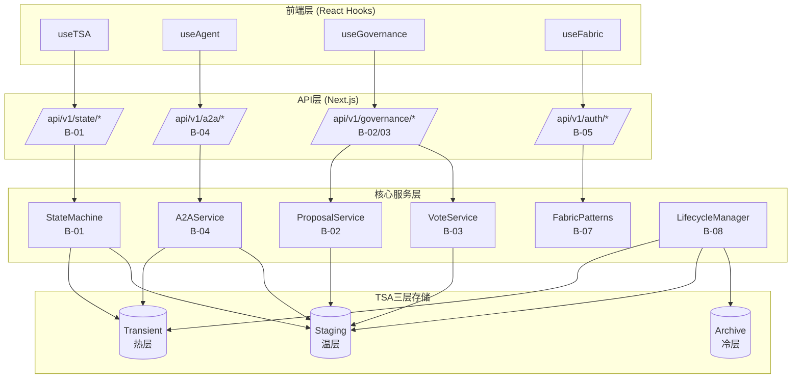

# HAJIMI-V2.1-MVP-CORE-白皮书-v1.0.md

---

## 封面与元信息

| 属性 | 值 |
|------|-----|
| 项目名称 | HAJIMI-V2.1-MVP-CORE |
| 版本号 | v1.0 |
| 日期 | 2026-02-13 |
| 九模块整合 | B-01~B-09 |
| 文档状态 | 设计完成，待实现 |
| 作者 | HAJIMI架构团队 |

---

# 第1章 总体架构（B-01~09整合）

## 1.1 九模块边界划分

```
┌─────────────────────────────────────────────────────────────────────────────┐
│                        HAJIMI-V2.1-MVP-CORE 总体架构                         │
├─────────────────────────────────────────────────────────────────────────────┤
│                                                                             │
│  ┌─────────────────────────────────────────────────────────────────────┐   │
│  │                        前端层 (React)                                │   │
│  │  ┌─────────────┐ ┌─────────────┐ ┌─────────────┐ ┌─────────────┐   │   │
│  │  │ useTSA      │ │ useAgent    │ │useGovernance│ │ useFabric   │   │   │
│  │  │ (B-06)      │ │ (B-06)      │ │ (B-06)      │ │ (B-07)      │   │   │
│  │  └──────┬──────┘ └──────┬──────┘ └──────┬──────┘ └──────┬──────┘   │   │
│  └─────────┼───────────────┼───────────────┼───────────────┼──────────┘   │
│            │               │               │               │              │
│            ▼               ▼               ▼               ▼              │
│  ┌─────────────────────────────────────────────────────────────────────┐   │
│  │                        API层 (Next.js)                               │   │
│  │  ┌─────────────┐ ┌─────────────┐ ┌─────────────┐ ┌─────────────┐   │   │
│  │  │ /state/*    │ │/governance/*│ │ /a2a/*      │ │ /auth/*     │   │   │
│  │  │ (B-01)      │ │ (B-02/03)   │ │ (B-04)      │ │ (B-05)      │   │   │
│  │  └──────┬──────┘ └──────┬──────┘ └──────┬──────┘ └──────┬──────┘   │   │
│  └─────────┼───────────────┼───────────────┼───────────────┼──────────┘   │
│            │               │               │               │              │
│            ▼               ▼               ▼               ▼              │
│  ┌─────────────────────────────────────────────────────────────────────┐   │
│  │                      核心服务层 (Core Services)                       │   │
│  │  ┌─────────────┐ ┌─────────────┐ ┌─────────────┐ ┌─────────────┐   │   │
│  │  │StateMachine │ │ Proposal    │ │ Vote        │ │ A2AService  │   │   │
│  │  │(B-01)状态机 │ │Service(B-02)│ │Service(B-03)│ │ (B-04)      │   │   │
│  │  └─────────────┘ └─────────────┘ └─────────────┘ └─────────────┘   │   │
│  │  ┌─────────────┐ ┌─────────────┐ ┌─────────────┐ ┌─────────────┐   │   │
│  │  │Transition   │ │ Fabric      │ │ Lifecycle   │ │ TSAMonitor  │   │   │
│  │  │RulesEngine  │ │Patterns(B-07)│ │Manager(B-08)│ │ (B-08)      │   │   │
│  │  └─────────────┘ └─────────────┘ └─────────────┘ └─────────────┘   │   │
│  └─────────────────────────────────────────────────────────────────────┘   │
│            │               │               │               │              │
│            ▼               ▼               ▼               ▼              │
│  ┌─────────────────────────────────────────────────────────────────────┐   │
│  │                      TSA三层存储 (B-08)                               │   │
│  │  ┌─────────────┐ ┌─────────────┐ ┌─────────────┐                    │   │
│  │  │ Transient   │ │ Staging     │ │ Archive     │                    │   │
│  │  │ (热层-Memory)│ │ (温层-IndexedDB)│ │ (冷层-File) │                    │   │
│  │  │ TTL: 5min   │ │ TTL: 24h    │ │ TTL: 30d    │                    │   │
│  │  └─────────────┘ └─────────────┘ └─────────────┘                    │   │
│  └─────────────────────────────────────────────────────────────────────┘   │
│                                                                             │
└─────────────────────────────────────────────────────────────────────────────┘
```

## 1.2 数据流图（Mermaid）



## 1.3 接口契约汇总表

| 模块 | 接口路径 | 方法 | 请求体 | 响应体 | 权限要求 |
|------|----------|------|--------|--------|----------|
| 状态机 | /api/v1/state/current | GET | - | StateResponse | 任意角色 |
| 状态机 | /api/v1/state/transition | POST | {to, agent, reason} | TransitionResponse | 按规则 |
| 状态机 | /api/v1/state/allowed | GET | - | AllowedResponse | 任意角色 |
| 治理-提案 | /api/v1/governance/proposals | GET | - | ProposalList | 任意角色 |
| 治理-提案 | /api/v1/governance/proposals | POST | CreateProposal | Proposal | PM专属 |
| 治理-提案 | /api/v1/governance/proposals/:id | GET | - | Proposal | 任意角色 |
| 治理-投票 | /api/v1/governance/vote | POST | {proposalId, choice, reason} | VoteResult | 七权角色 |
| 治理-投票 | /api/v1/governance/vote | GET | ?proposalId | VoteStats | 任意角色 |
| A2A消息 | /api/v1/a2a/send | POST | SendMessageRequest | A2AMessage | 认证用户 |
| A2A消息 | /api/v1/a2a/history | GET | ?sessionId&page&pageSize | HistoryResponse | 认证用户 |
| A2A消息 | /api/v1/a2a/sessions | GET | - | SessionList | 认证用户 |
| 权限 | /api/v1/auth/token | POST | {agentId, role} | TokenResponse | - |
| TSA监控 | /api/v1/tsa/metrics | GET | - | TSAMetrics | 管理员 |

---

# 第2章 状态机实现（B-01）

## 2.1 七权状态定义

```typescript
export type PowerState = 
  | 'IDLE'      // 空闲状态，等待任务
  | 'DESIGN'    // 设计阶段，架构师主导
  | 'CODE'      // 编码阶段，工程师主导
  | 'AUDIT'     // 审计阶段，QA主导
  | 'BUILD'     // 构建阶段，自动化执行
  | 'DEPLOY'    // 部署阶段，运维主导
  | 'DONE';     // 完成状态
```

## 2.2 状态流转规则

| 源状态 | 目标状态 | 允许角色 | 说明 |
|--------|----------|----------|------|
| IDLE | DESIGN | pm, arch | PM或架构师启动设计 |
| DESIGN | CODE | arch, engineer | 设计完成，进入编码 |
| DESIGN | IDLE | pm | PM取消设计 |
| CODE | AUDIT | engineer | 编码完成，提交审计 |
| CODE | DESIGN | arch | 架构师要求重新设计 |
| AUDIT | BUILD | qa | 审计通过，进入构建 |
| AUDIT | CODE | qa | QA要求修复问题 |
| BUILD | DEPLOY | system, mike | 构建成功，进入部署 |
| BUILD | CODE | system | 构建失败，返回编码 |
| DEPLOY | DONE | mike, system | 部署成功，任务完成 |
| DEPLOY | BUILD | mike | 部署失败，重新构建 |

## 2.3 StateMachine类核心方法

```typescript
export class StateMachine {
  async init(): Promise<void>;                    // 从TSA加载状态
  async transition(to, agent, context): Promise<TransitionResponse>;
  getCurrentState(): PowerState;                  // 获取当前状态
  getStateResponse(): StateResponse;              // 获取完整状态
  getHistory(): StateTransition[];                // 获取流转历史
  canTransition(to, agent): boolean;              // 检查流转可行性
  getAllowedTransitions(agent): PowerState[];     // 获取允许的流转目标
  subscribe(listener): () => void;                // 订阅状态变更
}
```

---

# 第3章 治理引擎（B-02~03）

## 3.1 提案系统（B-02）

### 3.1.1 ProposalService核心功能

```typescript
export class ProposalService {
  async createProposal(request: CreateProposalRequest): Promise<Proposal>;
  async getProposals(filter?: ProposalFilter): Promise<Proposal[]>;
  async getProposal(id: string): Promise<Proposal | null>;
  private async updateProposalStatus(id, status): Promise<void>;
  private async checkExpiration(): Promise<void>;
}
```

### 3.1.2 提案数据结构

```typescript
interface Proposal {
  id: string;                 // UUID
  title: string;              // 标题(max 200 chars)
  description: string;        // 描述(max 5000 chars)
  proposer: AgentRole;        // 提案人(必须为pm)
  targetState: PowerState;    // 目标状态
  status: ProposalStatus;     // pending/voting/approved/rejected/expired
  votes: Vote[];              // 投票列表
  createdAt: number;          // 创建时间戳
  expiresAt: number;          // 过期时间戳(默认30分钟)
}
```

### 3.1.3 PM权限检查

```typescript
async createProposal(request: CreateProposalRequest): Promise<Proposal> {
  if (request.proposer !== 'pm') {
    throw new PermissionDeniedError('ONLY_PM_CAN_CREATE_PROPOSAL');
  }
  // ...
}
```

## 3.2 投票系统（B-03）

### 3.2.1 VoteService核心功能

```typescript
export class VoteService {
  async vote(proposalId, voter, choice, reason): Promise<VoteResult>;
  private calculateResult(proposal): VoteResult;
  private async autoExecute(proposal): Promise<void>;
  async getVoteStats(proposalId): Promise<VoteStats>;
  startTimeoutMonitor(proposalId, expiresAt): void;
}
```

### 3.2.2 七权权重配置

| 角色 | 权重 | 说明 |
|------|------|------|
| pm | 2 | 产品经理 - 决策权重 |
| arch | 2 | 架构师 - 技术决策 |
| qa | 1 | 测试工程师 |
| engineer | 1 | 开发工程师 |
| mike | 1 | 产品助理 |

### 3.2.3 投票通过规则

- **法定人数**: 最少3人投票
- **通过阈值**: 60%赞成票
- **超时**: 30分钟自动关闭

---

# 第4章 A2A消息（B-04）

## 4.1 A2AService核心功能

```typescript
export class A2AService {
  async sendMessage(request: SendMessageRequest): Promise<A2AMessage>;
  async getHistory(sessionId, options): Promise<PaginatedResponse<A2AMessage>>;
  async sendMessageStream(request, onChunk): Promise<A2AMessage>;
  subscribe(listener): () => void;
  async getSessions(): Promise<string[]>;
}
```

## 4.2 SecondMeAdapter设计

```typescript
export class SecondMeAdapter {
  async chat(agentId, message, context): Promise<ChatResponse>;
  async chatStream(agentId, message, onChunk, context): Promise<void>;
  async getAgentInfo(agentId): Promise<AgentInfo>;
  async listAgents(): Promise<AgentInfo[]>;
}
```

## 4.3 Mock适配器

开发环境使用Mock适配器，无需真实SecondMe API:

```typescript
export class MockSecondMeAdapter extends SecondMeAdapter {
  // 预置模拟Agent和响应
  private mockAgents: Map<string, AgentInfo>;
  private mockResponses: Map<string, string[]>;
}
```

---

# 第5章 API与权限（B-05）

## 5.1 统一错误处理

### 5.1.1 错误代码分类

| 前缀 | 模块 | 说明 |
|------|------|------|
| COMMON_ | 通用 | 1xxx系列 |
| A2A_ | A2A消息 | 2xxx系列 |
| STATE_ | 状态机 | 3xxx系列 |
| GOV_ | 治理引擎 | 4xxx系列 |
| STORAGE_ | 存储 | 5xxx系列 |
| PLUGIN_ | 插件 | 6xxx系列 |

### 5.1.2 APIError类

```typescript
export class APIError extends Error {
  code: ErrorCode;
  statusCode: number;
  severity: ErrorSeverity;
  details?: Record<string, unknown>;
  timestamp: number;
  requestId: string;
}
```

## 5.2 权限验证中间件

### 5.2.1 withAuth中间件

```typescript
export function withAuth<T>(
  handler: (request, context) => Promise<NextResponse<T>>,
  config?: AuthConfig
): (request) => Promise<NextResponse<T | ErrorResponse>>;
```

### 5.2.2 角色层级

```typescript
export const ROLE_HIERARCHY: Record<AgentRole, number> = {
  pm: 100,      // 最高权限
  arch: 80,
  qa: 60,
  engineer: 40,
  mike: 20,     // 最低权限
};
```

## 5.3 Zod请求验证

```typescript
// 发送消息请求Schema
export const SendMessageSchema = z.object({
  sender: AgentRoleSchema,
  receiver: AgentRoleSchema,
  content: z.string().min(1).max(10000),
  type: MessageTypeSchema.default('chat'),
  sessionId: z.string().optional(),
  metadata: z.record(z.unknown()).optional(),
});
```

---

# 第6章 React Hooks（B-06）

## 6.1 useTSA Hook

```typescript
export function useTSA<T>(
  key: string,
  defaultValue: T | null = null,
  options: UseTSAOptions = {}
): UseTSAReturn<T>;

export interface UseTSAReturn<T> {
  value: T | null;
  set: (newValue, options?) => Promise<void>;
  remove: () => Promise<void>;
  loading: boolean;
  error: Error | null;
  refresh: () => Promise<void>;
  initialized: boolean;
}
```

## 6.2 useAgent Hook

```typescript
export function useAgent(agentId: string): UseAgentReturn;

export interface UseAgentReturn {
  agent: AgentInfo | null;
  messages: A2AMessage[];
  loading: boolean;
  sending: boolean;
  error: Error | null;
  sendMessage: (content, options?) => Promise<A2AMessage | null>;
  loadHistory: (options?) => Promise<void>;
  sendMessageStream: (content, onChunk, options?) => Promise<void>;
  clearMessages: () => void;
  refreshAgent: () => Promise<void>;
}
```

## 6.3 useGovernance Hook

```typescript
export function useGovernance(): UseGovernanceReturn;

export interface UseGovernanceReturn {
  proposals: Proposal[];
  currentProposal: Proposal | null;
  loading: boolean;
  processing: boolean;
  error: Error | null;
  fetchProposals: (filter?) => Promise<void>;
  fetchProposal: (id) => Promise<void>;
  createProposal: (request) => Promise<Proposal | null>;
  vote: (proposalId, choice, reason?) => Promise<void>;
  getVoteStats: (proposalId) => Promise<VoteStats | null>;
}
```

---

# 第7章 Fabric装备（B-07）

## 7.1 七权人格Pattern装备

| Pattern ID | 人格名称 | 类型 | Token限制 | 治理定位 |
|------------|----------|------|-----------|----------|
| sys:analyst-cucumber-mu | 黄瓜睦 | 数据分析型 | 2000 | 设计层(架构) |
| sys:creative-tang-yin | 唐音 | 创意型 | 2000 | 行政层(工程) |
| sys:qa-gu-gu-ga-ga | 咕咕嘎嘎 | 幽默型 | 1500 | 司法层(QA) |
| sys:audit-pressure-monster | 压力怪 | 严格型 | 1500 | 监察层(审计) |
| sys:cute-milk-dragon | 奶龙娘 | 可爱型 | 1500 | 服务层(陪伴) |
| sys:pm-soyorin | Soyorin | 需求型 | 2000 | 立法层(PM) |
| sys:support-xiao-xiang | 客服小祥 | 服务型 | 1500 | 服务层(客服) |

## 7.2 Pattern数据结构

```typescript
export interface Pattern {
  id: string;
  type: PatternType;
  name: string;
  description: string;
  version: string;
  template: string;           // 提示词模板
  variables: VariableDef[];   // 变量定义
  dependencies: string[];     // 依赖装备ID
  config: PatternConfig;
}

export interface PatternConfig {
  tokenLimit: number;
  compressionRatio: number;
  cacheEnabled: boolean;
  ttl: number;
}
```

## 7.3 批量注册

```typescript
export const sevenPowerPatterns = [
  黄瓜睦Pattern,
  唐音Pattern,
  咕咕嘎嘎Pattern,
  压力怪Pattern,
  奶龙娘Pattern,
  SoyorinPattern,
  客服小祥Pattern,
];

export function registerAllRolePatterns(): void {
  sevenPowerPatterns.forEach(pattern => {
    patternRegistry.register(pattern);
  });
}
```

---

# 第8章 TSA完善（B-08）

## 8.1 LifecycleManager

### 8.1.1 核心配置

```typescript
export interface LifecycleConfig {
  cleanupIntervalMs: number;           // 清理间隔(默认1小时)
  archiveThresholdDays: number;        // 归档阈值(默认30天)
  transientIdleTimeoutMinutes: number; // 热层空闲超时(默认5分钟)
  stagingIdleTimeoutHours: number;     // 温层空闲超时(默认24小时)
  enableAutoMigration: boolean;        // 启用自动迁移
  enableArchiving: boolean;            // 启用归档
}
```

### 8.1.2 生命周期事件

```typescript
export enum LifecycleEventType {
  CLEANUP_STARTED = 'cleanup:started',
  CLEANUP_COMPLETED = 'cleanup:completed',
  MIGRATION_STARTED = 'migration:started',
  MIGRATION_COMPLETED = 'migration:completed',
  ITEM_EXPIRED = 'item:expired',
  ITEM_PROMOTED = 'item:promoted',
  ITEM_DEMOTED = 'item:demoted',
}
```

## 8.2 TSAMonitor

### 8.2.1 监控指标

```typescript
export interface TSAMetrics {
  timestamp: number;
  transient: TransientMetrics;  // 热层指标
  staging: StagingMetrics;      // 温层指标
  archive: ArchiveMetrics;      // 冷层指标
  routing: RoutingMetrics;      // 路由指标
  overall: OverallMetrics;      // 整体指标
}
```

### 8.2.2 命中率统计

- 热层命中率目标: >80%
- 整体命中率目标: >70%
- 内存效率: 条目数/MB

---

# 第9章 测试体系（B-09）

## 9.1 单元测试覆盖目标

| 模块 | 目标覆盖率 | 关键测试点 |
|------|-----------|------------|
| StateMachine | >80% | 状态流转、权限验证、历史记录 |
| ProposalService | >80% | 创建、查询、过期管理 |
| VoteService | >80% | 投票提交、阈值计算、自动执行 |
| A2AService | >80% | 消息发送、历史查询、流式响应 |
| TSA | >80% | 三层存储、路由决策、LRU淘汰 |

## 9.2 集成测试

- A2A流集成测试
- 治理流集成测试
- 状态机与治理引擎集成测试

## 9.3 E2E测试框架

使用Playwright进行端到端测试。

---

# 附录A：文件变更清单（新增/修改/删除）

## A.1 新增文件清单

| 路径 | 说明 | 关联模块 |
|------|------|----------|
| lib/types/state.ts | 状态机类型定义 | B-01 |
| lib/core/state/machine.ts | StateMachine类 | B-01 |
| lib/core/state/rules.ts | TransitionRulesEngine | B-01 |
| config/state/flow.yaml | 状态流转规则配置 | B-01 |
| app/api/v1/state/*/route.ts | 状态机API路由 | B-01 |
| lib/core/governance/proposal-service.ts | 提案服务 | B-02 |
| lib/core/governance/vote-service.ts | 投票服务 | B-03 |
| lib/core/governance/types.ts | 治理引擎类型 | B-02/03 |
| config/governance/rules.yaml | 治理规则配置 | B-02/03 |
| app/api/v1/governance/*/route.ts | 治理API路由 | B-02/03 |
| lib/core/agents/a2a-service.ts | A2A消息服务 | B-04 |
| lib/adapters/secondme/client.ts | SecondMe适配器 | B-04 |
| lib/adapters/secondme/mock.ts | Mock适配器 | B-04 |
| app/api/v1/a2a/*/route.ts | A2A API路由 | B-04 |
| lib/api/error-handler.ts | 统一错误处理 | B-05 |
| lib/api/auth.ts | 权限验证中间件 | B-05 |
| lib/api/schemas/*.ts | Zod Schema定义 | B-05 |
| app/hooks/useTSA.ts | TSA Hook | B-06 |
| app/hooks/useAgent.ts | Agent Hook | B-06 |
| app/hooks/useGovernance.ts | 治理Hook | B-06 |
| patterns/system/roles/*.pattern.ts | 人格Pattern装备 | B-07 |
| patterns/registry.ts | 装备注册中心 | B-07 |
| lib/tsa/lifecycle/LifecycleManager.ts | 生命周期管理器 | B-08 |
| lib/tsa/monitor/TSAMonitor.ts | TSA监控面板 | B-08 |
| tests/unit/*.test.ts | 单元测试 | B-09 |
| tests/integration/*.test.ts | 集成测试 | B-09 |

## A.2 修改文件清单

| 路径 | 修改说明 |
|------|----------|
| lib/tsa/index.ts | 导出LifecycleManager和TSAMonitor |
| lib/tsa/TransientStore.ts | 添加getExpiredKeys/getIdleKeys |
| lib/tsa/StagingStore.ts | 添加getExpiredKeys/getHotCandidates |
| package.json | 添加jest/testing依赖 |

## A.3 删除文件清单

无

---

# 附录B：技术债务声明（mock清单）

## B.1 MVP阶段Mock清单

| ID | 债务项 | 位置 | 影响 | 修复优先级 |
|----|--------|------|------|------------|
| DEBT-001 | 使用简单Token格式(agentId:role:timestamp) | lib/api/auth.ts | 安全性低 | P1 |
| DEBT-002 | SecondMe使用Mock适配器 | lib/adapters/secondme/mock.ts | 无法连接真实服务 | P0 |
| DEBT-003 | 提案过期检查使用定时轮询 | lib/core/governance/proposal-service.ts | 性能开销 | P2 |
| DEBT-004 | 状态机持久化使用TSA STAGING层 | lib/core/state/machine.ts | 非数据库级持久化 | P2 |
| DEBT-005 | 投票权重硬编码 | lib/core/governance/vote-service.ts | 无法动态配置 | P2 |
| DEBT-006 | A2A消息TTL固定7天 | lib/core/agents/a2a-service.ts | 无法动态调整 | P3 |
| DEBT-007 | Fabric Pattern缓存固定1小时 | patterns/system/roles/*.pattern.ts | 无法动态调整 | P3 |
| DEBT-008 | TSA Archive层使用JSON文件 | lib/tsa/ArchiveStore.ts | 非专业归档方案 | P2 |
| DEBT-009 | 生命周期管理器单线程执行 | lib/tsa/lifecycle/LifecycleManager.ts | 大数据量时阻塞 | P2 |
| DEBT-010 | 监控指标内存存储 | lib/tsa/monitor/TSAMonitor.ts | 重启丢失 | P3 |

## B.2 债务清偿计划

| 版本 | 清偿债务 | 预计工时 |
|------|----------|----------|
| v1.1 | DEBT-001, DEBT-002 | 3天 |
| v1.2 | DEBT-003, DEBT-005, DEBT-008 | 4天 |
| v1.3 | DEBT-004, DEBT-009 | 3天 |
| v2.0 | DEBT-006, DEBT-007, DEBT-010 | 5天 |

---

*文档结束*
