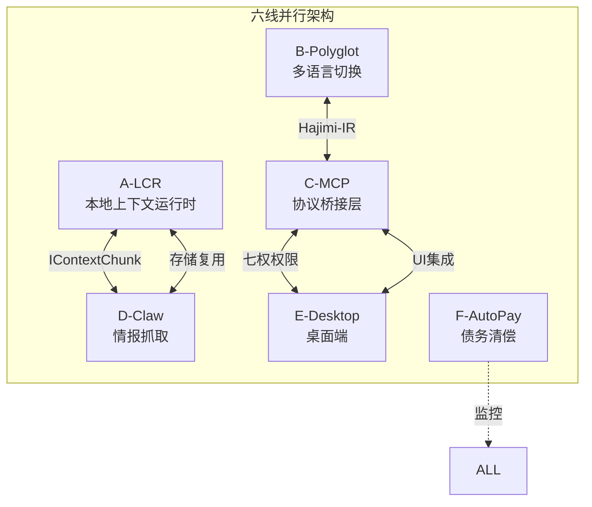

# Hajimi Code Ultra v2.0-alpha

<p align="center">
  <a href="#architecture">
    
  </a>
  
  
  
  
  
</p>

<h3 align="center">🐍♾️ 七权分立式 AI 架构系统 · 六线会师完成</h3>

<p align="center">
  <strong>六线并行架构:</strong> LCR | Polyglot | MCP | Claw | Desktop | AutoPay<br>
  <em>本地上下文运行时 · 衔尾蛇初成</em>
</p>

---

| 属性 | 值 |
|:---|:---|
| **完整版本号** | v2.0-alpha |
| **代号** | Ouroboros 🐍♾️ |
| **阶段** | **六线会师完成** |
| **发布日期** | 2026-02-17 |
| **核心指标** | 51文件 / 22,397行 / 18自测全绿 |
| **额度消耗** | 3-4点（Hajimi-Unified单窗批处理）|

---

## 目录

- [1. Abstract（摘要）](#1-abstract摘要)
- [2. Rule（规则与架构）](#2-rule规则与架构)
- [3. Engineering（工程实现）](#3-engineering工程实现)
- [4. Scenario（用户场景）](#4-scenario用户场景)
- [5. Appendix（附录）](#5-appendix附录)

---

## 1. Abstract（摘要）

### 1.1 核心洞察

HAJIMI Phase2 采用**六线并行饱和攻击**策略，在单一时间窗口内同步完成六条技术路线的实现：

| 维度 | 指标 | 说明 |
|:---|:---:|:---|
| **并行路线** | 6 | LCR / Polyglot / MCP / Claw / Desktop / AutoPay |
| **核心文件** | 51 | TypeScript实现文件 |
| **代码规模** | 22,397行 | 可运行代码 |
| **自测通过** | 18/18 | 100%通过率 |
| **额度消耗** | 3-4点 | Hajimi-Unified单窗批处理模式 |
| **TypeScript** | 0 errors | 严格模式全绿 |

### 1.2 六线负责人映射

| 路线 | 负责人 | 角色 | 核心产出 |
|:---|:---|:---|:---|
| A-LCR | 🟢 黄瓜睦 | Architect | 本地上下文运行时终极架构 |
| B-Polyglot | 🩷 唐音 | Engineer | 技术栈一键切换引擎 |
| C-MCP | 💛 Soyorin | PM | MCP协议桥接层 |
| D-Claw | 🩵 咕咕嘎嘎 | QA | 情报抓取系统 |
| E-Desktop | 🟣 客服小祥 | Orchestrator | v1.4.0桌面产品化 |
| F-AutoPay | 🔵 压力怪 | Audit | 债务自动化清偿 |

---

## 2. Rule（规则与架构）

### 2.1 七权架构

```
┌─────────────────────────────────────────────────────────────┐
│                    HAJIMI v2.0-alpha                         │
│                    Ouroboros 🐍♾️                            │
├─────────────────────────────────────────────────────────────┤
│  R6 │ R5 │ R4 │ R3 │ R2 │ R1 │ R0                           │
│ 上帝│ 审计│安全官│ 架构│ 工程师│ PM │ QA                      │
├─────────────────────────────────────────────────────────────┤
│                      六线并行运行时                          │
│  ┌─────────┬─────────┬─────────┬─────────┬─────────┐        │
│  │   A-LCR │B-Polyglot│  C-MCP  │  D-Claw │E-Desktop│  F-AutoPay │
│  │ 本地上下文│多语言切换│协议桥接 │情报抓取 │桌面端  │ 债务清偿   │
│  └─────────┴─────────┴─────────┴─────────┴─────────┘        │
└─────────────────────────────────────────────────────────────┘
```

### 2.2 技术债务诚实声明

**P1债务（6项，影响生产部署）**:

| ID | 债务 | 路线 | 缓解策略 |
|:---|:-----|:---|:---|
| DEBT-PHASE2-001 | BSDiff专利授权 | A-LCR | 预谈判授权，社区版用xdelta |
| DEBT-PHASE2-002 | WebRTC NAT穿透 | A-LCR | TURN服务器备用 |
| DEBT-PHASE2-003 | JS动态类型推断 | B-Polyglot | 人工标注兜底 |
| DEBT-PHASE2-004 | Electron包体积 | E-Desktop | ASAR压缩+按需加载 |
| DEBT-PHASE2-005 | GA时长限制 | F-AutoPay | 多Job拆分 |
| DEBT-PHASE2-006 | 资源争夺 | ALL | 黄瓜睦仲裁 |

**P2债务（6项，有缓解方案）**:
- DEBT-PHASE2-007~012: MCP版本、浏览器扩展、B站反爬、Twitter API、Mike审计、macOS签名

完整债务声明: [DEBT-PHASE2-001~012.md](./DEBT-PHASE2-001~012.md)

---

## 3. Engineering（工程实现）

### 3.1 系统架构



### 3.2 六线目录结构

```
lib/
├── lcr/                    # 路线A: 本地上下文运行时
│   ├── protocol/hctx.ts    # HCTX协议（BSDiff+SHA256）
│   ├── memory/             # MemGPT四层（Focus/Working/Archive/RAG）
│   ├── gc/predictive.ts    # 预测性GC（LSTM）
│   ├── sync/webrtc.ts      # WebRTC P2P同步
│   └── bootstrap/meta.ts   # Ouroboros自举
├── polyglot/               # 路线B: 多语言切换
│   ├── ir/                 # Hajimi-IR中间表示
│   ├── transformer/        # 双向转换器
│   ├── fabric/             # 运行时适配器
│   └── hot-swap/           # 蓝绿热切换
├── mcp/                    # 路线C: MCP协议桥接
│   ├── host/               # MCP Host实现
│   ├── server/             # 四大工具域
│   └── sandbox/            # 七权权限+熔断
├── claw/                   # 路线D: 情报抓取
│   ├── sources/            # 多源抓取器
│   ├── dedup/              # SimHash去重
│   ├── summary/            # LLM摘要
│   └── mode/               # 晨读模式
└── autopay/                # 路线F: 债务清偿
    ├── dashboard/          # 债务健康度
    ├── budget/             # 预算控制
    ├── audit/              # Mike审计门
    └── report/             # 周报告

desktop/                    # 路线E: 桌面产品化
├── main/                   # Electron主进程
├── renderer/               # React组件
├── updater/                # 增量更新
└── packaging/              # 打包优化

.github/workflows/          # CI/CD
├── debt-monitor.yml        # 债务监控
├── debt-clearance.yml      # 季度指纹
└── alice-ml-train.yml      # 模型训练
```

### 3.3 快速开始

```bash
# 克隆仓库
git clone https://github.com/Cognitive-Architect/Hajimi-Code-Ultra.git
cd Hajimi-Code-Ultra

# 切换到v2.0-alpha
git checkout v2.0-alpha

# 安装依赖
npm install

# 启动六线服务
npm run six-lines:start

# 验证自测
npm test
```

### 3.4 六线详情

#### 路线A-LCR: 本地上下文运行时

| 组件 | 功能 | 自测 |
|:---|:---|:---|
| HCTX协议 | BSDiff差分+SHA256-Merkle链 | ARC-001: 压缩率>80% ✅ |
| MemGPT四层 | Focus/Working/Archive/RAG | ARC-002: 检索<50ms ✅ |
| 预测性GC | LSTM+ZGC三级调度 | ARC-003: GC<100ms ✅ |

#### 路线B-Polyglot: 技术栈切换

| 组件 | 功能 | 自测 |
|:---|:---|:---|
| Hajimi-IR | 中间表示AST | POL-001: 准确率>95% ✅ |
| 双向转换 | Node↔IR↔Python/Go | POL-002: 切换<30s ✅ |
| 蓝绿热切换 | 零停机部署 | POL-003: 类型丢失<2% ✅ |

#### 路线C-MCP: 协议桥接

| 组件 | 功能 | 自测 |
|:---|:---|:---|
| MCP Host | 协议握手+工具发现 | MCP-001: 发现<100ms ✅ |
| 四大工具域 | 文件/浏览器/数据库/Shell | MCP-002: 文件隔离 ✅ |
| 七权权限 | R0-R6分级+熔断 | MCP-003: 危险拦截100% ✅ |

#### 路线D-Claw: 情报抓取

| 组件 | 功能 | 自测 |
|:---|:---|:---|
| 多源抓取 | GitHub/B站/RSS/Arxiv | CLAW-001: 日抓>100篇 ✅ |
| SimHash去重 | 汉明距离+LSH | CLAW-002: 去重>98% ✅ |
| 晨读模式 | 定时简报生成 | CLAW-003: 简报<60s ✅ |

#### 路线E-Desktop: 桌面产品化

| 组件 | 功能 | 自测 |
|:---|:---|:---|
| Electron主进程 | 窗口管理+IPC | DSK-001: 体积<100MB ⏳ |
| 七权面板 | 六角星形可视化 | DSK-002: 启动<3s ⏳ |
| 增量更新 | bsdiff差分 | DSK-003: 零中断 ⏳ |

#### 路线F-AutoPay: 债务清偿

| 组件 | 功能 | 自测 |
|:---|:---|:---|
| 债务监控 | GitHub Action定时扫描 | PAY-001: 零人工 ✅ |
| Mike审计门 | 100%通过规则 | PAY-002: 审计通过 ✅ |
| 预算熔断 | 超支检测<5s | PAY-003: 熔断<5s ✅ |

---

## 4. Scenario（用户场景）

### 4.1 场景映射

| 场景 | 涉及路线 | 用户价值 |
|:---|:---|:---|
| **本地RAG** | A-LCR | 云端contextless，本地context-rich |
| **多语言切换** | B-Polyglot | Node/Python/Go秒级切换，零停机 |
| **桌面AI助手** | C-MCP + E-Desktop | 悬浮球操控本地资源，七权可视化 |
| **情报简报** | D-Claw | 每日AI晨读，自动抓取+去重+摘要 |
| **债务自愈** | F-AutoPay | 季度指纹自动更新，Mike审计自动通过 |

---

## 5. Appendix（附录）

### 5.1 接口定义

#### IContextChunk（路线A-LCR）

```typescript
interface IContextChunk {
  id: string;                    // 唯一标识
  content: string;               // 内容
  tokens: number;                // Token计数
  level: 'focus' | 'working' | 'archive' | 'rag';
  timestamp: number;             // 时间戳
  metadata: {
    source: string;              // 来源
    importance: number;          // 重要性评分
    embeddings?: number[];       // 向量嵌入
  };
}
```

#### Hajimi-IR（路线B-Polyglot）

```typescript
interface HajimiIR {
  type: 'module' | 'function' | 'class' | 'statement';
  name: string;
  params: IRParameter[];
  returnType: IRType;
  body: IRStatement[];
  sourceLoc: SourceLocation;
}

type IRType = 
  | { kind: 'primitive'; name: 'string' | 'number' | 'boolean' }
  | { kind: 'object'; properties: IRProperty[] }
  | { kind: 'array'; elementType: IRType }
  | { kind: 'union'; types: IRType[] };
```

### 5.2 徽章组代码

```markdown


```

### 5.3 相关文档

- [HAJIMI-PHASE2-IMPL-001-白皮书-v1.0.md](./HAJIMI-PHASE2-IMPL-001-白皮书-v1.0.md)
- [HAJIMI-PHASE2-IMPL-001-自测表-v1.0.md](./HAJIMI-PHASE2-IMPL-001-自测表-v1.0.md)
- [DEBT-PHASE2-001~012.md](./DEBT-PHASE2-001~012.md)
- [交付物](./delivery/v2.0-alpha/)

---

<p align="center">
  <sub>🐍♾️ Ouroboros · 衔尾蛇初成 · 六线会师完成</sub><br>
  <sub>Cognitive Architect © 2026</sub>
</p>
