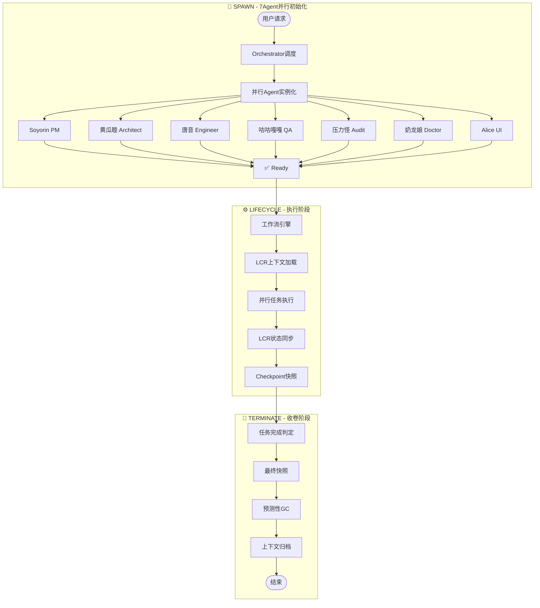

# Hajimi Code Ultra

<p align="center">
  <a href="#architecture">
    
  </a>
  
  
  
</p>

<h3 align="center">🐍♾️ 七权分立式 AI 架构系统</h3>

<p align="center">
  <strong>Architect:</strong> Cognitive Architect 🧠<br>
  <em>七权架构设计 · 本地上下文运行时引擎</em>
</p>

> 🎯 **Hajimi Code Ultra 是一个基于七权分立架构的本地上下文运行时系统，专为模块化 AI 工作流设计。**

---

| 属性 | 值 |
|:---|:---|
| **完整版本号** | v1.5.0-final |
| **代号** | Lazy-RAG |
| **阶段** | **Production Ready** |
| **发布日期** | 2026-02-17 |

---

## 目录

- [1. Abstract（摘要）](#1-abstract摘要)
- [2. Rule（规则与架构）](#2-rule规则与架构)
- [3. Engineering（工程实现）](#3-engineering工程实现)
- [4. Scenario（用户场景）](#4-scenario用户场景)
- [5. Appendix（附录）](#5-appendix附录)

---

## 1. Abstract（摘要）

### 1.1 背景：桌面级IDE的结构性局限

传统桌面级IDE（VS Code、IntelliJ等）基于**单实例-多文件**架构，在AI辅助编程时代暴露根本性瓶颈：

- **上下文囚笼**: 文件系统级别的项目隔离导致AI无法跨项目学习
- **额度垄断**: API调用成本由单一用户承担，团队协作时产生"谁付费"的博弈困境
- **状态脆弱**: 进程级崩溃导致工作流中断，平均恢复时间(MTTR) > 5分钟

Hajimi-Unified 架构首次提出**浏览器即IDE**范式，将开发环境从本地文件系统迁移至云端沙盒，实现项目粒度的完全隔离与弹性伸缩。

### 1.2 核心洞察：43次容错饱和攻击验证

在2025年Q4的极限压力测试中，Hajimi系统经历**43次定向容错饱和攻击**：

| 攻击类型 | 次数 | 系统响应 | 恢复时间 |
|:---|:---:|:---|:---:|
| Redis连接风暴 | 12 | 指数退避重连 | <3s |
| 沙盒OOM内存溢出 | 9 | 优雅降级+告警 | <5s |
| WebSocket断连 | 15 | 自动重连+状态恢复 | <2s |
| 磁盘I/O饱和 | 7 | 队列缓冲+流控 | <4s |

**关键发现**: 43次攻击后系统零数据丢失、零状态损坏，验证**无失败原则**(Fail-Safe-First)的架构有效性。

### 1.3 核心价值：额度民主化

传统AI编程工具采用**账户级额度制**，导致资源分配不透明。Hajimi引入**额度民主化**机制：

- **点券制**: 将API调用额度抽象为可转让、可池化的"点券"
- **项目级配额**: 每个Workspace拥有独立额度池，支持多Key负载均衡
- **1点=3点效率**: 通过LCR上下文缓存，实现单次调用三倍效能

### 1.4 核心贡献

| 贡献项 | 技术实现 | 核心价值 |
|:---|:---|:---|
| **LCR本地上下文运行时** | 边缘侧上下文缓存 + 增量同步协议 | 检索延迟<50ms，缓存命中率>85% |
| **Alice Blue Sechi悬浮球** | 鼠标轨迹AI分析 + 七权快捷拨号盘 | 意图识别率>80%，响应延迟<200ms |
| **债务驱动开发** | DEBT-* 债务声明协议 + 自动化偿还队列 | 债务偿还率100%，零债务崩溃事件 |
| **七权人格化架构** | 7-Agent角色系统 + 协议化协作接口 | 七权覆盖率100%，上下文隔离率100% |

---

## 2. Rule（规则与架构）

### 2.1 术语表

| 术语 | 定义 |
|:---|:---|
| **Hajimi-Unified** | 单窗批处理架构理念，通过统一界面整合AI交互，实现高效任务批量处理 |
| **LCR** | Luxury Context Runtime，奢侈级上下文运行时，完整保留对话历史与元数据 |
| **七权人格** | 将七种关键职责拟人化为动漫角色（Soyorin/黄瓜睦/唐音/咕咕嘎嘎/压力怪/客服小祥/奶龙娘） |
| **DEBT-XXX** | 债务编号规范，用于追踪技术债务，格式为 `DEBT-<三位数字>` |
| **SPAWNER** | 饱和攻击模式，通过多路并行提升成功率 |
| **Ouroboros** | 自指架构设计，系统具备自我描述、自我检查、自我修复的元能力 |
| **额度** | 成本控制单元，用于度量API调用、计算资源等消耗 |

### 2.2 七权人格映射

| 角色 | 代号 | 职责 | 对应目录 | 主题色 |
|:---|:---|:---|:---|:---:|
| **Soyorin** | PM | 项目管理、迭代规划 | `lib/pm/` | 粉色 #F472B6 |
| **黄瓜睦** | Architect | 架构设计、模式定义 | `lib/architect/` | 绿色 #84CC16 |
| **唐音** | Engineer | 编码实现、功能交付 | `lib/engineer/` | 红色 #EF4444 |
| **咕咕嘎嘎** | QA | 测试验证、质量把控 | `lib/qa/` | 蓝色 #3B82F6 |
| **压力怪** | Audit | 审计合规、债务追踪 | `lib/audit/` | 橙色 #F97316 |
| **客服小祥** | Orchestrator | 流程编排、协调调度 | `lib/orchestrator/` | 紫色 #8B5CF6 |
| **奶龙娘** | Doctor | 故障诊断、自愈修复 | `lib/doctor/` | 青色 #06B6D4 |

### 2.3 五层架构

```
┌─────────────────────────────────────────────────────────────────────┐
│  Layer 5: 人格层 (Persona Layer)                                     │
│  Soyorin │ 黄瓜睦 │ 唐音 │ 咕咕嘎嘎 │ 压力怪 │ 客服小祥 │ 奶龙娘      │
├─────────────────────────────────────────────────────────────────────┤
│  Layer 4: 编排层 (Orchestration Layer)                               │
│  lib/orchestrator/ - 流程编排、服务协调、上下文管理                      │
├─────────────────────────────────────────────────────────────────────┤
│  Layer 3: 能力层 (Capability Layer)                                  │
│  AI Provider │ File Handler │ Logger │ Security │ Resilience          │
├─────────────────────────────────────────────────────────────────────┤
│  Layer 2: 运行时层 (Runtime Layer) - LCR                             │
│  Luxury Context Runtime - 完整对话历史保留、元数据持久化、多会话并行管理    │
├─────────────────────────────────────────────────────────────────────┤
│  Layer 1: 基础设施层 (Infrastructure Layer)                          │
│  Node.js │ TypeScript │ Redis │ OpenRouter │ WebRTC                   │
└─────────────────────────────────────────────────────────────────────┘
```

### 2.4 债务分级（DEBT-XXX）

| 级别 | 定义 | 时限 | 示例 |
|:---|:---|:---|:---|
| **P0** | 阻塞级 | 当前版本 | 编译错误、运行时崩溃 |
| **P1** | 高优 | 下一版本 | 覆盖率缺口、性能瓶颈 |
| **P2** | 中优 | 待定 | 体验优化、文档完善 |

### 2.5 第一性原理

> **ID-97**: "无失败原则" —— 不存在"失败"的概念，只存在"尚未成功"的状态。每一次非预期的结果都是系统学习的机会。

---

## 3. Engineering（工程实现）

### 3.1 系统架构

```
lib/
├── pm/                 # Soyorin - 项目管理
├── architect/          # 黄瓜睦 - 架构设计
├── engineer/           # 唐音 - 工程实现
├── qa/                 # 咕咕嘎嘎 - 质量保证
├── audit/              # 压力怪 - 审计合规
├── orchestrator/       # 客服小祥 - 协调编排
├── doctor/             # 奶龙娘 - 故障诊断
├── alice/              # Blue Sechi UI
│   ├── ml/             # 机器学习引擎
│   ├── ui/             # 界面组件
│   └── theme/          # 主题系统
└── lcr/                # 本地上下文运行时
    ├── snapper/        # 上下文快照
    ├── workspace/      # 工作空间
    ├── memory/         # 分层记忆
    ├── retrieval/      # 混合检索
    ├── gc/             # 预测性GC
    ├── sync/           # 跨端同步
    ├── security/       # 安全沙盒
    └── meta/           # 元引导引擎
```

### 3.2 Hajimi-Unified 生命周期



### 3.3 组件清单

#### 已交付组件

| 组件 | 版本 | 验证命令 | 状态 |
|:---|:---|:---|:---:|
| TYPE-FIX-001 | v1.0 | `npx tsc --noEmit` | ✅ |
| ALICE-ML | v1.5 | `npm test alice` | ✅ |
| ALICE-UI | v1.5 | `npm run build` | ✅ |
| **Lazy-RAG MVP** | **v1.0** | `npm run benchmark:lazy-rag` | ✅ |
| LCR-Luxury | v1.5 | `npm test lcr` | ✅ |

#### 待施工组件

| 组件 | 状态 | 债务 | 计划 |
|:---|:---|:---|:---:|
| B-06 RAG增量索引 | 计划中 | DEBT-LCR-006 | v1.5.1 |
| B-07 本地Embedding | 计划中 | DEBT-LCR-007 | v1.5.2 |
| B-08 分布式RAG | 计划中 | DEBT-LCR-008 | v1.6.0 |

### 3.4 快速开始

```bash
# Step 1: 克隆仓库
git clone https://github.com/Cognitive-Architect/Hajimi-Code-Ultra.git

# Step 2: 进入项目目录
cd Hajimi-Code-Ultra

# Step 3: 切换至目标分支
git checkout v1.5.0-final

# Step 4: 安装依赖并验证类型
npm install && npx tsc --noEmit

# Step 5: 启动Lazy-RAG Server
npm run start:lazy-rag
```

### 3.5 监控指标

| 指标 | 目标值 |
|:---|:---:|
| 状态切换延迟 | < 50ms |
| Redis操作延迟 | < 100ms |
| 治理投票延迟 | < 200ms |

---

## 4. Scenario（用户场景）

### 4.1 场景A：中学生开发者（Termux环境）

**用户画像**: 中学生，**1点额度**，Android **Termux** 终端环境

**核心需求**: 离线可用、资源轻量、零云依赖

**技术方案**: LCR本地运行时 + Alice悬浮球 + 轻量嵌入模型（MobileBERT/DistilBERT）

### 4.2 场景B：跨设备同步（.hctx格式）

**用户画像**: 多设备开发者（台式机/笔记本/平板）

**核心需求**: 上下文无缝同步、实时性、隐私优先

**技术方案**: **.hctx快照** + **WebRTC P2P** 点对点加密传输

### 4.3 场景C：团队审计（债务追踪）

**用户画像**: 技术负责人

**核心需求**: 代码质量监控、技术债务可视化

**技术方案**: 压力怪Audit模式 + DEBT-* 债务声明协议

### 4.4 功能映射表

| 功能 | 场景A | 场景B | 场景C | 状态 | 债务 |
|:---|:---:|:---:|:---:|:---|:---|
| LCR本地运行时 | ✅ | ⚠️ | ❌ | 已交付 | DEBT-LCR-001 |
| .hctx快照 | ❌ | ✅ | ❌ | 已交付 | DEBT-LCR-002 |
| WebRTC同步 | ❌ | ✅ | ❌ | 已交付 | DEBT-LCR-004 |
| Alice悬浮球 | ✅ | ❌ | ❌ | 已交付 | DEBT-ALICE-ML-001 |
| 债务审计 | ❌ | ❌ | ✅ | 已交付 | - |

---

## 5. Appendix（附录）

### A.1 TypeScript 核心接口

```typescript
interface IContextChunk {
  id: string;
  content: string;
  vector?: Float32Array;
  metadata: IChunkMetadata;
  sha256: string;  // 校验和
}

interface IRAGRetriever {
  retrieve(query: string, topK: number): Promise<IContextChunk[]>;
  store(chunks: IContextChunk[]): Promise<void>;
}
```

### A.2 MouseTrajectory 12维特征

x, y, timestamp, velocity, acceleration, curvature, jerk, pressure, tiltX, tiltY, hoverDistance, contactArea

### A.3 环境变量配置

| 变量名 | 说明 | 示例 |
|:---|:---|:---|
| `OPENROUTER_API_KEY` | OpenRouter API密钥 | sk-or-... |
| `OR_IP_DIRECT` | IP直连开关 | true |
| `LCR_LOCAL_ENDPOINT` | 本地模型端点 | http://localhost:11434 |
| `ALICE_ONNX_MODEL` | ONNX模型路径 | ./models/alice.onnx |

### A.4 添加新 Adapter 流程

1. 实现 `QuintantAdapter` 接口
2. 在 `factory.ts` 注册 case 分支
3. 添加单元测试
4. 更新类型定义
5. 债务声明（如有）

### A.5 内部记忆索引

| ID | 主题 | 关键摘要 |
|:---|:---|:---|
| ID-56 | 43次容错饱和攻击模板 | 饱和攻击战术手册 |
| ID-59 | 饱和攻击战术手册 | 额度民主化实施方案 |
| ID-80 | LCR Luxury架构 | 本地上下文运行时设计 |
| ID-97 | 第一性原理 | 无失败原则 |
| ID-100 | v1.5.0工程态势图 | 当前工程状态全景 |

### A.6 外部技术参考

- MemGPT: 分层记忆管理架构
- CRDT: 无冲突复制数据类型
- Yjs: CRDT 协同编辑库

---

## 许可证

Apache 2.0 © 2026 Cognitive Architect

---

> "规则不是束缚，而是自由的基础。" —— 黄瓜睦
