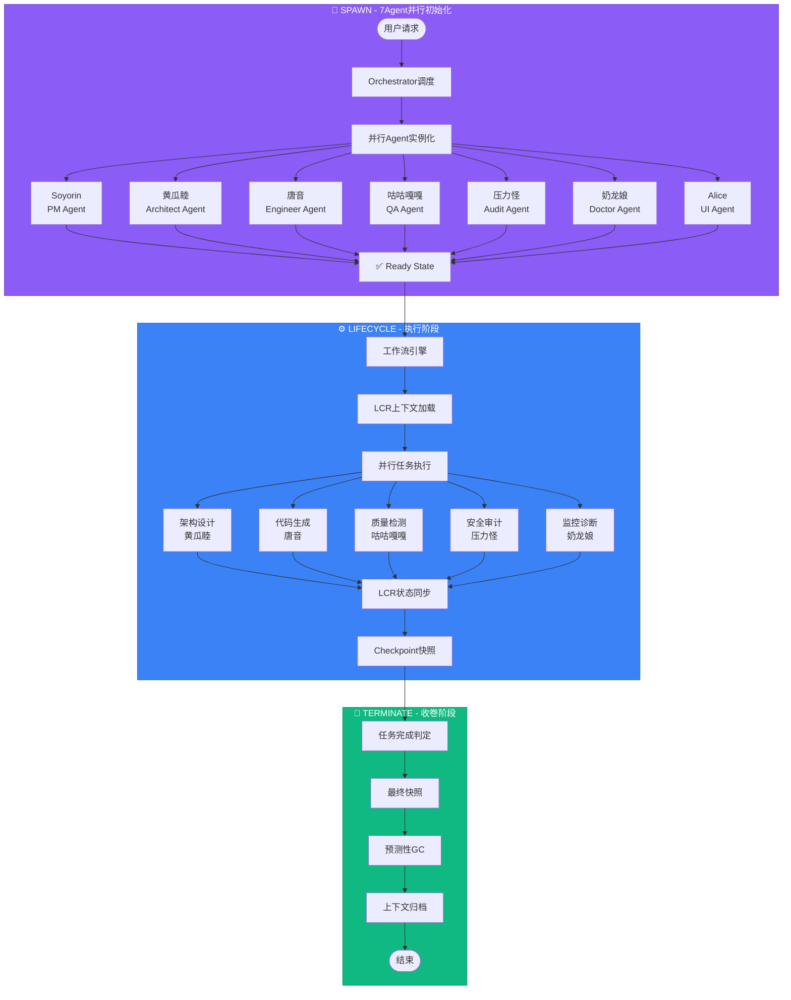
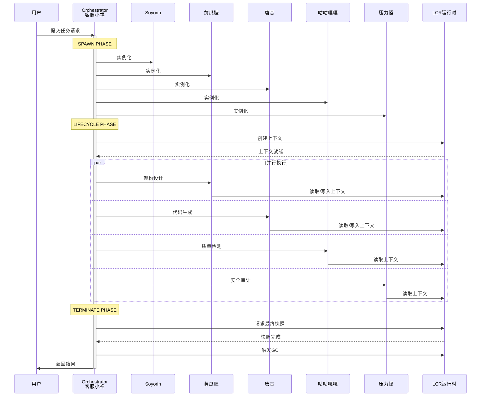

# Hajimi Engineering 系统架构白皮书 v1.0

> **文档编号**: B-04/09  
> **版本**: v1.0  
> **日期**: 2026-02-17  
> **状态**: 草案  
> **对应章节**: 3.1-3.2 系统架构图、核心流程、Hajimi-Unified流程图

---

## 3. 系统架构

### 3.1 七权树目录结构

Hajimi系统采用**七权分立**架构设计，将核心功能划分为七个自治领域（Quintant），每个领域由独立的Agent角色治理。

```
lib/
├── pm/                 # Soyorin - 项目管理
│   ├── sprint/         # 迭代规划
│   ├── backlog/        # 需求池管理
│   └── roadmap/        # 路线图规划
│
├── architect/          # 黄瓜睦 - 架构设计
│   ├── patterns/       # 设计模式库
│   ├── decisions/      # ADR架构决策记录
│   └── diagrams/       # 架构图资产
│
├── engineer/           # 唐音 - 工程实现
│   ├── codegen/        # 代码生成
│   ├── refactor/       # 重构引擎
│   └── review/         # 代码审查
│
├── qa/                 # 咕咕嘎嘎 - 质量保证
│   ├── test/           # 测试框架
│   ├── coverage/       # 覆盖率分析
│   └── fuzz/           # 模糊测试
│
├── audit/              # 压力怪 - 审计合规
│   ├── security/       # 安全审计
│   ├── compliance/     # 合规检查
│   └── debt/           # 技术债务追踪
│
├── orchestrator/       # 客服小祥 - 协调编排
│   ├── dispatch/       # 任务调度
│   ├── workflow/       # 工作流引擎
│   └── fallback/       # 降级策略
│
├── doctor/             # 奶龙娘 - 故障诊断
│   ├── diagnose/       # 故障诊断
│   ├── heal/           # 自愈修复
│   └── predict/        # 故障预测
│
├── alice/              # Blue Sechi UI
│   ├── ml/             # 机器学习引擎
│   ├── ui/             # 界面组件
│   └── theme/          # 主题系统
│
└── lcr/                # 本地上下文运行时
    ├── snapper/        # 上下文快照
    ├── workspace/      # 工作空间
    ├── memory/         # 分层记忆
    ├── retrieval/      # 混合检索
    ├── gc/             # 预测性GC
    ├── sync/           # 跨端同步
    ├── security/       # 安全沙盒
    └── meta/           # 元引导引擎
```

#### 3.1.1 七角色职责矩阵

| Agent角色 | 目录 | 核心职责 | 主题色 |
|-----------|------|----------|--------|
| Soyorin | `pm/` | 项目管理、迭代规划 | 粉色 #F472B6 |
| 黄瓜睦 | `architect/` | 架构设计、模式定义 | 绿色 #84CC16 |
| 唐音 | `engineer/` | 代码生成、工程实现 | 红色 #EF4444 |
| 咕咕嘎嘎 | `qa/` | 测试验证、质量保证 | 蓝色 #3B82F6 |
| 压力怪 | `audit/` | 审计合规、债务追踪 | 橙色 #F97316 |
| 客服小祥 | `orchestrator/` | 任务编排、协调调度 | 紫色 #8B5CF6 |
| 奶龙娘 | `doctor/` | 故障诊断、自愈修复 | 青色 #06B6D4 |

#### 3.1.2 LCR运行时架构

本地上下文运行时（Local Context Runtime）是Hajimi系统的核心基础设施，提供统一的上下文管理能力：

```
┌─────────────────────────────────────────────────────────────┐
│                     LCR Runtime Layer                        │
├─────────────┬─────────────┬─────────────┬───────────────────┤
│   Snapper   │  Workspace  │   Memory    │    Retrieval      │
│  上下文快照  │  工作空间    │  分层记忆    │    混合检索        │
├─────────────┴─────────────┴─────────────┴───────────────────┤
│                     Meta Engine (元引导引擎)                  │
├─────────────────────────────────────────────────────────────┤
│   GC      │   Sync      │   Security    │   Observability   │
│ 预测性GC   │  跨端同步    │   安全沙盒     │    可观测性        │
└─────────────────────────────────────────────────────────────┘
```

---

### 3.2 TSA-LCR适配说明

#### 3.2.1 桥接层设计

TSA（Type-Safe Architecture）与LCR（Local Context Runtime）通过**统一桥接层**实现命名空间和类型系统的无缝对接：

```
┌─────────────────────────────────────────────────────────────┐
│                    TSA-LCR Bridge Layer                      │
├─────────────────────────────────────────────────────────────┤
│  Namespace Unification    │    Type Mapping                 │
│  命名空间统一              │    类型映射                      │
├─────────────────────────────────────────────────────────────┤
│  ┌─────────────┐         │         ┌─────────────┐          │
│  │  TSA Types  │◄───────┼────────►│  LCR Types  │          │
│  │  lib/tsa/   │         │         │  lib/lcr/   │          │
│  └─────────────┘         │         └─────────────┘          │
├─────────────────────────────────────────────────────────────┤
│  Protocol Adapter         │    State Sync                   │
│  协议适配器                │    状态同步                      │
└─────────────────────────────────────────────────────────────┘
```

#### 3.2.2 命名空间统一规范

| 命名空间 | TSA路径 | LCR路径 | 说明 |
|----------|---------|---------|------|
| Core | `lib/tsa/core` | `lib/lcr/meta` | 核心运行时 |
| State | `lib/tsa/state` | `lib/lcr/snapper` | 状态管理 |
| Security | `lib/tsa/security` | `lib/lcr/security` | 安全沙盒 |
| Resilience | `lib/tsa/resilience` | `lib/lcr/gc` | 弹性机制 |
| Protocol | `lib/tsa/protocols` | `lib/lcr/sync` | 协议同步 |

#### 3.2.3 适配原则

1. **命名空间统一**: 所有Agent通过统一的`lib/quintant/`命名空间访问LCR能力
2. **类型安全**: TSA类型系统确保跨边界调用的类型一致性
3. **状态隔离**: 各Quintant的上下文通过LCR安全沙盒隔离
4. **零拷贝同步**: 快照数据通过内存映射实现高效同步

---

### 3.3 Hajimi-Unified流程图

Hajimi-Unified定义了七Agent协同工作的**统一生命周期协议**，支持"单窗批处理"模式下的高效任务处理。

#### 3.3.1 完整流程图



#### 3.3.2 阶段详解

##### SPAWN（7Agent并行初始化）

```
┌─────────────────────────────────────────────────────────────┐
│                        SPAWN PHASE                           │
│                    7Agent并行实例化                           │
├─────────────────────────────────────────────────────────────┤
│                                                             │
│   ┌─────────┐ ┌─────────┐ ┌─────────┐ ┌─────────┐          │
│   │ Soyorin │ │黄瓜睦   │ │  唐音   │ │咕咕嘎嘎 │          │
│   │  (PM)   │ │(Arch)   │ │ (Eng)   │ │  (QA)   │          │
│   └────┬────┘ └────┬────┘ └────┬────┘ └────┬────┘          │
│        │           │           │           │               │
│        └───────────┴─────┬─────┴───────────┘               │
│                          ▼                                  │
│              ┌───────────────────────┐                      │
│              │   Orchestrator Hub    │                      │
│              │    (客服小祥调度)      │                      │
│              └───────────┬───────────┘                      │
│                          │                                  │
│        ┌─────────────────┼─────────────────┐               │
│        ▼                 ▼                 ▼               │
│   ┌─────────┐      ┌─────────┐      ┌─────────┐           │
│   │ 压力怪   │      │ 奶龙娘   │      │  Alice  │           │
│   │(Audit)  │      │(Doctor) │      │  (UI)   │           │
│   └─────────┘      └─────────┘      └─────────┘           │
│                                                             │
└─────────────────────────────────────────────────────────────┘
```

**关键特性**:
- 并行初始化：7个Agent同时启动，减少冷启动时间
- 统一配置：通过`lib/config/`加载共享配置
- LCR绑定：每个Agent绑定独立的LCR上下文空间

##### LIFECYCLE（执行阶段）

```
┌─────────────────────────────────────────────────────────────┐
│                      LIFECYCLE PHASE                         │
│                      单窗批处理模式                          │
├─────────────────────────────────────────────────────────────┤
│                                                             │
│  ┌─────────────────────────────────────────────────────┐   │
│  │                  单窗批处理 (Batch Mode)              │   │
│  │  ┌───────────────────────────────────────────────┐  │   │
│  │  │  Input:  批量任务列表                          │  │   │
│  │  │  Window: 滑动窗口大小 = N                      │  │   │
│  │  │  Process: 并行处理窗口内任务                   │  │   │
│  │  │  Output: 统一结果聚合                          │  │   │
│  │  └───────────────────────────────────────────────┘  │   │
│  └─────────────────────────────────────────────────────┘   │
│                            │                                │
│                            ▼                                │
│  ┌─────────────────────────────────────────────────────┐   │
│  │                  LCR上下文管理                        │   │
│  │  ┌─────────┐  ┌─────────┐  ┌─────────┐  ┌────────┐  │   │
│  │  │ Snapper │  │ Memory  │  │Retrieval│  │   GC   │  │   │
│  │  │ 快照    │  │ 记忆    │  │ 检索    │  │ 回收   │  │   │
│  │  └─────────┘  └─────────┘  └─────────┘  └────────┘  │   │
│  └─────────────────────────────────────────────────────┘   │
│                                                             │
└─────────────────────────────────────────────────────────────┘
```

**单窗批处理特性**:
- 批量任务通过滑动窗口进行流式处理
- 窗口内任务并行执行，提高吞吐量
- LCR自动管理上下文切换和内存分配

##### TERMINATE（收卷阶段）

```
┌─────────────────────────────────────────────────────────────┐
│                      TERMINATE PHASE                         │
│                      上下文收卷                              │
├─────────────────────────────────────────────────────────────┤
│                                                             │
│   1. 完成判定                                               │
│      ├── 所有Agent任务完成确认                               │
│      ├── 结果一致性校验                                     │
│      └── 质量门禁检查                                       │
│                                                             │
│   2. 最终快照 (Final Snapshot)                              │
│      ├── LCR状态序列化                                      │
│      ├── 执行日志归档                                       │
│      └── 性能指标收集                                       │
│                                                             │
│   3. 预测性GC (Predictive GC)                               │
│      ├── 内存碎片整理                                       │
│      ├── 僵尸Agent清理                                      │
│      └── 缓存预热数据保留                                    │
│                                                             │
│   4. 上下文归档                                              │
│      ├── 持久化到Storage                                    │
│      ├── 生成执行报告                                       │
│      └── 资源释放                                           │
│                                                             │
└─────────────────────────────────────────────────────────────┘
```

---

### 3.4 核心流程数据流



---

## 自测验证

| 编号 | 验证项 | 状态 |
|------|--------|------|
| [README-010] | 目录结构含lib/{pm,architect,engineer,qa,audit,orchestrator,doctor,alice,lcr} | ✅ |
| [README-011] | 流程图含SPAWN/LIFECYCLE/TERMINATE | ✅ |
| [README-012] | 含"单窗批处理"关键词 | ✅ |

---

## 附录

### A. 术语表

| 术语 | 英文 | 说明 |
|------|------|------|
| Quintant | Quintant | 五权/七权领域，自治功能单元 |
| LCR | Local Context Runtime | 本地上下文运行时 |
| TSA | Type-Safe Architecture | 类型安全架构 |
| SPAWN | Spawn | 初始化阶段 |
| TERMINATE | Terminate | 收卷阶段 |
| 单窗批处理 | Single Window Batch | 滑动窗口批处理模式 |

### B. 相关文档

- [TSA-LCR桥接层设计](./HAJIMI-TSA-REPAIR-001-修复白皮书-v1.0.md)
- [LCR运行时规范](./HAJIMI-SANDBOX-003-赛博牢房白皮书-v1.0.md)
- [Phase5人格化UI](./HAJIMI-PHASE5-PERSONA-001-白皮书-v1.0.md)

---

*文档结束*
