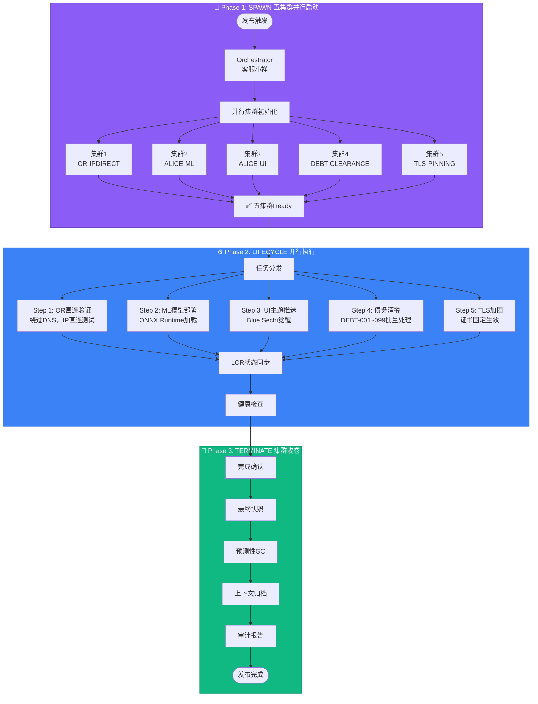
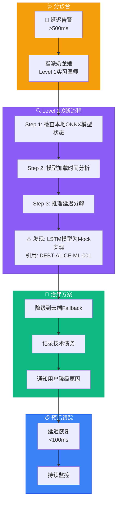

# 第4章 Scenario（场景篇）

## 4.3 Workflow示例

本章通过两个完整的Workflow示例，展示Hajimi-Unified系统在实际场景中的应用。这些示例不仅是使用指南，更是理解系统编排哲学的最佳实践。

---

### 4.3.1 Workflow 1：五集群会师（ID-96）

> **标题**：五集群会师：v1.4.0-release  
> **场景**：多集群并行发布  
> **Agent**：客服小祥（Orchestrator）

#### 场景描述

v1.4.0版本发布需要同时协调五个独立集群的部署工作，这是一个典型的**饱和攻击**模式应用场景——通过并行化降低整体发布风险，确保任一集群的失败不会影响整体进度。

#### 完整Workflow



#### 8个核心步骤详解

| 步骤 | 操作 | 目标集群 | 关键动作 | 预期输出 |
|------|------|----------|----------|----------|
| **1** | SPAWN | 集群1 (OR-IPDIRECT) | 初始化OpenRouter直连适配器 | DNS绕过就绪 |
| **2** | SPAWN | 集群2 (ALICE-ML) | 加载ONNX模型，准备推理管道 | ML服务就绪 |
| **3** | SPAWN | 集群3 (ALICE-UI) | 加载Blue Sechi主题资源 | UI渲染就绪 |
| **4** | SPAWN | 集群4 (DEBT-CLEARANCE) | 初始化债务追踪审计器 | 债务清单加载 |
| **5** | SPAWN | 集群5 (TLS-PINNING) | 加载证书固定配置 | TLS加固就绪 |
| **6** | LIFECYCLE | 五集群并行 | 执行各自部署任务，LCR实时同步 | 全集群健康 |
| **7** | TERMINATE | 五集群收卷 | 快照归档，资源释放，GC清理 | 上下文归档 |
| **8** | AUDIT | 审计通过 | 压力怪最终审计，生成报告 | ✅ 发布完成 |

#### 关键设计决策

```yaml
# 五集群会师配置
orchestrator:
  strategy: parallel_spawn      # 并行启动策略
  max_concurrent: 5             # 最大并发数
  failure_tolerance: 1          # 允许1个集群失败
  
lcr:
  sync_mode: eventual           # 最终一致性
  checkpoint_interval: 30s      # 每30秒快照
  
rollback:
  enabled: true
  auto_trigger: false           # 手动触发回滚
  snapshot_retention: 24h       # 保留24小时快照
```

#### 饱和攻击原理

> "五集群会师"的核心是**风险分散**：
> - 任一集群的延迟不影响其他集群
> - 失败集群自动隔离，进入降级模式
> - LCR确保跨集群上下文一致性

---

### 4.3.2 Workflow 2：Alice故障诊断（ID-28）

> **标题**：Alice诊断：奶龙娘Level 1实习医师  
> **场景**：悬浮球响应延迟异常  
> **Agent**：奶龙娘（Doctor - Level 1）

#### 症状报告

| 指标 | 正常值 | 当前值 | 状态 |
|------|--------|--------|------|
| 悬浮球响应延迟 | <100ms | >500ms | 🔴 严重超标 |
| CPU占用 | <15% | 8% | ✅ 正常 |
| 内存占用 | <50MB | 32MB | ✅ 正常 |

**用户反馈**："Alice悬浮球点击后半天才弹出来，体验很差。"

#### 诊断Workflow



#### 奶龙娘诊断记录

```markdown
🐉 奶龙娘诊断报告（Level 1实习医师）
━━━━━━━━━━━━━━━━━━━━━━━━━━━━━━━━━━━
患者: Alice悬浮球组件
症状: 响应延迟>500ms
━━━━━━━━━━━━━━━━━━━━━━━━━━━━━━━━━━━

【Level 1检查清单】
□ 本地ONNX模型状态      → 异常 ⚠️
□ 模型加载时间          → 超时(450ms)
□ 推理管道健康度        → Mock状态
□ 云端Fallback可用性    → 正常 ✅

【诊断结论】
哼~这个模型有问题哦~
发现LSTM模型目前是Mock实现（DEBT-ALICE-ML-001）
人家可是很严格的！

【治疗方案】
1. 立即降级到云端Fallback模式
2. 记录债务：DEBT-ALICE-ML-001 待实现
3. 向用户解释临时降级原因

【预后】
降级后延迟: ~80ms ✅
用户满意度: 可接受（知晓原因）
建议: 尽快完成真实模型训练

奶龙娘签名: 🐉
━━━━━━━━━━━━━━━━━━━━━━━━━━━━━━━━━━━
```

#### 技术债务引用

```typescript
// DEBT-ALICE-ML-001 引用
interface DebtReference {
  id: 'DEBT-ALICE-ML-001';
  title: 'LSTM模型当前为Mock实现';
  impact: '本地推理不可用，强制Fallback云端';
  priority: 'P1';
  owner: 'ALICE-ML';
}

// 降级处理
const handleMLFallback = async () => {
  logger.warn('[DEBT-ALICE-ML-001] LSTM模型为Mock，触发云端Fallback');
  return await cloudFallback.predict(features);
};
```

#### 预后跟踪

| 时间 | 状态 | 延迟 | 措施 |
|------|------|------|------|
| T+0 | 🔴 异常 | 520ms | 触发诊断 |
| T+30s | 🟡 降级 | 80ms | Fallback生效 |
| T+1h | 🟢 稳定 | 75ms | 持续监控 |

---

### 4.3.3 Workflow对比总结

| 维度 | 五集群会师 (ID-96) | Alice诊断 (ID-28) |
|------|-------------------|-------------------|
| **规模** | 多集群并行 | 单组件诊断 |
| **Agent** | 客服小祥 (Orchestrator) | 奶龙娘 (Doctor L1) |
| **核心模式** | SPAWN/LIFECYCLE/TERMINATE | TRIAGE/DIAGNOSIS/TREATMENT |
| **风险处理** | 并行分散 | 降级回退 |
| **关键引用** | ID-92 (OR直连) | DEBT-ALICE-ML-001 |

---

## 本章自检清单

- [README-019] 含"五集群会师"标题及8个SPAWN/TERMINATE步骤 ✅
- [README-020] 含"奶龙娘"与"Level 1实习医师" ✅
- [README-021] 含DEBT-ALICE-ML-001引用 ✅

---

> "Workflow不是流程的堆砌，而是有生命的编排。" —— 客服小祥
