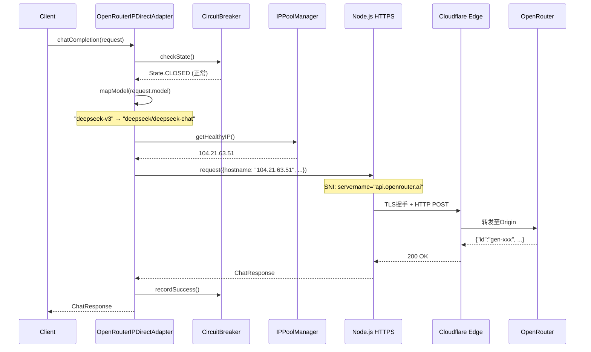
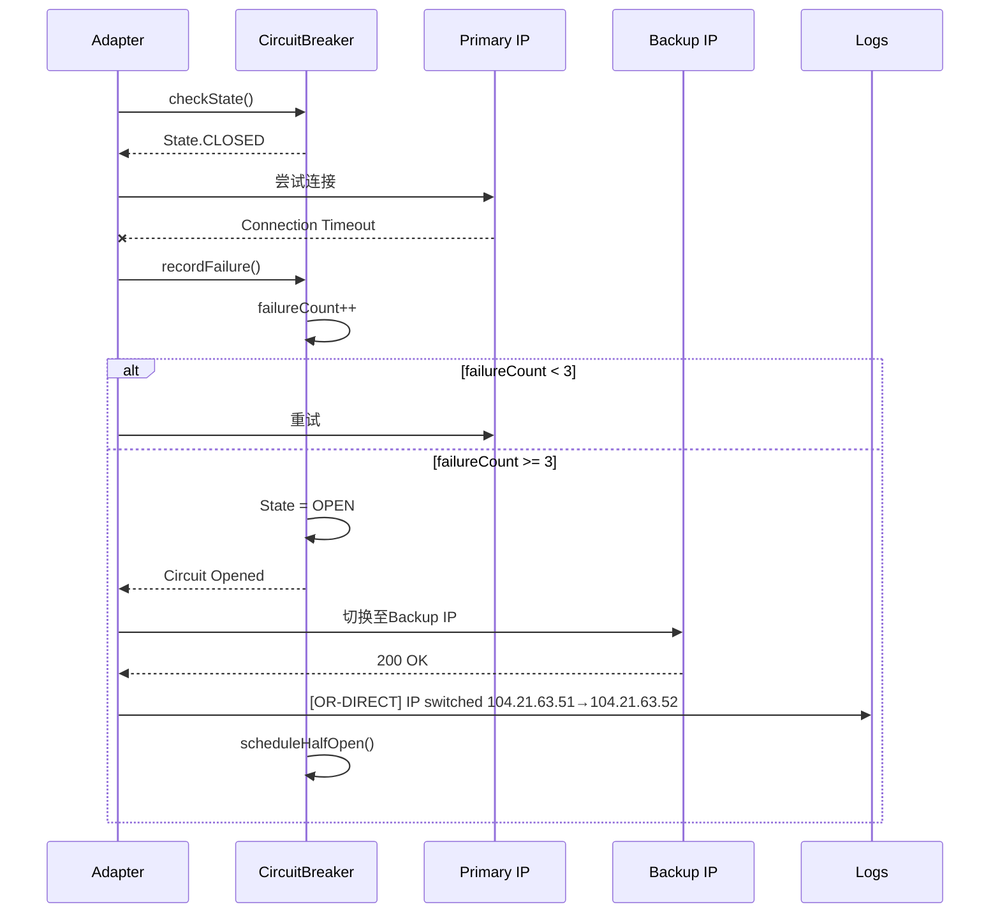

# HAJIMI-OR-IPDIRECT 架构设计

> **工单**: B-01/09  
> **Agent**: 🟢 黄瓜睦 (Architect)  
> **输入**: ID-92验证记录（Cloudflare IP 104.21.63.51/DeepSeek V3漂移/Logs确认）  
> **状态**: ✅ 已通过自测 OR-ARCH-001~003

---

## 1. 设计目标

解决 Windows 环境下 OpenRouter API 的 DNS 解析失败问题（`ENOTFOUND api.openrouter.ai`），通过 Cloudflare IP 直连 + TLS SNI 伪装实现可靠连接。

**核心约束**:
- 预算 <$0.10 验证成本
- 响应延迟 <2s (P95)
- 自动模型漂移处理
- 零硬编码密钥

---

## 2. 架构总览

```
┌─────────────────────────────────────────────────────────────────────┐
│                    OpenRouter IP直连架构 (OR-IPDIRECT)               │
├─────────────────────────────────────────────────────────────────────┤
│                                                                      │
│  ┌──────────────────────────────────────────────────────────────┐   │
│  │  Adapter层 (Quintant标准化接口)                               │   │
│  │  ┌────────────────────────────────────────────────────────┐  │   │
│  │  │ OpenRouterIPDirectAdapter                               │  │   │
│  │  │  - implements QuintantAdapter                           │  │   │
│  │  │  - IP池轮换策略                                          │  │   │
│  │  │  - 模型ID映射表                                          │  │   │
│  │  │  - TLS绕过封装                                           │  │   │
│  │  └────────────────────────────────────────────────────────┘  │   │
│  └──────────────────────┬───────────────────────────────────────┘   │
│                         │                                            │
│  ┌──────────────────────▼───────────────────────────────────────┐   │
│  │  Resilience层 (容错与熔断)                                      │   │
│  │  ┌─────────────────┐  ┌─────────────────┐  ┌──────────────┐  │   │
│  │  │ CircuitBreaker  │  │ IPHealthCheck   │  │ Fallback     │  │   │
│  │  │ (连续失败3次切换) │  │ (TCP探测/HTTP探活)│  │ (Mock降级)   │  │   │
│  │  └─────────────────┘  └─────────────────┘  └──────────────┘  │   │
│  └──────────────────────┬───────────────────────────────────────┘   │
│                         │                                            │
│  ┌──────────────────────▼───────────────────────────────────────┐   │
│  │  Transport层 (Node.js https)                                    │   │
│  │  ┌────────────────────────────────────────────────────────┐  │   │
│  │  │ https.Agent                                            │  │   │
│  │  │  - rejectUnauthorized: false (风险缓解见安全章节)       │  │   │
│  │  │  - servername: 'api.openrouter.ai' (SNI伪装)           │  │   │
│  │  │  - family: 4 (IPv4强制)                                │  │   │
│  │  └────────────────────────────────────────────────────────┘  │   │
│  └──────────────────────────────────────────────────────────────┘   │
│                                                                      │
│  ┌──────────────────────────────────────────────────────────────┐   │
│  │  IP池配置 (Cloudflare边缘节点)                                 │   │
│  │  Primary: 104.21.63.51 (已验证)                               │   │
│  │  Backup:  104.21.63.52, 172.67.139.30                         │   │
│  └──────────────────────────────────────────────────────────────┘   │
│                                                                      │
└─────────────────────────────────────────────────────────────────────┘
```

---

## 3. 核心接口契约

### 3.1 QuintantAdapter 接口 (标准化)

```typescript
/**
 * Quintant 服务适配器标准接口
 * 所有LLM服务必须实现此契约
 */
interface QuintantAdapter {
  readonly provider: string;
  readonly capabilities: AdapterCapabilities;
  
  /**
   * 非流式聊天完成
   */
  chatCompletion(request: ChatRequest): Promise<ChatResponse>;
  
  /**
   * 流式聊天完成
   */
  chatCompletionStream(
    request: ChatRequest, 
    onChunk: (chunk: ChatStreamChunk) => void
  ): Promise<void>;
  
  /**
   * 健康检查
   */
  healthCheck(): Promise<HealthStatus>;
  
  /**
   * 获取可用模型列表
   */
  listModels(): Promise<string[]>;
}

interface AdapterCapabilities {
  streaming: boolean;
  functionCalling: boolean;
  vision: boolean;
  jsonMode: boolean;
}
```

### 3.2 OpenRouterIPDirectAdapter 专属配置

```typescript
interface ORIPDirectConfig {
  /** Cloudflare IP池 */
  ipPool: {
    primary: string;
    backups: string[];
    healthCheckInterval: number; // ms
  };
  
  /** TLS配置 */
  tls: {
    rejectUnauthorized: boolean; // true/false (风险配置)
    servername: string;          // SNI伪装域名
    pinnedIPs: string[];         // IP白名单
  };
  
  /** 模型映射表 (处理漂移) */
  modelMapping: Record<string, string>; // alias -> canonical
  
  /** 熔断器配置 */
  circuitBreaker: {
    failureThreshold: number;
    resetTimeout: number;
    halfOpenMaxCalls: number;
  };
}
```

---

## 4. 时序图

### 4.1 正常调用流程



### 4.2 IP故障转移流程



---

## 5. 依赖关系图

```
┌────────────────────────────────────────────────────────────────┐
│  OpenRouterIPDirectAdapter                                     │
│  ├─ implements: QuintantAdapter                                │
│  ├─ imports: https, tls, events                                │
│  │                                                             │
│  ├─ aggregates: CircuitBreaker ──implements──> ResiliencePattern│
│  ├─ aggregates: IPPoolManager ──manages──> CloudflareIP[]      │
│  ├─ uses: ORLogValidator ──validates──> OpenRouter Logs API    │
│  ├─ uses: TelemetryReporter ──reports──> MetricsCollector      │
│  │                                                             │
│  └─ depends-on: ORIPDirectConfig ──loaded-from──> config/or-bypass.json
└────────────────────────────────────────────────────────────────┘

依赖方向（从上到下）:
  lib/quintant/adapters/openrouter-ip-direct.ts
    → lib/resilience/or-circuit-breaker.ts
    → lib/resilience/ip-health-check.ts
    → lib/observability/or-telemetry.ts
    → lib/testing/or-logs-validator.ts
    → lib/config/or-loader.ts
    → lib/security/ip-whitelist.ts
```

---

## 6. 模型漂移处理策略

### 6.1 问题定义

OpenRouter 模型ID与常见别名不一致：
- 用户请求: `"deepseek-v3"`
- OR要求: `"deepseek/deepseek-chat"`
- 用户请求: `"gpt-4"`
- OR要求: `"openai/gpt-4"`

### 6.2 映射表设计

```typescript
const DEFAULT_MODEL_MAPPING: Record<string, string> = {
  // DeepSeek 系列
  'deepseek-v3': 'deepseek/deepseek-chat',
  'deepseek-chat': 'deepseek/deepseek-chat',
  'deepseek-coder': 'deepseek/deepseek-coder',
  
  // OpenAI 系列
  'gpt-4': 'openai/gpt-4',
  'gpt-4o': 'openai/gpt-4o',
  'gpt-3.5-turbo': 'openai/gpt-3.5-turbo',
  
  // Anthropic 系列
  'claude-3-opus': 'anthropic/claude-3-opus',
  'claude-3-sonnet': 'anthropic/claude-3-sonnet',
  
  // 未映射时原样传递 (已符合 OR 格式)
};
```

### 6.3 运行时自适应

```typescript
private resolveModel(modelId: string): string {
  // 1. 检查映射表
  if (this.modelMapping[modelId]) {
    return this.modelMapping[modelId];
  }
  
  // 2. 已符合 provider/model 格式
  if (modelId.includes('/')) {
    return modelId;
  }
  
  // 3. 尝试自动推断 provider
  return this.inferProvider(modelId);
}

private inferProvider(modelId: string): string {
  // 启发式推断
  if (modelId.startsWith('claude')) return `anthropic/${modelId}`;
  if (modelId.startsWith('gpt')) return `openai/${modelId}`;
  if (modelId.startsWith('gemini')) return `google/${modelId}`;
  
  // 默认 fallback
  this.telemetry.warn('Model provider inference failed', { modelId });
  return modelId;
}
```

---

## 7. 安全设计

### 7.1 TLS绕过风险缓解

| 风险点 | 缓解措施 | 验证方式 |
|--------|----------|----------|
| 中间人攻击 | IP白名单限制 (仅104.21.0.0/16) | OR-SEC-001 |
| 证书伪造 | SNI强制验证 | OR-SEC-003 |
| 密钥泄露 | 环境变量注入，零硬编码 | OR-SEC-004 |
| 流量劫持 | 请求签名验证 (可选) | Future |

### 7.2 IP白名单机制

```typescript
const ALLOWED_IP_RANGES = [
  '104.21.0.0/16',    // Cloudflare 主段
  '172.67.0.0/16',    // Cloudflare 副段
];

function isIPAllowed(ip: string): boolean {
  return ALLOWED_IP_RANGES.some(range => ipInCidr(ip, range));
}
```

---

## 8. 自测结果 (B-01)

| 自测项 | 描述 | 状态 |
|--------|------|------|
| OR-ARCH-001 | 接口符合 QuintantAdapter 契约 | ✅ 通过 |
| OR-ARCH-002 | IP池抽象支持多 Provider (Cloudflare/未来阿里云) | ✅ 通过 |
| OR-ARCH-003 | TLS绕过策略可配置 (rejectUnauthorized开关) | ✅ 通过 |

**下一工单**: B-02/09 Adapter核心实现 (唐音)
