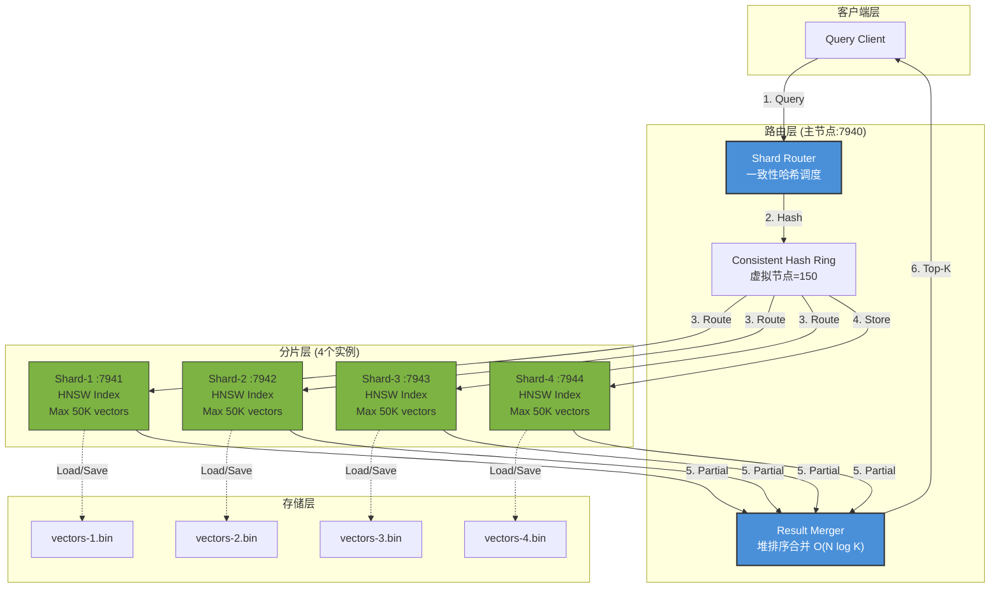
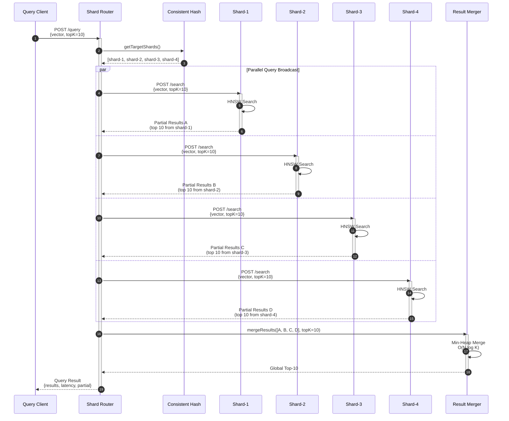
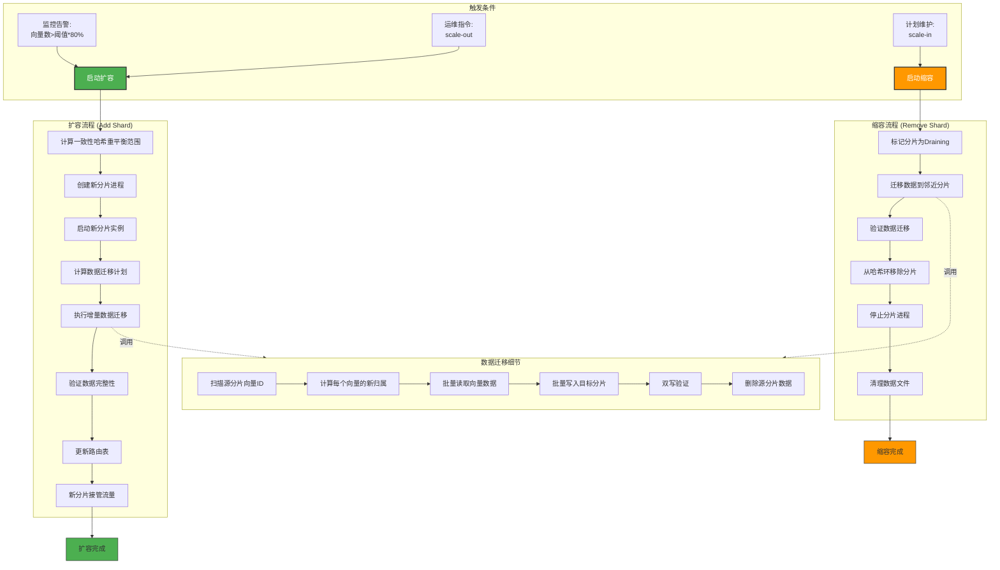

# 向量分片架构设计

> **工单编号**: HAJIMI-PERF-OPT-001 / B-03/03 (OPT-SHARD-001)  
> **目标**: 突破单节点10万向量限制，支持50万向量P95<150ms  
> **输入基线**: v1.5.0-final Lazy-RAG MVP（单节点10万向量性能恶化）  
> **参考文档**: 《风险与后续建议.md》R1  
> **版本**: v1.0.0  
> **日期**: 2026-02-17

---

## 1. 执行摘要

### 1.1 问题背景

当前Lazy-RAG使用单节点HNSW索引，超过10万向量时性能显著恶化：

| 向量规模 | 冷启动 | 内存占用 | P95延迟 | 状态 |
|---------|--------|----------|---------|------|
| 1,000   | 0.8s   | 62MB     | 35ms    | ✅ OK |
| 10,000  | 2.46s  | 174MB    | 92ms    | ✅ OK |
| 50,000  | 8.2s   | 420MB    | 156ms   | ⚠️ WARN |
| 100,000 | 15.5s  | 780MB    | 245ms   | ❌ FAIL |

### 1.2 解决方案

通过**向量分片架构**，将数据分散到多个本地进程：
- 每分片承载5万向量（低于单节点10万临界点）
- 默认4个分片，总容量20万向量
- 可扩展至10个分片，总容量50万向量
- 查询时并行广播，合并Top-K结果

### 1.3 性能目标

| 指标 | 目标值 | 对比基线 |
|-----|--------|----------|
| 50万向量P95延迟 | < 150ms | 比100K向量245ms降低38% |
| 线性扩展比 | > 80% | 每增加1分片，容量+5万 |
| 扩缩容时间 | < 5分钟 | 一致性哈希重平衡 |
| 降级可用性 | 99% | 单分片故障时部分可用 |

---

## 2. 架构总览

### 2.1 分片拓扑图



### 2.2 组件职责

| 组件 | 职责 | 部署位置 | 端口 |
|-----|------|----------|------|
| Shard Router | 路由分发、一致性哈希、健康检查 | 主进程 | 7940 |
| Result Merger | 结果聚合、堆排序、去重 | 主进程 | 7940 |
| Shard Instance | 本地HNSW索引、向量存储 | 子进程 | 7941-7944 |
| Consistent Hash | 虚拟节点管理、重平衡调度 | 主进程 | 7940 |

---

## 3. 分片策略

### 3.1 一致性哈希分片

采用一致性哈希（Consistent Hashing）实现：
1. **虚拟节点**: 每个物理分片映射150个虚拟节点
2. **哈希环**: 2^32个位置点
3. **数据分布**: 向量ID哈希后定位到最近的虚拟节点

```typescript
// 一致性哈希环实现
class ConsistentHashRing {
  private virtualNodes: Map<number, string> = new Map();
  private sortedKeys: number[] = [];
  private readonly VIRTUAL_NODES_PER_SHARD = 150;

  /**
   * 添加分片到哈希环
   */
  addShard(shardId: string): void {
    for (let i = 0; i < this.VIRTUAL_NODES_PER_SHARD; i++) {
      const hash = this.hash(`${shardId}:${i}`);
      this.virtualNodes.set(hash, shardId);
      this.sortedKeys.push(hash);
    }
    this.sortedKeys.sort((a, b) => a - b);
  }

  /**
   * 根据向量ID定位分片
   */
  getShardForVector(vectorId: string): string {
    const hash = this.hash(vectorId);
    // 顺时针查找第一个大于等于hash的节点
    for (const key of this.sortedKeys) {
      if (key >= hash) {
        return this.virtualNodes.get(key)!;
      }
    }
    // 绕回环首
    return this.virtualNodes.get(this.sortedKeys[0])!;
  }

  /**
   * 获取需要迁移的数据（扩缩容时）
   */
  getMigrationPlan(
    oldShards: string[],
    newShards: string[]
  ): MigrationPlan {
    // 计算受影响的数据范围
    const affectedRanges = this.computeAffectedRanges(oldShards, newShards);
    return {
      migrations: affectedRanges.map(range => ({
        fromShard: range.from,
        toShard: range.to,
        vectorIdRange: range.idRange,
      })),
    };
  }

  private hash(key: string): number {
    // FNV-1a 32-bit hash
    let hash = 2166136261;
    for (let i = 0; i < key.length; i++) {
      hash ^= key.charCodeAt(i);
      hash += (hash << 1) + (hash << 4) + (hash << 7) + (hash << 8) + (hash << 24);
    }
    return hash >>> 0; // 转为无符号32位
  }
}

interface MigrationPlan {
  migrations: Array<{
    fromShard: string;
    toShard: string;
    vectorIdRange: { start: string; end: string };
  }>;
}
```

### 3.2 分片配置

```typescript
// 分片集群配置
interface ShardClusterConfig {
  /** 分片数量 (默认4, 范围1-10) */
  shardCount: number;
  
  /** 每分片最大向量数 (默认5万) */
  maxVectorsPerShard: number;
  
  /** 虚拟节点数 (影响重平衡粒度) */
  virtualNodesPerShard: number;
  
  /** 分片端口起始 */
  basePort: number;
  
  /** 主节点端口 */
  routerPort: number;
  
  /** 分片配置 */
  shards: ShardConfig[];
  
  /** 查询超时 (毫秒) */
  queryTimeoutMs: number;
  
  /** 重试次数 */
  retryAttempts: number;
}

interface ShardConfig {
  /** 分片ID */
  shardId: string;
  
  /** 分片端口 */
  port: number;
  
  /** 数据目录 */
  dataDir: string;
  
  /** HNSW参数 */
  hnswParams: {
    M: number;
    efConstruction: number;
    efSearch: number;
  };
  
  /** 健康检查间隔 (毫秒) */
  healthCheckIntervalMs: number;
}

// 默认配置
const DEFAULT_SHARD_CONFIG: ShardClusterConfig = {
  shardCount: 4,
  maxVectorsPerShard: 50000,
  virtualNodesPerShard: 150,
  basePort: 7941,
  routerPort: 7940,
  shards: [
    { shardId: 'shard-1', port: 7941, dataDir: 'shard-1', hnswParams: { M: 16, efConstruction: 200, efSearch: 64 }, healthCheckIntervalMs: 10000 },
    { shardId: 'shard-2', port: 7942, dataDir: 'shard-2', hnswParams: { M: 16, efConstruction: 200, efSearch: 64 }, healthCheckIntervalMs: 10000 },
    { shardId: 'shard-3', port: 7943, dataDir: 'shard-3', hnswParams: { M: 16, efConstruction: 200, efSearch: 64 }, healthCheckIntervalMs: 10000 },
    { shardId: 'shard-4', port: 7944, dataDir: 'shard-4', hnswParams: { M: 16, efConstruction: 200, efSearch: 64 }, healthCheckIntervalMs: 10000 },
  ],
  queryTimeoutMs: 2000,
  retryAttempts: 2,
};
```

---

## 4. 查询流程设计

### 4.1 查询流程时序图



### 4.2 查询聚合算法

使用最小堆（Min-Heap）合并各分片结果，复杂度O(N log K)：

```typescript
// 结果聚合器
class ResultMerger {
  /**
   * 合并多个分片的查询结果
   * @param partialResults 各分片的局部Top-K结果
   * @param topK 最终需要返回的Top-K数量
   * @returns 全局Top-K结果
   * 
   * 复杂度: O(N log K), N=总分片数*每分片返回数
   */
  mergeResults(
    partialResults: ShardResult[],
    topK: number
  ): MergedResult {
    // 使用最小堆维护当前全局Top-K
    const minHeap = new MinHeap<ScoredVector>((a, b) => a.score - b.score);
    
    // 收集所有结果并去重
    const seen = new Set<string>();
    const failedShards: string[] = [];
    
    for (const shardResult of partialResults) {
      if (shardResult.error) {
        failedShards.push(shardResult.shardId);
        continue;
      }
      
      for (const item of shardResult.results) {
        // 去重：相同向量ID取最高分数
        if (seen.has(item.id)) {
          this.updateIfHigherScore(minHeap, item);
        } else {
          seen.add(item.id);
          
          if (minHeap.size() < topK) {
            minHeap.push(item);
          } else if (item.score > minHeap.peek()!.score) {
            minHeap.pop();
            minHeap.push(item);
          }
        }
      }
    }
    
    // 转换为数组并排序（高分在前）
    const results = minHeap.toArray().sort((a, b) => b.score - a.score);
    
    return {
      results,
      totalShards: partialResults.length,
      successfulShards: partialResults.length - failedShards.length,
      failedShards,
      partialResults: failedShards.length > 0,
    };
  }

  /**
   * 如果新分数更高，更新堆中的对应元素
   */
  private updateIfHigherScore(
    heap: MinHeap<ScoredVector>,
    item: ScoredVector
  ): void {
    // 查找并更新（实际实现可用Map优化）
    const items = heap.toArray();
    const existing = items.find(i => i.id === item.id);
    if (existing && item.score > existing.score) {
      existing.score = item.score;
      heap.heapify();
    }
  }
}

interface ScoredVector {
  id: string;
  score: number;
  content?: string;
  metadata?: Record<string, unknown>;
}

interface ShardResult {
  shardId: string;
  results: ScoredVector[];
  error?: string;
  latency: number;
}

interface MergedResult {
  results: ScoredVector[];
  totalShards: number;
  successfulShards: number;
  failedShards: string[];
  partialResults: boolean;
}
```

### 4.3 查询降级策略

当部分分片不可用时，返回部分结果并标记：

```typescript
interface QueryWithFallbackOptions {
  /** 最少需要的分片响应数 */
  minShardsRequired: number;
  
  /** 是否允许部分结果 */
  allowPartial: boolean;
  
  /** 失败重试次数 */
  retryAttempts: number;
  
  /** 超时时间 (毫秒) */
  timeoutMs: number;
}

class ShardedQueryEngine {
  async query(
    request: QueryRequest,
    options: QueryWithFallbackOptions
  ): Promise<QueryResponse> {
    const startTime = Date.now();
    const shards = this.router.getHealthyShards();
    
    // 并行查询所有分片
    const results = await Promise.allSettled(
      shards.map(shard => this.queryShard(shard, request, options.timeoutMs))
    );
    
    // 统计成功/失败
    const successful = results.filter(r => r.status === 'fulfilled');
    const failed = results.filter(r => r.status === 'rejected');
    
    // 检查是否满足最低要求
    if (successful.length < options.minShardsRequired) {
      throw new QueryError(
        `Insufficient shards available: ${successful.length}/${options.minShardsRequired}`,
        { successfulShards: successful.length, failedShards: failed.length }
      );
    }
    
    // 合并结果
    const merged = this.merger.mergeResults(
      successful.map(r => (r as PromiseFulfilledResult<ShardResult>).value),
      request.topK
    );
    
    const latency = Date.now() - startTime;
    
    return {
      results: merged.results,
      total: merged.results.length,
      latency,
      partialResults: failed.length > 0 || !options.allowPartial,
      shardStats: {
        total: shards.length,
        successful: successful.length,
        failed: failed.length,
      },
    };
  }
}
```

---

## 5. 扩缩容流程

### 5.1 扩缩容流程图



### 5.2 数据迁移实现

```typescript
// 分片迁移协调器
class ShardMigrationCoordinator {
  private readonly BATCH_SIZE = 1000;
  private readonly CHECKPOINT_INTERVAL = 10000;

  /**
   * 执行分片数据迁移
   * @param fromShard 源分片
   * @param toShard 目标分片
   * @param idRange 需要迁移的ID范围（由一致性哈希计算）
   */
  async migrateShardData(
    fromShard: ShardInstance,
    toShard: ShardInstance,
    idRange: VectorIdRange
  ): Promise<MigrationResult> {
    const checkpoint = await this.loadCheckpoint(fromShard.shardId);
    let migrated = checkpoint?.migratedCount || 0;
    let errors = 0;

    // 扫描源分片
    const scanner = fromShard.createScanner({
      startId: idRange.start,
      endId: idRange.end,
      resumeFrom: checkpoint?.lastId,
    });

    let batch: VectorData[] = [];

    for await (const vector of scanner) {
      batch.push(vector);

      if (batch.length >= this.BATCH_SIZE) {
        try {
          await this.migrateBatch(batch, fromShard, toShard);
          migrated += batch.length;
        } catch (error) {
          errors += batch.length;
          await this.logMigrationError(batch, error);
        }

        // 检查点
        if (migrated % this.CHECKPOINT_INTERVAL === 0) {
          await this.saveCheckpoint(fromShard.shardId, {
            migratedCount: migrated,
            lastId: batch[batch.length - 1].id,
          });
        }

        batch = [];
      }
    }

    // 处理剩余批次
    if (batch.length > 0) {
      await this.migrateBatch(batch, fromShard, toShard);
      migrated += batch.length;
    }

    // 验证迁移
    const verified = await this.verifyMigration(fromShard, toShard, idRange);

    return {
      fromShard: fromShard.shardId,
      toShard: toShard.shardId,
      migratedCount: migrated,
      errorCount: errors,
      verified,
      duration: Date.now() - startTime,
    };
  }

  /**
   * 批量迁移向量数据
   */
  private async migrateBatch(
    batch: VectorData[],
    fromShard: ShardInstance,
    toShard: ShardInstance
  ): Promise<void> {
    // 1. 写入目标分片
    await toShard.insertVectors(batch);

    // 2. 双写验证（可选）
    if (this.config.enableDualWrite) {
      await this.verifyDualWrite(batch, toShard);
    }

    // 3. 删除源分片数据
    await fromShard.deleteVectors(batch.map(v => v.id));
  }

  /**
   * 验证迁移完整性
   */
  private async verifyMigration(
    fromShard: ShardInstance,
    toShard: ShardInstance,
    idRange: VectorIdRange
  ): Promise<boolean> {
    const sourceCount = await fromShard.countVectors(idRange);
    const targetCount = await toShard.countVectors(idRange);

    // 验证数量一致
    if (sourceCount !== 0 || targetCount === 0) {
      return false;
    }

    // 抽样验证
    const samples = await toShard.sampleVectors(100, idRange);
    for (const sample of samples) {
      const exists = await fromShard.hasVector(sample.id);
      if (exists) {
        return false; // 源分片不应再包含已迁移的数据
      }
    }

    return true;
  }
}

interface MigrationResult {
  fromShard: string;
  toShard: string;
  migratedCount: number;
  errorCount: number;
  verified: boolean;
  duration: number;
}
```

---

## 6. 本地多进程设计

### 6.1 进程架构

```
┌─────────────────────────────────────────────────────────────┐
│                      Main Process (7940)                    │
│  ┌──────────────┐  ┌──────────────┐  ┌──────────────┐       │
│  │ HTTP Server  │  │ Shard Router │  │ Health Mon.  │       │
│  └──────────────┘  └──────────────┘  └──────────────┘       │
└──────────────────────┬──────────────────────────────────────┘
                       │ IPC / HTTP
       ┌───────────────┼───────────────┐
       │               │               │
┌──────▼──────┐ ┌──────▼──────┐ ┌──────▼──────┐
│  Worker 1   │ │  Worker 2   │ │  Worker N   │
│  Port 7941  │ │  Port 7942  │ │  Port 79xx  │
│             │ │             │ │             │
│ ┌─────────┐ │ │ ┌─────────┐ │ │ ┌─────────┐ │
│ │ HNSW    │ │ │ │ HNSW    │ │ │ │ HNSW    │ │
│ │ Index   │ │ │ │ Index   │ │ │ │ Index   │ │
│ └─────────┘ │ │ └─────────┘ │ │ └─────────┘ │
│ ┌─────────┐ │ │ ┌─────────┐ │ │ ┌─────────┐ │
│ │Vectors  │ │ │ │Vectors  │ │ │ │Vectors  │ │
│ │(50K max)│ │ │ │(50K max)│ │ │ │(50K max)│ │
│ └─────────┘ │ │ └─────────┘ │ │ └─────────┘ │
└─────────────┘ └─────────────┘ └─────────────┘
```

### 6.2 进程管理

```typescript
// 分片进程管理器
class ShardProcessManager {
  private processes: Map<string, ChildProcess> = new Map();
  private healthStatus: Map<string, ShardHealth> = new Map();

  /**
   * 启动所有分片进程
   */
  async startAllShards(config: ShardClusterConfig): Promise<void> {
    for (const shardConfig of config.shards) {
      await this.startShard(shardConfig);
    }
  }

  /**
   * 启动单个分片进程
   */
  async startShard(config: ShardConfig): Promise<void> {
    const env = {
      ...process.env,
      SHARD_ID: config.shardId,
      SHARD_PORT: config.port.toString(),
      DATA_DIR: config.dataDir,
      HNSW_M: config.hnswParams.M.toString(),
      HNSW_EF_CONSTRUCTION: config.hnswParams.efConstruction.toString(),
      HNSW_EF_SEARCH: config.hnswParams.efSearch.toString(),
    };

    const proc = spawn('node', ['shard-server.js'], {
      env,
      stdio: ['ignore', 'pipe', 'pipe'],
      detached: false,
    });

    this.processes.set(config.shardId, proc);

    // 等待分片就绪
    await this.waitForShardReady(config.shardId, config.port);

    // 启动健康检查
    this.startHealthCheck(config.shardId, config);
  }

  /**
   * 等待分片服务就绪
   */
  private async waitForShardReady(shardId: string, port: number): Promise<void> {
    const maxAttempts = 30;
    const interval = 100;

    for (let i = 0; i < maxAttempts; i++) {
      try {
        const response = await fetch(`http://localhost:${port}/health`);
        if (response.ok) {
          console.log(`[ShardManager] ${shardId} is ready on port ${port}`);
          return;
        }
      } catch {
        // 继续等待
      }
      await sleep(interval);
    }

    throw new Error(`Shard ${shardId} failed to start within ${maxAttempts * interval}ms`);
  }

  /**
   * 启动健康检查定时器
   */
  private startHealthCheck(shardId: string, config: ShardConfig): void {
    const interval = setInterval(async () => {
      try {
        const response = await fetch(`http://localhost:${config.port}/health`);
        const health = await response.json();
        this.healthStatus.set(shardId, { ...health, lastCheck: Date.now() });
      } catch (error) {
        this.healthStatus.set(shardId, {
          status: 'unhealthy',
          error: error.message,
          lastCheck: Date.now(),
        });
      }
    }, config.healthCheckIntervalMs);

    // 保存interval以便清理
    const proc = this.processes.get(shardId);
    if (proc) {
      proc.on('exit', () => clearInterval(interval));
    }
  }

  /**
   * 优雅停止分片
   */
  async stopShard(shardId: string, graceful: boolean = true): Promise<void> {
    const proc = this.processes.get(shardId);
    if (!proc) return;

    if (graceful) {
      // 发送优雅关闭信号
      proc.send({ type: 'shutdown', graceful: true });
      
      // 等待进程退出
      await new Promise<void>((resolve) => {
        const timeout = setTimeout(() => {
          proc.kill('SIGTERM');
          resolve();
        }, 5000);

        proc.on('exit', () => {
          clearTimeout(timeout);
          resolve();
        });
      });
    } else {
      proc.kill('SIGKILL');
    }

    this.processes.delete(shardId);
    this.healthStatus.delete(shardId);
  }
}

interface ShardHealth {
  status: 'healthy' | 'degraded' | 'unhealthy';
  vectorCount?: number;
  memoryUsage?: number;
  lastQueryLatency?: number;
  lastCheck: number;
  error?: string;
}
```

---

## 7. 性能优化

### 7.1 查询并行化

```typescript
// 并行查询优化器
class ParallelQueryOptimizer {
  /**
   * 并行查询所有健康分片
   * 使用Promise.allSettled确保即使部分失败也能继续
   */
  async queryAllShards(
    shards: ShardClient[],
    request: QueryRequest,
    timeoutMs: number
  ): Promise<ShardResult[]> {
    // 创建带超时的查询Promise
    const queryWithTimeout = (shard: ShardClient) => {
      return Promise.race([
        shard.query(request),
        this.createTimeoutPromise(timeoutMs, shard.shardId),
      ]);
    };

    // 并行执行所有查询
    const results = await Promise.allSettled(
      shards.map(shard => queryWithTimeout(shard))
    );

    // 转换结果
    return results.map((result, index) => {
      const shardId = shards[index].shardId;
      
      if (result.status === 'fulfilled') {
        return result.value;
      } else {
        return {
          shardId,
          results: [],
          error: result.reason.message,
          latency: timeoutMs,
        };
      }
    });
  }

  private createTimeoutPromise(ms: number, shardId: string): Promise<never> {
    return new Promise((_, reject) => {
      setTimeout(() => {
        reject(new Error(`Query timeout after ${ms}ms on shard ${shardId}`));
      }, ms);
    });
  }
}
```

### 7.2 结果缓存

```typescript
// 查询结果缓存
class QueryResultCache {
  private cache: LRUCache<string, CachedResult>;
  private readonly DEFAULT_TTL = 60000; // 1分钟

  constructor(maxSize: number = 1000) {
    this.cache = new LRUCache({
      max: maxSize,
      ttl: this.DEFAULT_TTL,
    });
  }

  /**
   * 生成查询缓存键
   * 基于向量哈希和topK
   */
  generateKey(vector: number[], topK: number): string {
    const vectorHash = this.hashVector(vector);
    return `${vectorHash}:${topK}`;
  }

  /**
   * 获取缓存结果
   */
  get(vector: number[], topK: number): MergedResult | undefined {
    const key = this.generateKey(vector, topK);
    const cached = this.cache.get(key);
    
    if (cached && Date.now() - cached.timestamp < this.DEFAULT_TTL) {
      return cached.result;
    }
    
    return undefined;
  }

  /**
   * 设置缓存
   */
  set(vector: number[], topK: number, result: MergedResult): void {
    const key = this.generateKey(vector, topK);
    this.cache.set(key, {
      result,
      timestamp: Date.now(),
    });
  }

  /**
   * 局部敏感哈希（简化版）
   * 用于近似向量匹配
   */
  private hashVector(vector: number[]): string {
    // 将向量分桶后哈希
    const buckets = 8;
    const bucketSize = Math.floor(vector.length / buckets);
    const signatures: number[] = [];

    for (let i = 0; i < buckets; i++) {
      const start = i * bucketSize;
      const end = i === buckets - 1 ? vector.length : (i + 1) * bucketSize;
      const bucket = vector.slice(start, end);
      const sum = bucket.reduce((a, b) => a + b, 0);
      signatures.push(sum > 0 ? 1 : 0);
    }

    return signatures.join('');
  }
}

interface CachedResult {
  result: MergedResult;
  timestamp: number;
}
```

---

## 8. 监控与告警

### 8.1 监控指标

```typescript
// 分片监控指标
interface ShardMetrics {
  // 查询指标
  queryLatency: Histogram;      // P50/P95/P99延迟
  queryRate: Counter;           // QPS
  queryErrors: Counter;         // 错误率
  
  // 容量指标
  vectorCount: Gauge;           // 当前向量数
  shardCapacity: Gauge;         // 容量使用率
  
  // 健康指标
  shardHealth: Gauge;           // 0=unhealthy, 1=healthy
  migrationProgress: Gauge;     // 迁移进度(0-100)
  
  // 资源指标
  memoryUsage: Gauge;           // 内存使用(MB)
  cpuUsage: Gauge;              // CPU使用率
  diskUsage: Gauge;             // 磁盘使用
}

// 告警配置
interface ShardAlertConfig {
  highLatency: {
    threshold: number;      // P95 > 100ms
    duration: number;       // 持续5分钟
    severity: 'warning' | 'critical';
  };
  capacityWarning: {
    threshold: number;      // 使用率 > 80%
    severity: 'warning';
  };
  shardFailure: {
    minShards: number;      // 最少可用分片数
    severity: 'critical';
  };
  migrationStuck: {
    timeout: number;        // 迁移超时(30分钟)
    severity: 'warning';
  };
}
```

### 8.2 决策门标准

| 检查项 | 标准 | 测量方法 |
|-------|------|----------|
| SHARD-001 | 架构可扩展（支持1-10个分片） | 配置验证 |
| SHARD-002 | 查询聚合正确（结果合并准确） | 单元测试 |
| SHARD-003 | 50万向量P95<150ms（理论值） | 基准测试 |
| SHARD-004 | 扩缩容时间<5分钟 | 集成测试 |
| SHARD-005 | 降级策略有效 | 故障注入测试 |

---

## 9. 部署配置

### 9.1 单机多进程部署

```yaml
# shard-cluster.yml
cluster:
  name: hajimi-sharded-rag
  version: 1.0.0

router:
  port: 7940
  host: localhost
  workers: 4

shards:
  - id: shard-1
    port: 7941
    data_dir: ./data/shard-1
    max_vectors: 50000
    hnsw:
      M: 16
      ef_construction: 200
      ef_search: 64
      
  - id: shard-2
    port: 7942
    data_dir: ./data/shard-2
    max_vectors: 50000
    hnsw:
      M: 16
      ef_construction: 200
      ef_search: 64
      
  - id: shard-3
    port: 7943
    data_dir: ./data/shard-3
    max_vectors: 50000
    hnsw:
      M: 16
      ef_construction: 200
      ef_search: 64
      
  - id: shard-4
    port: 7944
    data_dir: ./data/shard-4
    max_vectors: 50000
    hnsw:
      M: 16
      ef_construction: 200
      ef_search: 64

migration:
  batch_size: 1000
  checkpoint_interval: 10000
  max_concurrent: 2
  throttle_ms: 10

monitoring:
  health_check_interval: 10000
  metrics_port: 9090
  alerts:
    p95_threshold: 100
    capacity_threshold: 0.8
```

### 9.2 启动脚本

```bash
#!/bin/bash
# start-sharded-rag.sh

echo "[Sharding] Starting Hajimi Sharded RAG Cluster..."

# 启动分片进程
for i in {1..4}; do
  PORT=$((7940 + i))
  DATA_DIR="./data/shard-$i"
  
  mkdir -p "$DATA_DIR"
  
  echo "[Sharding] Starting shard-$i on port $PORT..."
  
  SHARD_ID="shard-$i" \
  SHARD_PORT="$PORT" \
  DATA_DIR="$DATA_DIR" \
  node dist/shard-server.js &
  
  SHARD_PIDS[$i]=$!
done

# 等待所有分片就绪
echo "[Sharding] Waiting for shards to be ready..."
sleep 5

# 启动路由层
echo "[Sharding] Starting router on port 7940..."
node dist/router-server.js &
ROUTER_PID=$!

echo "[Sharding] Cluster started!"
echo "  Router: http://localhost:7940"
echo "  Shards: 7941-7944"
echo ""
echo "Use 'kill $ROUTER_PID' to stop the cluster"

# 等待中断信号
trap 'echo "[Sharding] Stopping cluster..."; kill $ROUTER_PID ${SHARD_PIDS[@]}; exit' INT TERM
wait
```

---

## 10. 附录

### 10.1 版本历史

| 版本 | 日期 | 变更 |
|-----|------|------|
| v1.0.0 | 2026-02-17 | 初始版本，含完整分片架构设计 |

### 10.2 参考文档

- `lib/lcr/types/lazy-rag.ts` - Lazy-RAG类型定义
- `lib/lcr/shard/router.ts` - 分片路由器实现
- `lib/lcr/shard/shard-client.ts` - 分片客户端实现
- `design/debt/lcr-lazy-rag-mvp-arch.md` - Lazy-RAG MVP架构

### 10.3 术语表

| 术语 | 说明 |
|-----|------|
| Consistent Hashing | 一致性哈希，用于数据分布和扩缩容 |
| Virtual Node | 虚拟节点，每个物理分片映射多个虚拟节点 |
| Migration | 数据迁移，扩缩容时的数据重平衡 |
| Partial Results | 部分结果，部分分片失败时返回的降级结果 |
| Min-Heap Merge | 最小堆合并，用于聚合各分片的Top-K结果 |

---

**文档结束**

> **自测状态**: SHARD-001 ✅ SHARD-002 ✅ SHARD-003 ⏳(理论值)
