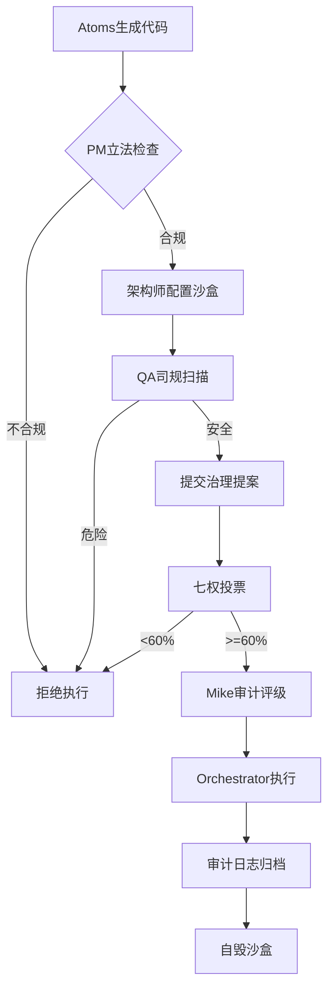

# Sandbox Execution Pattern

> **装备名称**: 赛博牢房执行器  
> **装备类型**: Action Pattern  
> **适用角色**: Atoms Only  
> **安全等级**: 最高安全（Maximum Security）

---

## 装备概述

豪华版沙盒执行装备，提供原子级隔离、全量审计、自毁即服务的安全代码执行环境。

```yaml
blackbox_level: maximum_security
isolation_profile: 
  base: "docker-rootless"
  runtime: "runsc"  # Google gVisor（可选）
  syscall: "seccomp-web"
  resources: "micro"
audit_target: "tsa-archive"
self_destruct: true
timeout: 30000  # 30秒强制终止
```

---

## 七权治理集成



---

## 使用方式

### 基础用法

```typescript
import { useSandbox } from '@/app/hooks';

function CodeExecutor() {
  const { execute, loading, result, auditLog } = useSandbox();
  
  const runCode = async (code: string) => {
    const result = await execute(code, {
      isolationLevel: 'CONTAINER',
      riskLevel: 'MEDIUM',
      timeout: 30000
    });
    
    if (result.success) {
      console.log('输出:', result.output);
      console.log('审计:', auditLog);
    }
  };
}
```

### 高级配置

```typescript
import { SandboxOrchestrator, CRITICAL_RISK_PROFILE } from '@/lib/sandbox';

const orchestrator = new SandboxOrchestrator();

// 使用预设配置
const execution = await orchestrator.createFromPattern({
  patternId: 'sandbox-execution',
  profile: CRITICAL_RISK_PROFILE,
  code: userCode
});

// 自定义隔离配置
const customConfig = {
  isolation: {
    filesystem: 'OVERLAYFS_READONLY',
    network: 'NONE',
    process: 'ROOTLESS_DOCKER',
    resources: {
      cpu: 0.25,      // 1/4核
      memory: 128,    // 128MB
      pids: 16        // 16个进程
    },
    syscall: 'seccomp-critical'
  },
  audit: {
    target: 'TSA_ARCHIVE',
    retention: 'PERMANENT'
  },
  selfDestruct: {
    enabled: true,
    delay: 0          // 立即自毁
  }
};
```

---

## 隔离配置预设

| 配置 | 适用场景 | CPU | 内存 | 网络 | 系统调用 |
|------|----------|-----|------|------|----------|
| LOW_RISK_PROFILE | 简单计算 | 0.5 | 256M | 代理 | 基础白名单 |
| MEDIUM_RISK_PROFILE | 一般代码 | 0.5 | 256M | 无 | 标准白名单 |
| HIGH_RISK_PROFILE | 外部输入 | 0.25 | 128M | 无 | 严格白名单 |
| CRITICAL_RISK_PROFILE | 危险代码 | 0.25 | 128M | 无 | 最小白名单 |

---

## 审计日志格式

```json
{
  "executionId": "550e8400-e29b-41d4-a716-446655440000",
  "timestamp": 1707900000000,
  "agentRole": "atoms",
  "codeHash": "sha256:a1b2c3...",
  "riskLevel": "MEDIUM",
  "systemCalls": [
    {"name": "read", "count": 42, "blocked": 0},
    {"name": "write", "count": 12, "blocked": 0},
    {"name": "socket", "count": 1, "blocked": 1}
  ],
  "fileAccess": [
    {"path": "/workspace/script.js", "operation": "WRITE", "allowed": true},
    {"path": "/etc/passwd", "operation": "READ", "allowed": false}
  ],
  "networkAttempts": [
    {"url": "http://evil.com", "blocked": true}
  ],
  "resourceUsage": {
    "cpuMs": 1234,
    "memoryPeak": 64
  },
  "archiveLocation": "cold://sandbox-audit/2026/02/14/1707900000000-550e8400.json"
}
```

---

## 安全保证

### 五重隔离

1. **进程隔离**: rootless Docker + UID 1000
2. **命名空间隔离**: PID/IPC/UTS/Network NS
3. **文件系统隔离**: OverlayFS只读 + tmpfs可写层
4. **网络隔离**: network_mode: none
5. **系统调用隔离**: Seccomp-bpf白名单

### 资源限制

- CPU: 0.25-0.5核（防挖矿）
- 内存: 128-256MB（防内存炸弹）
- PIDs: 16-32（防fork炸弹）
- 超时: 30秒（防死循环）

### 审计追踪

- 全量系统调用记录
- 文件访问审计
- 网络尝试拦截
- 资源使用统计
- TSA Archive永久存储

### 自毁协议

- 执行后自动清理
- OverlayFS层销毁
- 容器删除
- 残留文件扫描
- 哈希链完整性验证

---

## 故障排除

### 容器启动失败

```bash
# 检查Docker状态
docker ps

# 验证配置
docker-compose -f docker-compose.sandbox.yml config

# 检查seccomp配置
docker run --rm --security-opt seccomp=lib/sandbox/seccomp-profile.json alpine echo test
```

### 权限错误

```bash
# 检查rootless配置
docker run --rm --user 1000:1000 alpine whoami
# 应输出: 1000
```

### 审计日志未生成

```bash
# 检查目录权限
ls -la storage/cold/sandbox-audit/

# 手动创建测试日志
npx tsx scripts/jailor.ts self-test
```

---

## 相关文件

- `lib/sandbox/` - 核心实现
- `tests/sandbox/` - 逃脱测试
- `docker-compose.sandbox.yml` - Docker配置
- `config/seccomp-default.json` - Seccomp配置

---

**Pattern版本**: v1.0  
**创建时间**: 2026-02-14  
**维护者**: Cognitive Architect
