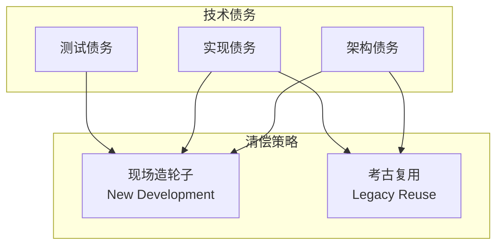
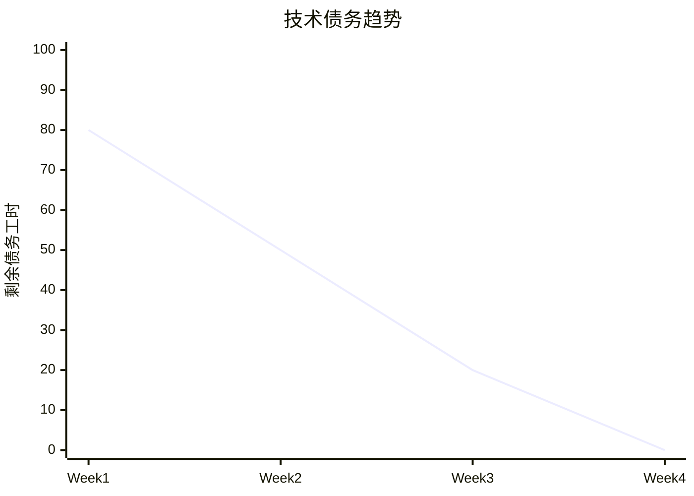

# 技术债务清单与清偿计划

> 🐍♾️ HAJIMI-PERF-DESKTOP-RESEARCH-011
> 
> 项目代号：Ouroboros Desktop
> 
> 文档版本：v1.0.0 | 日期：2026-02-14

---

## 债务分类概览



| 债务类型 | 数量 | 预计总工时 | 清偿优先级 |
|----------|------|-----------|-----------|
| 架构债务 | 5 | 24h | P0 |
| 实现债务 | 8 | 40h | P1 |
| 测试债务 | 4 | 16h | P2 |
| **总计** | **17** | **80h** | |

---

## 架构债务

### DEBT-ARCH-001: Electron 主进程架构设计

| 属性 | 内容 |
|------|------|
| **描述** | 需要设计清晰的 Electron Main Process 架构，包括 IPC 路由、窗口管理、生命周期管理 |
| **清偿策略** | 🛠️ **现场造轮子** |
| **理由** | Electron 架构是桌面版核心，需根据项目需求定制设计 |
| **优先级** | P0 |
| **预计工时** | 8h |
| **依赖** | 无 |
| **风险** | 架构设计不当会导致后期重构困难 |

**清偿方案**
```typescript
// electron/main.ts - 架构蓝图
class HajimiDesktop {
  private windowManager: WindowManager;
  private ipcRouter: IPCRouter;
  private lifecycleManager: LifecycleManager;
  
  async initialize() {
    await app.whenReady();
    this.ipcRouter = new IPCRouter();
    this.windowManager = new WindowManager(this.ipcRouter);
    this.lifecycleManager = new LifecycleManager();
    
    await this.lifecycleManager.initialize();
    await this.windowManager.createMainWindow();
  }
}
```

---

### DEBT-ARCH-002: TSA 桌面适配层

| 属性 | 内容 |
|------|------|
| **描述** | v1.0.0 TSA 使用 Redis/IndexedDB，需要适配到桌面环境的 SQLite |
| **清偿策略** | 🛠️ **现场造轮子** |
| **理由** | TSA 适配层需要桥接内存层和持久层，无现成方案 |
| **优先级** | P0 |
| **预计工时** | 6h |
| **依赖** | Better-SQLite3 集成 |
| **风险** | 适配不当会导致数据不一致 |

**清偿方案**
- 实现 `TSAAdapter` 类
- 三层降级：Memory → SQLite → IndexedDB
- WAL 模式保证事务

---

### DEBT-ARCH-003: Undo/Redo 系统设计

| 属性 | 内容 |
|------|------|
| **描述** | 需要设计支持 1000 步的 Undo/Redo 系统，使用 Command 模式 |
| **清偿策略** | 🛠️ **现场造轮子** |
| **理由** | Undo 系统与业务逻辑深度耦合，需定制 |
| **优先级** | P0 |
| **预计工时** | 6h |
| **依赖** | 数据库 Schema |
| **风险** | 持久化不当会导致崩溃后状态丢失 |

**清偿方案**
- 实现 `UndoManager` 类
- AOF 持久化到 SQLite
- 支持复合命令

---

### DEBT-ARCH-004: IPC 协议设计

| 属性 | 内容 |
|------|------|
| **描述** | 需要设计安全的 IPC 通信协议，防止原型链污染和任意代码执行 |
| **清偿策略** | 🛠️ **现场造轮子** |
| **理由** | IPC 安全是 Electron 应用的关键，需仔细设计 |
| **优先级** | P0 |
| **预计工时** | 4h |
| **依赖** | 无 |
| **风险** | 安全漏洞可能导致远程代码执行 |

**清偿方案**
- 使用 `contextBridge` 暴露有限 API
- 所有 IPC 调用验证参数
- 结构化克隆算法传输数据

---

### DEBT-ARCH-005: Worker 线程池架构

| 属性 | 内容 |
|------|------|
| **描述** | 需要设计 Worker Pool 管理 CPU 密集型任务 |
| **清偿策略** | 🛠️ **现场造轮子** |
| **理由** | Worker Pool 需根据任务类型动态调度 |
| **优先级** | P1 |
| **预计工时** | 4h |
| **依赖** | 无 |
| **风险** | 调度不当会导致任务饥饿 |

**清偿方案**
- 实现 `WorkerPool` 类
- 优先级队列
- 动态扩缩容

---

## 实现债务

### DEBT-IMPL-001: 七权 UI 组件迁移

| 属性 | 内容 |
|------|------|
| **描述** | Luxury 2.0 的 UI 组件需要迁移到 Electron Renderer 进程 |
| **清偿策略** | 📦 **考古复用** |
| **理由** | 组件已修复并运行良好，只需适配 IPC 调用 |
| **优先级** | P1 |
| **预计工时** | 8h |
| **依赖** | Luxury 2.0 组件 |
| **考古来源** | `app/components/ui/` |

**清偿方案**
```typescript
// 迁移清单
- AgentChatDialog.tsx → 适配 IPC
- A2AMessageFeed.tsx → 适配 IPC  
- StateIndicator.tsx → 直接使用
- SixStarMap.tsx → 直接使用
```

---

### DEBT-IMPL-002: 治理核心集成

| 属性 | 内容 |
|------|------|
| **描述** | v1.0.0 治理核心需要集成到桌面环境 |
| **清偿策略** | 📦 **考古复用** |
| **理由** | 治理核心已稳定运行，可直接引入 |
| **优先级** | P0 |
| **预计工时** | 4h |
| **依赖** | v1.0.0 治理模块 |
| **考古来源** | `lib/core/governance/` |

**清偿方案**
- 直接引入 `lib/core/governance/`
- 适配存储层到 SQLite
- 保持 API 不变

---

### DEBT-IMPL-003: Monaco Editor 集成

| 属性 | 内容 |
|------|------|
| **描述** | 需要集成 Monaco Editor 并配置大文件支持 |
| **清偿策略** | 🛠️ **现场造轮子** |
| **理由** | Monaco 配置复杂，需根据需求定制 |
| **优先级** | P1 |
| **预计工时** | 6h |
| **依赖** | 无 |
| **风险** | 配置不当会导致大文件卡顿 |

**清偿方案**
- 本地加载 Monaco（非 CDN）
- 配置 Worker
- 实现大文件分块加载

---

### DEBT-IMPL-004: 文件系统监视器

| 属性 | 内容 |
|------|------|
| **描述** | 需要实现 chokidar 文件监视，检测外部编辑器修改 |
| **清偿策略** | 🛠️ **现场造轮子** |
| **理由** | 文件监视需处理大量边界情况 |
| **优先级** | P1 |
| **预计工时** | 4h |
| **依赖** | chokidar |
| **风险** | 监视器可能导致 CPU 占用过高 |

**清偿方案**
- 使用 chokidar 原生绑定
- 节流处理变更事件
- 忽略 node_modules 等目录

---

### DEBT-IMPL-005: 跨窗口拖拽实现

| 属性 | 内容 |
|------|------|
| **描述** | 需要实现跨窗口文件拖拽功能 |
| **清偿策略** | 🛠️ **现场造轮子** |
| **理由** | Electron 拖拽 API 有限，需自定义实现 |
| **优先级** | P2 |
| **预计工时** | 6h |
| **依赖** | WindowManager |
| **风险** | 平台差异可能导致行为不一致 |

**清偿方案**
- 使用 IPC 模拟拖拽
- 可视化拖拽反馈
- 支持撤销跨窗口操作

---

### DEBT-IMPL-006: 主题系统移植

| 属性 | 内容 |
|------|------|
| **描述** | Luxury 2.0 七权主题需要移植到桌面版 |
| **清偿策略** | 📦 **考古复用** |
| **理由** | 主题样式已完整实现，只需提取 |
| **优先级** | P2 |
| **预计工时** | 2h |
| **依赖** | Luxury 2.0 样式 |
| **考古来源** | `app/globals.css` |

**清偿方案**
- 提取 CSS 变量
- 移植呼吸动画
- 适配 Monaco 主题

---

### DEBT-IMPL-007: Git 原生绑定

| 属性 | 内容 |
|------|------|
| **描述** | 需要集成 simple-git 实现原生 Git 操作 |
| **清偿策略** | 🛠️ **现场造轮子** |
| **理由** | Git 操作需根据业务需求封装 |
| **优先级** | P1 |
| **预计工时** | 4h |
| **依赖** | simple-git |
| **风险** | Git 版本差异可能导致命令失败 |

**清偿方案**
- 封装 `GitManager` 类
- 错误处理与重试
- 与 Branch Manager 集成

---

### DEBT-IMPL-008: 六件套导出

| 属性 | 内容 |
|------|------|
| **描述** | 需要实现六件套导出功能 |
| **清偿策略** | 📦 **考古复用** |
| **理由** | v1.0.0 已有六件套生成逻辑 |
| **优先级** | P2 |
| **预计工时** | 4h |
| **依赖** | Worker Pool |
| **考古来源** | `lib/core/governance/` |

**清偿方案**
- 复用六件套生成逻辑
- 使用 Worker 打包 ZIP
- 写入 `.archive/` 目录

---

## 测试债务

### DEBT-TEST-001: E2E 测试覆盖

| 属性 | 内容 |
|------|------|
| **描述** | 需要编写 Playwright E2E 测试覆盖核心流程 |
| **清偿策略** | 🛠️ **现场造轮子** |
| **理由** | E2E 测试需根据实际 UI 编写 |
| **优先级** | P1 |
| **预计工时** | 8h |
| **依赖** | UI 稳定 |
| **风险** | UI 变更会导致测试失效 |

**清偿方案**
- 核心流程测试：打开项目、编辑文件、保存
- 崩溃恢复测试
- 跨窗口操作测试

---

### DEBT-TEST-002: IPC 单元测试

| 属性 | 内容 |
|------|------|
| **描述** | 需要为 IPC 处理器编写单元测试 |
| **清偿策略** | 🛠️ **现场造轮子** |
| **理由** | IPC 测试需要模拟 Electron 环境 |
| **优先级** | P1 |
| **预计工时** | 4h |
| **依赖** | IPC 实现 |
| **风险** | 模拟环境可能与真实环境有差异 |

**清偿方案**
- 使用 `electron-mocha` 或 `jest-electron`
- 模拟 IPC 事件
- 验证响应格式

---

### DEBT-TEST-003: 性能基准测试

| 属性 | 内容 |
|------|------|
| **描述** | 需要建立性能基准测试套件 |
| **清偿策略** | 🛠️ **现场造轮子** |
| **理由** | 性能测试需模拟真实场景 |
| **优先级** | P2 |
| **预计工时** | 2h |
| **依赖** | 功能完整 |
| **风险** | 测试结果受机器性能影响 |

**清偿方案**
- 文件加载性能测试
- 搜索性能测试
- ZIP 打包性能测试

---

### DEBT-TEST-004: 崩溃恢复测试

| 属性 | 内容 |
|------|------|
| **描述** | 需要测试崩溃后数据恢复能力 |
| **清偿策略** | 🛠️ **现场造轮子** |
| **理由** | 崩溃测试需要特殊手段模拟 |
| **优先级** | P1 |
| **预计工时** | 2h |
| **依赖** | Undo 系统、数据库 |
| **风险** | 测试可能损坏开发环境 |

**清偿方案**
- 模拟进程崩溃
- 验证 Undo 栈恢复
- 验证数据库完整性

---

## 清偿计划

### Phase A（第 1-2 周）

| 债务项 | 优先级 | 预计工时 | 清偿方式 |
|-------|-------|---------|---------|
| DEBT-ARCH-001 | P0 | 8h | 现场造轮子 |
| DEBT-ARCH-002 | P0 | 6h | 现场造轮子 |
| DEBT-ARCH-004 | P0 | 4h | 现场造轮子 |
| DEBT-IMPL-002 | P0 | 4h | 考古复用 |
| **小计** | | **22h** | |

### Phase B（第 3 周）

| 债务项 | 优先级 | 预计工时 | 清偿方式 |
|-------|-------|---------|---------|
| DEBT-ARCH-003 | P0 | 6h | 现场造轮子 |
| DEBT-ARCH-005 | P1 | 4h | 现场造轮子 |
| DEBT-IMPL-003 | P1 | 6h | 现场造轮子 |
| DEBT-IMPL-004 | P1 | 4h | 现场造轮子 |
| **小计** | | **20h** | |

### Phase C（第 4 周）

| 债务项 | 优先级 | 预计工时 | 清偿方式 |
|-------|-------|---------|---------|
| DEBT-IMPL-001 | P1 | 8h | 考古复用 |
| DEBT-IMPL-005 | P2 | 6h | 现场造轮子 |
| DEBT-IMPL-007 | P1 | 4h | 现场造轮子 |
| DEBT-IMPL-006 | P2 | 2h | 考古复用 |
| DEBT-IMPL-008 | P2 | 4h | 考古复用 |
| **小计** | | **24h** | |

### Phase D（测试周）

| 债务项 | 优先级 | 预计工时 | 清偿方式 |
|-------|-------|---------|---------|
| DEBT-TEST-001 | P1 | 8h | 现场造轮子 |
| DEBT-TEST-002 | P1 | 4h | 现场造轮子 |
| DEBT-TEST-004 | P1 | 2h | 现场造轮子 |
| DEBT-TEST-003 | P2 | 2h | 现场造轮子 |
| **小计** | | **16h** | |

---

## 清偿统计

| 清偿方式 | 数量 | 总工时 | 占比 |
|----------|------|--------|------|
| 现场造轮子 | 12 | 56h | 70% |
| 考古复用 | 5 | 24h | 30% |
| **总计** | **17** | **80h** | **100%** |

---

## 考古复用资产清单

| 资产 | 来源 | 状态 | 复用工时 |
|------|------|------|---------|
| AgentChatDialog | Luxury 2.0 | ✅ 已修复 | 2h |
| A2AMessageFeed | Luxury 2.0 | ✅ 已修复 | 2h |
| StateIndicator | Luxury 2.0 | ✅ 已修复 | 1h |
| SixStarMap | Luxury 2.0 | ✅ 已修复 | 1h |
| 治理核心 | v1.0.0 | ✅ 稳定 | 4h |
| 主题样式 | Luxury 2.0 | ✅ 已修复 | 2h |
| 六件套逻辑 | v1.0.0 | ✅ 稳定 | 4h |

---

## 现场造轮子清单

| 组件 | 复杂度 | 工时 | 风险 |
|------|--------|------|------|
| Electron Main Process | 高 | 8h | 架构风险 |
| TSA 适配层 | 中 | 6h | 数据一致性 |
| Undo/Redo 系统 | 中 | 6h | 状态丢失 |
| IPC 协议 | 中 | 4h | 安全风险 |
| Worker Pool | 中 | 4h | 调度问题 |
| Monaco 集成 | 中 | 6h | 性能问题 |
| 文件监视器 | 低 | 4h | CPU 占用 |
| 跨窗口拖拽 | 高 | 6h | 平台差异 |
| Git 绑定 | 低 | 4h | 版本兼容 |
| E2E 测试 | 中 | 8h | 维护成本 |
| IPC 测试 | 低 | 4h | 环境差异 |
| 崩溃恢复测试 | 低 | 2h | 环境损坏 |

---

## 债务监控

### 债务趋势



### 每周清偿目标

| 周次 | 目标清偿 | 累计清偿 | 剩余债务 |
|------|---------|---------|---------|
| Week 1 | 22h | 22h | 58h |
| Week 2 | 0h | 22h | 58h |
| Week 3 | 20h | 42h | 38h |
| Week 4 | 22h | 64h | 16h |
| Week 5 | 16h | 80h | 0h |

---

## 附录

### A. 清偿检查清单

- [ ] 代码审查通过
- [ ] 单元测试通过
- [ ] 集成测试通过
- [ ] 文档更新
- [ ] 债务标记移除

### B. 新增债务记录模板

```markdown
### DEBT-XXX-XXX: 标题

| 属性 | 内容 |
|------|------|
| **描述** | 描述债务内容 |
| **清偿策略** | 现场造轮子 / 考古复用 |
| **优先级** | P0/P1/P2 |
| **预计工时** | Xh |
| **发现日期** | YYYY-MM-DD |
| **清偿日期** | YYYY-MM-DD |
```

---

## 签名

| 角色 | 签名 | 日期 |
|------|------|------|
| 架构师 | | |
| 技术负责人 | | |
| PM | | |

---

**文档结束**

> 🐍♾️ 技术债务是战略选择，不是技术失败。清晰的债务清单是负责任的表现。
