# HAJIMI-PERF-DESKTOP-RESEARCH-011 技术白皮书 v1.0

> 🖥️ 桌面级IDE架构设计 - Electron + Next.js 混合架构
> 
> 项目代号：Ouroboros Desktop 🐍♾️
> 
> 版本：v1.0.0 | 日期：2026-02-14

---

## 文档信息

| 属性 | 值 |
|------|-----|
| 文档编号 | HAJIMI-PERF-DESKTOP-RESEARCH-011 |
| 版本 | v1.0.0 |
| 状态 | 草案 |
| 作者 | 技术作家 (R-09) |
| 依赖 | R-01~R-08 研究成果 |

---

## 第 1 章：架构概览

### 1.1 架构决策记录（ADR）

#### ADR-001: 桌面应用框架选型

**背景**
需要将 v1.0.0 Web 版治理核心迁移到桌面环境，充分利用本地系统资源。

**决策**
采用 Electron + Next.js 混合架构

**权衡分析**

| 方案 | 优势 | 劣势 | 决策 |
|------|------|------|------|
| Electron + Next.js | 成熟生态、Node.js原生API、Web技术栈复用 | 包体积较大 (~150MB) | ✅ 采用 |
| Tauri + Next.js | 包体积小 (~5MB)、Rust性能 | 生态较新、学习成本高 | ❌ 否决 |
| 纯 Wails (Go) | 极致性能 | 技术栈不统一 | ❌ 否决 |

**决策理由**
1. 团队已有 Next.js 技术积累（v1.0.0 基础）
2. Electron 原生 Node.js 集成满足 Phase 1-4 所有需求
3. 与 v1.0.0 治理核心代码复用率高（预计 80%+）

**引用**: [R-01-electron-nextjs-architecture.md](./R-01-electron-nextjs-architecture.md)

### 1.2 Electron+Next.js 混合架构

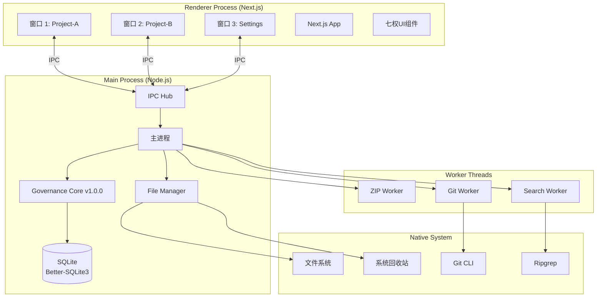

**架构特点**

| 层级 | 技术 | 职责 |
|------|------|------|
| Main Process | Node.js 18+ | 系统API访问、文件管理、数据库、IPC协调 |
| Renderer Process | Next.js 14 | UI渲染、状态管理、用户交互 |
| Worker Threads | worker_threads | CPU密集型任务（压缩、搜索、Git） |
| Preload | contextBridge | 安全IPC通道 |

### 1.3 进程通信模型

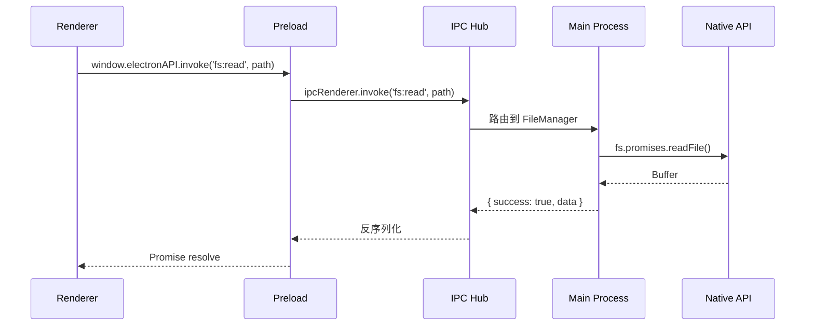

**IPC 协议规范**

```typescript
// lib/desktop/ipc/protocol.ts

// 命名空间规范: domain:action
export const IPC_CHANNELS = {
  // 文件系统
  FS_READ: 'fs:read',
  FS_WRITE: 'fs:write',
  FS_DELETE: 'fs:delete',
  FS_WATCH: 'fs:watch',
  
  // 项目
  PROJECT_OPEN: 'project:open',
  PROJECT_CLOSE: 'project:close',
  PROJECT_LIST: 'project:list',
  
  // 窗口
  WINDOW_CREATE: 'window:create',
  WINDOW_CLOSE: 'window:close',
  WINDOW_FOCUS: 'window:focus',
  
  // 跨窗口
  CROSS_COPY: 'cross:copy',
  CROSS_MOVE: 'cross:move',
  
  // 系统
  SYSTEM_TRASH: 'system:trash',
  SYSTEM_SHOW_DIALOG: 'system:showDialog',
} as const;

// 统一响应格式
export interface IPCResponse<T> {
  success: boolean;
  data?: T;
  error?: {
    code: string;
    message: string;
    details?: unknown;
  };
}
```

**引用**: [R-05-multiwindow-ipc-design.md](./R-05-multiwindow-ipc-design.md)

### 1.4 目录结构规范

```
hajimi-desktop/
├── electron/                    # Electron 主进程代码
│   ├── main.ts                 # 入口
│   ├── preload.ts              # 预加载脚本
│   ├── ipc/                    # IPC 处理器
│   │   ├── handlers/
│   │   │   ├── fs-handler.ts
│   │   │   ├── project-handler.ts
│   │   │   └── window-handler.ts
│   │   └── protocol.ts
│   ├── managers/               # 核心管理器
│   │   ├── FileManager.ts
│   │   ├── WindowManager.ts
│   │   ├── ProjectManager.ts
│   │   └── UndoManager.ts
│   └── workers/                # Worker 线程
│       ├── zip-worker.ts
│       ├── search-worker.ts
│       └── git-worker.ts
├── renderer/                    # Next.js 应用
│   ├── app/                    # Next.js 14 App Router
│   │   ├── editor/             # 编辑器页面
│   │   ├── settings/           # 设置页面
│   │   └── page.tsx            # 主页
│   ├── components/
│   │   ├── ui/                 # 基础UI组件
│   │   ├── editor/             # 编辑器相关
│   │   ├── file-tree/          # 文件树
│   │   └── governance/         # 治理组件
│   ├── hooks/                  # React Hooks
│   └── lib/
│       ├── api.ts              # API客户端
│       └── ipc-client.ts       # IPC调用封装
├── shared/                      # 共享代码
│   ├── types/                  # TypeScript类型
│   └── constants/              # 常量
├── resources/                   # 静态资源
├── storage/                     # 本地存储（Git忽略）
└── package.json
```

**关键配置**

```json
// package.json
{
  "name": "hajimi-desktop",
  "version": "2.0.0",
  "main": "electron/dist/main.js",
  "scripts": {
    "dev": "concurrently \"next dev\" \"electron electron/dist/main.js\"",
    "build": "next build && tsc -p electron",
    "dist": "electron-builder"
  },
  "dependencies": {
    "better-sqlite3": "^9.4.0",
    "chokidar": "^3.5.3",
    "electron": "^28.0.0"
  }
}
```

---

## 第 2 章：存储系统

### 2.1 Better-SQLite3 选型决策

#### ADR-002: 本地数据库选型

**背景**
桌面应用需要可靠、高性能的本地数据存储，支持项目元数据、操作历史、配置等。

**决策**
采用 Better-SQLite3 作为本地数据库

**权衡分析**

| 方案 | 优势 | 劣势 | 决策 |
|------|------|------|------|
| Better-SQLite3 | 原生绑定、同步API、WAL模式 | Node环境专用 | ✅ 采用 |
| SQLite WASM | 跨平台 | 性能低10倍 | ❌ 否决 |
| LevelDB | 键值简单 | 查询能力弱 | ❌ 否决 |
| JSON文件 | 简单 | 并发安全差 | ❌ 否决 |

**决策理由**
1. Better-SQLite3 是 Node.js 最快的 SQLite 绑定
2. 同步 API 避免 async/await 污染代码
3. WAL 模式支持高并发读写

**引用**: [R-02-storage-strategy.md](./R-02-storage-strategy.md)

### 2.2 数据库 Schema 设计

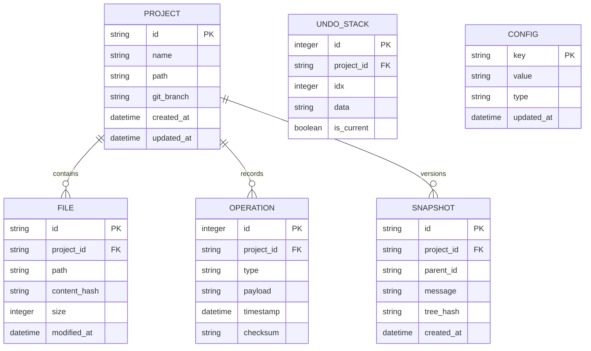

**Schema SQL**

```sql
-- Project 表
CREATE TABLE projects (
    id TEXT PRIMARY KEY,
    name TEXT NOT NULL,
    path TEXT NOT NULL UNIQUE,
    git_branch TEXT DEFAULT 'main',
    created_at INTEGER DEFAULT (strftime('%s', 'now')),
    updated_at INTEGER DEFAULT (strftime('%s', 'now'))
);

-- 文件索引表
CREATE TABLE files (
    id TEXT PRIMARY KEY,
    project_id TEXT NOT NULL,
    path TEXT NOT NULL,
    content_hash TEXT,
    size INTEGER,
    modified_at INTEGER,
    FOREIGN KEY (project_id) REFERENCES projects(id) ON DELETE CASCADE
);
CREATE INDEX idx_files_project ON files(project_id);
CREATE INDEX idx_files_path ON files(path);

-- 操作历史表（支持 Undo/Redo）
CREATE TABLE operations (
    id INTEGER PRIMARY KEY AUTOINCREMENT,
    project_id TEXT NOT NULL,
    type TEXT NOT NULL,
    payload JSON,
    timestamp INTEGER DEFAULT (strftime('%s', 'now')),
    checksum TEXT,
    FOREIGN KEY (project_id) REFERENCES projects(id) ON DELETE CASCADE
);
CREATE INDEX idx_ops_project_time ON operations(project_id, timestamp);

-- 文件快照表（Git-like版本控制）
CREATE TABLE snapshots (
    id TEXT PRIMARY KEY,
    project_id TEXT NOT NULL,
    parent_id TEXT,
    message TEXT,
    tree_hash TEXT NOT NULL,
    created_at INTEGER DEFAULT (strftime('%s', 'now')),
    FOREIGN KEY (project_id) REFERENCES projects(id) ON DELETE CASCADE,
    FOREIGN KEY (parent_id) REFERENCES snapshots(id)
);

-- Undo 栈持久化
CREATE TABLE undo_stack (
    id INTEGER PRIMARY KEY AUTOINCREMENT,
    project_id TEXT NOT NULL,
    idx INTEGER NOT NULL,
    data JSON NOT NULL,
    is_current BOOLEAN DEFAULT 0,
    FOREIGN KEY (project_id) REFERENCES projects(id) ON DELETE CASCADE
);
CREATE INDEX idx_undo_project ON undo_stack(project_id, idx);

-- 配置表
CREATE TABLE config (
    key TEXT PRIMARY KEY,
    value TEXT NOT NULL,
    type TEXT DEFAULT 'string',
    updated_at INTEGER DEFAULT (strftime('%s', 'now'))
);
```

### 2.3 WAL 模式配置

```typescript
// electron/managers/DatabaseManager.ts
import Database from 'better-sqlite3';

export class DatabaseManager {
  private db: Database.Database;
  
  constructor(dbPath: string) {
    this.db = new Database(dbPath, {
      verbose: process.env.DEBUG ? console.log : undefined,
      fileMustExist: false,
    });
    
    // WAL 模式配置 - 电脑级性能
    this.db.pragma('journal_mode = WAL');
    this.db.pragma('synchronous = NORMAL');
    this.db.pragma('cache_size = -64000'); // 64MB cache
    this.db.pragma('temp_store = memory');
    this.db.pragma('mmap_size = 30000000000'); // 30GB memory map
    
    this.initSchema();
  }
  
  // 同步事务（电脑级：无需 async/await 开销）
  transaction<T>(fn: (db: Database.Database) => T): T {
    return this.db.transaction(fn)();
  }
  
  // 预编译语句缓存
  prepare<BindParameters extends unknown[], Result = unknown>(
    sql: string
  ): Database.Statement<BindParameters, Result> {
    return this.db.prepare<BindParameters, Result>(sql);
  }
  
  close(): void {
    this.db.close();
  }
}
```

**WAL 模式优势**

| 特性 | 传统模式 | WAL 模式 |
|------|----------|----------|
| 读写并发 | 读阻塞写 | 读写并发 |
| 性能 | 一般 | 快 2-3 倍 |
| 崩溃恢复 | 慢 | 快 |
| 磁盘同步 | 频繁 | 延迟写入 |

### 2.4 TSA 集成适配层

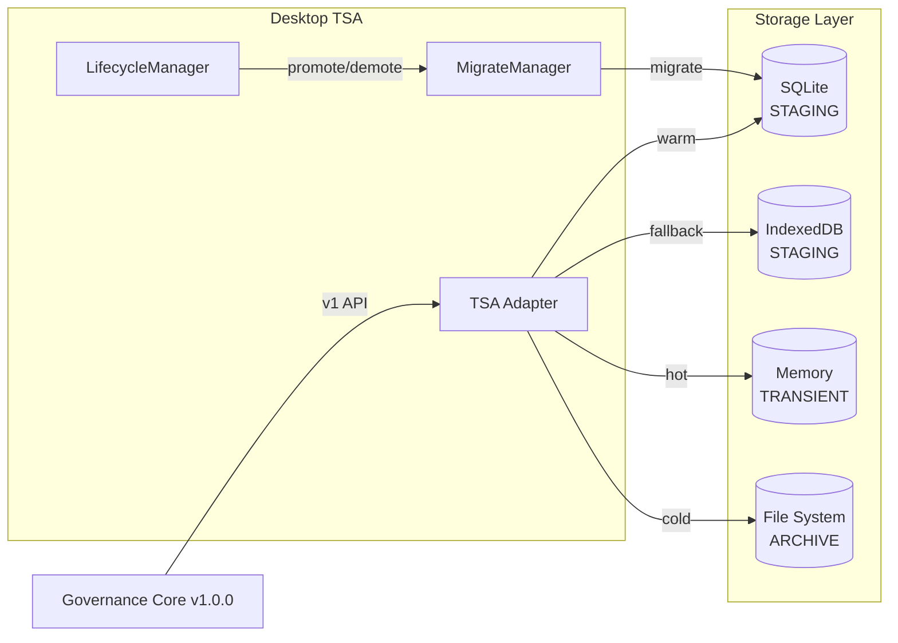

**适配层实现**

```typescript
// electron/managers/TSAAdapter.ts
import { tsa, StorageTier } from '@/lib/tsa';
import { DatabaseManager } from './DatabaseManager';

export class TSAAdapter {
  private db: DatabaseManager;
  
  constructor(dbPath: string) {
    this.db = new DatabaseManager(dbPath);
  }
  
  // 兼容 v1.0.0 TSA API
  async get<T>(key: string, tier?: StorageTier): Promise<T | null> {
    // 优先从内存/SQLite获取
    const value = await tsa.get<T>(key);
    if (value !== null) return value;
    
    // 回退到数据库查询
    const stmt = this.db.prepare('SELECT value FROM kv_store WHERE key = ?');
    const row = stmt.get(key) as { value: string } | undefined;
    return row ? JSON.parse(row.value) : null;
  }
  
  async set<T>(key: string, value: T, tier: StorageTier = 'STAGING'): Promise<void> {
    // 写入 TSA
    await tsa.set(key, value, { tier });
    
    // 持久化到 SQLite（STAGING 层）
    if (tier === 'STAGING' || tier === 'ARCHIVE') {
      this.db.transaction((db) => {
        const stmt = db.prepare(`
          INSERT INTO kv_store (key, value, tier, updated_at) 
          VALUES (?, ?, ?, strftime('%s', 'now'))
          ON CONFLICT(key) DO UPDATE SET
            value = excluded.value,
            tier = excluded.tier,
            updated_at = excluded.updated_at
        `);
        stmt.run(key, JSON.stringify(value), tier);
      });
    }
  }
  
  // 分层迁移
  async migrate(key: string, fromTier: StorageTier, toTier: StorageTier): Promise<void> {
    const value = await this.get(key, fromTier);
    if (value === null) return;
    
    await this.set(key, value, toTier);
    
    // 清理原层级
    if (fromTier === 'TRANSIENT') {
      await tsa.delete(key);
    }
  }
}
```

**引用**: [R-02-storage-strategy.md](./R-02-storage-strategy.md), [R-06-governance-integration-spec.md](./R-06-governance-integration-spec.md)

---

## 第 3 章：容错机制

### 3.1 Undo/Redo 系统设计

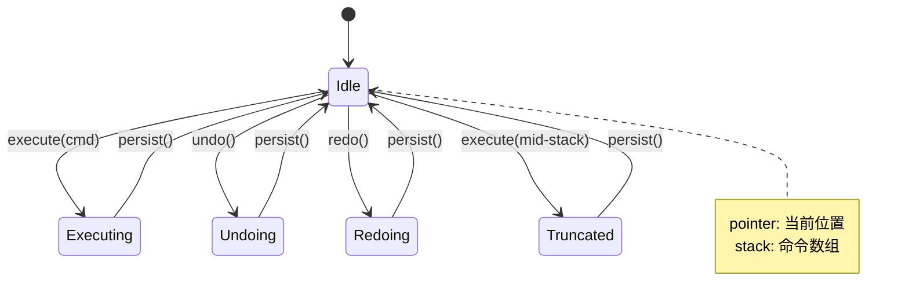

**核心架构**

```typescript
// electron/managers/UndoManager.ts
import { ipcMain } from 'electron';

interface UndoableCommand {
  id: string;
  type: 'file' | 'git' | 'setting' | 'cross';
  projectId: string;
  
  // 执行操作
  execute(): Promise<void>;
  
  // 撤销操作
  undo(): Promise<void>;
  
  // 重做操作
  redo(): Promise<void>;
  
  // 序列化（持久化）
  serialize(): CommandPayload;
  
  // 反序列化
  static deserialize(payload: CommandPayload): UndoableCommand;
}

interface CommandPayload {
  id: string;
  type: string;
  projectId: string;
  data: unknown;
  timestamp: number;
}

export class UndoManager {
  private stacks: Map<string, UndoStack> = new Map();
  private maxSize = 1000; // 电脑级：支持1000步
  private db: DatabaseManager;
  
  constructor(db: DatabaseManager) {
    this.db = db;
    this.loadAllStacks();
    this.setupIPC();
  }
  
  private getStack(projectId: string): UndoStack {
    if (!this.stacks.has(projectId)) {
      this.stacks.set(projectId, new UndoStack(projectId, this.db));
    }
    return this.stacks.get(projectId)!;
  }
  
  // 执行命令
  async execute(projectId: string, cmd: UndoableCommand): Promise<void> {
    const stack = this.getStack(projectId);
    await stack.execute(cmd);
  }
  
  // 撤销
  async undo(projectId: string): Promise<boolean> {
    const stack = this.getStack(projectId);
    return await stack.undo();
  }
  
  // 重做
  async redo(projectId: string): Promise<boolean> {
    const stack = this.getStack(projectId);
    return await stack.redo();
  }
  
  // 跨项目操作
  async executeCrossProject(cmd: CrossProjectCommand): Promise<void> {
    await cmd.execute();
    
    // 在两个项目的栈中都记录
    const sourceStack = this.getStack(cmd.sourceProjectId);
    const targetStack = this.getStack(cmd.targetProjectId);
    
    await sourceStack.execute(cmd.toSourceCommand());
    await targetStack.execute(cmd.toTargetCommand());
  }
  
  private setupIPC(): void {
    ipcMain.handle('undo:execute', async (event, { projectId, command }) => {
      const cmd = this.deserializeCommand(command);
      await this.execute(projectId, cmd);
      return { success: true };
    });
    
    ipcMain.handle('undo:undo', async (event, { projectId }) => {
      const success = await this.undo(projectId);
      return { success };
    });
    
    ipcMain.handle('undo:redo', async (event, { projectId }) => {
      const success = await this.redo(projectId);
      return { success };
    });
  }
}

// 单个项目的 Undo 栈
class UndoStack {
  private stack: UndoableCommand[] = [];
  private pointer = -1;
  
  constructor(
    private projectId: string,
    private db: DatabaseManager
  ) {}
  
  async execute(cmd: UndoableCommand): Promise<void> {
    await cmd.execute();
    
    // 如果在栈中间执行新命令，截断后面的历史
    if (this.pointer < this.stack.length - 1) {
      this.stack = this.stack.slice(0, this.pointer + 1);
    }
    
    this.stack.push(cmd);
    this.pointer++;
    
    // 限制大小
    if (this.stack.length > 1000) {
      this.stack.shift();
      this.pointer--;
    }
    
    await this.persist();
  }
  
  async undo(): Promise<boolean> {
    if (this.pointer < 0) return false;
    
    const cmd = this.stack[this.pointer];
    await cmd.undo();
    this.pointer--;
    
    await this.persist();
    return true;
  }
  
  async redo(): Promise<boolean> {
    if (this.pointer >= this.stack.length - 1) return false;
    
    this.pointer++;
    const cmd = this.stack[this.pointer];
    await cmd.redo();
    
    await this.persist();
    return true;
  }
  
  // AOF 持久化
  private async persist(): Promise<void> {
    this.db.transaction((db) => {
      // 清除旧栈
      db.prepare('DELETE FROM undo_stack WHERE project_id = ?')
        .run(this.projectId);
      
      // 插入新栈
      const insert = db.prepare(`
        INSERT INTO undo_stack (project_id, idx, data, is_current)
        VALUES (?, ?, ?, ?)
      `);
      
      this.stack.forEach((cmd, idx) => {
        insert.run(
          this.projectId,
          idx,
          JSON.stringify(cmd.serialize()),
          idx === this.pointer ? 1 : 0
        );
      });
    });
  }
}
```

**引用**: [R-03-undo-system-design.md](./R-03-undo-system-design.md)

### 3.2 Command 模式实现

```typescript
// electron/commands/FileCommands.ts
import { UndoableCommand } from '../managers/UndoManager';

// 文件创建命令
export class CreateFileCommand implements UndoableCommand {
  readonly type = 'file';
  
  constructor(
    public id: string,
    public projectId: string,
    private filePath: string,
    private content: string,
    private fileManager: FileManager
  ) {}
  
  async execute(): Promise<void> {
    await this.fileManager.writeFile(this.filePath, this.content);
  }
  
  async undo(): Promise<void> {
    await this.fileManager.moveToTrash(this.filePath);
  }
  
  async redo(): Promise<void> {
    await this.execute();
  }
  
  serialize(): CommandPayload {
    return {
      id: this.id,
      type: this.type,
      projectId: this.projectId,
      data: { path: this.filePath, content: this.content },
      timestamp: Date.now(),
    };
  }
}

// 文件重命名命令
export class RenameFileCommand implements UndoableCommand {
  readonly type = 'file';
  private oldPath: string;
  
  constructor(
    public id: string,
    public projectId: string,
    private filePath: string,
    private newName: string,
    private fileManager: FileManager
  ) {
    this.oldPath = filePath;
  }
  
  async execute(): Promise<void> {
    const dir = path.dirname(this.filePath);
    const newPath = path.join(dir, this.newName);
    await this.fileManager.rename(this.filePath, newPath);
    this.filePath = newPath;
  }
  
  async undo(): Promise<void> {
    await this.fileManager.rename(this.filePath, this.oldPath);
    this.filePath = this.oldPath;
  }
  
  async redo(): Promise<void> {
    await this.execute();
  }
  
  serialize(): CommandPayload {
    return {
      id: this.id,
      type: this.type,
      projectId: this.projectId,
      data: { oldPath: this.oldPath, newName: this.newName },
      timestamp: Date.now(),
    };
  }
}

// 批量操作命令（复合命令）
export class CompositeCommand implements UndoableCommand {
  readonly type = 'composite';
  private commands: UndoableCommand[] = [];
  
  constructor(
    public id: string,
    public projectId: string
  ) {}
  
  add(cmd: UndoableCommand): void {
    this.commands.push(cmd);
  }
  
  async execute(): Promise<void> {
    for (const cmd of this.commands) {
      await cmd.execute();
    }
  }
  
  async undo(): Promise<void> {
    // 逆序撤销
    for (let i = this.commands.length - 1; i >= 0; i--) {
      await this.commands[i].undo();
    }
  }
  
  async redo(): Promise<void> {
    await this.execute();
  }
  
  serialize(): CommandPayload {
    return {
      id: this.id,
      type: this.type,
      projectId: this.projectId,
      data: {
        commands: this.commands.map(c => c.serialize())
      },
      timestamp: Date.now(),
    };
  }
}
```

### 3.3 系统回收站集成

```typescript
// electron/managers/TrashManager.ts
import { shell } from 'electron';
import { ipcMain } from 'electron';

export class TrashManager {
  constructor() {
    this.setupIPC();
  }
  
  // 移动到系统回收站
  async moveToTrash(filePath: string): Promise<boolean> {
    try {
      await shell.trashItem(filePath);
      return true;
    } catch (error) {
      console.error('Failed to move to trash:', error);
      return false;
    }
  }
  
  // 从回收站恢复（平台特定）
  async restoreFromTrash(filePath: string): Promise<boolean> {
    // Windows: 从 $Recycle.Bin 恢复
    // macOS: 从 ~/.Trash 恢复
    // Linux: 从 ~/.local/share/Trash/files 恢复
    
    const trashPaths = this.getTrashPaths(filePath);
    
    for (const trashPath of trashPaths) {
      if (await this.fileExists(trashPath)) {
        await fs.rename(trashPath, filePath);
        return true;
      }
    }
    
    return false;
  }
  
  private getTrashPaths(originalPath: string): string[] {
    const fileName = path.basename(originalPath);
    const home = os.homedir();
    
    if (process.platform === 'win32') {
      // Windows 回收站路径较复杂，需解析 SID
      return [];
    } else if (process.platform === 'darwin') {
      return [path.join(home, '.Trash', fileName)];
    } else {
      return [
        path.join(home, '.local/share/Trash/files', fileName),
        path.join(home, '.trash', fileName),
      ];
    }
  }
  
  // 危险操作确认对话框
  showDangerConfirm(action: 'delete-project' | 'delete-file', details: string): boolean {
    const { dialog } = require('electron');
    
    const result = dialog.showMessageBoxSync({
      type: 'warning',
      buttons: ['取消', '删除'],
      defaultId: 0,
      cancelId: 0,
      title: '危险操作确认',
      message: '此操作不可撤销，文件将进入系统回收站',
      detail: details,
      checkboxLabel: '我确认要执行此删除操作',
      checkboxChecked: false,
    });
    
    return result.response === 1 && result.checkboxChecked;
  }
  
  private setupIPC(): void {
    ipcMain.handle('trash:move', async (event, filePath) => {
      const success = await this.moveToTrash(filePath);
      return { success };
    });
    
    ipcMain.handle('dialog:confirmDelete', async (event, { action, details }) => {
      const confirmed = this.showDangerConfirm(action, details);
      return { confirmed };
    });
  }
}
```

**系统回收站优势**

| 特性 | 自建 .trash | 系统回收站 |
|------|-------------|------------|
| 用户熟悉度 | 低 | 高 |
| 恢复方式 | 应用内恢复 | 系统原生恢复 |
| 磁盘空间管理 | 需自建清理逻辑 | 系统管理 |
| 跨应用恢复 | 否 | 是 |

### 3.4 与 Governance State 边界

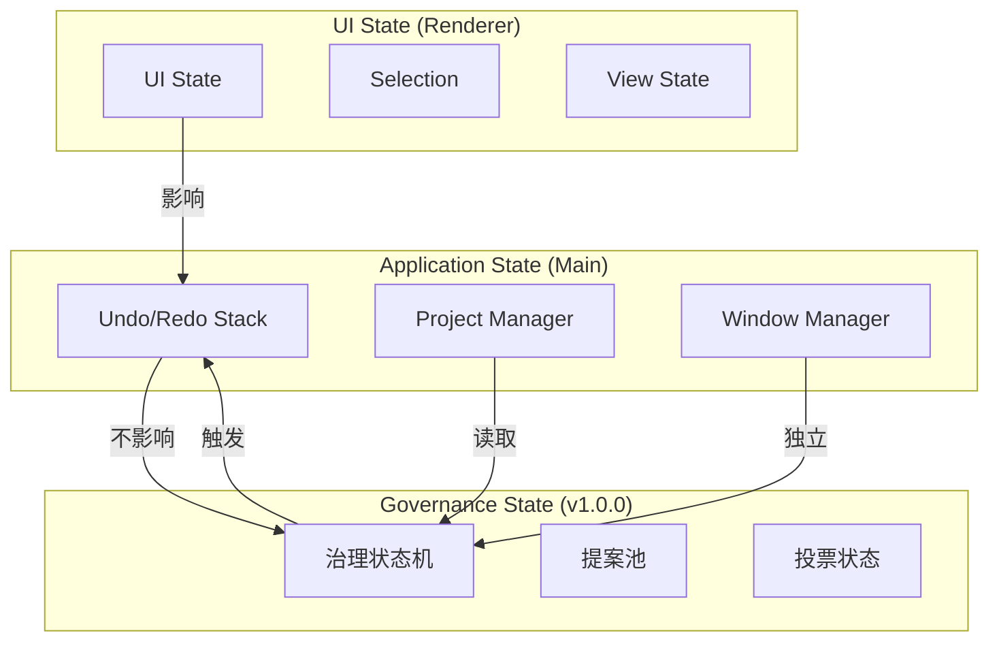

**边界定义**

| 状态类型 | 层级 | 说明 |
|----------|------|------|
| UI State | Renderer | 编辑器光标位置、选中文件、滚动位置 |
| Application State | Main | Undo/Redo、打开的项目列表、窗口布局 |
| Governance State | Main/Core | 治理提案、投票状态、角色权限 |

**交互规则**

1. **UI State 不影响 Governance State**
   - 编辑器内的光标移动、滚动等不触发治理提案
   
2. **Governance State 触发 Application State 变化**
   - 治理提案通过后，Application State 执行相应操作
   
3. **Undo/Redo 与 Governance 解耦**
   - Undo 是本地编辑操作，不涉及治理流程
   - 治理提案一旦执行，不可通过 Undo 回退

```typescript
// 边界示例代码
// ✅ 正确的边界
async function onFileEdit(filePath: string, content: string) {
  // 1. 本地编辑 - 记录到 Undo 栈
  const cmd = new EditFileCommand(filePath, content);
  await undoManager.execute(projectId, cmd);
  
  // 2. 如果是关键文件，触发治理审计
  if (isCriticalFile(filePath)) {
    await governance.createProposal({
      type: 'FILE_MODIFIED',
      file: filePath,
      diff: await git.diff([filePath]),
    });
  }
}

// ❌ 错误的边界（混合）
async function badExample() {
  // 不要把 Undo 和 Governance 混在一起
  await undoManager.execute(projectId, new GovernanceCommand(...));
}
```

---

## 第 4 章：性能优化

### 4.1 Monaco Editor 集成

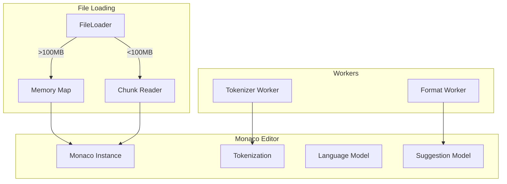

**Monaco 配置（电脑级优化）**

```typescript
// renderer/components/editor/MonacoEditor.tsx
import * as monaco from 'monaco-editor';
import { loader } from '@monaco-editor/react';

// 电脑级：本地加载 Monaco，非 CDN
loader.config({ 
  paths: { 
    vs: path.join(__dirname, '../node_modules/monaco-editor/min/vs')
  }
});

// 环境变量配置 Monaco Workers
self.MonacoEnvironment = {
  getWorker: function (workerId, label) {
    const getWorkerModuleUrl = (moduleId, label) => {
      return './node_modules/monaco-editor/min/vs/' + moduleId + '/' + label + '.worker.js';
    };
    
    switch (label) {
      case 'json':
        return new Worker(getWorkerModuleUrl('language', 'json'));
      case 'css':
      case 'scss':
      case 'less':
        return new Worker(getWorkerModuleUrl('language', 'css'));
      case 'html':
      case 'handlebars':
      case 'razor':
        return new Worker(getWorkerModuleUrl('language', 'html'));
      case 'typescript':
      case 'javascript':
        return new Worker(getWorkerModuleUrl('language', 'ts'));
      default:
        return new Worker(getWorkerModuleUrl('base', 'worker'));
    }
  }
};

export function createEditor(container: HTMLElement, options?: EditorOptions) {
  return monaco.editor.create(container, {
    // 电脑级：启用高级功能
    value: options?.content || '',
    language: options?.language || 'typescript',
    theme: 'vs-dark',
    
    // 性能优化
    fontSize: 14,
    fontFamily: 'JetBrains Mono, Fira Code, Consolas, monospace',
    fontLigatures: true,
    
    // 电脑级：小地图导航
    minimap: { 
      enabled: true,
      side: 'right',
      size: 'proportional',
    },
    
    // 电脑级：多光标
    multiCursorModifier: 'altCmd',
    
    // 大文件优化
    largeFileOptimizations: true,
    maxTokenizationLineLength: 20000,
    
    // 其他优化
    automaticLayout: true,
    scrollBeyondLastLine: false,
    smoothScrolling: true,
    cursorSmoothCaretAnimation: true,
    
    // 编辑器行为
    formatOnPaste: true,
    formatOnType: true,
    autoIndent: 'full',
    tabSize: 2,
    insertSpaces: true,
    
    // 智能提示
    quickSuggestions: true,
    suggestOnTriggerCharacters: true,
    acceptSuggestionOnCommitCharacter: true,
    snippetSuggestions: 'inline',
  });
}
```

**引用**: [R-04-performance-monaco-workers.md](./R-04-performance-monaco-workers.md)

### 4.2 Worker 线程池设计

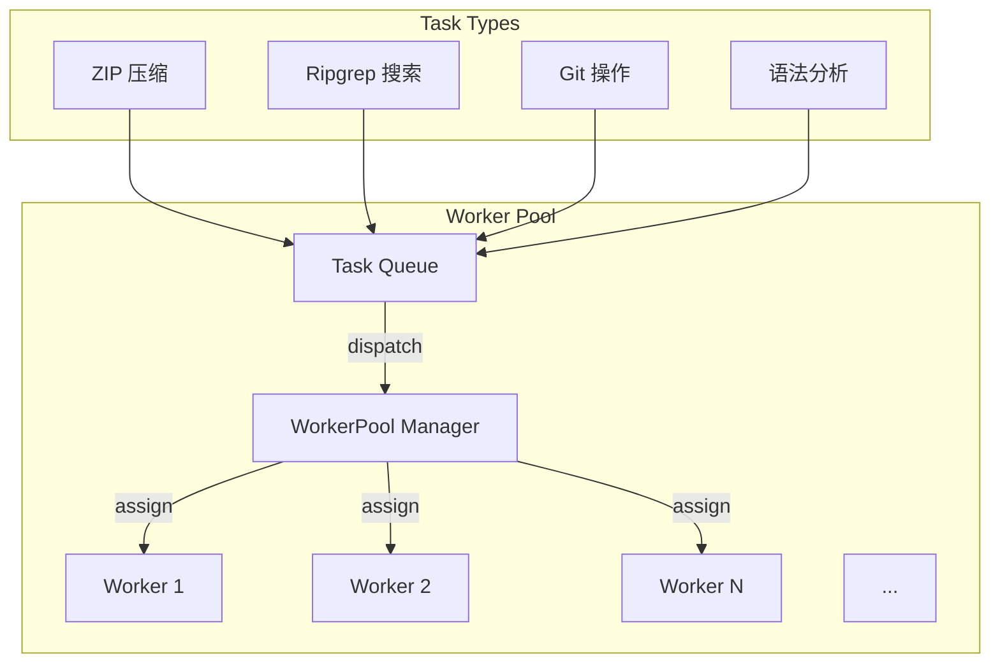

**Worker Pool 实现**

```typescript
// electron/workers/WorkerPool.ts
import { Worker } from 'worker_threads';
import os from 'os';
import path from 'path';

interface Task {
  id: string;
  type: 'zip' | 'search' | 'git' | 'analyze';
  payload: unknown;
  resolve: (value: unknown) => void;
  reject: (reason: Error) => void;
  priority: number;
}

interface WorkerInfo {
  worker: Worker;
  busy: boolean;
  currentTask?: Task;
}

export class WorkerPool {
  private workers: WorkerInfo[] = [];
  private queue: Task[] = [];
  private maxWorkers: number;
  private taskMap: Map<string, Task> = new Map();
  
  constructor(maxWorkers = os.cpus().length) {
    this.maxWorkers = maxWorkers;
    this.initializeWorkers();
  }
  
  private initializeWorkers(): void {
    for (let i = 0; i < this.maxWorkers; i++) {
      const worker = new Worker(path.join(__dirname, 'task-processor.js'));
      
      const workerInfo: WorkerInfo = {
        worker,
        busy: false,
      };
      
      worker.on('message', (result) => {
        this.handleResult(workerInfo, result);
      });
      
      worker.on('error', (error) => {
        this.handleError(workerInfo, error);
      });
      
      this.workers.push(workerInfo);
    }
    
    console.log(`[WorkerPool] Initialized with ${this.maxWorkers} workers`);
  }
  
  async executeTask<T>(
    type: Task['type'], 
    payload: unknown, 
    priority = 0
  ): Promise<T> {
    return new Promise((resolve, reject) => {
      const task: Task = {
        id: `${type}-${Date.now()}-${Math.random().toString(36).substr(2, 9)}`,
        type,
        payload,
        resolve: resolve as (value: unknown) => void,
        reject,
        priority,
      };
      
      this.taskMap.set(task.id, task);
      
      // 按优先级插入队列
      const insertIndex = this.queue.findIndex(t => t.priority < priority);
      if (insertIndex === -1) {
        this.queue.push(task);
      } else {
        this.queue.splice(insertIndex, 0, task);
      }
      
      this.dispatch();
    });
  }
  
  private dispatch(): void {
    const availableWorker = this.workers.find(w => !w.busy);
    if (!availableWorker || this.queue.length === 0) return;
    
    const task = this.queue.shift()!;
    availableWorker.busy = true;
    availableWorker.currentTask = task;
    
    availableWorker.worker.postMessage({
      taskId: task.id,
      type: task.type,
      payload: task.payload,
    });
  }
  
  private handleResult(worker: WorkerInfo, result: { taskId: string; data: unknown; error?: string }): void {
    const task = this.taskMap.get(result.taskId);
    if (!task) return;
    
    this.taskMap.delete(result.taskId);
    worker.busy = false;
    worker.currentTask = undefined;
    
    if (result.error) {
      task.reject(new Error(result.error));
    } else {
      task.resolve(result.data);
    }
    
    this.dispatch();
  }
  
  private handleError(worker: WorkerInfo, error: Error): void {
    console.error('[WorkerPool] Worker error:', error);
    
    if (worker.currentTask) {
      worker.currentTask.reject(error);
      this.taskMap.delete(worker.currentTask.id);
    }
    
    // 重启 Worker
    worker.worker.terminate();
    const newWorker = new Worker(path.join(__dirname, 'task-processor.js'));
    worker.worker = newWorker;
    worker.busy = false;
    worker.currentTask = undefined;
  }
  
  terminate(): Promise<number[]> {
    return Promise.all(this.workers.map(w => w.worker.terminate()));
  }
}

// 单例导出
export const workerPool = new WorkerPool();
```

**Worker 处理器**

```typescript
// electron/workers/task-processor.ts
import { parentPort } from 'worker_threads';
import { exec } from 'child_process';
import { promisify } from 'util';
import archiver from 'archiver';
import fs from 'fs';

const execAsync = promisify(exec);

parentPort?.on('message', async ({ taskId, type, payload }) => {
  try {
    let result: unknown;
    
    switch (type) {
      case 'zip':
        result = await handleZip(payload);
        break;
      case 'search':
        result = await handleSearch(payload);
        break;
      case 'git':
        result = await handleGit(payload);
        break;
      case 'analyze':
        result = await handleAnalyze(payload);
        break;
      default:
        throw new Error(`Unknown task type: ${type}`);
    }
    
    parentPort?.postMessage({ taskId, data: result });
  } catch (error) {
    parentPort?.postMessage({
      taskId,
      error: error instanceof Error ? error.message : 'Unknown error',
    });
  }
});

// ZIP 压缩
async function handleZip(payload: { sourcePath: string; outputPath: string }) {
  return new Promise((resolve, reject) => {
    const output = fs.createWriteStream(payload.outputPath);
    const archive = archiver('zip', { zlib: { level: 9 } });
    
    output.on('close', () => {
      resolve({ 
        success: true, 
        path: payload.outputPath,
        size: archive.pointer(),
      });
    });
    
    archive.on('error', reject);
    archive.pipe(output);
    archive.directory(payload.sourcePath, false);
    archive.finalize();
  });
}

// Ripgrep 搜索
async function handleSearch(payload: { 
  query: string; 
  path: string; 
  options?: string[] 
}) {
  const rgOptions = payload.options?.join(' ') || '';
  const command = `rg ${rgOptions} "${payload.query}" "${payload.path}"`;
  
  const { stdout, stderr } = await execAsync(command);
  
  return {
    results: stdout.split('\n').filter(Boolean),
    errors: stderr,
  };
}

// Git 操作
async function handleGit(payload: { 
  repoPath: string; 
  command: string;
  args?: string[];
}) {
  const gitCommand = `git -C "${payload.repoPath}" ${payload.command} ${payload.args?.join(' ') || ''}`;
  const { stdout, stderr } = await execAsync(gitCommand);
  
  return {
    output: stdout,
    errors: stderr,
  };
}

// 代码分析
async function handleAnalyze(payload: { filePath: string }) {
  const content = await fs.promises.readFile(payload.filePath, 'utf-8');
  
  // 简单统计
  const lines = content.split('\n');
  const stats = {
    totalLines: lines.length,
    codeLines: lines.filter(l => l.trim() && !l.trim().startsWith('//')).length,
    commentLines: lines.filter(l => l.trim().startsWith('//')).length,
    blankLines: lines.filter(l => !l.trim()).length,
  };
  
  return stats;
}
```

### 4.3 大文件处理策略

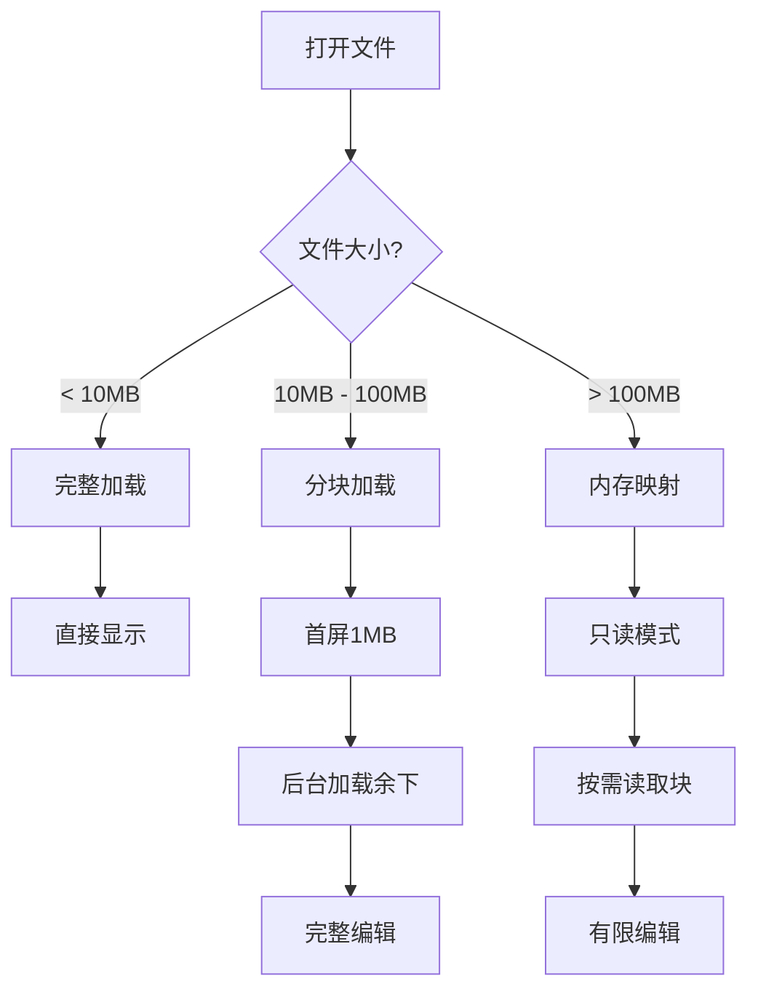

**大文件处理实现**

```typescript
// electron/managers/FileManager.ts
import { open, read } from 'fs/promises';
import { mmap } from 'mmap-io';

export class FileManager {
  private largeFileHandles: Map<string, { fd: number; size: number }> = new Map();
  
  // 读取文件（自动选择策略）
  async readFile(filePath: string): Promise<FileContent> {
    const stats = await fs.stat(filePath);
    
    if (stats.size < 10 * 1024 * 1024) {
      // < 10MB: 直接读取
      return this.readSmallFile(filePath);
    } else if (stats.size < 100 * 1024 * 1024) {
      // 10MB - 100MB: 分块读取
      return this.readChunkedFile(filePath, stats.size);
    } else {
      // > 100MB: 内存映射
      return this.readMemoryMapped(filePath, stats.size);
    }
  }
  
  private async readSmallFile(filePath: string): Promise<FileContent> {
    const content = await fs.readFile(filePath, 'utf-8');
    return {
      type: 'full',
      content,
      size: content.length,
      editable: true,
    };
  }
  
  private async readChunkedFile(filePath: string, size: number): Promise<FileContent> {
    const fd = await open(filePath, 'r');
    
    // 先读取前 1MB 用于显示
    const firstChunk = Buffer.alloc(Math.min(1024 * 1024, size));
    await fd.read(firstChunk, 0, firstChunk.length, 0);
    
    // 后台加载完整内容
    this.loadRestInBackground(fd, size);
    
    return {
      type: 'chunked',
      content: firstChunk.toString('utf-8'),
      size,
      totalSize: size,
      editable: true,
      loading: true,
    };
  }
  
  private async readMemoryMapped(filePath: string, size: number): Promise<FileContent> {
    // 电脑级特权：内存映射 GB 级文件
    const fd = await open(filePath, 'r');
    const buffer = mmap.map(size, mmap.PROT_READ, mmap.MAP_SHARED, fd.fd, 0);
    
    // 只读取前 10MB 显示
    const displaySize = Math.min(10 * 1024 * 1024, size);
    const displayContent = buffer.slice(0, displaySize).toString('utf-8');
    
    // 保存句柄用于后续读取
    this.largeFileHandles.set(filePath, { fd: fd.fd, size });
    
    return {
      type: 'memory-mapped',
      content: displayContent,
      size: displaySize,
      totalSize: size,
      editable: false, // >100MB 只读模式
      warning: `Large file (${(size / 1024 / 1024).toFixed(1)}MB) opened in read-only mode`,
    };
  }
  
  // 读取指定范围
  async readRange(filePath: string, start: number, length: number): Promise<string> {
    const handle = this.largeFileHandles.get(filePath);
    if (!handle) throw new Error('File not opened');
    
    const buffer = Buffer.alloc(length);
    await read(handle.fd, buffer, 0, length, start);
    return buffer.toString('utf-8');
  }
  
  // 原子写入（大文件）
  async atomicWriteLargeFile(filePath: string, content: string): Promise<void> {
    const tempPath = `${filePath}.tmp.${Date.now()}`;
    
    // 流式写入避免内存爆炸
    const writeStream = fs.createWriteStream(tempPath);
    
    return new Promise((resolve, reject) => {
      writeStream.on('finish', async () => {
        await fs.rename(tempPath, filePath);
        resolve();
      });
      
      writeStream.on('error', reject);
      writeStream.write(content);
      writeStream.end();
    });
  }
}

interface FileContent {
  type: 'full' | 'chunked' | 'memory-mapped';
  content: string;
  size: number;
  totalSize?: number;
  editable: boolean;
  loading?: boolean;
  warning?: string;
}
```

**大文件处理策略对比**

| 文件大小 | 策略 | 内存占用 | 编辑能力 |
|----------|------|----------|----------|
| < 10MB | 完整加载 | 1x | 完全编辑 |
| 10-100MB | 分块加载 | ~1MB + 后台加载 | 完全编辑 |
| > 100MB | 内存映射 | ~10MB显示缓存 | 只读模式 |

### 4.4 Ripgrep 搜索集成

```typescript
// electron/managers/SearchManager.ts
import { workerPool } from '../workers/WorkerPool';
import { ipcMain } from 'electron';

export interface SearchOptions {
  caseSensitive?: boolean;
  wholeWord?: boolean;
  regex?: boolean;
  filePattern?: string;
  exclude?: string[];
  maxResults?: number;
}

export interface SearchResult {
  filePath: string;
  line: number;
  column: number;
  text: string;
  match: string;
}

export class SearchManager {
  constructor() {
    this.setupIPC();
  }
  
  async search(
    query: string,
    searchPath: string,
    options: SearchOptions = {}
  ): Promise<SearchResult[]> {
    const rgOptions: string[] = ['--json', '--line-number', '--column'];
    
    if (!options.caseSensitive) rgOptions.push('--ignore-case');
    if (options.wholeWord) rgOptions.push('--word-regexp');
    if (options.regex) rgOptions.push('--regexp');
    if (options.filePattern) rgOptions.push('-g', options.filePattern);
    if (options.exclude) {
      options.exclude.forEach(e => rgOptions.push('-g', `!${e}`));
    }
    if (options.maxResults) rgOptions.push('-m', options.maxResults.toString());
    
    // 使用 Worker Pool 执行搜索
    const result = await workerPool.executeTask('search', {
      query,
      path: searchPath,
      options: rgOptions,
    });
    
    return this.parseRipgrepOutput(result.results);
  }
  
  // 全文索引（增量）
  async buildIndex(projectPath: string): Promise<void> {
    // 使用 Ripgrep 生成文件列表和符号索引
    const { output } = await workerPool.executeTask('search', {
      query: '',
      path: projectPath,
      options: ['--files', '--json'],
    });
    
    // 存储索引到 SQLite
    const files = output.split('\n').filter(Boolean);
    // ... 索引逻辑
  }
  
  private parseRipgrepOutput(lines: string[]): SearchResult[] {
    const results: SearchResult[] = [];
    
    for (const line of lines) {
      try {
        const parsed = JSON.parse(line);
        if (parsed.type === 'match') {
          const { path, lines, line_number, submatches } = parsed.data;
          submatches.forEach((match: any) => {
            results.push({
              filePath: path.text,
              line: line_number,
              column: match.start + 1,
              text: lines.text.trim(),
              match: match.match.text,
            });
          });
        }
      } catch (e) {
        // 忽略非 JSON 行
      }
    }
    
    return results;
  }
  
  private setupIPC(): void {
    ipcMain.handle('search:query', async (event, { query, path, options }) => {
      const results = await this.search(query, path, options);
      return { results };
    });
  }
}
```

**Ripgrep 优势**

| 特性 | 简单遍历 | Ripgrep |
|------|----------|---------|
| 10万行代码搜索 | 5-10秒 | <100ms |
| 正则表达式 | 需自建 | 原生支持 |
| 多线程 | 单线程 | 自动并行 |
| Unicode | 需处理 | 原生支持 |

---

## 第 5 章：多窗口与 IPC

### 5.1 多窗口架构

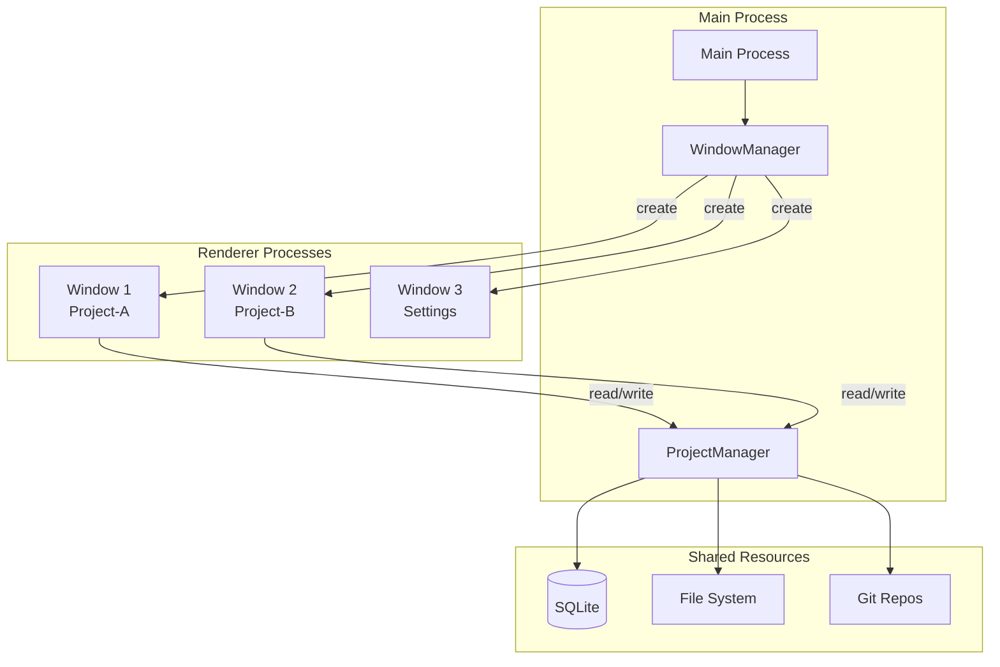

**Window Manager 实现**

```typescript
// electron/managers/WindowManager.ts
import { BrowserWindow, app, ipcMain } from 'electron';
import path from 'path';

interface WindowInfo {
  id: number;
  projectId?: string;
  type: 'editor' | 'settings' | 'dashboard';
  window: BrowserWindow;
}

export class WindowManager {
  private windows: Map<number, WindowInfo> = new Map();
  private projectWindows: Map<string, number> = new Map();
  
  constructor() {
    this.setupIPC();
    app.on('window-all-closed', this.handleAllClosed.bind(this));
  }
  
  // 创建项目编辑器窗口
  async createEditorWindow(projectId: string): Promise<BrowserWindow> {
    // 检查是否已打开
    if (this.projectWindows.has(projectId)) {
      const existingId = this.projectWindows.get(projectId)!;
      const existing = this.windows.get(existingId);
      if (existing) {
        existing.window.focus();
        return existing.window;
      }
    }
    
    const window = new BrowserWindow({
      width: 1400,
      height: 900,
      minWidth: 800,
      minHeight: 600,
      titleBarStyle: process.platform === 'darwin' ? 'hiddenInset' : 'default',
      webPreferences: {
        nodeIntegration: false,
        contextIsolation: true,
        preload: path.join(__dirname, '../preload.js'),
        additionalArguments: [`--project-id=${projectId}`],
      },
    });
    
    // 加载 Next.js 编辑器页面
    if (process.env.NODE_ENV === 'development') {
      window.loadURL(`http://localhost:3000/editor?project=${projectId}`);
      window.webContents.openDevTools();
    } else {
      window.loadFile(path.join(__dirname, '../../renderer/out/editor.html'), {
        query: { project: projectId },
      });
    }
    
    const windowInfo: WindowInfo = {
      id: window.id,
      projectId,
      type: 'editor',
      window,
    };
    
    this.windows.set(window.id, windowInfo);
    this.projectWindows.set(projectId, window.id);
    
    window.on('closed', () => {
      this.windows.delete(window.id);
      if (projectId) {
        this.projectWindows.delete(projectId);
      }
    });
    
    return window;
  }
  
  // 创建设置窗口
  async createSettingsWindow(): Promise<BrowserWindow> {
    const window = new BrowserWindow({
      width: 800,
      height: 600,
      parent: BrowserWindow.getFocusedWindow() || undefined,
      modal: true,
      webPreferences: {
        nodeIntegration: false,
        contextIsolation: true,
        preload: path.join(__dirname, '../preload.js'),
      },
    });
    
    if (process.env.NODE_ENV === 'development') {
      window.loadURL('http://localhost:3000/settings');
    } else {
      window.loadFile(path.join(__dirname, '../../renderer/out/settings.html'));
    }
    
    const windowInfo: WindowInfo = {
      id: window.id,
      type: 'settings',
      window,
    };
    
    this.windows.set(window.id, windowInfo);
    
    window.on('closed', () => {
      this.windows.delete(window.id);
    });
    
    return window;
  }
  
  // 获取窗口信息
  getWindow(id: number): WindowInfo | undefined {
    return this.windows.get(id);
  }
  
  getWindowByProject(projectId: string): WindowInfo | undefined {
    const id = this.projectWindows.get(projectId);
    return id ? this.windows.get(id) : undefined;
  }
  
  // 广播消息到所有窗口
  broadcast(channel: string, ...args: unknown[]): void {
    for (const { window } of this.windows.values()) {
      if (!window.isDestroyed()) {
        window.webContents.send(channel, ...args);
      }
    }
  }
  
  // 发送消息到指定项目窗口
  sendToProject(projectId: string, channel: string, ...args: unknown[]): boolean {
    const windowInfo = this.getWindowByProject(projectId);
    if (windowInfo && !windowInfo.window.isDestroyed()) {
      windowInfo.window.webContents.send(channel, ...args);
      return true;
    }
    return false;
  }
  
  private setupIPC(): void {
    ipcMain.handle('window:create', async (event, { projectId }) => {
      const window = await this.createEditorWindow(projectId);
      return { windowId: window.id };
    });
    
    ipcMain.handle('window:close', async (event, { windowId }) => {
      const info = this.windows.get(windowId);
      if (info) {
        info.window.close();
      }
    });
    
    ipcMain.handle('window:getAll', async () => {
      return Array.from(this.windows.values()).map(w => ({
        id: w.id,
        projectId: w.projectId,
        type: w.type,
      }));
    });
  }
  
  private handleAllClosed(): void {
    if (process.platform !== 'darwin') {
      app.quit();
    }
  }
}
```

**引用**: [R-05-multiwindow-ipc-design.md](./R-05-multiwindow-ipc-design.md)

### 5.2 IPC 通信协议

```typescript
// electron/preload.ts
import { contextBridge, ipcRenderer } from 'electron';

// 暴露给 Renderer 的安全 API
contextBridge.exposeInMainWorld('electronAPI', {
  // 文件系统
  fs: {
    readFile: (filePath: string) => 
      ipcRenderer.invoke('fs:read', filePath),
    writeFile: (filePath: string, content: string) => 
      ipcRenderer.invoke('fs:write', { filePath, content }),
    deleteFile: (filePath: string) => 
      ipcRenderer.invoke('fs:delete', filePath),
    readDir: (dirPath: string) => 
      ipcRenderer.invoke('fs:readdir', dirPath),
    watch: (dirPath: string, callback: (event: string, path: string) => void) => {
      const listener = (event: any, data: { event: string; path: string }) => {
        callback(data.event, data.path);
      };
      ipcRenderer.on(`fs:watch:${dirPath}`, listener);
      ipcRenderer.invoke('fs:watch', dirPath);
      
      return () => {
        ipcRenderer.removeListener(`fs:watch:${dirPath}`, listener);
        ipcRenderer.invoke('fs:unwatch', dirPath);
      };
    },
  },
  
  // 项目
  project: {
    open: (projectPath: string) => 
      ipcRenderer.invoke('project:open', projectPath),
    close: (projectId: string) => 
      ipcRenderer.invoke('project:close', projectId),
    list: () => 
      ipcRenderer.invoke('project:list'),
    getInfo: (projectId: string) => 
      ipcRenderer.invoke('project:getInfo', projectId),
  },
  
  // 窗口
  window: {
    create: (projectId: string) => 
      ipcRenderer.invoke('window:create', { projectId }),
    close: (windowId: number) => 
      ipcRenderer.invoke('window:close', { windowId }),
    getAll: () => 
      ipcRenderer.invoke('window:getAll'),
    minimize: () => 
      ipcRenderer.invoke('window:minimize'),
    maximize: () => 
      ipcRenderer.invoke('window:maximize'),
  },
  
  // 跨窗口操作
  cross: {
    copy: (sourceProject: string, targetProject: string, filePath: string) =>
      ipcRenderer.invoke('cross:copy', { sourceProject, targetProject, filePath }),
    move: (sourceProject: string, targetProject: string, filePath: string) =>
      ipcRenderer.invoke('cross:move', { sourceProject, targetProject, filePath }),
  },
  
  // 系统
  system: {
    showOpenDialog: (options: any) => 
      ipcRenderer.invoke('system:showOpenDialog', options),
    showSaveDialog: (options: any) => 
      ipcRenderer.invoke('system:showSaveDialog', options),
    showMessageBox: (options: any) => 
      ipcRenderer.invoke('system:showMessageBox', options),
    moveToTrash: (filePath: string) => 
      ipcRenderer.invoke('system:moveToTrash', filePath),
  },
  
  // Undo/Redo
  undo: {
    execute: (projectId: string, command: any) =>
      ipcRenderer.invoke('undo:execute', { projectId, command }),
    undo: (projectId: string) =>
      ipcRenderer.invoke('undo:undo', { projectId }),
    redo: (projectId: string) =>
      ipcRenderer.invoke('undo:redo', { projectId }),
    canUndo: (projectId: string) =>
      ipcRenderer.invoke('undo:canUndo', { projectId }),
    canRedo: (projectId: string) =>
      ipcRenderer.invoke('undo:canRedo', { projectId }),
  },
  
  // 搜索
  search: {
    query: (query: string, searchPath: string, options?: any) =>
      ipcRenderer.invoke('search:query', { query, path: searchPath, options }),
  },
  
  // 监听事件
  on: (channel: string, callback: (...args: any[]) => void) => {
    const listener = (event: any, ...args: any[]) => callback(...args);
    ipcRenderer.on(channel, listener);
    return () => ipcRenderer.removeListener(channel, listener);
  },
});

// 类型声明（用于 Renderer 端）
declare global {
  interface Window {
    electronAPI: typeof window.electronAPI;
  }
}
```

### 5.3 跨窗口拖拽实现

```typescript
// electron/managers/DragDropManager.ts
import { ipcMain, BrowserWindow } from 'electron';

interface DragData {
  sourceProject: string;
  sourceWindow: number;
  filePath: string;
  fileName: string;
}

export class DragDropManager {
  private activeDrag: DragData | null = null;
  
  constructor(private windowManager: WindowManager) {
    this.setupIPC();
  }
  
  private setupIPC(): void {
    // 开始拖拽
    ipcMain.handle('drag:start', async (event, data: DragData) => {
      this.activeDrag = {
        ...data,
        sourceWindow: BrowserWindow.fromWebContents(event.sender)?.id || 0,
      };
      
      // 通知所有窗口进入拖拽模式
      this.windowManager.broadcast('drag:started', {
        sourceProject: data.sourceProject,
        fileName: data.fileName,
      });
      
      return { success: true };
    });
    
    // 拖拽进入目标窗口
    ipcMain.handle('drag:enter', async (event, { targetProject }) => {
      if (!this.activeDrag) return { canDrop: false };
      
      // 检查是否可以放置
      const canDrop = this.activeDrag.sourceProject !== targetProject;
      
      return { canDrop };
    });
    
    // 放置
    ipcMain.handle('drag:drop', async (event, { targetProject, targetPath }) => {
      if (!this.activeDrag) return { success: false, error: 'No active drag' };
      
      const { sourceProject, filePath } = this.activeDrag;
      const fullTargetPath = `${targetPath}/${path.basename(filePath)}`;
      
      try {
        // 执行跨项目复制
        const result = await this.windowManager.crossProjectCopy(
          sourceProject,
          targetProject,
          filePath,
          fullTargetPath
        );
        
        // 清除拖拽状态
        this.activeDrag = null;
        this.windowManager.broadcast('drag:ended');
        
        return result;
      } catch (error) {
        return { 
          success: false, 
          error: error instanceof Error ? error.message : 'Unknown error' 
        };
      }
    });
    
    // 取消拖拽
    ipcMain.handle('drag:cancel', async () => {
      this.activeDrag = null;
      this.windowManager.broadcast('drag:ended');
      return { success: true };
    });
  }
}
```

**跨窗口复制实现**

```typescript
// electron/managers/WindowManager.ts（扩展）
export class WindowManager {
  // ... 之前代码 ...
  
  async crossProjectCopy(
    sourceProject: string,
    targetProject: string,
    sourcePath: string,
    targetPath: string
  ): Promise<{ success: boolean }> {
    // 获取源项目窗口
    const sourceWindow = this.getWindowByProject(sourceProject);
    const targetWindow = this.getWindowByProject(targetProject);
    
    if (!sourceWindow || !targetWindow) {
      throw new Error('Source or target project not open');
    }
    
    // 执行复制
    const result = await ipcMain.call(
      sourceWindow.window.webContents,
      'cross:copy',
      {
        sourceProject,
        targetProject,
        sourcePath,
        targetPath,
      }
    );
    
    return result;
  }
}
```

### 5.4 状态管理策略

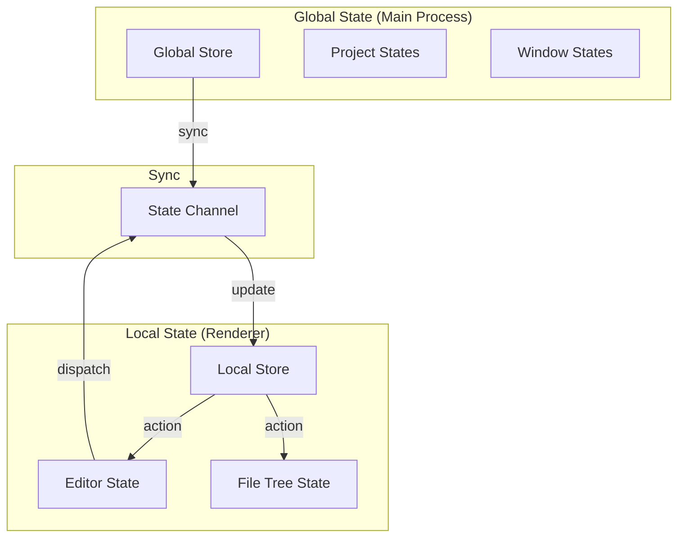

**状态分层**

| 状态层级 | 位置 | 示例 | 同步方式 |
|----------|------|------|----------|
| Global State | Main Process | 打开的项目列表、窗口布局 | IPC |
| Local State | Renderer | 编辑器内容、选中文件 | 本地 |
| URL State | URL Params | 当前项目ID、文件路径 | URL |
| Persistent State | SQLite | 用户设置、主题偏好 | 数据库 |

**Zustand Store 设计**

```typescript
// renderer/stores/editorStore.ts
import { create } from 'zustand';
import { subscribeWithSelector } from 'zustand/middleware';

interface EditorState {
  // 编辑器状态
  currentFile: string | null;
  openFiles: string[];
  modifiedFiles: Set<string>;
  
  // Actions
  openFile: (path: string) => void;
  closeFile: (path: string) => void;
  markModified: (path: string, modified: boolean) => void;
  saveFile: (path: string) => Promise<void>;
}

export const useEditorStore = create<EditorState>()(
  subscribeWithSelector((set, get) => ({
    currentFile: null,
    openFiles: [],
    modifiedFiles: new Set(),
    
    openFile: (path: string) => {
      set((state) => ({
        currentFile: path,
        openFiles: state.openFiles.includes(path) 
          ? state.openFiles 
          : [...state.openFiles, path],
      }));
    },
    
    closeFile: (path: string) => {
      set((state) => ({
        openFiles: state.openFiles.filter((f) => f !== path),
        modifiedFiles: new Set(Array.from(state.modifiedFiles).filter((f) => f !== path)),
        currentFile: state.currentFile === path 
          ? state.openFiles[state.openFiles.length - 2] || null 
          : state.currentFile,
      }));
    },
    
    markModified: (path: string, modified: boolean) => {
      set((state) => {
        const newSet = new Set(state.modifiedFiles);
        if (modified) {
          newSet.add(path);
        } else {
          newSet.delete(path);
        }
        return { modifiedFiles: newSet };
      });
    },
    
    saveFile: async (path: string) => {
      const content = // 从编辑器获取内容
      await window.electronAPI.fs.writeFile(path, content);
      get().markModified(path, false);
    },
  }))
);

// 与 Main Process 同步
useEditorStore.subscribe(
  (state) => state.modifiedFiles,
  (modifiedFiles) => {
    window.electronAPI.project.setModified(
      new URLSearchParams(window.location.search).get('project')!,
      modifiedFiles.size > 0
    );
  }
);
```

---

## 第 6 章：与 v1.0.0 治理核心集成

### 6.1 集成架构图

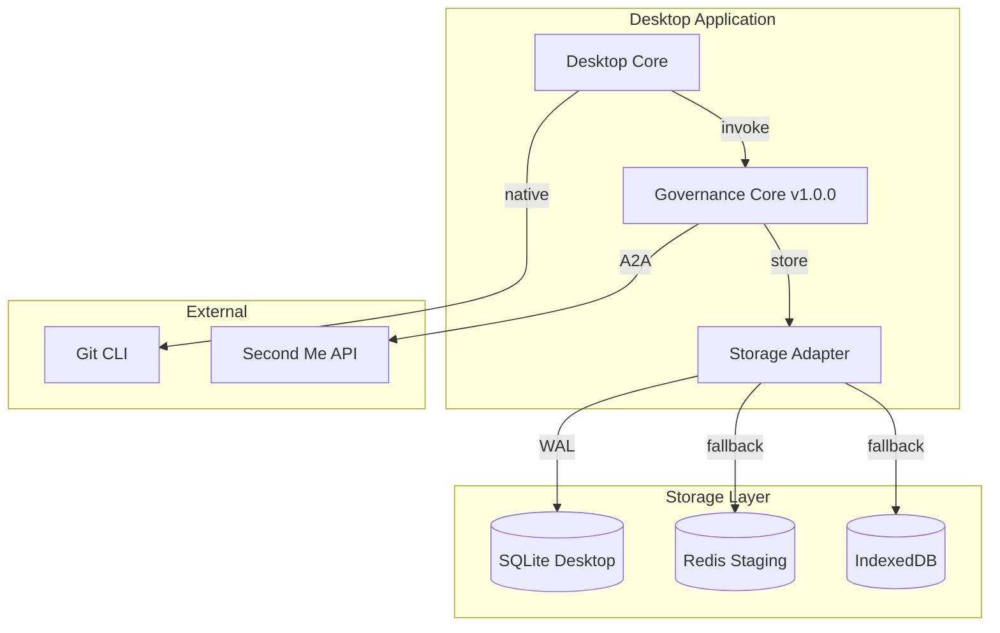

**集成原则**

| 原则 | 说明 |
|------|------|
| 向后兼容 | v1.0.0 API 保持不变 |
| 存储适配 | TSA 适配 SQLite 本地存储 |
| 功能增强 | 桌面版增加原生 Git、大文件支持 |
| 治理一致 | 七权治理逻辑完全复用 |

**引用**: [R-06-governance-integration-spec.md](./R-06-governance-integration-spec.md)

### 6.2 文件系统事件映射

```typescript
// electron/adapters/FileSystemAdapter.ts
import { FileManager } from '../managers/FileManager';
import { governance } from '@/lib/core/governance';

export class FileSystemAdapter {
  constructor(
    private fileManager: FileManager,
    private projectId: string
  ) {
    this.setupWatchers();
  }
  
  private setupWatchers(): void {
    // 监视文件系统变化
    this.fileManager.watch(this.projectId, async (event, filePath) => {
      switch (event) {
        case 'create':
          await this.handleFileCreated(filePath);
          break;
        case 'modify':
          await this.handleFileModified(filePath);
          break;
        case 'delete':
          await this.handleFileDeleted(filePath);
          break;
        case 'rename':
          await this.handleFileRenamed(filePath);
          break;
      }
    });
  }
  
  private async handleFileCreated(filePath: string): Promise<void> {
    // 非关键文件：直接记录，不触发治理
    if (!this.isCriticalFile(filePath)) {
      await this.recordEvent('FILE_CREATED', filePath);
      return;
    }
    
    // 关键文件：触发治理提案
    await governance.createProposal({
      type: 'FILE_CREATED',
      title: `新文件创建: ${path.basename(filePath)}`,
      description: `文件路径: ${filePath}`,
      context: { filePath, projectId: this.projectId },
    });
  }
  
  private async handleFileModified(filePath: string): Promise<void> {
    // 获取 Git diff
    const diff = await this.fileManager.getGitDiff(this.projectId, filePath);
    
    if (!this.isCriticalFile(filePath)) {
      await this.recordEvent('FILE_MODIFIED', filePath, { diff });
      return;
    }
    
    await governance.createProposal({
      type: 'FILE_MODIFIED',
      title: `文件修改: ${path.basename(filePath)}`,
      description: `变更内容:\n\`\`\`diff\n${diff}\n\`\`\``,
      context: { filePath, projectId: this.projectId, diff },
    });
  }
  
  private async handleFileDeleted(filePath: string): Promise<void> {
    // 删除操作必须经过治理
    await governance.createProposal({
      type: 'FILE_DELETED',
      title: `文件删除: ${path.basename(filePath)}`,
      description: `删除路径: ${filePath}`,
      context: { filePath, projectId: this.projectId },
      requireQuorum: true, // 需要更多投票
    });
  }
  
  private isCriticalFile(filePath: string): boolean {
    const criticalPatterns = [
      /package\.json$/,
      /tsconfig\.json$/,
      /next\.config\./,
      /\.env/,
      /lib\/core\//,
    ];
    return criticalPatterns.some(p => p.test(filePath));
  }
  
  private async recordEvent(
    type: string, 
    filePath: string, 
    data?: Record<string, unknown>
  ): Promise<void> {
    // 记录到 SQLite
    await this.fileManager.db.prepare(`
      INSERT INTO fs_events (project_id, type, file_path, data, timestamp)
      VALUES (?, ?, ?, ?, strftime('%s', 'now'))
    `).run(this.projectId, type, filePath, JSON.stringify(data || {}));
  }
}
```

### 6.3 TSA Branch ↔ Git Branch 同步

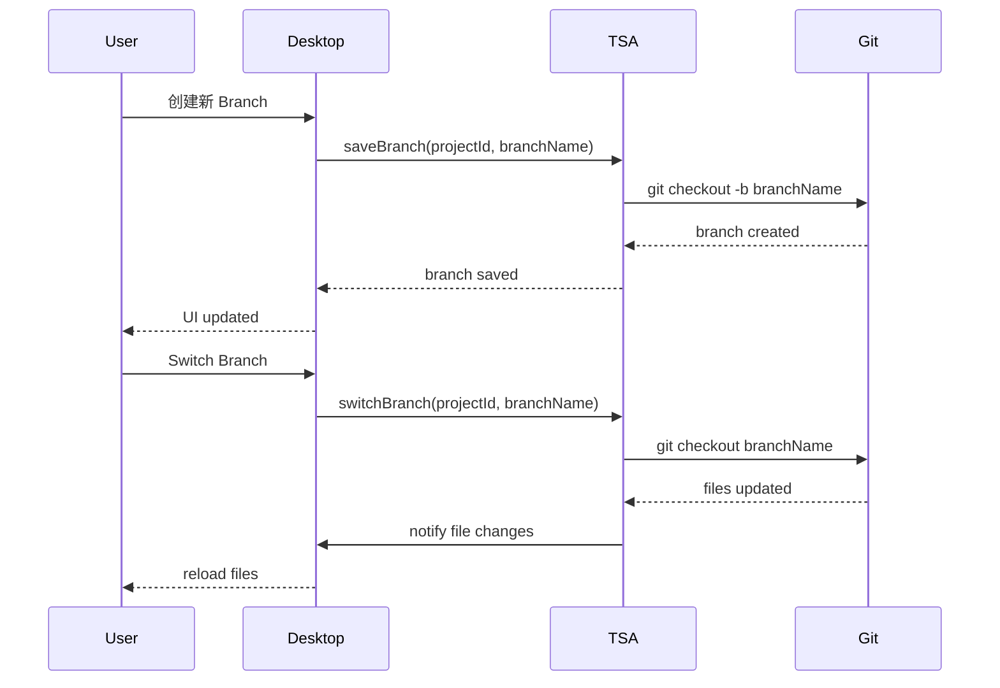

**Branch 管理实现**

```typescript
// electron/managers/BranchManager.ts
import { simpleGit, SimpleGit } from 'simple-git';

export class BranchManager {
  private gitInstances: Map<string, SimpleGit> = new Map();
  
  constructor(private db: DatabaseManager) {}
  
  private getGit(projectId: string): SimpleGit {
    if (!this.gitInstances.has(projectId)) {
      const project = this.getProject(projectId);
      this.gitInstances.set(projectId, simpleGit(project.path));
    }
    return this.gitInstances.get(projectId)!;
  }
  
  // 创建新分支
  async createBranch(
    projectId: string, 
    branchName: string, 
    fromBranch = 'main'
  ): Promise<void> {
    const git = this.getGit(projectId);
    
    // 先切换到基础分支
    await git.checkout(fromBranch);
    
    // 创建并切换新分支
    await git.checkoutLocalBranch(branchName);
    
    // 记录到数据库
    this.db.prepare(`
      INSERT INTO branches (project_id, name, parent, created_at)
      VALUES (?, ?, ?, strftime('%s', 'now'))
    `).run(projectId, branchName, fromBranch);
    
    // 更新项目当前分支
    this.db.prepare(`
      UPDATE projects SET git_branch = ? WHERE id = ?
    `).run(branchName, projectId);
  }
  
  // 切换分支
  async switchBranch(projectId: string, branchName: string): Promise<void> {
    const git = this.getGit(projectId);
    
    // 检查工作区是否干净
    const status = await git.status();
    if (status.files.length > 0) {
      // 自动 stash
      await git.stash(['-u']);
    }
    
    // 切换分支
    await git.checkout(branchName);
    
    // 尝试恢复 stash
    const stashList = await git.stashList();
    if (stashList.latest) {
      await git.stash(['pop']);
    }
    
    // 更新数据库
    this.db.prepare(`
      UPDATE projects SET git_branch = ? WHERE id = ?
    `).run(branchName, projectId);
    
    // 通知 UI 刷新
    windowManager.sendToProject(projectId, 'branch:switched', { branchName });
  }
  
  // 获取分支列表
  async listBranches(projectId: string): Promise<string[]> {
    const git = this.getGit(projectId);
    const branches = await git.branch(['-a']);
    return branches.all;
  }
  
  // 删除分支
  async deleteBranch(projectId: string, branchName: string): Promise<void> {
    const git = this.getGit(projectId);
    await git.branch(['-d', branchName]);
    
    this.db.prepare(`
      DELETE FROM branches WHERE project_id = ? AND name = ?
    `).run(projectId, branchName);
  }
}
```

### 6.4 六件套导出流程

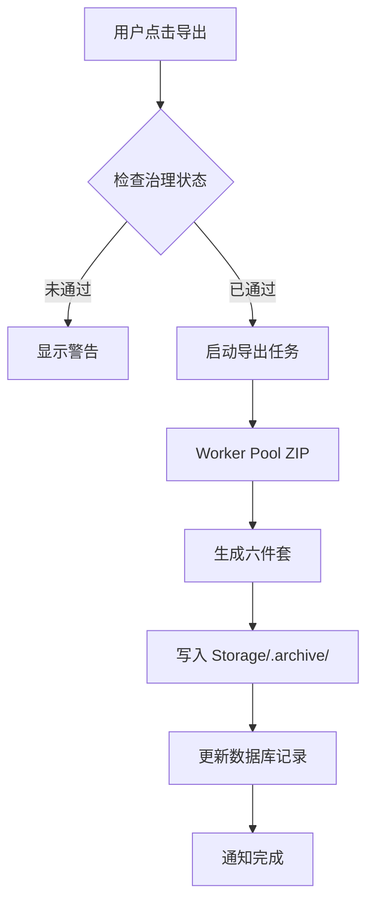

**导出实现**

```typescript
// electron/managers/ExportManager.ts
import { workerPool } from '../workers/WorkerPool';
import path from 'path';

export interface SixPackExport {
  readme: string;
  codebase: string;
  specs: string;
  guide: string;
  logs: string;
  assets: string;
}

export class ExportManager {
  constructor(
    private db: DatabaseManager,
    private fileManager: FileManager
  ) {}
  
  async exportSixPack(projectId: string): Promise<{ success: boolean; path?: string }> {
    // 1. 检查治理状态
    const governanceStatus = await this.checkGovernanceStatus(projectId);
    if (!governanceStatus.passed) {
      return { 
        success: false, 
        path: undefined 
      };
    }
    
    const project = this.getProject(projectId);
    const timestamp = Date.now();
    const exportDir = path.join(project.path, '.archive', `export-${timestamp}`);
    const zipPath = `${exportDir}.zip`;
    
    // 2. 准备导出内容
    const sixPack = await this.prepareSixPack(projectId);
    
    // 3. 写入临时目录
    await fs.mkdir(exportDir, { recursive: true });
    await fs.writeFile(path.join(exportDir, 'README.md'), sixPack.readme);
    await fs.writeFile(path.join(exportDir, 'CODEBASE.md'), sixPack.codebase);
    await fs.writeFile(path.join(exportDir, 'SPECS.md'), sixPack.specs);
    await fs.writeFile(path.join(exportDir, 'GUIDE.md'), sixPack.guide);
    await fs.writeFile(path.join(exportDir, 'LOGS.md'), sixPack.logs);
    
    // 4. 使用 Worker 打包
    await workerPool.executeTask('zip', {
      sourcePath: exportDir,
      outputPath: zipPath,
    });
    
    // 5. 清理临时目录
    await fs.rm(exportDir, { recursive: true });
    
    // 6. 记录导出历史
    this.db.prepare(`
      INSERT INTO exports (project_id, path, timestamp, governance_status)
      VALUES (?, ?, strftime('%s', 'now'), ?)
    `).run(projectId, zipPath, JSON.stringify(governanceStatus));
    
    return { success: true, path: zipPath };
  }
  
  private async prepareSixPack(projectId: string): Promise<SixPackExport> {
    const project = this.getProject(projectId);
    
    return {
      readme: await this.generateReadme(project),
      codebase: await this.generateCodebaseDoc(project),
      specs: await this.generateSpecs(project),
      guide: await this.generateGuide(project),
      logs: await this.generateLogs(project),
      assets: await this.collectAssets(project),
    };
  }
  
  private async checkGovernanceStatus(projectId: string): Promise<{ passed: boolean }> {
    // 检查最近的治理提案状态
    const stmt = this.db.prepare(`
      SELECT COUNT(*) as count FROM governance_audit
      WHERE project_id = ? AND status = 'approved'
      AND timestamp > strftime('%s', 'now', '-7 days')
    `);
    const result = stmt.get(projectId) as { count: number };
    
    return { passed: result.count > 0 };
  }
  
  // ... 其他生成方法
}
```

---

## 第 7 章：历史资产复用

### 7.1 考古成果汇总

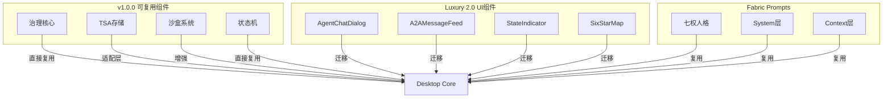

**考古发现清单**

| 来源 | 资产 | 状态 | 复用方式 |
|------|------|------|----------|
| v1.0.0 | Governance Core | ✅ 可用 | 直接引入 |
| v1.0.0 | TSA | ✅ 可用 | 适配层 |
| v1.0.0 | Sandbox | ✅ 可用 | 直接引入 |
| v1.0.0 | State Machine | ✅ 可用 | 直接引入 |
| Luxury 2.0 | UI Components | ✅ 已修复 | 迁移至 renderer |
| Luxury 2.0 | Hooks | ✅ 已修复 | 迁移至 renderer |
| Fabric | 七权人格 | ✅ 可用 | 复用 Prompts |

**引用**: [R-07-legacy-assets-analysis.md](./R-07-legacy-assets-analysis.md)

### 7.2 组件迁移方案

**迁移映射表**

| 原位置 | 新位置 | 修改内容 |
|--------|--------|----------|
| `src/components/ui/AgentChatDialog.tsx` | `renderer/components/ui/AgentChatDialog.tsx` | IPC 适配 |
| `src/components/ui/A2AMessageFeed.tsx` | `renderer/components/ui/A2AMessageFeed.tsx` | IPC 适配 |
| `src/components/ui/StateIndicator.tsx` | `renderer/components/ui/StateIndicator.tsx` | 无修改 |
| `src/components/ui/SixStarMap.tsx` | `renderer/components/ui/SixStarMap.tsx` | 无修改 |
| `src/hooks/useGovernance.ts` | `renderer/hooks/useGovernance.ts` | IPC 调用 |
| `src/hooks/useTSA.ts` | `renderer/hooks/useTSA.ts` | IPC 调用 |

**迁移后代码示例**

```typescript
// renderer/hooks/useGovernance.ts（迁移后）
import { useState, useCallback } from 'react';

export function useGovernance() {
  const [proposals, setProposals] = useState<Proposal[]>([]);
  
  const fetchProposals = useCallback(async () => {
    // 从 Main Process 获取
    const result = await window.electronAPI.governance.listProposals();
    setProposals(result.proposals);
  }, []);
  
  const createProposal = useCallback(async (data: CreateProposalData) => {
    const result = await window.electronAPI.governance.createProposal(data);
    return result;
  }, []);
  
  const vote = useCallback(async (proposalId: string, choice: VoteChoice) => {
    const result = await window.electronAPI.governance.vote(proposalId, choice);
    return result;
  }, []);
  
  return { proposals, fetchProposals, createProposal, vote };
}
```

### 7.3 样式资产提取

**七权主题变量**

```css
/* renderer/styles/theme.css */
:root {
  /* 七权角色色 */
  --color-orchestrator: #884499;  /* 客服小祥 */
  --color-architect: #669966;     /* 黄瓜睦 */
  --color-engineer: #FF9999;      /* 唐音 */
  --color-qa: #77BBDD;            /* 咕咕嘎嘎 */
  --color-pm: #FFDD88;            /* Soyorin */
  --color-audit: #7777AA;         /* 压力怪 */
  --color-doctor: #FFDD00;        /* 奶龙娘 */
  
  /* 功能色 */
  --color-success: #22c55e;
  --color-warning: #f59e0b;
  --color-error: #ef4444;
  --color-info: #3b82f6;
  
  /* 中性色 */
  --color-bg-primary: #0f0f0f;
  --color-bg-secondary: #1a1a1a;
  --color-bg-tertiary: #262626;
  --color-text-primary: #ffffff;
  --color-text-secondary: #a1a1aa;
  --color-text-tertiary: #71717a;
  --color-border: #27272a;
}

/* 呼吸动画 */
@keyframes breathe {
  0%, 100% { opacity: 0.6; }
  50% { opacity: 1; }
}

.role-breathe {
  animation: breathe 3s ease-in-out infinite;
}
```

### 7.4 迁移工作量估算

| 组件/模块 | 工作量 | 优先级 | 状态 |
|-----------|--------|--------|------|
| 治理核心 (Governance) | 2h | P0 | 直接复用 |
| TSA 适配层 | 4h | P0 | 需适配 |
| UI 组件迁移 | 8h | P1 | 6组件 |
| Hooks 迁移 | 4h | P1 | IPC适配 |
| 主题样式 | 2h | P2 | 提取复用 |
| **总计** | **20h** | | |

---

## 第 8 章：测试策略

### 8.1 测试金字塔

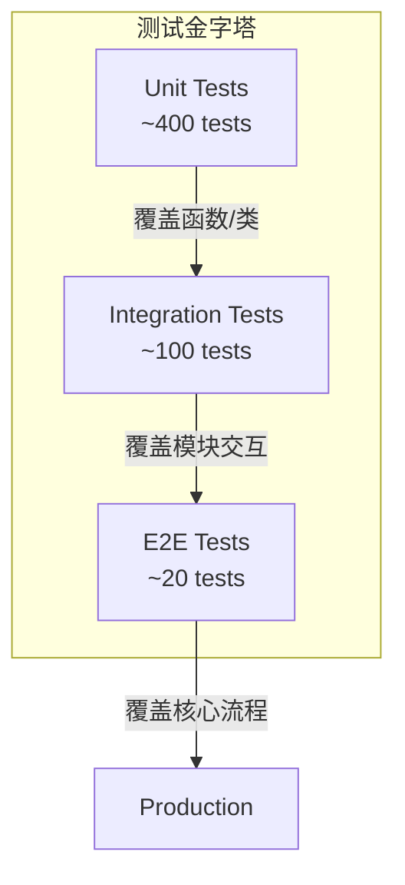

**测试分层**

| 层级 | 范围 | 工具 | 数量目标 |
|------|------|------|----------|
| Unit | 函数、类 | Jest | 400+ |
| Integration | 模块交互 | Jest + Supertest | 100+ |
| E2E | 完整流程 | Playwright | 20+ |

**引用**: [R-08-testing-strategy.md](./R-08-testing-strategy.md)

### 8.2 E2E 测试架构

```typescript
// tests/e2e/project.spec.ts
import { test, expect } from '@playwright/test';

test.describe('Project Management', () => {
  test('创建新项目', async ({ page }) => {
    await page.goto('app://editor');
    
    // 点击新建项目
    await page.click('[data-testid="new-project-btn"]');
    
    // 输入项目名称
    await page.fill('[data-testid="project-name-input"]', 'Test Project');
    await page.click('[data-testid="create-project-btn"]');
    
    // 验证项目打开
    await expect(page.locator('[data-testid="project-title"]'))
      .toHaveText('Test Project');
  });
  
  test('跨窗口拖拽文件', async ({ context, page }) => {
    // 打开两个项目窗口
    const page1 = await context.newPage();
    const page2 = await context.newPage();
    
    await page1.goto('app://editor?project=project-a');
    await page2.goto('app://editor?project=project-b');
    
    // 拖拽文件
    const file = page1.locator('[data-testid="file-item"]:has-text("test.ts")');
    const target = page2.locator('[data-testid="file-tree"]');
    
    await file.dragTo(target);
    
    // 验证文件出现在目标窗口
    await expect(page2.locator('[data-testid="file-item"]:has-text("test.ts")'))
      .toBeVisible();
  });
});
```

### 8.3 崩溃恢复测试

```typescript
// tests/e2e/crash-recovery.spec.ts
import { test, expect } from '@playwright/test';
import { app } from 'electron';

test.describe('Crash Recovery', () => {
  test('进程崩溃后恢复 Undo 栈', async ({ page }) => {
    // 1. 执行一些操作
    await page.goto('app://editor?project=test');
    await page.click('[data-testid="new-file-btn"]');
    await page.fill('[data-testid="filename-input"]', 'test.ts');
    await page.click('[data-testid="confirm-btn"]');
    
    // 2. 模拟进程崩溃（强制退出）
    await page.evaluate(() => {
      window.electronAPI.test.simulateCrash();
    });
    
    // 3. 重新启动应用
    await page.goto('app://editor?project=test');
    
    // 4. 验证 Undo 栈恢复
    await expect(page.locator('[data-testid="undo-btn"]')).toBeEnabled();
    
    // 5. 执行 Undo
    await page.click('[data-testid="undo-btn"]');
    
    // 6. 验证撤销成功
    await expect(page.locator('[data-testid="file-item"]:has-text("test.ts")'))
      .not.toBeVisible();
  });
  
  test('数据库损坏后自动修复', async ({ page }) => {
    // 1. 损坏数据库文件
    await page.evaluate(() => {
      window.electronAPI.test.corruptDatabase();
    });
    
    // 2. 重新启动
    await page.goto('app://editor?project=test');
    
    // 3. 验证自动修复
    await expect(page.locator('[data-testid="db-repair-notice"]'))
      .toContainText('数据库已自动修复');
  });
});
```

### 8.4 性能基准测试

```typescript
// tests/performance/file-loading.spec.ts
import { test, expect } from '@playwright/test';

test.describe('File Loading Performance', () => {
  test('10MB 文件加载 < 1s', async ({ page }) => {
    const startTime = Date.now();
    
    await page.goto('app://editor?project=test&file=10mb-file.ts');
    
    await page.waitForSelector('[data-testid="editor-ready"]');
    
    const loadTime = Date.now() - startTime;
    expect(loadTime).toBeLessThan(1000);
  });
  
  test('100MB 文件加载 < 3s', async ({ page }) => {
    const startTime = Date.now();
    
    await page.goto('app://editor?project=test&file=100mb-file.ts');
    
    await page.waitForSelector('[data-testid="editor-ready"]');
    
    const loadTime = Date.now() - startTime;
    expect(loadTime).toBeLessThan(3000);
  });
  
  test('搜索 10万行代码 < 100ms', async ({ page }) => {
    await page.goto('app://editor?project=large-project');
    
    const startTime = Date.now();
    
    await page.fill('[data-testid="search-input"]', 'function');
    await page.waitForSelector('[data-testid="search-results"]');
    
    const searchTime = Date.now() - startTime;
    expect(searchTime).toBeLessThan(100);
  });
});
```

**性能基准**

| 场景 | 目标 | 测试方法 |
|------|------|----------|
| 启动时间 | < 3s | E2E |
| 10MB 文件加载 | < 1s | E2E |
| 100MB 文件加载 | < 3s | E2E |
| 100万行搜索 | < 100ms | 性能测试 |
| ZIP 打包 1GB | < 30s | 性能测试 |

---

## 第 9 章：实施路线图

### 9.1 Phase A（基础设施）：2周

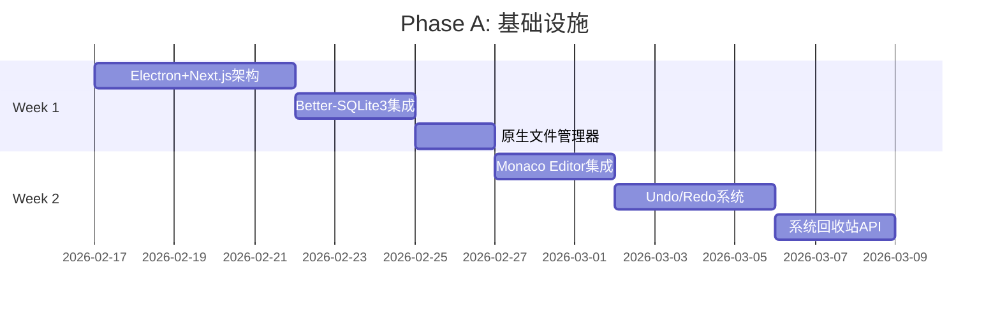

**Week 1 任务清单**

| 天数 | 任务 | 产出 |
|------|------|------|
| 1-2 | Electron + Next.js 混合架构搭建 | 可运行的基础框架 |
| 3-4 | Better-SQLite3 集成 | 数据库管理器 |
| 5 | 原生文件管理器 | FileManager 类 |
| 6-7 | Monaco Editor 基础集成 | 代码编辑器组件 |

**Week 2 任务清单**

| 天数 | 任务 | 产出 |
|------|------|------|
| 8-9 | Undo/Redo Command 模式 | UndoManager 类 |
| 10-11 | 系统回收站集成 | TrashManager 类 |
| 12-14 | 集成测试 & Bug 修复 | 通过基础测试 |

### 9.2 Phase B（性能满血）：1周

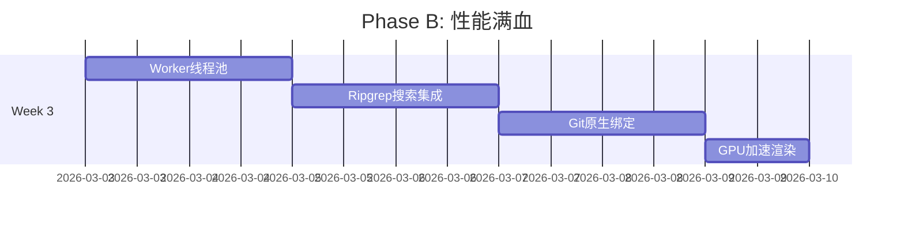

**Week 3 任务清单**

| 天数 | 任务 | 产出 |
|------|------|------|
| 15-16 | Worker Pool 实现 | WorkerPool 类 |
| 17-18 | Ripgrep 搜索集成 | SearchManager 类 |
| 19-20 | 原生 Git 绑定 | GitManager 类 |
| 21 | GPU 渲染优化 | 性能优化配置 |

### 9.3 Phase C（多开豪华）：1周

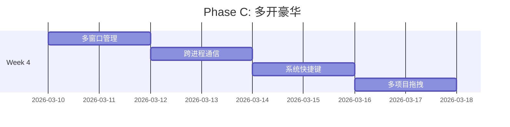

**Week 4 任务清单**

| 天数 | 任务 | 产出 |
|------|------|------|
| 22-23 | 多窗口管理 | WindowManager 类 |
| 24-25 | IPC 通信协议 | IPC 完整实现 |
| 26-27 | 系统快捷键 | GlobalShortcut |
| 28 | 多项目拖拽 | DragDropManager |

### 9.4 风险与缓解措施

| 风险 | 可能性 | 影响 | 缓解措施 |
|------|--------|------|----------|
| Better-SQLite3 原生编译失败 | 中 | 高 | 准备预编译二进制；使用 better-sqlite3-proxy 回退 |
| Monaco 大文件性能不达标 | 低 | 中 | 已实现分块加载策略；可降级到 CodeMirror 6 |
| 跨窗口 IPC 延迟过高 | 中 | 中 | 使用 SharedArrayBuffer 优化；限制跨窗口操作频率 |
| 与 v1.0.0 治理核心不兼容 | 低 | 高 | 提前进行集成测试；准备适配层 |
| Windows 回收站 API 差异 | 中 | 低 | 平台特定实现；macOS/Linux 使用 trash 模块 |

---

## 附录

### A. 引用文档

| 文档 | 路径 | 说明 |
|------|------|------|
| R-01 | [R-01-electron-nextjs-architecture.md](./R-01-electron-nextjs-architecture.md) | 架构设计 |
| R-02 | [R-02-storage-strategy.md](./R-02-storage-strategy.md) | 存储策略 |
| R-03 | [R-03-undo-system-design.md](./R-03-undo-system-design.md) | Undo 系统 |
| R-04 | [R-04-performance-monaco-workers.md](./R-04-performance-monaco-workers.md) | 性能优化 |
| R-05 | [R-05-multiwindow-ipc-design.md](./R-05-multiwindow-ipc-design.md) | 多窗口 |
| R-06 | [R-06-governance-integration-spec.md](./R-06-governance-integration-spec.md) | 治理集成 |
| R-07 | [R-07-legacy-assets-analysis.md](./R-07-legacy-assets-analysis.md) | 历史资产 |
| R-08 | [R-08-testing-strategy.md](./R-08-testing-strategy.md) | 测试策略 |

### B. 依赖清单

```json
{
  "dependencies": {
    "better-sqlite3": "^9.4.0",
    "chokidar": "^3.5.3",
    "electron": "^28.0.0",
    "monaco-editor": "^0.45.0",
    "simple-git": "^3.22.0",
    "archiver": "^6.0.0",
    "mmap-io": "^1.0.0"
  },
  "devDependencies": {
    "@playwright/test": "^1.40.0",
    "electron-builder": "^24.0.0"
  }
}
```

### C. 变更日志

| 版本 | 日期 | 变更 |
|------|------|------|
| v1.0.0 | 2026-02-14 | 初始版本，整合 R-01~R-08 |

---

**文档结束**

> 🐍♾️ Ouroboros Desktop - 通过分布式Agent的局部最优追求，实现系统级的自我改进涌现。
