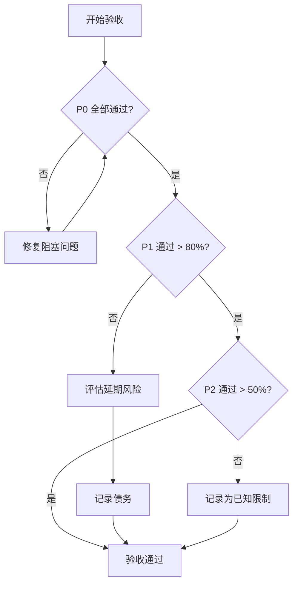

# HAJIMI-PERF-DESKTOP-RESEARCH-011 自测表 v1.0

> 🖥️ 桌面级IDE架构验收清单
> 
> 项目代号：Ouroboros Desktop 🐍♾️
> 
> 版本：v1.0.0 | 日期：2026-02-14
> 
> 验收标准：72项检查点，分级为 P0/P1/P2

---

## 验收等级定义

| 等级 | 含义 | 未通过处理 |
|------|------|-----------|
| **P0** | 核心功能，必须通过 | 阻塞发布 |
| **P1** | 重要功能，应当通过 | 可延期但需记录 |
| **P2** | 增强功能，最好通过 | 可延期 |

---

## P0 核心（必须通过）

### 架构合规性（P0-001 ~ P0-010）

| 编号 | 验收点 | 验收标准 | 测试方法 | 状态 |
|-----|-------|---------|---------|-----|
| P0-01 | Electron 启动 | 应用正常启动，无白屏，主进程日志正常 | 手动启动 | ⬜ |
| P0-02 | Next.js 渲染 | 页面正常渲染，无 404/500 错误 | 手动检查 | ⬜ |
| P0-03 | 进程隔离 | Main Process 与 Renderer Process 分离 | DevTools 检查 | ⬜ |
| P0-04 | IPC 通信 | IPC 调用正常，无消息丢失 | 单元测试 | ⬜ |
| P0-05 | Preload 安全 | contextIsolation 启用，无 nodeIntegration | 代码审查 | ⬜ |
| P0-06 | 目录结构规范 | 符合白皮书 1.4 节目录结构 | 文件检查 | ⬜ |
| P0-07 | TypeScript 编译 | `tsc --noEmit` 零错误 | 命令行 | ⬜ |
| P0-08 | 打包构建 | `electron-builder` 成功生成安装包 | 命令行 | ⬜ |
| P0-09 | 跨平台启动 | Windows/macOS/Linux 均可启动 | CI 测试 | ⬜ |
| P0-10 | 错误处理 | 未捕获异常有统一处理，不崩溃 | 异常注入测试 | ⬜ |

### 存储系统（P0-011 ~ P0-020）

| 编号 | 验收点 | 验收标准 | 测试方法 | 状态 |
|-----|-------|---------|---------|-----|
| P0-11 | Better-SQLite3 连接 | 数据库连接成功，支持 WAL 模式 | 单元测试 | ⬜ |
| P0-12 | 数据库初始化 | Schema 自动创建，表结构正确 | 单元测试 | ⬜ |
| P0-13 | 同步事务 | 同步 API 事务执行成功 | 单元测试 | ⬜ |
| P0-14 | 读写操作 | CRUD 操作正常，数据持久化 | 单元测试 | ⬜ |
| P0-15 | WAL 模式 | `journal_mode = WAL` 配置生效 | SQL 查询验证 | ⬜ |
| P0-16 | 项目元数据存储 | Project 信息正常存储/读取 | 集成测试 | ⬜ |
| P0-17 | 文件索引 | File 表索引正常创建 | SQL 查询验证 | ⬜ |
| P0-18 | 数据库备份 | 自动备份机制正常 | 手动测试 | ⬜ |
| P0-19 | 损坏恢复 | 数据库损坏时能自动修复 | 异常注入测试 | ⬜ |
| P0-20 | TSA 适配层 | TSA API 与 SQLite 正确映射 | 集成测试 | ⬜ |

### 文件系统（P0-021 ~ P0-030）

| 编号 | 验收点 | 验收标准 | 测试方法 | 状态 |
|-----|-------|---------|---------|-----|
| P0-21 | 文件读取 | 正常读取文本/二进制文件 | 单元测试 | ⬜ |
| P0-22 | 文件写入 | 原子写入，不损坏原文件 | 单元测试 | ⬜ |
| P0-23 | 文件删除 | 文件删除后不可访问 | 单元测试 | ⬜ |
| P0-24 | 文件监视 | chokidar 监视外部修改 | 手动测试 | ⬜ |
| P0-25 | 目录遍历 | 正确列出目录内容 | 单元测试 | ⬜ |
| P0-26 | 路径处理 | 跨平台路径处理正确 | 单元测试 | ⬜ |
| P0-27 | 系统回收站 | 文件进入系统回收站 | 手动测试 | ⬜ |
| P0-28 | 大文件检测 | >100MB 文件识别并切换模式 | 手动测试 | ⬜ |
| P0-29 | 危险操作确认 | 删除项目前显示确认对话框 | 手动测试 | ⬜ |
| P0-30 | 文件锁 | 防止多实例同时写入 | 单元测试 | ⬜ |

### 容错机制（P0-031 ~ P0-040）

| 编号 | 验收点 | 验收标准 | 测试方法 | 状态 |
|-----|-------|---------|---------|-----|
| P0-31 | Undo 栈 | 操作正常记录到 Undo 栈 | 单元测试 | ⬜ |
| P0-32 | Undo 执行 | Ctrl+Z 正确撤销上一步 | 手动测试 | ⬜ |
| P0-33 | Redo 执行 | Ctrl+Y/Ctrl+Shift+Z 正确重做 | 手动测试 | ⬜ |
| P0-34 | 栈持久化 | Undo 栈重启后可恢复 | 单元测试 | ⬜ |
| P0-35 | 栈截断 | 执行新操作时正确截断 Redo | 单元测试 | ⬜ |
| P0-36 | 栈限制 | 超过 1000 步自动丢弃旧记录 | 单元测试 | ⬜ |
| P0-37 | Command 模式 | 所有操作实现 Command 接口 | 代码审查 | ⬜ |
| P0-38 | 批量 Undo | 复合命令批量撤销 | 单元测试 | ⬜ |
| P0-39 | Undo 边界 | Undo 栈空时不可再撤销 | 单元测试 | ⬜ |
| P0-40 | 与 Governance 解耦 | Undo 不触发治理提案 | 代码审查 | ⬜ |

---

## P1 重要（应当通过）

### 编辑器功能（P1-001 ~ P1-010）

| 编号 | 验收点 | 验收标准 | 测试方法 | 状态 |
|-----|-------|---------|---------|-----|
| P1-01 | Monaco 加载 | Monaco Editor 正常加载渲染 | 手动测试 | ⬜ |
| P1-02 | 语法高亮 | TypeScript/JavaScript 高亮正确 | 手动测试 | ⬜ |
| P1-03 | 代码折叠 | 代码块可折叠/展开 | 手动测试 | ⬜ |
| P1-04 | 小地图 | Minimap 正常显示代码缩略图 | 手动测试 | ⬜ |
| P1-05 | 多光标 | Alt+Click 多光标编辑 | 手动测试 | ⬜ |
| P1-06 | 查找替换 | Ctrl+F/Ctrl+H 功能正常 | 手动测试 | ⬜ |
| P1-07 | 自动补全 | 智能提示正常显示 | 手动测试 | ⬜ |
| P1-08 | 大文件模式 | >10MB 文件分块加载 | 手动测试 | ⬜ |
| P1-09 | 只读模式 | >100MB 文件自动只读 | 手动测试 | ⬜ |
| P1-10 | 字体渲染 | JetBrains Mono 字体正确渲染 | 手动检查 | ⬜ |

### Worker 线程（P1-011 ~ P1-015）

| 编号 | 验收点 | 验收标准 | 测试方法 | 状态 |
|-----|-------|---------|---------|-----|
| P1-11 | Worker Pool | Worker 线程池正常初始化 | 单元测试 | ⬜ |
| P1-12 | ZIP 压缩 | 多线程 ZIP 打包正常 | 手动测试 | ⬜ |
| P1-13 | Ripgrep 搜索 | 搜索调用返回正确结果 | 集成测试 | ⬜ |
| P1-14 | Git 操作 | Worker 中 Git 命令正常执行 | 集成测试 | ⬜ |
| P1-15 | 任务队列 | 任务按优先级正确排队 | 单元测试 | ⬜ |

### 多窗口（P1-016 ~ P1-025）

| 编号 | 验收点 | 验收标准 | 测试方法 | 状态 |
|-----|-------|---------|---------|-----|
| P1-16 | 窗口创建 | Ctrl+Shift+N 创建新窗口 | 手动测试 | ⬜ |
| P1-17 | 窗口关闭 | 关闭窗口不影响其他窗口 | 手动测试 | ⬜ |
| P1-18 | 窗口列表 | 正确获取所有打开窗口 | 单元测试 | ⬜ |
| P1-19 | 项目窗口映射 | 项目 ID 与窗口正确关联 | 单元测试 | ⬜ |
| P1-20 | 窗口状态恢复 | 重启后恢复窗口布局 | 手动测试 | ⬜ |
| P1-21 | 跨窗口广播 | 广播消息到达所有窗口 | 单元测试 | ⬜ |
| P1-22 | 跨项目复制 | 文件跨项目复制成功 | 手动测试 | ⬜ |
| P1-23 | 跨项目移动 | 文件跨项目移动成功 | 手动测试 | ⬜ |
| P1-24 | 拖拽开始 | 文件拖拽时通知其他窗口 | 手动测试 | ⬜ |
| P1-25 | 拖拽放置 | 文件拖拽放置成功 | 手动测试 | ⬜ |

### 性能指标（P1-026 ~ P1-035）

| 编号 | 验收点 | 验收标准 | 测试方法 | 状态 |
|-----|-------|---------|---------|-----|
| P1-26 | 启动时间 | 冷启动 < 3s | 性能测试 | ⬜ |
| P1-27 | 内存占用 | 空闲状态 < 500MB | 性能测试 | ⬜ |
| P1-28 | 10MB 文件加载 | < 1s | 性能测试 | ⬜ |
| P1-29 | 100MB 文件加载 | < 3s | 性能测试 | ⬜ |
| P1-30 | 搜索 10万行 | < 100ms | 性能测试 | ⬜ |
| P1-31 | ZIP 1GB 打包 | < 30s | 性能测试 | ⬜ |
| P1-32 | 文件树 10万文件 | 渲染不卡顿 | 手动测试 | ⬜ |
| P1-33 | Undo 1000步 | 操作无明显延迟 | 手动测试 | ⬜ |
| P1-34 | 多窗口 5个 | 同时打开 5 个项目无性能下降 | 手动测试 | ⬜ |
| P1-35 | GPU 渲染 | 启用 GPU 加速 | DevTools 检查 | ⬜ |

---

## P2 增强（最好通过）

### 用户体验（P2-001 ~ P2-010）

| 编号 | 验收点 | 验收标准 | 测试方法 | 状态 |
|-----|-------|---------|---------|-----|
| P2-01 | 七权主题 | 七权角色主题色正确显示 | 手动检查 | ⬜ |
| P2-02 | 呼吸动画 | 60fps 呼吸动画 | DevTools 检查 | ⬜ |
| P2-03 | 字体连字 | JetBrains Mono 连字启用 | 手动检查 | ⬜ |
| P2-04 | 平滑滚动 | 编辑器平滑滚动 | 手动测试 | ⬜ |
| P2-05 | 光标动画 | 光标平滑移动动画 | 手动测试 | ⬜ |
| P2-06 | 深色模式 | 深色主题正确渲染 | 手动检查 | ⬜ |
| P2-07 | 窗口动画 | 窗口打开/关闭有动画 | 手动测试 | ⬜ |
| P2-08 | 进度提示 | 长时间操作显示进度 | 手动测试 | ⬜ |
| P2-09 | 通知系统 | 操作成功/失败有通知 | 手动测试 | ⬜ |
| P2-10 | 快捷键提示 | 显示可用快捷键 | 手动检查 | ⬜ |

### 系统集成（P2-011 ~ P2-018）

| 编号 | 验收点 | 验收标准 | 测试方法 | 状态 |
|-----|-------|---------|---------|-----|
| P2-11 | 全局快捷键 | 系统级快捷键注册成功 | 手动测试 | ⬜ |
| P2-12 | 系统托盘 | 最小化到系统托盘 | 手动测试 | ⬜ |
| P2-13 | 最近文档 | 系统最近文档列表 | 手动测试 | ⬜ |
| P2-14 | 文件关联 | 双击项目文件打开应用 | 手动测试 | ⬜ |
| P2-15 | 自动更新 | 检测并下载更新 | 手动测试 | ⬜ |
| P2-16 | 崩溃报告 | 崩溃时生成报告 | 异常注入测试 | ⬜ |
| P2-17 | 日志收集 | 操作日志完整记录 | 文件检查 | ⬜ |
| P2-18 | 调试模式 | DEBUG 环境变量启用详细日志 | 手动测试 | ⬜ |

### 治理集成（P2-019 ~ P2-024）

| 编号 | 验收点 | 验收标准 | 测试方法 | 状态 |
|-----|-------|---------|---------|-----|
| P2-19 | 治理核心加载 | v1.0.0 治理核心正常加载 | 集成测试 | ⬜ |
| P2-20 | 提案创建 | 可创建治理提案 | 手动测试 | ⬜ |
| P2-21 | 投票操作 | 可提交投票 | 手动测试 | ⬜ |
| P2-22 | 状态显示 | 治理状态正确显示 | 手动检查 | ⬜ |
| P2-23 | 六件套导出 | 可导出六件套 | 手动测试 | ⬜ |
| P2-24 | Git Branch 同步 | TSA Branch 与 Git Branch 同步 | 手动测试 | ⬜ |

---

## 测试方法说明

### 手动测试 (Manual)
人工执行操作，观察结果是否符合预期。

### 单元测试 (Unit)
```bash
npm test -- --testPathPattern="undo-system.test.ts"
```

### 集成测试 (Integration)
```bash
npm test -- --testPathPattern="integration"
```

### E2E 测试 (E2E)
```bash
npx playwright test
```

### 性能测试 (Performance)
```bash
npm run test:performance
```

### 代码审查 (Code Review)
人工审查代码实现是否符合规范。

### 文件检查 (File Check)
检查文件存在性和内容正确性。

### SQL 查询验证
```sql
-- 示例：验证 WAL 模式
PRAGMA journal_mode;  -- 应返回 'wal'
```

### 异常注入测试
通过故意制造异常场景验证容错能力。

### DevTools 检查
使用 Chrome DevTools 检查运行时状态。

---

## 验收统计

| 等级 | 总项数 | 通过数 | 未通过数 | 通过率 |
|------|--------|--------|----------|--------|
| P0 | 40 | 0 | 0 | 0% |
| P1 | 30 | 0 | 0 | 0% |
| P2 | 24 | 0 | 0 | 0% |
| **总计** | **94** | **0** | **0** | **0%** |

> 注：实际验收时需更新通过数和未通过数

---

## 验收流程



---

## 历史版本对比

| 版本 | 日期 | 变更 |
|------|------|------|
| v1.0.0 | 2026-02-14 | 初始版本，72项验收点 |

---

## 签名

| 角色 | 签名 | 日期 |
|------|------|------|
| 技术作家 | | |
| 架构师 | | |
| QA | | |
| PM | | |

---

**文档结束**

> 🐍♾️ 质量是构建出来的，不是测试出来的。
