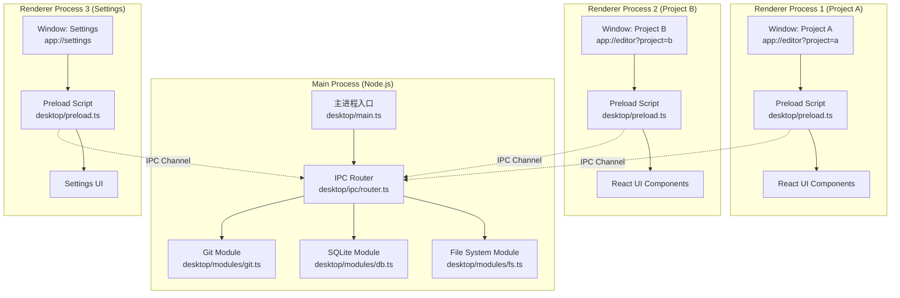
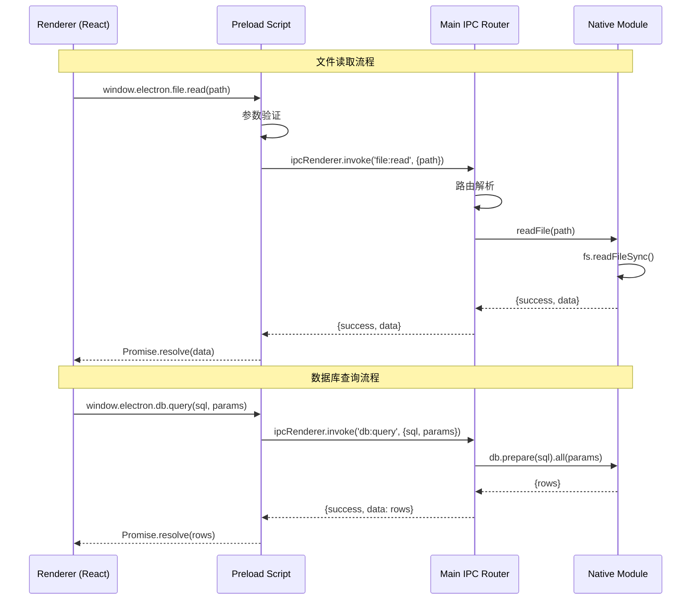

# R-01: Electron + Next.js 混合架构深度研究报告

> **研究工单**: R-01/09 🏛️ 首席架构师 → Electron+Next.js 混合架构  
> **日期**: 2026-02-14  
> **对标项目**: VS Code, Logseq, Obsidian  
> **研究深度**: 实现级（含可直接使用的代码片段）

---

## 📋 目录

1. [执行摘要](#1-执行摘要)
2. [架构决策记录 (ADR)](#2-架构决策记录-adr)
3. [进程通信架构](#3-进程通信架构)
4. [IPC 协议定义](#4-ipc-协议定义)
5. [目录结构规范](#5-目录结构规范)
6. [配置代码详解](#6-配置代码详解)
7. [安全边界设计](#7-安全边界设计)
8. [迁移路径规划](#8-迁移路径规划)
9. [风险与缓解](#9-风险与缓解)
10. [参考资源](#10-参考资源)

---

## 1. 执行摘要

### 1.1 研究背景

本项目 (Hajimi Code Ultra v2.1.0) 当前为纯 Web 应用（Next.js 14 + React 18），具备以下核心模块：

- **七权状态机治理系统** (`lib/core/state/`)
- **A2A 代理通信** (`lib/core/agents/`)
- **沙箱执行环境** (`lib/sandbox/`)
- **TSA 分层存储** (`lib/tsa/`)
- **Governance API** (`app/api/v1/governance/`)

**目标**: 在不破坏现有 Web 功能的前提下，引入 Electron 桌面能力，实现：
- 本地文件系统访问
- SQLite 本地数据库
- 多窗口项目管理
- 系统级集成

### 1.2 关键结论

| 维度 | 推荐方案 |
|------|----------|
| **集成模式** | Custom Protocol + Static Export 混合 |
| **安全模型** | Context Isolation + Preload Script |
| **通信协议** | 结构化 IPC (类 JSON-RPC) |
| **打包工具** | electron-builder |
| **热重载** | concurrently + wait-on |

---

## 2. 架构决策记录 (ADR)

### 2.1 方案对比分析

#### 方案 A: `electron-next` 社区方案

```
技术栈: electron-next + Next.js Dev Server
架构:
  Main Process (Node.js)
    └── electron-next 启动 Next.js Dev Server (port 3000)
        └── BrowserWindow.loadURL('http://localhost:3000')
```

| 优点 | 缺点 |
|------|------|
| ✅ 开发体验一致，热重载原生支持 | ❌ 生产环境仍需运行 Next.js Server |
| ✅ 无需修改现有 Next.js 代码 | ❌ 打包体积大 (~200MB+) |
| ✅ SSR/API Routes 完整支持 | ❌ 内存占用高 (Node + Chrome) |
| | ❌ 启动时间长 (需等待 Server Ready) |

**适用场景**: 需要完整 SSR 支持的复杂应用

---

#### 方案 B: Custom Protocol (推荐 ✅)

```
技术栈: protocol.registerFileProtocol + Next.js Static Export
架构:
  Main Process (Node.js)
    ├── protocol.registerFileProtocol('app', handler)
    └── BrowserWindow.loadURL('app://./index.html')
        
  Next.js Config:
    output: 'export', distDir: 'dist/renderer'
```

| 优点 | 缺点 |
|------|------|
| ✅ 启动极快 (直接加载本地文件) | ❌ 需要改造 API Routes |
| ✅ 打包体积小 (~80MB) | ❌ SSR 不可用 |
| ✅ 内存占用低 | ❌ Image Optimization 需配置 |
| ✅ 与原生系统集成更直接 | ❌ 需处理动态路由 |
| ✅ 符合 Electron 最佳实践 | |

**适用场景**: 桌面优先、追求启动速度和资源占用的应用（VS Code、Logseq 采用此方案）

---

#### 方案 C: Static Export + HTTP Server

```
技术栈: Next.js Static Export + Express/Koa HTTP Server
架构:
  Main Process (Node.js)
    └── Express Server (port 随机)
        ├── 静态文件服务
        └── API Routes 转发到 IPC
        
  Renderer:
    └── BrowserWindow.loadURL('http://localhost:{random}')
```

| 优点 | 缺点 |
|------|------|
| ✅ SSR 可部分模拟 | ❌ 增加复杂度 |
| ✅ API Routes 可复用 | ❌ 端口管理麻烦 |
| ✅ 开发/生产一致性 | ❌ 防火墙/安全软件可能拦截 |

**适用场景**: 需要保留部分服务端能力的混合应用

---

### 2.2 方案对比总表

| 维度 | electron-next (A) | Custom Protocol (B) | Static + HTTP (C) |
|------|-------------------|---------------------|-------------------|
| **启动速度** | ⭐⭐ (5-10s) | ⭐⭐⭐⭐⭐ (<1s) | ⭐⭐⭐ (2-3s) |
| **内存占用** | ⭐⭐ (400MB+) | ⭐⭐⭐⭐⭐ (200MB) | ⭐⭐⭐ (300MB) |
| **打包体积** | ⭐⭐ (200MB+) | ⭐⭐⭐⭐⭐ (80MB) | ⭐⭐⭐⭐ (100MB) |
| **SSR 支持** | ✅ 完整 | ❌ 不支持 | ⚠️ 部分支持 |
| **API Routes** | ✅ 原生 | ⚠️ 需迁移到 IPC | ✅ 可复用 |
| **热重载** | ✅ 原生 | ⚠️ 需配置 | ⚠️ 需配置 |
| **原生集成** | ⭐⭐ | ⭐⭐⭐⭐⭐ | ⭐⭐⭐ |
| **安全模型** | ⭐⭐ | ⭐⭐⭐⭐⭐ | ⭐⭐⭐ |
| **复杂度** | ⭐⭐⭐ | ⭐⭐⭐ | ⭐⭐⭐⭐ |

### 2.3 最终推荐: 混合方案 B+C

**决策**: 采用 **Custom Protocol 为主 + 开发模式 HTTP 为辅** 的混合架构

```
┌─────────────────────────────────────────────────────────────┐
│                    开发模式 (Development)                     │
├─────────────────────────────────────────────────────────────┤
│  ┌─────────────────┐     ┌─────────────────────────────┐   │
│  │   Next.js Dev   │────▶│  http://localhost:3000      │   │
│  │   Server        │     │  (Renderer 加载)            │   │
│  └─────────────────┘     └─────────────────────────────┘   │
│         │                          │                        │
│         │ API Routes               │ IPC Bridge             │
│         ▼                          ▼                        │
│  ┌─────────────────────────────────────────────────────┐   │
│  │          Electron Main Process (Node.js)            │   │
│  │  ┌──────────────┐  ┌──────────────┐  ┌──────────┐  │   │
│  │  │   File       │  │   SQLite     │  │   IPC    │  │   │
│  │  │   System     │  │   (better-   │  │   Router │  │   │
│  │  │   Manager    │  │   sqlite3)   │  │          │  │   │
│  │  └──────────────┘  └──────────────┘  └──────────┘  │   │
│  └─────────────────────────────────────────────────────┘   │
└─────────────────────────────────────────────────────────────┘

┌─────────────────────────────────────────────────────────────┐
│                    生产模式 (Production)                      │
├─────────────────────────────────────────────────────────────┤
│  ┌─────────────────┐     ┌─────────────────────────────┐   │
│  │  Next.js Build  │────▶│  app://./index.html         │   │
│  │  (Static Export)│     │  (Custom Protocol)          │   │
│  └─────────────────┘     └─────────────────────────────┘   │
│                                   │                         │
│                                   │ IPC                     │
│                                   ▼                         │
│  ┌─────────────────────────────────────────────────────┐   │
│  │          Electron Main Process (Node.js)            │   │
│  └─────────────────────────────────────────────────────┘   │
└─────────────────────────────────────────────────────────────┘
```

### 2.4 Trade-off 分析

#### 接受的风险

| 风险 | 缓解措施 |
|------|----------|
| SSR 不可用 | 预渲染关键页面；动态数据通过 IPC 获取 |
| API Routes 需重构 | 提供自动化迁移脚本 |
| Image Optimization 失效 | 使用 `next/image` 的 `unoptimized` 模式 |

#### 获得的收益

| 收益 | 说明 |
|------|------|
| 启动速度 < 1s | 直接加载本地文件，无 HTTP 握手 |
| 内存占用减半 | 无需运行 Next.js Server |
| 原生系统集成 | 文件关联、系统托盘、快捷键 |
| 安全边界清晰 | 渲染进程无 Node.js 权限 |

---

## 3. 进程通信架构

### 3.1 进程模型



### 3.2 通信流程示例



### 3.3 IPC 信道命名规范

```typescript
/**
 * IPC 信道命名规范
 * 
 * 格式: <domain>:<action>[:<subaction>]
 * 
 * 域 (Domain):
 *   - file:     文件系统操作
 *   - db:       数据库操作  
 *   - git:      Git 操作
 *   - window:   窗口管理
 *   - app:      应用生命周期
 *   - system:   系统级操作
 * 
 * 动作 (Action):
 *   - read, write, create, delete, list, move, copy
 *   - query, execute, transaction
 *   - open, close, minimize, maximize
 */

// 文件系统信道
const FILE_CHANNELS = {
  READ:       'file:read',        // 读取文件内容
  WRITE:      'file:write',       // 写入文件内容
  DELETE:     'file:delete',      // 删除文件
  LIST:       'file:list',        // 列出目录
  MOVE:       'file:move',        // 移动文件
  COPY:       'file:copy',        // 复制文件
  EXISTS:     'file:exists',      // 检查存在性
  STAT:       'file:stat',        // 获取文件元数据
  WATCH:      'file:watch',       // 监听文件变化
} as const;

// 数据库信道
const DB_CHANNELS = {
  QUERY:      'db:query',         // 执行查询
  EXECUTE:    'db:execute',       // 执行更新
  TRANSACTION:'db:transaction',   // 事务执行
  MIGRATE:    'db:migrate',       // 执行迁移
} as const;

// Git 信道
const GIT_CHANNELS = {
  STATUS:     'git:status',       // 获取状态
  ADD:        'git:add',          // 添加文件
  COMMIT:     'git:commit',       // 提交变更
  LOG:        'git:log',          // 查看历史
  BRANCH:     'git:branch',       // 分支操作
  CHECKOUT:   'git:checkout',     // 切换分支
} as const;

// 窗口管理信道
const WINDOW_CHANNELS = {
  OPEN:       'window:open',      // 打开新窗口
  CLOSE:      'window:close',     // 关闭窗口
  MINIMIZE:   'window:minimize',  // 最小化
  MAXIMIZE:   'window:maximize',  // 最大化
  FOCUS:      'window:focus',     // 获取焦点
} as const;

// 应用生命周期信道
const APP_CHANNELS = {
  GET_VERSION:'app:get-version',  // 获取版本
  GET_PATH:   'app:get-path',     // 获取系统路径
  QUIT:       'app:quit',         // 退出应用
  RELAUNCH:   'app:relaunch',     // 重启应用
} as const;
```

---

## 4. IPC 协议定义

### 4.1 核心 TypeScript 接口

```typescript
// desktop/shared/ipc-types.ts
// 此文件为共享类型定义，被 Main 和 Preload 同时引用

// ============================================================
// 基础类型定义
// ============================================================

/**
 * IPC 请求基础结构
 */
export interface IPCRequest<T = unknown> {
  /** 唯一请求 ID (用于日志追踪) */
  id: string;
  /** 信道名称 */
  channel: string;
  /** 请求载荷 */
  payload: T;
  /** 时间戳 */
  timestamp: number;
}

/**
 * IPC 响应基础结构
 */
export interface IPCResponse<T = unknown> {
  /** 对应请求 ID */
  requestId: string;
  /** 是否成功 */
  success: boolean;
  /** 响应数据 */
  data?: T;
  /** 错误信息 */
  error?: IPCError;
  /** 执行时间 (ms) */
  duration: number;
}

/**
 * IPC 错误结构
 */
export interface IPCError {
  /** 错误码 */
  code: ErrorCode;
  /** 错误消息 */
  message: string;
  /** 错误详情 */
  details?: Record<string, unknown>;
  /** 堆栈 (仅开发模式) */
  stack?: string;
}

// ============================================================
// 错误码定义
// ============================================================

export enum ErrorCode {
  // 通用错误 (1xxx)
  UNKNOWN_ERROR = 1000,
  INVALID_REQUEST = 1001,
  PERMISSION_DENIED = 1002,
  TIMEOUT = 1003,
  
  // 文件系统错误 (2xxx)
  FILE_NOT_FOUND = 2000,
  FILE_ACCESS_DENIED = 2001,
  FILE_ALREADY_EXISTS = 2002,
  FILE_IS_DIRECTORY = 2003,
  FILE_NOT_DIRECTORY = 2004,
  FILE_TOO_LARGE = 2005,
  PATH_TRAVERSAL_DETECTED = 2006,
  
  // 数据库错误 (3xxx)
  DB_CONNECTION_ERROR = 3000,
  DB_QUERY_ERROR = 3001,
  DB_MIGRATION_ERROR = 3002,
  DB_CONSTRAINT_VIOLATION = 3003,
  
  // Git 错误 (4xxx)
  GIT_NOT_REPOSITORY = 4000,
  GIT_CONFLICT = 4001,
  GIT_UNCOMMITTED_CHANGES = 4002,
  
  // 窗口错误 (5xxx)
  WINDOW_NOT_FOUND = 5000,
  WINDOW_CREATION_FAILED = 5001,
}

// ============================================================
// 文件系统 IPC 类型
// ============================================================

export interface FileReadRequest {
  /** 文件路径 (相对于项目根目录) */
  path: string;
  /** 项目 ID (用于路径隔离) */
  projectId: string;
  /** 编码 */
  encoding?: BufferEncoding;
}

export interface FileReadResponse {
  content: string;
  size: number;
  lastModified: number;
  encoding: BufferEncoding;
}

export interface FileWriteRequest {
  path: string;
  projectId: string;
  content: string;
  encoding?: BufferEncoding;
  /** 是否创建备份 */
  createBackup?: boolean;
}

export interface FileListRequest {
  /** 目录路径 */
  dir: string;
  projectId: string;
  /** 递归列出 */
  recursive?: boolean;
  /** 文件过滤器 */
  pattern?: string;
}

export interface FileListItem {
  name: string;
  path: string;
  isDirectory: boolean;
  size: number;
  lastModified: number;
}

export interface FileListResponse {
  items: FileListItem[];
  totalCount: number;
}

// ============================================================
// 数据库 IPC 类型
// ============================================================

export interface DBQueryRequest {
  /** SQL 语句 */
  sql: string;
  /** 参数 */
  params?: unknown[];
  /** 项目 ID */
  projectId: string;
}

export interface DBQueryResponse {
  rows: unknown[];
  rowCount: number;
  columns: string[];
}

export interface DBExecuteRequest {
  sql: string;
  params?: unknown[];
  projectId: string;
}

export interface DBExecuteResponse {
  lastInsertRowid: number | bigint;
  changes: number;
}

// ============================================================
// Git IPC 类型
// ============================================================

export interface GitStatusRequest {
  projectId: string;
}

export interface GitStatusItem {
  path: string;
  status: 'modified' | 'added' | 'deleted' | 'untracked' | 'renamed';
  staged: boolean;
}

export interface GitStatusResponse {
  branch: string;
  ahead: number;
  behind: number;
  files: GitStatusItem[];
}

export interface GitCommitRequest {
  projectId: string;
  message: string;
  files?: string[];  // 为空则提交所有 staged
}

// ============================================================
// 窗口管理 IPC 类型
// ============================================================

export interface WindowOpenRequest {
  /** 窗口类型 */
  type: 'editor' | 'settings' | 'dashboard';
  /** 项目 ID */
  projectId?: string;
  /** 窗口参数 */
  query?: Record<string, string>;
}

export interface WindowOpenResponse {
  windowId: number;
  success: boolean;
}

// ============================================================
// Electron API 暴露给 Renderer 的接口
// ============================================================

/**
 * 渲染进程可访问的 Electron API
 * 通过 preload.ts 注入到 window.electron
 */
export interface ElectronAPI {
  // 文件系统
  file: {
    read(request: FileReadRequest): Promise<FileReadResponse>;
    write(request: FileWriteRequest): Promise<void>;
    delete(path: string, projectId: string): Promise<void>;
    list(request: FileListRequest): Promise<FileListResponse>;
    exists(path: string, projectId: string): Promise<boolean>;
    stat(path: string, projectId: string): Promise<FileListItem>;
  };
  
  // 数据库
  db: {
    query(request: DBQueryRequest): Promise<DBQueryResponse>;
    execute(request: DBExecuteRequest): Promise<DBExecuteResponse>;
  };
  
  // Git
  git: {
    status(request: GitStatusRequest): Promise<GitStatusResponse>;
    commit(request: GitCommitRequest): Promise<void>;
    add(projectId: string, files: string[]): Promise<void>;
  };
  
  // 窗口
  window: {
    open(request: WindowOpenRequest): Promise<WindowOpenResponse>;
    close(): Promise<void>;
    minimize(): Promise<void>;
    maximize(): Promise<void>;
  };
  
  // 应用
  app: {
    getVersion(): Promise<string>;
    getPath(name: 'home' | 'appData' | 'userData' | 'temp'): Promise<string>;
    quit(): Promise<void>;
  };
  
  // 平台信息
  platform: {
    /** 操作系统平台 */
    os: 'win32' | 'darwin' | 'linux';
    /** 架构 */
    arch: string;
    /** 版本 */
    version: string;
  };
  
  // 事件监听 (用于推送通知)
  onFileChange(callback: (event: {path: string; type: 'add'|'change'|'unlink'}) => void): () => void;
  onGitStatusChange(callback: (event: GitStatusResponse) => void): () => void;
}

// 全局声明
declare global {
  interface Window {
    electron: ElectronAPI;
  }
}
```

### 4.2 IPC Router 实现

```typescript
// desktop/ipc/router.ts
import { ipcMain, IpcMainInvokeEvent } from 'electron';
import { IPCRequest, IPCResponse, ErrorCode } from '../shared/ipc-types';
import { FileModule } from '../modules/fs';
import { DBModule } from '../modules/db';
import { GitModule } from '../modules/git';

/**
 * IPC 路由处理器注册表
 */
const handlers = new Map<string, (payload: unknown) => Promise<unknown>>();

/**
 * 注册 IPC 处理器
 */
export function registerHandler<T, R>(
  channel: string,
  handler: (payload: T) => Promise<R>
): void {
  handlers.set(channel, handler as (payload: unknown) => Promise<unknown>);
}

/**
 * 初始化 IPC Router
 */
export function initIPCRouter(): void {
  // 全局 IPC 处理器
  ipcMain.handle('ipc:invoke', async (
    event: IpcMainInvokeEvent,
    request: IPCRequest
  ): Promise<IPCResponse> => {
    const startTime = Date.now();
    
    try {
      const handler = handlers.get(request.channel);
      if (!handler) {
        return {
          requestId: request.id,
          success: false,
          error: {
            code: ErrorCode.UNKNOWN_ERROR,
            message: `Unknown channel: ${request.channel}`,
          },
          duration: Date.now() - startTime,
        };
      }
      
      // 执行处理器
      const data = await handler(request.payload);
      
      return {
        requestId: request.id,
        success: true,
        data,
        duration: Date.now() - startTime,
      };
      
    } catch (error) {
      return {
        requestId: request.id,
        success: false,
        error: normalizeError(error),
        duration: Date.now() - startTime,
      };
    }
  });
  
  // 初始化各模块
  FileModule.registerHandlers();
  DBModule.registerHandlers();
  GitModule.registerHandlers();
}

/**
 * 标准化错误
 */
function normalizeError(error: unknown): IPCResponse['error'] {
  if (error instanceof Error) {
    return {
      code: ErrorCode.UNKNOWN_ERROR,
      message: error.message,
      stack: process.env.NODE_ENV === 'development' ? error.stack : undefined,
    };
  }
  return {
    code: ErrorCode.UNKNOWN_ERROR,
    message: String(error),
  };
}
```

### 4.3 Preload Script 实现

```typescript
// desktop/preload.ts
import { contextBridge, ipcRenderer } from 'electron';
import type { 
  ElectronAPI, 
  FileReadRequest, 
  FileReadResponse,
  FileWriteRequest,
  FileListRequest,
  FileListResponse,
  DBQueryRequest,
  DBQueryResponse,
  DBExecuteRequest,
  DBExecuteResponse,
  GitStatusRequest,
  GitStatusResponse,
  GitCommitRequest,
  WindowOpenRequest,
  WindowOpenResponse,
  IPCRequest,
} from './shared/ipc-types';

/**
 * 生成唯一请求 ID
 */
function generateRequestId(): string {
  return `${Date.now()}-${Math.random().toString(36).substr(2, 9)}`;
}

/**
 * 发送 IPC 调用
 */
async function invokeIPC<T>(channel: string, payload: unknown): Promise<T> {
  const request: IPCRequest = {
    id: generateRequestId(),
    channel,
    payload,
    timestamp: Date.now(),
  };
  
  const response = await ipcRenderer.invoke('ipc:invoke', request);
  
  if (!response.success) {
    const error = new Error(response.error?.message || 'Unknown error');
    (error as any).code = response.error?.code;
    throw error;
  }
  
  return response.data as T;
}

/**
 * Electron API 实现
 */
const electronAPI: ElectronAPI = {
  // 文件系统
  file: {
    read: (request: FileReadRequest) => 
      invokeIPC<FileReadResponse>('file:read', request),
    write: (request: FileWriteRequest) => 
      invokeIPC<void>('file:write', request),
    delete: (path: string, projectId: string) => 
      invokeIPC<void>('file:delete', { path, projectId }),
    list: (request: FileListRequest) => 
      invokeIPC<FileListResponse>('file:list', request),
    exists: (path: string, projectId: string) => 
      invokeIPC<boolean>('file:exists', { path, projectId }),
    stat: (path: string, projectId: string) => 
      invokeIPC<FileListItem>('file:stat', { path, projectId }),
  },
  
  // 数据库
  db: {
    query: (request: DBQueryRequest) => 
      invokeIPC<DBQueryResponse>('db:query', request),
    execute: (request: DBExecuteRequest) => 
      invokeIPC<DBExecuteResponse>('db:execute', request),
  },
  
  // Git
  git: {
    status: (request: GitStatusRequest) => 
      invokeIPC<GitStatusResponse>('git:status', request),
    commit: (request: GitCommitRequest) => 
      invokeIPC<void>('git:commit', request),
    add: (projectId: string, files: string[]) => 
      invokeIPC<void>('git:add', { projectId, files }),
  },
  
  // 窗口
  window: {
    open: (request: WindowOpenRequest) => 
      invokeIPC<WindowOpenResponse>('window:open', request),
    close: () => 
      invokeIPC<void>('window:close', {}),
    minimize: () => 
      invokeIPC<void>('window:minimize', {}),
    maximize: () => 
      invokeIPC<void>('window:maximize', {}),
  },
  
  // 应用
  app: {
    getVersion: () => 
      invokeIPC<string>('app:get-version', {}),
    getPath: (name) => 
      invokeIPC<string>('app:get-path', { name }),
    quit: () => 
      invokeIPC<void>('app:quit', {}),
  },
  
  // 平台信息 (同步获取)
  platform: {
    os: process.platform as 'win32' | 'darwin' | 'linux',
    arch: process.arch,
    version: process.getSystemVersion?.() || '',
  },
  
  // 事件监听
  onFileChange: (callback) => {
    const handler = (_: unknown, event: unknown) => callback(event as any);
    ipcRenderer.on('file:change', handler);
    return () => ipcRenderer.off('file:change', handler);
  },
  
  onGitStatusChange: (callback) => {
    const handler = (_: unknown, event: unknown) => callback(event as any);
    ipcRenderer.on('git:status-change', handler);
    return () => ipcRenderer.off('git:status-change', handler);
  },
};

// 暴露到 window.electron
contextBridge.exposeInMainWorld('electron', electronAPI);
```

---

## 5. 目录结构规范

### 5.1 完整目录树

```
hajimi-code-ultra/
├── app/                          # Next.js App Router (保持现有)
│   ├── api/v1/                   # API Routes (Web 模式使用)
│   ├── components/
│   ├── hooks/
│   ├── layout.tsx
│   └── page.tsx
│
├── desktop/                      # [新增] Electron 桌面层
│   ├── main.ts                   # 主进程入口
│   ├── preload.ts                # Preload 脚本
│   ├── shared/                   # 共享类型
│   │   └── ipc-types.ts
│   │
│   ├── ipc/                      # IPC 路由层
│   │   ├── router.ts             # 路由器
│   │   └── channels.ts           # 信道定义
│   │
│   ├── modules/                  # 原生功能模块
│   │   ├── fs.ts                 # 文件系统
│   │   ├── db.ts                 # SQLite 数据库
│   │   ├── git.ts                # Git 操作
│   │   └── window.ts             # 窗口管理
│   │
│   ├── utils/                    # 工具函数
│   │   ├── path.ts               # 路径处理
│   │   └── security.ts           # 安全检查
│   │
│   └── config/                   # 配置
│       ├── window.ts             # 窗口配置
│       └── protocol.ts           # Protocol 配置
│
├── lib/                          # 现有核心库
│   ├── core/
│   ├── sandbox/
│   ├── storage/
│   └── tsa/
│
├── lib-electron/                 # [新增] Electron 专用库
│   ├── adapters/                 # 适配器模式
│   │   ├── storage-adapter.ts    # 存储层适配
│   │   └── api-adapter.ts        # API 路由适配
│   ├── hooks/                    # Electron 专用 hooks
│   │   ├── useElectron.ts        # Electron API 访问
│   │   ├── useFile.ts            # 文件操作
│   │   └── useGit.ts             # Git 操作
│   └── context/                  # React Context
│       └── ElectronProvider.tsx
│
├── scripts/                      # 构建脚本
│   ├── electron-dev.js           # 开发模式启动
│   └── electron-build.js         # 生产构建
│
├── dist/                         # 构建输出 (gitignore)
│   ├── renderer/                 # Next.js 静态导出
│   ├── main/                     # Electron 主进程编译输出
│   └── preload/                  # Preload 编译输出
│
├── release/                      # 打包输出 (gitignore)
│   ├── win-unpacked/
│   ├── Hajimi-Code-Ultra-2.1.0.exe
│   └── latest.yml
│
├── package.json
├── next.config.js
├── tsconfig.json
└── electron-builder.yml          # [新增] 打包配置
```

### 5.2 关键文件位置说明

| 文件 | 位置 | 说明 |
|------|------|------|
| **主进程入口** | `desktop/main.ts` | Electron 启动入口 |
| **Preload 脚本** | `desktop/preload.ts` | 安全桥接脚本 |
| **共享类型** | `desktop/shared/ipc-types.ts` | Main/Renderer 共用 |
| **IPC 路由器** | `desktop/ipc/router.ts` | 请求分发中心 |
| **文件模块** | `desktop/modules/fs.ts` | 文件系统操作 |
| **数据库模块** | `desktop/modules/db.ts` | SQLite 操作 |
| **窗口管理** | `desktop/modules/window.ts` | 窗口生命周期 |
| **存储适配器** | `lib-electron/adapters/storage-adapter.ts` | 兼容 TSA 层 |
| **API 适配器** | `lib-electron/adapters/api-adapter.ts` | API Routes 迁移 |

---

## 6. 配置代码详解

### 6.1 package.json 修改建议

```json
{
  "name": "hajimi-code-ultra",
  "version": "2.1.0",
  "description": "Hajimi Code Ultra - Electron + Next.js 混合架构",
  "main": "dist/main/main.js",
  "author": "Cognitive-Architect",
  "license": "MIT",
  "scripts": {
    "// === 原有脚本 (保留) ===": "",
    "dev": "next dev",
    "build": "next build",
    "start": "next start",
    "lint": "next lint",
    "type-check": "tsc --noEmit",
    
    "// === Electron 开发脚本 (新增) ===": "",
    "electron:dev": "node scripts/electron-dev.js",
    "electron:build": "npm run build:renderer && npm run build:main && npm run build:preload",
    "electron:pack": "npm run electron:build && electron-builder",
    "electron:dist": "npm run electron:pack -- --publish=never",
    
    "// === 构建子任务 (新增) ===": "",
    "build:renderer": "cross-env NEXT_PUBLIC_IS_ELECTRON=1 next build",
    "build:main": "tsc -p tsconfig.electron.json --outDir dist/main",
    "build:preload": "tsc -p tsconfig.preload.json --outDir dist/preload",
    
    "// === 多模式启动 (新增) ===": "",
    "dev:web": "next dev",
    "dev:desktop": "cross-env NODE_ENV=development npm run electron:dev",
    "dev:all": "concurrently \"npm run dev:web\" \"wait-on http://localhost:3000 && npm run dev:desktop\""
  },
  "dependencies": {
    "// === 原有依赖 (保留) ===": "",
    "ioredis": "^5.9.3",
    "lucide-react": "^0.564.0",
    "next": "14.1.0",
    "react": "^18.2.0",
    "react-dom": "^18.2.0",
    "yaml": "^2.3.4",
    "zod": "^3.22.4",
    
    "// === Electron 运行时 (新增) ===": "",
    "electron-log": "^5.0.0",
    "electron-updater": "^6.1.0",
    
    "// === 数据库 (新增) ===": "",
    "better-sqlite3": "^9.4.0",
    
    "// === Git 操作 (新增) ===": "",
    "simple-git": "^3.22.0",
    
    "// === 文件监控 (新增) ===": "",
    "chokidar": "^3.5.3"
  },
  "devDependencies": {
    "// === 原有开发依赖 (保留) ===": "",
    "@testing-library/jest-dom": "^6.1.0",
    "@testing-library/react": "^14.1.0",
    "@types/jest": "^29.5.0",
    "@types/node": "^20.10.0",
    "@types/react": "^18.2.0",
    "@types/react-dom": "^18.2.0",
    "cross-env": "^10.1.0",
    "jest": "^29.7.0",
    "jest-environment-jsdom": "^30.2.0",
    "ts-jest": "^29.1.0",
    "typescript": "^5.3.0",
    
    "// === Electron 开发依赖 (新增) ===": "",
    "electron": "^28.0.0",
    "electron-builder": "^24.9.0",
    
    "// === 类型定义 (新增) ===": "",
    "@types/better-sqlite3": "^7.6.8",
    
    "// === 开发工具 (新增) ===": "",
    "concurrently": "^8.2.0",
    "wait-on": "^7.2.0"
  },
  "// === Electron Builder 配置 (新增) ===": "",
  "build": {
    "appId": "com.cognitive-architect.hajimi",
    "productName": "Hajimi Code Ultra",
    "directories": {
      "output": "release",
      "buildResources": "build"
    },
    "files": [
      "dist/**/*",
      "node_modules/**/*",
      "package.json"
    ],
    "extraResources": [
      {
        "from": "resources/",
        "to": "resources/"
      }
    ],
    "win": {
      "target": [
        {
          "target": "nsis",
          "arch": ["x64"]
        },
        {
          "target": "portable",
          "arch": ["x64"]
        }
      ],
      "icon": "build/icon.ico"
    },
    "mac": {
      "target": [
        {
          "target": "dmg",
          "arch": ["x64", "arm64"]
        }
      ],
      "icon": "build/icon.icns"
    },
    "linux": {
      "target": [
        {
          "target": "AppImage",
          "arch": ["x64"]
        },
        {
          "target": "deb",
          "arch": ["x64"]
        }
      ],
      "icon": "build/icon.png"
    },
    "nsis": {
      "oneClick": false,
      "allowToChangeInstallationDirectory": true,
      "createDesktopShortcut": true,
      "createStartMenuShortcut": true
    }
  }
}
```

### 6.2 Next.js 配置修改

```javascript
// next.config.js
/** @type {import('next').NextConfig} */
const nextConfig = {
  // Electron 模式下使用静态导出
  ...(process.env.NEXT_PUBLIC_IS_ELECTRON === '1' && {
    output: 'export',
    distDir: 'dist/renderer',
    // 禁用图片优化（静态导出不支持）
    images: {
      unoptimized: true,
    },
    // 禁用 ESLint 在生产构建时（加速打包）
    eslint: {
      ignoreDuringBuilds: true,
    },
    // 禁用 TypeScript 错误检查（已在 CI 中检查）
    typescript: {
      ignoreBuildErrors: false,
    },
  }),
  
  // 公共配置
  poweredByHeader: false,
  
  // 重写规则（Web 模式下 API 路由）
  async rewrites() {
    return [
      {
        source: '/api/v1/:path*',
        destination: '/api/v1/:path*',
      },
    ];
  },
};

module.exports = nextConfig;
```

### 6.3 TypeScript 配置

```json
// tsconfig.electron.json
{
  "extends": "./tsconfig.json",
  "compilerOptions": {
    "module": "commonjs",
    "target": "ES2020",
    "outDir": "dist/main",
    "noEmit": false,
    "declaration": false,
    "sourceMap": true,
    "moduleResolution": "node"
  },
  "include": [
    "desktop/**/*.ts",
    "desktop/**/*.tsx"
  ],
  "exclude": [
    "node_modules",
    "desktop/preload.ts"
  ]
}
```

```json
// tsconfig.preload.json
{
  "extends": "./tsconfig.json",
  "compilerOptions": {
    "module": "commonjs",
    "target": "ES2020",
    "outDir": "dist/preload",
    "noEmit": false,
    "declaration": false,
    "sourceMap": true,
    "moduleResolution": "node"
  },
  "include": [
    "desktop/preload.ts",
    "desktop/shared/**/*.ts"
  ],
  "exclude": [
    "node_modules"
  ]
}
```

### 6.4 Electron 主进程入口

```typescript
// desktop/main.ts
import { app, BrowserWindow, protocol, ipcMain } from 'electron';
import * as path from 'path';
import * as url from 'url';
import { initIPCRouter } from './ipc/router';

// 保持窗口对象的全局引用
const windows = new Map<string, BrowserWindow>();

/**
 * 创建主窗口
 */
function createMainWindow(projectId?: string): BrowserWindow {
  const windowId = projectId || 'main';
  
  // 如果窗口已存在，聚焦它
  if (windows.has(windowId)) {
    const existing = windows.get(windowId)!;
    existing.focus();
    return existing;
  }

  const mainWindow = new BrowserWindow({
    width: 1400,
    height: 900,
    minWidth: 800,
    minHeight: 600,
    titleBarStyle: 'hiddenInset', // macOS 风格
    webPreferences: {
      // 安全设置
      contextIsolation: true,      // 启用上下文隔离
      nodeIntegration: false,      // 禁用 Node 集成
      sandbox: true,               // 启用沙箱
      preload: path.join(__dirname, '../preload/preload.js'), // Preload 脚本
      // 安全策略
      allowRunningInsecureContent: false,
      experimentalFeatures: false,
    },
    show: false, // 加载完成后再显示
  });

  // 加载页面
  const isDev = !app.isPackaged;
  
  if (isDev) {
    // 开发模式：加载 Next.js Dev Server
    const devUrl = projectId 
      ? `http://localhost:3000/editor?project=${projectId}`
      : 'http://localhost:3000';
    mainWindow.loadURL(devUrl);
    
    // 打开开发者工具
    mainWindow.webContents.openDevTools();
  } else {
    // 生产模式：加载静态文件
    const query = projectId ? `?project=${projectId}` : '';
    mainWindow.loadURL(`app://./index.html${query}`);
  }

  // 窗口加载完成后显示
  mainWindow.once('ready-to-show', () => {
    mainWindow.show();
    mainWindow.focus();
  });

  // 窗口关闭时清理
  mainWindow.on('closed', () => {
    windows.delete(windowId);
  });

  windows.set(windowId, mainWindow);
  return mainWindow;
}

/**
 * 注册自定义协议
 */
function registerProtocol(): void {
  protocol.registerFileProtocol('app', (request, callback) => {
    const filePath = url.fileURLToPath(
      'file://' + path.normalize(request.url.slice('app://'.length))
    );
    
    // 安全检查：确保路径在应用目录内
    const appPath = app.getAppPath();
    const fullPath = path.join(appPath, 'dist/renderer', filePath);
    
    if (!fullPath.startsWith(appPath)) {
      callback({ error: -6 }); // 路径越界
      return;
    }
    
    callback({ path: fullPath });
  });
}

/**
 * 应用就绪
 */
app.whenReady().then(() => {
  // 注册自定义协议
  registerProtocol();
  
  // 初始化 IPC Router
  initIPCRouter();
  
  // 创建主窗口
  createMainWindow();

  app.on('activate', () => {
    // macOS: 点击 dock 图标时重新创建窗口
    if (BrowserWindow.getAllWindows().length === 0) {
      createMainWindow();
    }
  });
});

/**
 * 所有窗口关闭时
 */
app.on('window-all-closed', () => {
  // macOS 除外
  if (process.platform !== 'darwin') {
    app.quit();
  }
});

/**
 * 安全相关：阻止新窗口创建
 */
app.on('web-contents-created', (_, contents) => {
  contents.on('new-window', (event) => {
    event.preventDefault();
  });
  
  // 阻止导航到外部链接
  contents.on('will-navigate', (event, navigationUrl) => {
    const parsedUrl = new URL(navigationUrl);
    
    if (parsedUrl.origin !== 'app://') {
      event.preventDefault();
    }
  });
});
```

### 6.5 开发模式启动脚本

```javascript
// scripts/electron-dev.js
const { execSync, spawn } = require('child_process');
const waitOn = require('wait-on');
const path = require('path');

const isWindows = process.platform === 'win32';

/**
 * 开发模式启动流程:
 * 1. 等待 Next.js Dev Server (localhost:3000)
 * 2. 编译 preload 脚本
 * 3. 使用 ts-node 启动 Electron 主进程
 */

async function main() {
  console.log('🚀 Starting Electron development mode...');
  
  try {
    // 1. 检查 Next.js Dev Server
    console.log('⏳ Waiting for Next.js Dev Server...');
    await waitOn({
      resources: ['http://localhost:3000'],
      timeout: 30000,
    });
    console.log('✅ Next.js Dev Server is ready');
    
    // 2. 编译 preload 脚本
    console.log('🔨 Building preload script...');
    execSync('npx tsc -p tsconfig.preload.json', {
      stdio: 'inherit',
      cwd: process.cwd(),
    });
    
    // 3. 启动 Electron
    console.log('🎯 Starting Electron...');
    const electronPath = require('electron');
    
    const electronProcess = spawn(
      electronPath,
      ['.', '--enable-logging'],
      {
        stdio: 'inherit',
        cwd: process.cwd(),
        env: {
          ...process.env,
          NODE_ENV: 'development',
        },
      }
    );
    
    electronProcess.on('close', (code) => {
      console.log(`Electron process exited with code ${code}`);
      process.exit(code);
    });
    
  } catch (error) {
    console.error('❌ Failed to start Electron:', error.message);
    console.log('\n💡 Make sure Next.js Dev Server is running:');
    console.log('   npm run dev:web');
    process.exit(1);
  }
}

main();
```

### 6.6 Electron Builder 配置

```yaml
# electron-builder.yml
appId: com.cognitive-architect.hajimi
productName: Hajimi Code Ultra
copyright: Copyright © 2024 Cognitive-Architect

directories:
  output: release
  buildResources: build

files:
  - dist/**/*
  - node_modules/**/*
  - package.json
  - "!node_modules/**/*.d.ts"
  - "!node_modules/**/*.map"
  - "!node_modules/.cache/**/*"

extraResources:
  - from: resources/
    to: resources/
    filter:
      - "**/*"

asar: true
asarUnpack:
  - "node_modules/better-sqlite3/**/*"
  - "node_modules/simple-git/**/*"

# Windows 配置
win:
  target:
    - target: nsis
      arch:
        - x64
    - target: portable
      arch:
        - x64
  icon: build/icon.ico
  publisherName: Cognitive-Architect
  verifyUpdateCodeSignature: false

nsis:
  oneClick: false
  allowToChangeInstallationDirectory: true
  createDesktopShortcut: always
  createStartMenuShortcut: true
  shortcutName: Hajimi Code Ultra
  uninstallDisplayName: Hajimi Code Ultra
  license: LICENSE.txt

portable:
  artifactName: ${productName}-${version}-portable.exe

# macOS 配置
mac:
  target:
    - target: dmg
      arch:
        - x64
        - arm64
    - target: zip
      arch:
        - x64
        - arm64
  icon: build/icon.icns
  category: public.app-category.developer-tools
  hardenedRuntime: true
  gatekeeperAssess: false
  entitlements: build/entitlements.mac.plist
  entitlementsInherit: build/entitlements.mac.plist

dmg:
  contents:
    - x: 130
      y: 220
    - x: 410
      y: 220
      type: link
      path: /Applications

# Linux 配置
linux:
  target:
    - target: AppImage
      arch:
        - x64
    - target: deb
      arch:
        - x64
    - target: rpm
      arch:
        - x64
  icon: build/icon.png
  category: Development
  maintainer: Cognitive-Architect
  vendor: Cognitive-Architect
  synopsis: AI-powered code governance IDE
  description: A desktop IDE with seven-power governance system

# 自动更新配置
publish:
  provider: github
  owner: Cognitive-Architect
  repo: Hajimi-Code-Ultra
  releaseType: release

# 文件关联
fileAssociations:
  - ext: hajimi
    name: Hajimi Project
    description: Hajimi Code Ultra Project File
    icon: build/file-icon.ico
    role: Editor
```

---

## 7. 安全边界设计

### 7.1 安全模型概览

```
┌─────────────────────────────────────────────────────────────────┐
│                        安全边界架构                              │
├─────────────────────────────────────────────────────────────────┤
│                                                                  │
│  ┌─────────────────────────────────────────────────────────┐   │
│  │                    Main Process                          │   │
│  │  ┌──────────────┐  ┌──────────────┐  ┌──────────────┐  │   │
│  │  │  Node.js API │  │  Native API  │  │   SQLite     │  │   │
│  │  │  (Full Access)│  │  (System)    │  │  (Database)  │  │   │
│  │  └──────────────┘  └──────────────┘  └──────────────┘  │   │
│  │                                                          │   │
│  │  ┌──────────────────────────────────────────────────┐   │   │
│  │  │              IPC Router (Validated)               │   │   │
│  │  └──────────────────────────────────────────────────┘   │   │
│  └─────────────────────────────────────────────────────────┘   │
│                              │                                   │
│                              │ IPC (Structured)                  │
│                              ▼                                   │
│  ┌─────────────────────────────────────────────────────────┐   │
│  │                  Preload Script                          │   │
│  │  ┌──────────────────────────────────────────────────┐   │   │
│  │  │  contextBridge.exposeInMainWorld()               │   │   │
│  │  │  - 白名单 API 暴露                               │   │   │
│  │  │  - 参数验证                                      │   │   │
│  │  │  - 错误处理                                      │   │   │
│  │  └──────────────────────────────────────────────────┘   │   │
│  └─────────────────────────────────────────────────────────┘   │
│                              │                                   │
│                              │ window.electron.*                 │
│                              ▼                                   │
│  ┌─────────────────────────────────────────────────────────┐   │
│  │                Renderer Process                          │   │
│  │  ┌──────────────┐  ┌──────────────┐  ┌──────────────┐  │   │
│  │  │   React UI   │  │  React Hooks │  │  API Adapters│  │   │
│  │  │              │  │              │  │              │  │   │
│  │  │  No Node.js │  │  No Node.js │  │  No Node.js │  │   │
│  │  │  No fs      │  │  No fs      │  │  No fs      │  │   │
│  │  └──────────────┘  └──────────────┘  └──────────────┘  │   │
│  └─────────────────────────────────────────────────────────┘   │
│                                                                  │
└─────────────────────────────────────────────────────────────────┘
```

### 7.2 关键安全设置

```typescript
// desktop/main.ts - 安全配置详解

const mainWindow = new BrowserWindow({
  webPreferences: {
    // ✅ 必须启用：上下文隔离
    // 效果：Preload 和 Renderer 运行在不同上下文
    // 原因：防止 Renderer 直接访问 Preload 的内部变量
    contextIsolation: true,
    
    // ✅ 必须禁用：Node 集成
    // 效果：Renderer 中无法使用 require()
    // 原因：防止 Renderer 直接调用 Node.js API
    nodeIntegration: false,
    
    // ✅ 建议启用：沙箱
    // 效果：Renderer 在操作系统沙箱中运行
    // 原因：限制系统级访问权限
    sandbox: true,
    
    // ✅ 必须设置：Preload 脚本
    // 效果：提供受控的 API 桥接
    preload: path.join(__dirname, 'preload.js'),
    
    // ❌ 必须禁用：允许不安全内容
    allowRunningInsecureContent: false,
    
    // ❌ 必须禁用：实验性功能
    experimentalFeatures: false,
    
    // ✅ 建议设置：内容安全策略
    // 通过 headers 设置
  },
});

// 内容安全策略 (CSP)
mainWindow.webContents.session.webRequest.onHeadersReceived(
  (details, callback) => {
    callback({
      responseHeaders: {
        ...details.responseHeaders,
        'Content-Security-Policy': [
          "default-src 'self';",
          "script-src 'self' 'unsafe-inline';",
          "style-src 'self' 'unsafe-inline';",
          "img-src 'self' data: blob:;",
          "font-src 'self';",
          "connect-src 'self';",
        ].join(' '),
      },
    });
  }
);
```

### 7.3 路径安全检查

```typescript
// desktop/utils/security.ts
import * as path from 'path';

/**
 * 项目路径白名单
 */
const ALLOWED_BASE_PATHS = [
  process.env.HAJIMI_PROJECTS_PATH || path.join(process.env.USERPROFILE || '', 'Hajimi-Projects'),
  path.join(process.env.APPDATA || '', 'Hajimi', 'Projects'),
];

/**
 * 验证并规范化路径
 * @param inputPath 输入路径（相对于项目）
 * @param projectId 项目 ID
 * @returns 绝对路径
 * @throws 如果路径不安全
 */
export function resolveSafePath(inputPath: string, projectId: string): string {
  // 1. 移除 null 字节
  if (inputPath.includes('\0')) {
    throw new Error('Path contains null bytes');
  }
  
  // 2. 规范化路径
  const normalized = path.normalize(inputPath);
  
  // 3. 检查路径遍历攻击
  if (normalized.startsWith('..') || normalized.includes('../')) {
    throw new Error('Path traversal detected');
  }
  
  // 4. 构建完整路径
  const basePath = ALLOWED_BASE_PATHS[0];
  const projectPath = path.join(basePath, projectId);
  const fullPath = path.join(projectPath, normalized);
  
  // 5. 最终安全检查：确保解析后的路径仍在项目目录内
  const resolvedPath = path.resolve(fullPath);
  const resolvedProjectPath = path.resolve(projectPath);
  
  if (!resolvedPath.startsWith(resolvedProjectPath)) {
    throw new Error('Path escapes project directory');
  }
  
  return resolvedPath;
}

/**
 * 检查路径是否在允许范围内
 */
export function isPathAllowed(checkPath: string): boolean {
  const resolved = path.resolve(checkPath);
  return ALLOWED_BASE_PATHS.some(base => 
    resolved.startsWith(path.resolve(base))
  );
}
```

---

## 8. 迁移路径规划

### 8.1 现有代码适配策略

```typescript
// lib-electron/adapters/api-adapter.ts
/**
 * API 路由迁移适配器
 * 
 * 原 API Routes (app/api/v1/governance/proposals/route.ts)
 * 在 Electron 模式下通过 IPC 调用本地实现
 */

import type { NextRequest } from 'next/server';

/**
 * 判断是否在 Electron 环境
 */
export function isElectron(): boolean {
  return typeof window !== 'undefined' && 
         typeof window.electron !== 'undefined';
}

/**
 * 通用 API 请求适配器
 */
export async function apiRequest<T>(
  endpoint: string,
  options?: RequestInit
): Promise<T> {
  if (isElectron()) {
    // Electron 模式：通过 IPC 调用
    const channel = endpointToChannel(endpoint);
    const payload = options?.body ? JSON.parse(options.body as string) : {};
    return window.electron.ipc.invoke(channel, payload);
  } else {
    // Web 模式：正常 HTTP 请求
    const response = await fetch(`/api/v1/${endpoint}`, options);
    if (!response.ok) {
      throw new Error(`API Error: ${response.status}`);
    }
    return response.json();
  }
}

/**
 * 端点映射到 IPC 信道
 */
function endpointToChannel(endpoint: string): string {
  const mappings: Record<string, string> = {
    'governance/proposals': 'governance:listProposals',
    'governance/proposals/create': 'governance:createProposal',
    'governance/vote': 'governance:vote',
    'state/current': 'state:getCurrent',
    'state/transition': 'state:transition',
  };
  return mappings[endpoint] || `api:${endpoint}`;
}
```

### 8.2 Hooks 适配

```typescript
// lib-electron/hooks/useGovernance.ts
/**
 * Governance Hooks 适配
 * 同时支持 Web (HTTP) 和 Electron (IPC) 模式
 */

import { useState, useEffect, useCallback } from 'react';
import { apiRequest } from '../adapters/api-adapter';
import type { Proposal, Vote } from '@/lib/core/governance/types';

interface UseGovernanceReturn {
  proposals: Proposal[];
  loading: boolean;
  error: Error | null;
  createProposal: (data: CreateProposalData) => Promise<void>;
  vote: (proposalId: string, choice: Vote['choice']) => Promise<void>;
  refresh: () => Promise<void>;
}

export function useGovernance(): UseGovernanceReturn {
  const [proposals, setProposals] = useState<Proposal[]>([]);
  const [loading, setLoading] = useState(false);
  const [error, setError] = useState<Error | null>(null);

  const refresh = useCallback(async () => {
    setLoading(true);
    try {
      const data = await apiRequest<Proposal[]>('governance/proposals');
      setProposals(data);
      setError(null);
    } catch (err) {
      setError(err instanceof Error ? err : new Error(String(err)));
    } finally {
      setLoading(false);
    }
  }, []);

  const createProposal = useCallback(async (data: CreateProposalData) => {
    await apiRequest('governance/proposals/create', {
      method: 'POST',
      body: JSON.stringify(data),
    });
    await refresh();
  }, [refresh]);

  const vote = useCallback(async (proposalId: string, choice: Vote['choice']) => {
    await apiRequest('governance/vote', {
      method: 'POST',
      body: JSON.stringify({ proposalId, choice }),
    });
    await refresh();
  }, [refresh]);

  useEffect(() => {
    refresh();
  }, [refresh]);

  return {
    proposals,
    loading,
    error,
    createProposal,
    vote,
    refresh,
  };
}
```

### 8.3 分阶段迁移计划

```
Phase 1: 基础架构 (Week 1-2)
├── 搭建 Electron 基础框架
├── 配置 Custom Protocol
├── 实现基础 IPC 通信
└── 建立安全边界

Phase 2: 核心功能迁移 (Week 3-4)
├── 文件系统模块 (fs.ts)
├── 状态机治理适配
├── 沙箱执行适配
└── TSA 存储层适配

Phase 3: 数据层迁移 (Week 5-6)
├── SQLite 数据库模块
├── Governance 数据迁移
├── Git 集成
└── 项目配置管理

Phase 4: UI 适配 (Week 7-8)
├── 多窗口管理
├── 系统托盘集成
├── 菜单栏实现
└── 快捷键绑定

Phase 5: 打包发布 (Week 9-10)
├── 自动更新机制
├── 签名配置
├── 安装程序测试
└── 文档完善
```

---

## 9. 风险与缓解

### 9.1 技术风险矩阵

| 风险 | 概率 | 影响 | 缓解措施 |
|------|------|------|----------|
| **API Routes 迁移复杂** | 高 | 高 | 提供自动化迁移脚本；保持 HTTP 兼容层 |
| **SQLite 性能瓶颈** | 中 | 中 | 使用 better-sqlite3 (同步 API)；连接池 |
| **多窗口状态同步** | 中 | 高 | 使用 Electron 的 ipcRenderer.sendTo；或 SQLite 共享 |
| **打包体积过大** | 中 | 低 | 启用 ASAR 压缩；按需加载模块 |
| **安全漏洞** | 低 | 高 | 严格的安全审计；路径白名单；CSP |
| **开发体验下降** | 中 | 中 | 热重载配置；source map；调试工具 |

### 9.2 关键依赖风险

| 依赖 | 风险 | 缓解 |
|------|------|------|
| `better-sqlite3` | 原生模块编译失败 | 提供预编译二进制；使用 `electron-rebuild` |
| `electron-builder` | 打包配置复杂 | 详细文档；CI/CD 自动化 |
| `simple-git` | Git 命令依赖 | 检测 Git 安装；优雅降级 |

---

## 10. 参考资源

### 10.1 官方文档

- [Electron Documentation](https://www.electronjs.org/docs)
- [Next.js Static Export](https://nextjs.org/docs/app/building-your-application/deploying/static-exports)
- [electron-builder](https://www.electron.build/)

### 10.2 对标项目源码

| 项目 | 架构模式 | 学习要点 |
|------|----------|----------|
| [VS Code](https://github.com/microsoft/vscode) | Custom Protocol | 多进程架构、Extension Host |
| [Logseq](https://github.com/logseq/logseq) | Static Export + Electron | SQLite 集成、Git 同步 |
| [Obsidian](https://obsidian.md/) | 闭源 | 插件系统、本地优先 |
| [Notion Desktop](https://www.notion.so/) | Web Wrapper | 离线缓存策略 |

### 10.3 推荐工具

```bash
# 开发工具
npm install --save-dev electron-devtools-installer    # React/Vue DevTools
npm install --save-dev electron-reload                # 主进程热重载

# 调试工具
npm install --save-dev electron-debug                 # 调试辅助

# 测试工具
npm install --save-dev spectron                       # E2E 测试 (已弃用，可用 Playwright)
npm install --save-dev @playwright/test               # 推荐 E2E 测试
```

---

## 附录 A: 快速启动命令参考

```bash
# 安装依赖
npm install

# 开发模式 (Web)
npm run dev:web

# 开发模式 (Desktop) - 需要同时运行 dev:web
npm run dev:desktop

# 或者一键启动全部
npm run dev:all

# 构建生产版本
npm run electron:build

# 打包应用
npm run electron:pack

# 仅 Windows
npx electron-builder --win

# 仅 macOS
npx electron-builder --mac

# 仅 Linux
npx electron-builder --linux
```

---

## 附录 B: 文件清单

实施本架构需要创建/修改的文件：

```
新建文件:
├── desktop/
│   ├── main.ts
│   ├── preload.ts
│   ├── shared/
│   │   └── ipc-types.ts
│   ├── ipc/
│   │   ├── router.ts
│   │   └── channels.ts
│   ├── modules/
│   │   ├── fs.ts
│   │   ├── db.ts
│   │   ├── git.ts
│   │   └── window.ts
│   └── utils/
│       ├── path.ts
│       └── security.ts
├── lib-electron/
│   ├── adapters/
│   │   ├── storage-adapter.ts
│   │   └── api-adapter.ts
│   ├── hooks/
│   │   ├── useElectron.ts
│   │   ├── useFile.ts
│   │   └── useGit.ts
│   └── context/
│       └── ElectronProvider.tsx
├── scripts/
│   └── electron-dev.js
├── tsconfig.electron.json
├── tsconfig.preload.json
├── electron-builder.yml
└── build/
    ├── icon.ico
    ├── icon.icns
    └── icon.png

修改文件:
├── package.json
├── next.config.js
└── tsconfig.json
```

---

*报告生成时间: 2026-02-14*  
*版本: v1.0*  
*作者: AI 架构研究团队*
