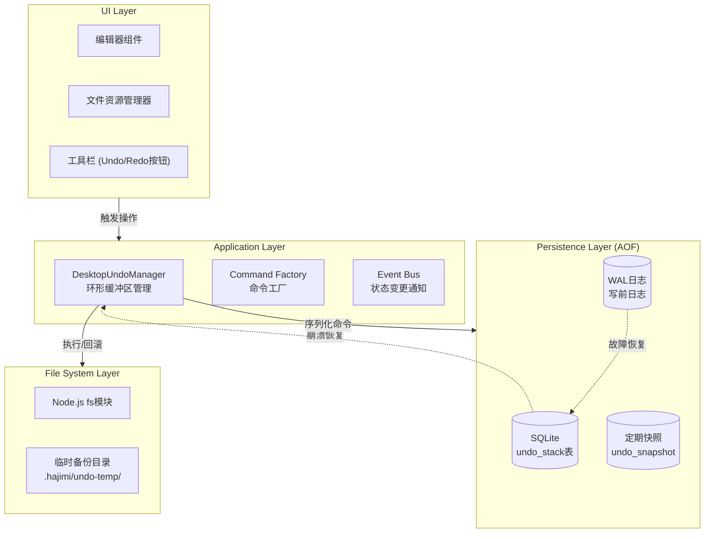
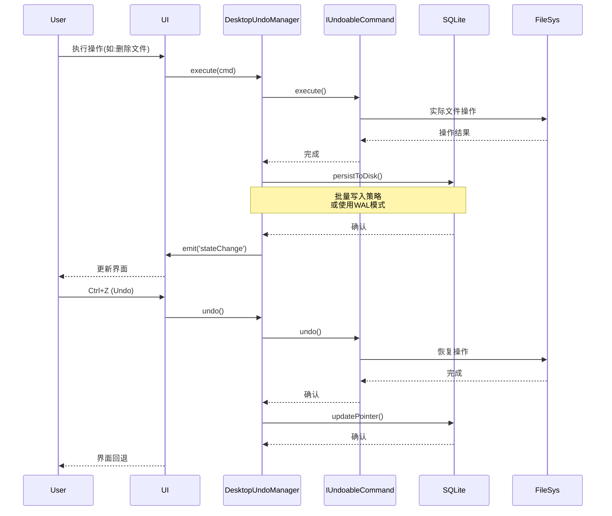
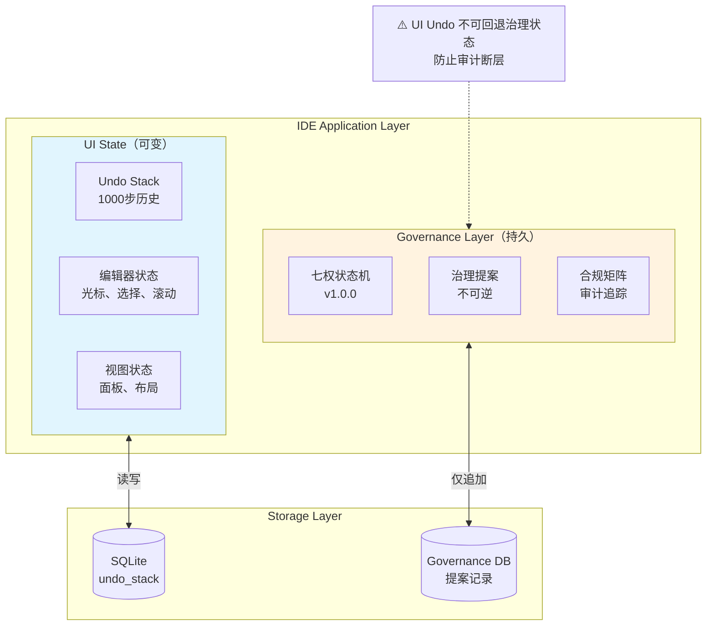
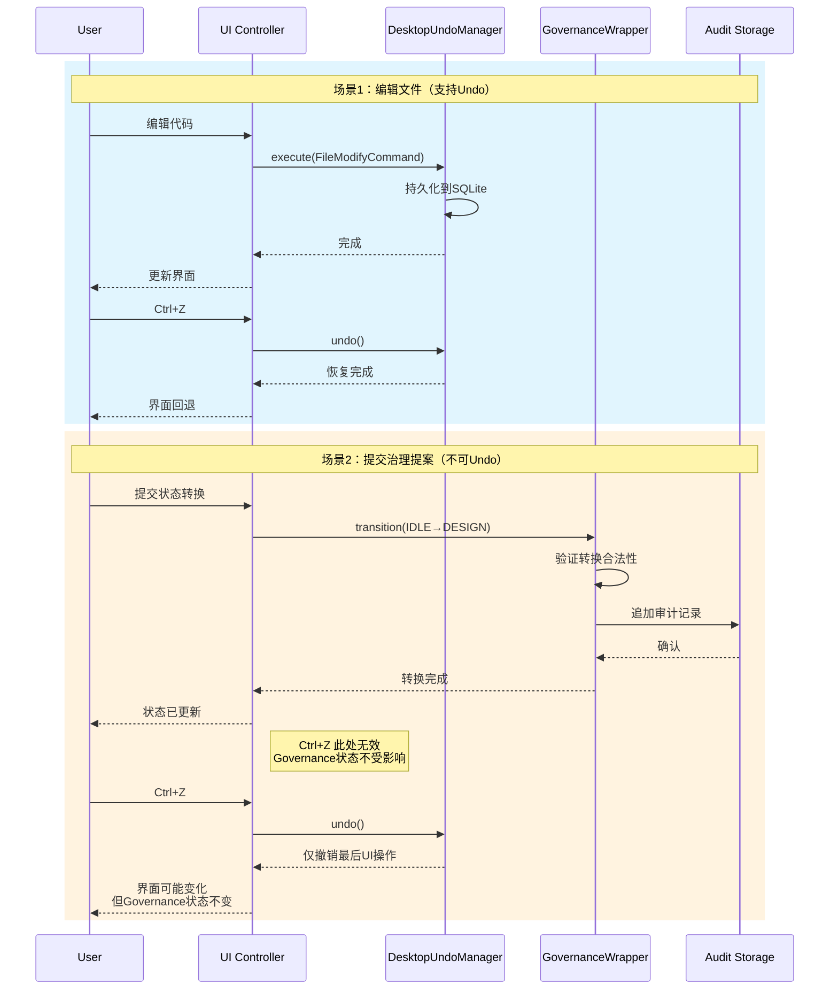

# 研究工单 R-03/09: 桌面级 Undo/Redo 与回收站机制设计

## 📋 研究概述

本研究基于 HAJIMI-PERF-DESKTOP-RESEARCH-011 项目，针对桌面级 IDE 的容错系统进行深度设计，实现系统级 Undo/Redo 机制与跨平台回收站集成。

---

## 1. Undo 系统设计规范

### 1.1 架构图（Mermaid）



### 1.2 核心组件关系图



### 1.3 写入策略决策：批量写入 vs 即时写入

#### 性能对比分析

| 策略 | 响应延迟 | 数据安全性 | 磁盘I/O | 适用场景 |
|------|----------|------------|---------|----------|
| **即时写入** | 高(5-15ms) | 最高 | 频繁 | 单文件编辑、关键操作 |
| **批量写入(500ms)** | 低(<1ms) | 高 | 适中 | 批量操作、代码重构 |
| **WAL+定时刷盘** | 极低(<0.5ms) | 高 | 批量 | 高频操作、实时协作 |

#### 推荐方案：混合策略（WAL + 批量写入）

```typescript
// lib/desktop/undo-persistence.ts
export class UndoPersistence {
  private db: Database;
  private writeBuffer: SerializedCommand[] = [];
  private flushTimer: NodeJS.Timeout | null = null;
  private readonly FLUSH_INTERVAL = 500; // 500ms批量写入
  private readonly BUFFER_SIZE = 50;     // 缓冲区大小阈值

  constructor(dbPath: string) {
    this.db = new Database(dbPath);
    this.db.pragma('journal_mode = WAL'); // 启用WAL模式
    this.initSchema();
  }

  // 追加到缓冲区（非阻塞）
  async append(command: SerializedCommand): Promise<void> {
    this.writeBuffer.push(command);
    
    // 触发条件：缓冲区满或定时器到期
    if (this.writeBuffer.length >= this.BUFFER_SIZE) {
      await this.flush();
    } else if (!this.flushTimer) {
      this.flushTimer = setTimeout(() => this.flush(), this.FLUSH_INTERVAL);
    }
  }

  // 批量刷盘
  private async flush(): Promise<void> {
    if (this.writeBuffer.length === 0) return;
    
    if (this.flushTimer) {
      clearTimeout(this.flushTimer);
      this.flushTimer = null;
    }

    const batch = [...this.writeBuffer];
    this.writeBuffer = [];

    // 事务批量写入
    this.db.transaction(() => {
      const insert = this.db.prepare(
        'INSERT INTO undo_stack (idx, type, data, pointer, timestamp) VALUES (?, ?, ?, ?, ?)'
      );
      batch.forEach(cmd => {
        insert.run(cmd.idx, cmd.type, cmd.data, cmd.pointer, Date.now());
      });
    })();
  }

  // 强制同步（用于应用退出前）
  async forceSync(): Promise<void> {
    await this.flush();
    this.db.pragma('wal_checkpoint(TRUNCATE)');
  }
}
```

#### WAL 模式优势

```
┌─────────────────────────────────────────────────────────────┐
│                    SQLite Journal Modes                     │
├─────────────────────────────────────────────────────────────┤
│ DELETE模式: 每次写入都需等待fsync，延迟高                     │
│ WAL模式:    写入WAL文件，后台checkpoint，性能提升3-10x       │
├─────────────────────────────────────────────────────────────┤
│ WAL文件结构:                                                │
│ ┌──────────┬──────────┬──────────┬──────────┐              │
│ │ Header   │ Frame 1  │ Frame 2  │ Frame N  │              │
│ │ (32B)    │          │          │          │              │
│ └──────────┴──────────┴──────────┴──────────┘              │
│ 每个Frame = 页面数据 + 校验和，支持并发读取                   │
└─────────────────────────────────────────────────────────────┘
```

---

## 2. Command 接口定义（TypeScript）

### 2.1 核心接口

```typescript
// lib/desktop/undo/types.ts

/**
 * 命令类型枚举
 */
export enum CommandType {
  FILE_CREATE = 'file:create',
  FILE_DELETE = 'file:delete',
  FILE_MODIFY = 'file:modify',
  FILE_MOVE = 'file:move',
  FILE_COPY = 'file:copy',
  DIR_CREATE = 'dir:create',
  DIR_DELETE = 'dir:delete',
  DIR_RENAME = 'dir:rename',
  GIT_COMMIT = 'git:commit',
  SETTING_CHANGE = 'setting:change',
  BATCH = 'batch',           // 批量操作容器
}

/**
 * 命令执行结果
 */
export interface CommandResult {
  success: boolean;
  error?: Error;
  affectedPaths: string[];
  metadata?: Record<string, unknown>;
}

/**
 * 序列化命令结构（AOF存储格式）
 */
export interface SerializedCommand {
  id: string;                    // UUID v4
  type: CommandType;
  version: number;               // 命令格式版本，用于迁移
  data: string;                  // JSON序列化的命令数据
  pointer: number;               // 在栈中的位置
  timestamp: number;             // 执行时间戳
  workspaceId: string;           // 所属工作区
}

/**
 * 可撤销命令接口
 */
export interface IUndoableCommand {
  /** 唯一标识 */
  readonly id: string;
  
  /** 命令类型 */
  readonly type: CommandType;
  
  /** 命令显示名称 */
  readonly displayName: string;
  
  /** 是否为破坏性操作（影响危险操作提示） */
  readonly isDestructive: boolean;
  
  /** 关联的文件路径（用于依赖检查） */
  readonly affectedPaths: string[];

  /**
   * 执行命令
   * @returns 执行结果
   */
  execute(): Promise<CommandResult>;

  /**
   * 撤销命令
   * @returns 撤销结果
   */
  undo(): Promise<CommandResult>;

  /**
   * 重做命令（execute的幂等版本）
   * @returns 重做结果
   */
  redo(): Promise<CommandResult>;

  /**
   * 序列化为存储格式
   */
  serialize(): SerializedCommand;

  /**
   * 验证命令是否可执行（前置条件检查）
   */
  canExecute(): Promise<boolean>;

  /**
   * 验证命令是否可撤销（后置条件检查）
   */
  canUndo(): Promise<boolean>;
}

/**
 * 命令反序列化器
 */
export interface ICommandDeserializer {
  deserialize(data: SerializedCommand): IUndoableCommand;
}

/**
 * 命令构造器（工厂模式）
 */
export interface ICommandConstructor {
  new (data: unknown): IUndoableCommand;
  fromJSON(json: string): IUndoableCommand;
}
```

### 2.2 文件操作命令实现

```typescript
// lib/desktop/undo/commands/file-commands.ts

import { IUndoableCommand, CommandType, CommandResult, SerializedCommand } from '../types';
import * as fs from 'fs/promises';
import * as path from 'path';
import { v4 as uuidv4 } from 'uuid';

// ─────────────────────────────────────────────────────────────
// 抽象基类
// ─────────────────────────────────────────────────────────────

abstract class FileCommandBase implements IUndoableCommand {
  public readonly id: string;
  public readonly type: CommandType;
  public readonly timestamp: number;
  public readonly displayName: string;
  public readonly isDestructive: boolean;
  public readonly affectedPaths: string[];

  constructor(
    type: CommandType,
    displayName: string,
    isDestructive: boolean,
    affectedPaths: string[],
    id?: string
  ) {
    this.id = id || uuidv4();
    this.type = type;
    this.timestamp = Date.now();
    this.displayName = displayName;
    this.isDestructive = isDestructive;
    this.affectedPaths = affectedPaths;
  }

  abstract execute(): Promise<CommandResult>;
  abstract undo(): Promise<CommandResult>;
  abstract redo(): Promise<CommandResult>;
  abstract serialize(): SerializedCommand;

  async canExecute(): Promise<boolean> {
    // 默认实现：检查路径是否可访问
    try {
      for (const p of this.affectedPaths) {
        await fs.access(path.dirname(p));
      }
      return true;
    } catch {
      return false;
    }
  }

  async canUndo(): Promise<boolean> {
    return true;
  }

  protected createResult(success: boolean, error?: Error): CommandResult {
    return {
      success,
      error,
      affectedPaths: this.affectedPaths,
      metadata: {
        commandId: this.id,
        timestamp: this.timestamp,
      },
    };
  }
}

// ─────────────────────────────────────────────────────────────
// 文件创建命令
// ─────────────────────────────────────────────────────────────

interface FileCreateData {
  filePath: string;
  content: string | Buffer;
  encoding?: BufferEncoding;
}

export class FileCreateCommand extends FileCommandBase {
  private data: FileCreateData;

  constructor(data: FileCreateData, id?: string) {
    super(
      CommandType.FILE_CREATE,
      `创建文件: ${path.basename(data.filePath)}`,
      false,
      [data.filePath],
      id
    );
    this.data = data;
  }

  async execute(): Promise<CommandResult> {
    try {
      // 确保目录存在
      await fs.mkdir(path.dirname(this.data.filePath), { recursive: true });
      await fs.writeFile(this.data.filePath, this.data.content, this.data.encoding);
      return this.createResult(true);
    } catch (error) {
      return this.createResult(false, error as Error);
    }
  }

  async undo(): Promise<CommandResult> {
    try {
      await fs.unlink(this.data.filePath);
      return this.createResult(true);
    } catch (error) {
      return this.createResult(false, error as Error);
    }
  }

  async redo(): Promise<CommandResult> {
    return this.execute();
  }

  serialize(): SerializedCommand {
    return {
      id: this.id,
      type: this.type,
      version: 1,
      data: JSON.stringify({
        filePath: this.data.filePath,
        content: this.data.content.toString('base64'),
        encoding: 'base64', // 统一使用base64存储
      }),
      pointer: -1, // 由Manager设置
      timestamp: this.timestamp,
      workspaceId: '', // 由Manager设置
    };
  }

  static fromJSON(json: string): FileCreateCommand {
    const parsed = JSON.parse(json);
    return new FileCreateCommand({
      filePath: parsed.filePath,
      content: Buffer.from(parsed.content, 'base64'),
    }, parsed.id);
  }
}

// ─────────────────────────────────────────────────────────────
// 文件删除命令（带回收站集成）
// ─────────────────────────────────────────────────────────────

interface FileDeleteData {
  filePath: string;
  useTrash?: boolean;           // 是否使用系统回收站
  backupToTemp?: boolean;       // 是否备份到临时目录（用于undo）
  tempBackupDir?: string;       // 临时备份目录
}

interface FileDeleteSnapshot {
  originalPath: string;
  tempBackupPath?: string;
  movedToTrash: boolean;
  stats: {                      // 文件元数据
    size: number;
    mtime: Date;
    mode: number;
  };
}

export class FileDeleteCommand extends FileCommandBase {
  private data: FileDeleteData;
  private snapshot: FileDeleteSnapshot | null = null;

  constructor(data: FileDeleteData, id?: string) {
    super(
      CommandType.FILE_DELETE,
      `删除文件: ${path.basename(data.filePath)}`,
      true,
      [data.filePath],
      id
    );
    this.data = { useTrash: true, backupToTemp: true, ...data };
  }

  async execute(): Promise<CommandResult> {
    try {
      // 1. 保存文件元数据
      const stats = await fs.stat(this.data.filePath);
      this.snapshot = {
        originalPath: this.data.filePath,
        movedToTrash: this.data.useTrash ?? true,
        stats: {
          size: stats.size,
          mtime: stats.mtime,
          mode: stats.mode,
        },
      };

      // 2. 如果需要undo备份，先复制到临时目录
      if (this.data.backupToTemp && this.data.tempBackupDir) {
        const backupPath = path.join(
          this.data.tempBackupDir,
          `${this.id}_${path.basename(this.data.filePath)}`
        );
        await fs.mkdir(this.data.tempBackupDir, { recursive: true });
        await fs.copyFile(this.data.filePath, backupPath);
        this.snapshot.tempBackupPath = backupPath;
      }

      // 3. 删除文件（移到回收站或直接删除）
      if (this.data.useTrash) {
        // 使用TrashManager（见第4节）
        const { TrashManager } = await import('../../trash-manager');
        await TrashManager.moveToTrash(this.data.filePath);
      } else {
        await fs.unlink(this.data.filePath);
      }

      return this.createResult(true);
    } catch (error) {
      return this.createResult(false, error as Error);
    }
  }

  async undo(): Promise<CommandResult> {
    if (!this.snapshot) {
      return this.createResult(false, new Error('No snapshot available'));
    }

    try {
      if (this.snapshot.tempBackupPath) {
        // 从临时备份恢复
        await fs.mkdir(path.dirname(this.snapshot.originalPath), { recursive: true });
        await fs.copyFile(this.snapshot.tempBackupPath, this.snapshot.originalPath);
        // 恢复文件权限
        await fs.chmod(this.snapshot.originalPath, this.snapshot.stats.mode);
        // 清理临时备份
        await fs.unlink(this.snapshot.tempBackupPath);
      } else if (this.snapshot.movedToTrash) {
        // 从回收站恢复（需要平台特定实现）
        // 这里标记为需要从回收站手动恢复
        return this.createResult(
          false,
          new Error('File in system trash, manual restore required')
        );
      }

      return this.createResult(true);
    } catch (error) {
      return this.createResult(false, error as Error);
    }
  }

  async redo(): Promise<CommandResult> {
    // 重新执行删除
    this.snapshot = null; // 重置快照
    return this.execute();
  }

  serialize(): SerializedCommand {
    return {
      id: this.id,
      type: this.type,
      version: 1,
      data: JSON.stringify({
        filePath: this.data.filePath,
        useTrash: this.data.useTrash,
        backupToTemp: this.data.backupToTemp,
        tempBackupDir: this.data.tempBackupDir,
        snapshot: this.snapshot,
      }),
      pointer: -1,
      timestamp: this.timestamp,
      workspaceId: '',
    };
  }

  static fromJSON(json: string): FileDeleteCommand {
    const parsed = JSON.parse(json);
    return new FileDeleteCommand({
      filePath: parsed.filePath,
      useTrash: parsed.useTrash,
      backupToTemp: parsed.backupToTemp,
      tempBackupDir: parsed.tempBackupDir,
    }, parsed.id);
  }
}

// ─────────────────────────────────────────────────────────────
// 文件修改命令
// ─────────────────────────────────────────────────────────────

interface FileModifyData {
  filePath: string;
  newContent?: string | Buffer;
  patch?: string;               // diff补丁格式（大文件优化）
  encoding?: BufferEncoding;
  usePatch?: boolean;           // 是否使用补丁模式
}

interface FileModifySnapshot {
  originalContent?: string;     // 原始内容（小文件）
  originalHash: string;         // 原始内容哈希
  patchReverse?: string;        // 反向补丁（大文件）
  backupPath?: string;          // 备份文件路径
}

export class FileModifyCommand extends FileCommandBase {
  private data: FileModifyData;
  private snapshot: FileModifySnapshot | null = null;
  private static readonly PATCH_THRESHOLD = 1024 * 1024; // 1MB阈值

  constructor(data: FileModifyData, id?: string) {
    super(
      CommandType.FILE_MODIFY,
      `修改文件: ${path.basename(data.filePath)}`,
      false,
      [data.filePath],
      id
    );
    this.data = { encoding: 'utf-8', usePatch: false, ...data };
  }

  async execute(): Promise<CommandResult> {
    try {
      // 1. 读取原始内容
      const originalBuffer = await fs.readFile(this.data.filePath);
      const originalContent = originalBuffer.toString(this.data.encoding);
      
      // 2. 根据大小选择存储策略
      if (originalBuffer.length > FileModifyCommand.PATCH_THRESHOLD) {
        // 大文件：生成diff补丁
        const { createPatch } = await import('diff');
        const newContent = this.data.newContent?.toString() || '';
        this.snapshot = {
          originalHash: this.hashContent(originalBuffer),
          patchReverse: createPatch(
            this.data.filePath,
            newContent,
            originalContent,
            '',
            ''
          ),
        };
      } else {
        // 小文件：直接存储原始内容
        this.snapshot = {
          originalContent,
          originalHash: this.hashContent(originalBuffer),
        };
      }

      // 3. 写入新内容
      const contentToWrite = this.data.newContent || '';
      await fs.writeFile(this.data.filePath, contentToWrite, this.data.encoding);

      return this.createResult(true);
    } catch (error) {
      return this.createResult(false, error as Error);
    }
  }

  async undo(): Promise<CommandResult> {
    if (!this.snapshot) {
      return this.createResult(false, new Error('No snapshot available'));
    }

    try {
      if (this.snapshot.originalContent !== undefined) {
        // 小文件：直接恢复
        await fs.writeFile(
          this.data.filePath,
          this.snapshot.originalContent,
          this.data.encoding
        );
      } else if (this.snapshot.patchReverse) {
        // 大文件：应用反向补丁
        const { applyPatch } = await import('diff');
        const currentContent = await fs.readFile(this.data.filePath, this.data.encoding);
        const restoredContent = applyPatch(this.data.filePath, currentContent, this.snapshot.patchReverse);
        
        if (typeof restoredContent === 'string') {
          await fs.writeFile(this.data.filePath, restoredContent, this.data.encoding);
        } else {
          throw new Error('Failed to apply reverse patch');
        }
      }

      return this.createResult(true);
    } catch (error) {
      return this.createResult(false, error as Error);
    }
  }

  async redo(): Promise<CommandResult> {
    try {
      const contentToWrite = this.data.newContent || '';
      await fs.writeFile(this.data.filePath, contentToWrite, this.data.encoding);
      return this.createResult(true);
    } catch (error) {
      return this.createResult(false, error as Error);
    }
  }

  private hashContent(buffer: Buffer): string {
    // 使用简单的哈希（实际项目使用crypto.createHash）
    let hash = 0;
    for (let i = 0; i < buffer.length; i++) {
      hash = ((hash << 5) - hash) + buffer[i];
      hash = hash & hash;
    }
    return hash.toString(16);
  }

  serialize(): SerializedCommand {
    return {
      id: this.id,
      type: this.type,
      version: 1,
      data: JSON.stringify({
        filePath: this.data.filePath,
        newContent: this.data.newContent?.toString('base64'),
        patch: this.data.patch,
        encoding: this.data.encoding,
        usePatch: this.data.usePatch,
        snapshot: this.snapshot,
      }),
      pointer: -1,
      timestamp: this.timestamp,
      workspaceId: '',
    };
  }

  static fromJSON(json: string): FileModifyCommand {
    const parsed = JSON.parse(json);
    return new FileModifyCommand({
      filePath: parsed.filePath,
      newContent: parsed.newContent ? Buffer.from(parsed.newContent, 'base64') : undefined,
      patch: parsed.patch,
      encoding: parsed.encoding,
      usePatch: parsed.usePatch,
    }, parsed.id);
  }
}

// ─────────────────────────────────────────────────────────────
// 文件移动/重命名命令
// ─────────────────────────────────────────────────────────────

interface FileMoveData {
  sourcePath: string;
  targetPath: string;
  overwrite?: boolean;
}

export class FileMoveCommand extends FileCommandBase {
  private data: FileMoveData;

  constructor(data: FileMoveData, id?: string) {
    super(
      CommandType.FILE_MOVE,
      `移动: ${path.basename(data.sourcePath)} → ${path.basename(data.targetPath)}`,
      false,
      [data.sourcePath, data.targetPath],
      id
    );
    this.data = { overwrite: false, ...data };
  }

  async execute(): Promise<CommandResult> {
    try {
      // 检查目标是否存在
      try {
        await fs.access(this.data.targetPath);
        if (!this.data.overwrite) {
          throw new Error(`Target already exists: ${this.data.targetPath}`);
        }
      } catch (e) {
        // 目标不存在，继续
      }

      await fs.mkdir(path.dirname(this.data.targetPath), { recursive: true });
      await fs.rename(this.data.sourcePath, this.data.targetPath);
      return this.createResult(true);
    } catch (error) {
      return this.createResult(false, error as Error);
    }
  }

  async undo(): Promise<CommandResult> {
    try {
      await fs.rename(this.data.targetPath, this.data.sourcePath);
      return this.createResult(true);
    } catch (error) {
      return this.createResult(false, error as Error);
    }
  }

  async redo(): Promise<CommandResult> {
    return this.execute();
  }

  serialize(): SerializedCommand {
    return {
      id: this.id,
      type: this.type,
      version: 1,
      data: JSON.stringify(this.data),
      pointer: -1,
      timestamp: this.timestamp,
      workspaceId: '',
    };
  }

  static fromJSON(json: string): FileMoveCommand {
    return new FileMoveCommand(JSON.parse(json));
  }
}

// ─────────────────────────────────────────────────────────────
// 批量命令（事务性操作）
// ─────────────────────────────────────────────────────────────

export class BatchCommand extends FileCommandBase {
  private commands: IUndoableCommand[];
  private results: CommandResult[] = [];

  constructor(commands: IUndoableCommand[], displayName?: string, id?: string) {
    const allPaths = commands.flatMap(c => c.affectedPaths);
    super(
      CommandType.BATCH,
      displayName || `批量操作 (${commands.length}个命令)`,
      commands.some(c => c.isDestructive),
      [...new Set(allPaths)],
      id
    );
    this.commands = commands;
  }

  async execute(): Promise<CommandResult> {
    this.results = [];
    try {
      for (const cmd of this.commands) {
        const result = await cmd.execute();
        this.results.push(result);
        if (!result.success) {
          // 事务回滚：撤销已执行的命令
          await this.rollbackExecuted();
          return this.createResult(false, new Error(`Batch command failed: ${cmd.displayName}`));
        }
      }
      return this.createResult(true);
    } catch (error) {
      await this.rollbackExecuted();
      return this.createResult(false, error as Error);
    }
  }

  private async rollbackExecuted(): Promise<void> {
    // 逆序撤销已执行的命令
    for (let i = this.results.length - 1; i >= 0; i--) {
      if (this.results[i].success) {
        await this.commands[i].undo();
      }
    }
  }

  async undo(): Promise<CommandResult> {
    try {
      // 逆序撤销所有命令
      for (let i = this.commands.length - 1; i >= 0; i--) {
        await this.commands[i].undo();
      }
      return this.createResult(true);
    } catch (error) {
      return this.createResult(false, error as Error);
    }
  }

  async redo(): Promise<CommandResult> {
    return this.execute();
  }

  serialize(): SerializedCommand {
    return {
      id: this.id,
      type: this.type,
      version: 1,
      data: JSON.stringify({
        commands: this.commands.map(c => c.serialize()),
      }),
      pointer: -1,
      timestamp: this.timestamp,
      workspaceId: '',
    };
  }
}
```

---

## 3. UndoManager 类设计

### 3.1 核心实现

```typescript
// lib/desktop/undo/undo-manager.ts

import { EventEmitter } from 'events';
import Database from 'better-sqlite3';
import { IUndoableCommand, SerializedCommand, CommandType } from './types';
import * as path from 'path';
import * as fs from 'fs/promises';

/**
 * UndoManager 配置选项
 */
export interface UndoManagerOptions {
  /** 最大历史记录数（默认1000） */
  maxSize?: number;
  
  /** SQLite数据库路径 */
  dbPath: string;
  
  /** 工作区ID */
  workspaceId: string;
  
  /** 临时备份目录 */
  tempBackupDir?: string;
  
  /** 是否启用WAL模式 */
  enableWAL?: boolean;
  
  /** 批量写入间隔（毫秒） */
  flushInterval?: number;
  
  /** 监听器：状态变更 */
  onStateChange?: (state: UndoState) => void;
  
  /** 监听器：命令执行 */
  onCommandExecute?: (cmd: IUndoableCommand) => void;
}

/**
 * UndoManager 状态
 */
export interface UndoState {
  canUndo: boolean;
  canRedo: boolean;
  undoDisplayName?: string;
  redoDisplayName?: string;
  stackSize: number;
  currentPointer: number;
}

/**
 * 环形缓冲区节点
 */
interface UndoNode {
  command: IUndoableCommand;
  next: UndoNode | null;
  prev: UndoNode | null;
}

/**
 * 桌面级 Undo 管理器
 * 支持1000步历史记录，AOF持久化到SQLite，崩溃恢复
 */
export class DesktopUndoManager extends EventEmitter {
  private head: UndoNode | null = null;      // 缓冲区头
  private tail: UndoNode | null = null;      // 缓冲区尾
  private current: UndoNode | null = null;   // 当前指针
  private size = 0;                          // 当前大小
  private readonly maxSize: number;
  private readonly db: Database.Database;
  private readonly workspaceId: string;
  private readonly tempBackupDir: string;
  private writeBuffer: SerializedCommand[] = [];
  private flushTimer: NodeJS.Timeout | null = null;
  private readonly FLUSH_INTERVAL: number;
  private isRestoring = false;
  private commandRegistry: Map<CommandType, (data: string) => IUndoableCommand> = new Map();

  constructor(options: UndoManagerOptions) {
    super();
    
    this.maxSize = options.maxSize || 1000;
    this.workspaceId = options.workspaceId;
    this.tempBackupDir = options.tempBackupDir || path.join(
      path.dirname(options.dbPath),
      '.undo-temp'
    );
    this.FLUSH_INTERVAL = options.flushInterval || 500;

    // 初始化SQLite
    this.db = new Database(options.dbPath);
    if (options.enableWAL !== false) {
      this.db.pragma('journal_mode = WAL');
    }
    
    this.initSchema();
    this.ensureTempDir();
    
    // 注册命令反序列化器
    this.registerDefaultDeserializers();
    
    // 崩溃恢复
    this.restoreFromCrash();
  }

  /**
   * 初始化数据库表结构
   */
  private initSchema(): void {
    this.db.exec(`
      CREATE TABLE IF NOT EXISTS undo_stack (
        id TEXT PRIMARY KEY,
        workspace_id TEXT NOT NULL,
        idx INTEGER NOT NULL,
        type TEXT NOT NULL,
        version INTEGER NOT NULL DEFAULT 1,
        data TEXT NOT NULL,
        pointer INTEGER NOT NULL,
        timestamp INTEGER NOT NULL,
        created_at DATETIME DEFAULT CURRENT_TIMESTAMP
      );
      
      CREATE INDEX IF NOT EXISTS idx_undo_workspace ON undo_stack(workspace_id);
      CREATE INDEX IF NOT EXISTS idx_undo_pointer ON undo_stack(pointer);
      
      CREATE TABLE IF NOT EXISTS undo_metadata (
        workspace_id TEXT PRIMARY KEY,
        current_pointer INTEGER DEFAULT -1,
        last_updated INTEGER NOT NULL
      );
      
      CREATE TABLE IF NOT EXISTS undo_snapshots (
        id TEXT PRIMARY KEY,
        workspace_id TEXT NOT NULL,
        snapshot_data TEXT NOT NULL,
        created_at INTEGER NOT NULL
      );
    `);
  }

  /**
   * 确保临时目录存在
   */
  private async ensureTempDir(): Promise<void> {
    await fs.mkdir(this.tempBackupDir, { recursive: true });
  }

  /**
   * 注册默认命令反序列化器
   */
  private registerDefaultDeserializers(): void {
    // 动态导入避免循环依赖
    const register = async () => {
      const { FileCreateCommand, FileDeleteCommand, FileModifyCommand, FileMoveCommand } = 
        await import('./commands/file-commands');
      
      this.registerDeserializer(CommandType.FILE_CREATE, FileCreateCommand.fromJSON);
      this.registerDeserializer(CommandType.FILE_DELETE, FileDeleteCommand.fromJSON);
      this.registerDeserializer(CommandType.FILE_MODIFY, FileModifyCommand.fromJSON);
      this.registerDeserializer(CommandType.FILE_MOVE, FileMoveCommand.fromJSON);
    };
    register();
  }

  /**
   * 注册命令反序列化器
   */
  registerDeserializer(type: CommandType, deserializer: (data: string) => IUndoableCommand): void {
    this.commandRegistry.set(type, deserializer);
  }

  /**
   * 执行命令
   */
  async execute(command: IUndoableCommand): Promise<boolean> {
    if (this.isRestoring) {
      throw new Error('Cannot execute command while restoring');
    }

    // 执行命令
    const result = await command.execute();
    if (!result.success) {
      this.emit('commandFailed', { command, error: result.error });
      return false;
    }

    // 截断Redo历史（新操作后旧的Redo不可用）
    if (this.current && this.current.next) {
      this.truncateAfter(this.current);
    }

    // 添加到环形缓冲区
    const newNode: UndoNode = { command, next: null, prev: this.tail };
    
    if (this.tail) {
      this.tail.next = newNode;
    } else {
      this.head = newNode;
    }
    
    this.tail = newNode;
    this.current = newNode;
    this.size++;

    // 超出最大容量时移除头部
    if (this.size > this.maxSize) {
      this.removeHead();
    }

    // 持久化
    await this.persistCommand(command);
    
    // 更新元数据
    this.updateMetadata();
    
    // 通知状态变更
    this.notifyStateChange();
    this.emit('commandExecuted', command);

    return true;
  }

  /**
   * Undo 操作
   */
  async undo(): Promise<boolean> {
    if (!this.current) {
      return false;
    }

    const result = await this.current.command.undo();
    if (!result.success) {
      this.emit('undoFailed', { command: this.current.command, error: result.error });
      return false;
    }

    this.current = this.current.prev;
    this.updateMetadata();
    this.notifyStateChange();
    this.emit('undo', result);

    return true;
  }

  /**
   * Redo 操作
   */
  async redo(): Promise<boolean> {
    const target = this.current?.next || this.head;
    
    if (!target || (this.current && !this.current.next)) {
      return false;
    }

    const nextNode = this.current ? this.current.next : this.head;
    if (!nextNode) return false;

    const result = await nextNode.command.redo();
    if (!result.success) {
      this.emit('redoFailed', { command: nextNode.command, error: result.error });
      return false;
    }

    this.current = nextNode;
    this.updateMetadata();
    this.notifyStateChange();
    this.emit('redo', result);

    return true;
  }

  /**
   * 获取当前状态
   */
  getState(): UndoState {
    return {
      canUndo: this.current !== null,
      canRedo: this.current?.next !== null || (this.current === null && this.head !== null),
      undoDisplayName: this.current?.command.displayName,
      redoDisplayName: this.current?.next?.command.displayName || this.head?.command.displayName,
      stackSize: this.size,
      currentPointer: this.getPointerIndex(),
    };
  }

  /**
   * 获取Undo历史列表（用于UI显示）
   */
  getHistory(): Array<{ id: string; name: string; type: CommandType; isCurrent: boolean }> {
    const history: Array<{ id: string; name: string; type: CommandType; isCurrent: boolean }> = [];
    let node = this.head;
    let isCurrent = this.current === null;

    while (node) {
      history.push({
        id: node.command.id,
        name: node.command.displayName,
        type: node.command.type,
        isCurrent: isCurrent || node === this.current,
      });
      
      if (node === this.current) {
        isCurrent = false;
      }
      
      node = node.next;
    }

    return history;
  }

  /**
   * 跳转到指定历史位置
   */
  async goto(index: number): Promise<boolean> {
    const targetNode = this.getNodeAt(index);
    if (!targetNode) return false;

    const currentIndex = this.getPointerIndex();
    
    if (index < currentIndex) {
      // 向后undo
      for (let i = currentIndex; i > index; i--) {
        await this.undo();
      }
    } else if (index > currentIndex) {
      // 向前redo
      for (let i = currentIndex; i < index; i++) {
        await this.redo();
      }
    }

    return true;
  }

  /**
   * 清空历史
   */
  async clear(): Promise<void> {
    this.head = null;
    this.tail = null;
    this.current = null;
    this.size = 0;

    // 清空数据库
    this.db.prepare('DELETE FROM undo_stack WHERE workspace_id = ?').run(this.workspaceId);
    this.db.prepare('DELETE FROM undo_metadata WHERE workspace_id = ?').run(this.workspaceId);

    // 清空临时备份
    const files = await fs.readdir(this.tempBackupDir);
    await Promise.all(files.map(f => 
      fs.unlink(path.join(this.tempBackupDir, f)).catch(() => {})
    ));

    this.notifyStateChange();
  }

  /**
   * 持久化命令（批量写入策略）
   */
  private async persistCommand(command: IUndoableCommand): Promise<void> {
    const serialized = command.serialize();
    serialized.workspaceId = this.workspaceId;
    serialized.pointer = this.getPointerIndex();

    this.writeBuffer.push(serialized);

    if (this.writeBuffer.length >= 50) {
      await this.flush();
    } else if (!this.flushTimer) {
      this.flushTimer = setTimeout(() => this.flush(), this.FLUSH_INTERVAL);
    }
  }

  /**
   * 批量刷盘
   */
  private async flush(): Promise<void> {
    if (this.writeBuffer.length === 0) return;

    if (this.flushTimer) {
      clearTimeout(this.flushTimer);
      this.flushTimer = null;
    }

    const batch = [...this.writeBuffer];
    this.writeBuffer = [];

    const insert = this.db.prepare(
      'INSERT OR REPLACE INTO undo_stack (id, workspace_id, idx, type, version, data, pointer, timestamp) ' +
      'VALUES (?, ?, ?, ?, ?, ?, ?, ?)'
    );

    const transaction = this.db.transaction((commands: SerializedCommand[]) => {
      for (const cmd of commands) {
        insert.run(
          cmd.id,
          cmd.workspaceId,
          cmd.pointer,
          cmd.type,
          cmd.version,
          cmd.data,
          cmd.pointer,
          cmd.timestamp
        );
      }
    });

    transaction(batch);
  }

  /**
   * 崩溃恢复：从SQLite重建Undo栈
   */
  private async restoreFromCrash(): Promise<void> {
    this.isRestoring = true;

    try {
      // 读取元数据
      const meta = this.db.prepare(
        'SELECT current_pointer FROM undo_metadata WHERE workspace_id = ?'
      ).get(this.workspaceId) as { current_pointer: number } | undefined;

      if (!meta) {
        this.isRestoring = false;
        return;
      }

      // 读取所有命令
      const rows = this.db.prepare(
        'SELECT * FROM undo_stack WHERE workspace_id = ? ORDER BY idx ASC'
      ).all(this.workspaceId) as Array<{
        id: string;
        type: CommandType;
        version: number;
        data: string;
        pointer: number;
      }>;

      // 重建链表
      let prevNode: UndoNode | null = null;
      
      for (const row of rows) {
        const deserializer = this.commandRegistry.get(row.type);
        if (!deserializer) {
          console.warn(`Unknown command type: ${row.type}`);
          continue;
        }

        try {
          const command = deserializer(row.data);
          const node: UndoNode = { command, next: null, prev: prevNode };

          if (prevNode) {
            prevNode.next = node;
          } else {
            this.head = node;
          }

          if (row.pointer === meta.current_pointer) {
            this.current = node;
          }

          prevNode = node;
          this.tail = node;
          this.size++;
        } catch (e) {
          console.error(`Failed to restore command: ${row.id}`, e);
        }
      }

      console.log(`Restored ${this.size} commands from persistence`);
    } finally {
      this.isRestoring = false;
    }
  }

  /**
   * 更新元数据
   */
  private updateMetadata(): void {
    const pointer = this.getPointerIndex();
    this.db.prepare(
      'INSERT OR REPLACE INTO undo_metadata (workspace_id, current_pointer, last_updated) VALUES (?, ?, ?)'
    ).run(this.workspaceId, pointer, Date.now());
  }

  /**
   * 获取当前指针索引
   */
  private getPointerIndex(): number {
    let index = -1;
    let node = this.head;
    
    while (node) {
      index++;
      if (node === this.current) break;
      node = node.next;
    }

    return this.current === null ? -1 : index;
  }

  /**
   * 获取指定索引的节点
   */
  private getNodeAt(index: number): UndoNode | null {
    let current = 0;
    let node = this.head;

    while (node && current < index) {
      node = node.next;
      current++;
    }

    return node;
  }

  /**
   * 截断链表（删除指定节点之后的所有节点）
   */
  private truncateAfter(node: UndoNode): void {
    let current = node.next;
    node.next = null;
    
    while (current) {
      const next = current.next;
      this.size--;
      
      // 从数据库删除
      this.db.prepare('DELETE FROM undo_stack WHERE id = ?').run(current.command.id);
      
      current = next;
    }

    this.tail = node;
  }

  /**
   * 移除头部节点（超出容量时）
   */
  private removeHead(): void {
    if (!this.head) return;

    const oldHead = this.head;
    this.head = oldHead.next;
    
    if (this.head) {
      this.head.prev = null;
    }

    this.size--;

    // 从数据库删除
    this.db.prepare('DELETE FROM undo_stack WHERE id = ?').run(oldHead.command.id);

    // 调整当前指针
    if (this.current === oldHead) {
      this.current = null;
    }
  }

  /**
   * 通知状态变更
   */
  private notifyStateChange(): void {
    const state = this.getState();
    this.emit('stateChange', state);
  }

  /**
   * 关闭并清理资源
   */
  async dispose(): Promise<void> {
    await this.flush();
    
    if (this.flushTimer) {
      clearTimeout(this.flushTimer);
    }

    this.db.pragma('wal_checkpoint(TRUNCATE)');
    this.db.close();
    
    this.removeAllListeners();
  }
}
```

### 3.2 AOF 持久化格式（JSON Schema）

```json
{
  "$schema": "http://json-schema.org/draft-07/schema#",
  "title": "Undo Stack AOF Format",
  "description": "桌面级IDE的Undo操作持久化格式",
  "type": "object",
  "required": ["version", "workspace_id", "commands", "metadata"],
  "properties": {
    "version": {
      "type": "integer",
      "description": "AOF格式版本",
      "const": 1
    },
    "workspace_id": {
      "type": "string",
      "description": "工作区唯一标识"
    },
    "created_at": {
      "type": "integer",
      "description": "创建时间戳（毫秒）"
    },
    "commands": {
      "type": "array",
      "description": "命令序列",
      "items": {
        "$ref": "#/definitions/command"
      }
    },
    "metadata": {
      "type": "object",
      "properties": {
        "current_pointer": {
          "type": "integer",
          "description": "当前指针位置"
        },
        "total_size": {
          "type": "integer",
          "description": "历史记录总数"
        },
        "last_updated": {
          "type": "integer",
          "description": "最后更新时间"
        }
      }
    }
  },
  "definitions": {
    "command": {
      "type": "object",
      "required": ["id", "type", "version", "data", "timestamp"],
      "properties": {
        "id": {
          "type": "string",
          "format": "uuid",
          "description": "命令唯一标识"
        },
        "type": {
          "type": "string",
          "enum": [
            "file:create",
            "file:delete",
            "file:modify",
            "file:move",
            "file:copy",
            "dir:create",
            "dir:delete",
            "dir:rename",
            "git:commit",
            "setting:change",
            "batch"
          ]
        },
        "version": {
          "type": "integer",
          "description": "命令格式版本"
        },
        "data": {
          "type": "string",
          "description": "Base64编码的命令数据"
        },
        "pointer": {
          "type": "integer",
          "description": "在栈中的位置"
        },
        "timestamp": {
          "type": "integer",
          "description": "执行时间戳"
        }
      }
    }
  }
}
```

### 3.3 并发控制（多窗口场景）

```typescript
// lib/desktop/undo/multi-window-sync.ts

import { DesktopUndoManager } from './undo-manager';
import { ipcMain, ipcRenderer, BrowserWindow } from 'electron';

/**
 * 多窗口Undo同步管理器
 * 
 * 策略：每个窗口有独立的Undo栈，但关键操作（如文件删除）需要全局协调
 */
export class MultiWindowUndoCoordinator {
  private managers: Map<string, DesktopUndoManager> = new Map();
  private fileLocks: Map<string, string> = new Map(); // filePath -> windowId

  /**
   * 注册窗口的UndoManager
   */
  registerWindow(windowId: string, manager: DesktopUndoManager): void {
    this.managers.set(windowId, manager);
    
    // 监听可能影响其他窗口的操作
    manager.on('commandExecuted', (cmd) => {
      this.handleGlobalCommand(windowId, cmd);
    });
  }

  /**
   * 注销窗口
   */
  unregisterWindow(windowId: string): void {
    this.managers.delete(windowId);
  }

  /**
   * 尝试获取文件操作锁
   */
  acquireFileLock(filePath: string, windowId: string): boolean {
    if (this.fileLocks.has(filePath)) {
      const holder = this.fileLocks.get(filePath);
      if (holder !== windowId) {
        return false; // 已被其他窗口锁定
      }
    }
    this.fileLocks.set(filePath, windowId);
    return true;
  }

  /**
   * 释放文件操作锁
   */
  releaseFileLock(filePath: string, windowId: string): void {
    if (this.fileLocks.get(filePath) === windowId) {
      this.fileLocks.delete(filePath);
    }
  }

  /**
   * 处理需要全局协调的命令
   */
  private handleGlobalCommand(windowId: string, command: any): void {
    // 通知其他窗口有关此文件的操作
    if (command.affectedPaths) {
      for (const [otherWindowId, otherManager] of this.managers) {
        if (otherWindowId !== windowId) {
          // 检查是否有冲突
          const hasConflict = command.affectedPaths.some((path: string) =>
            this.isPathInUndoStack(otherManager, path)
          );

          if (hasConflict) {
            // 发送冲突警告到其他窗口
            this.notifyConflict(otherWindowId, {
              sourceWindow: windowId,
              affectedPaths: command.affectedPaths,
            });
          }
        }
      }
    }
  }

  /**
   * 检查路径是否在其他窗口的Undo栈中
   */
  private isPathInUndoStack(manager: DesktopUndoManager, filePath: string): boolean {
    const history = manager.getHistory();
    // 简化实现：实际应该检查命令详情
    return history.length > 0;
  }

  /**
   * 通知其他窗口有冲突
   */
  private notifyConflict(windowId: string, conflict: unknown): void {
    // 通过IPC通知渲染进程
    const window = BrowserWindow.fromId(parseInt(windowId));
    if (window) {
      window.webContents.send('undo-conflict', conflict);
    }
  }
}

// 单例实例
export const undoCoordinator = new MultiWindowUndoCoordinator();
```

---

## 4. 系统回收站封装

### 4.1 跨平台 TrashManager 设计

```typescript
// lib/desktop/trash/trash-manager.ts

import { exec, spawn } from 'child_process';
import { promisify } from 'util';
import * as path from 'path';
import * as fs from 'fs/promises';
import { platform } from 'os';

const execAsync = promisify(exec);

/**
 * 回收站管理器接口
 */
export interface ITrashManager {
  /**
   * 移动文件到回收站
   */
  moveToTrash(filePath: string): Promise<void>;
  
  /**
   * 批量移动文件到回收站
   */
  moveMultipleToTrash(filePaths: string[]): Promise<{ success: string[]; failed: Array<{ path: string; error: Error }> }>;
  
  /**
   * 检查平台支持
   */
  isSupported(): boolean;
  
  /**
   * 清空回收站（谨慎操作）
   */
  emptyTrash?(): Promise<void>;
}

/**
 * 回收站操作结果
 */
export interface TrashResult {
  success: boolean;
  originalPath: string;
  trashPath?: string;
  error?: Error;
}

// ─────────────────────────────────────────────────────────────
// Windows 实现（PowerShell + shell32）
// ─────────────────────────────────────────────────────────────

class WindowsTrashManager implements ITrashManager {
  isSupported(): boolean {
    return platform() === 'win32';
  }

  async moveToTrash(filePath: string): Promise<void> {
    const resolvedPath = path.resolve(filePath);
    
    // 检查文件是否存在
    try {
      await fs.access(resolvedPath);
    } catch {
      throw new Error(`File not found: ${resolvedPath}`);
    }

    // 方法1：使用PowerShell（推荐，兼容性好）
    try {
      const psScript = `
        Add-Type -AssemblyName Microsoft.VisualBasic
        [Microsoft.VisualBasic.FileIO.FileSystem]::DeleteFile(
          '${resolvedPath.replace(/'/g, "''")}',
          'OnlyErrorDialogs',
          'SendToRecycleBin'
        )
      `;
      
      await execAsync(`powershell.exe -Command "${psScript}"`, {
        timeout: 30000,
      });
      return;
    } catch (psError) {
      console.warn('PowerShell trash failed, falling back:', psError);
    }

    // 方法2：使用VBS脚本（兼容旧版Windows）
    try {
      const vbsScript = `
        Set objFSO = CreateObject("Scripting.FileSystemObject")
        Set objShell = CreateObject("Shell.Application")
        objShell.Namespace(0).ParseName("${resolvedPath}").InvokeVerb("delete")
      `;
      
      const tempVbs = path.join(process.env.TEMP || '.', `trash_${Date.now()}.vbs`);
      await fs.writeFile(tempVbs, vbsScript);
      
      try {
        await execAsync(`cscript //NoLogo "${tempVbs}"`, { timeout: 30000 });
      } finally {
        await fs.unlink(tempVbs).catch(() => {});
      }
      return;
    } catch (vbsError) {
      console.warn('VBS trash failed:', vbsError);
    }

    // 方法3：使用第三方工具（如果有安装）
    try {
      await execAsync(`recycle-bin "${resolvedPath}"`, { timeout: 10000 });
      return;
    } catch {
      // 工具未安装，继续抛出错误
    }

    throw new Error('Failed to move file to trash on Windows');
  }

  async moveMultipleToTrash(filePaths: string[]): Promise<{ success: string[]; failed: Array<{ path: string; error: Error }> }> {
    const success: string[] = [];
    const failed: Array<{ path: string; error: Error }> = [];

    // Windows批量操作优化：使用单个PowerShell会话
    const resolvedPaths = filePaths.map(p => path.resolve(p));
    
    const psScript = `
      Add-Type -AssemblyName Microsoft.VisualBasic
      $paths = @(${resolvedPaths.map(p => `'${p.replace(/'/g, "''")}'`).join(',')})
      foreach ($filePath in $paths) {
        try {
          [Microsoft.VisualBasic.FileIO.FileSystem]::DeleteFile(
            $filePath,
            'OnlyErrorDialogs',
            'SendToRecycleBin'
          )
          Write-Host "SUCCESS:$filePath"
        } catch {
          Write-Host "FAILED:$filePath:$($_.Exception.Message)"
        }
      }
    `;

    try {
      const { stdout } = await execAsync(`powershell.exe -Command "${psScript}"`, {
        timeout: 60000,
      });

      // 解析输出
      const lines = stdout.split('\n');
      for (const line of lines) {
        const trimmed = line.trim();
        if (trimmed.startsWith('SUCCESS:')) {
          success.push(trimmed.substring(8));
        } else if (trimmed.startsWith('FAILED:')) {
          const parts = trimmed.substring(7).split(':');
          failed.push({
            path: parts[0],
            error: new Error(parts.slice(1).join(':')),
          });
        }
      }
    } catch (error) {
      // 批量失败，逐个尝试
      for (const filePath of filePaths) {
        try {
          await this.moveToTrash(filePath);
          success.push(filePath);
        } catch (e) {
          failed.push({ path: filePath, error: e as Error });
        }
      }
    }

    return { success, failed };
  }

  async emptyTrash(): Promise<void> {
    try {
      // 使用PowerShell清空回收站
      await execAsync('Clear-RecycleBin -Force -ErrorAction SilentlyContinue', {
        shell: 'powershell.exe',
        timeout: 30000,
      });
    } catch {
      // Windows 8.1及以下版本使用替代方法
      const psScript = `
        $shell = New-Object -ComObject Shell.Application
        $shell.Namespace(0xA).Items() | ForEach-Object { 
          Remove-Item $_.Path -Recurse -Force -ErrorAction SilentlyContinue 
        }
      `;
      await execAsync(`powershell.exe -Command "${psScript}"`, { timeout: 60000 });
    }
  }
}

// ─────────────────────────────────────────────────────────────
// macOS 实现（AppleScript / shell.trashItem）
// ─────────────────────────────────────────────────────────────

class MacOSTrashManager implements ITrashManager {
  isSupported(): boolean {
    return platform() === 'darwin';
  }

  async moveToTrash(filePath: string): Promise<void> {
    const resolvedPath = path.resolve(filePath);
    
    try {
      await fs.access(resolvedPath);
    } catch {
      throw new Error(`File not found: ${resolvedPath}`);
    }

    // 方法1：使用macos-trash二进制工具（如果有）
    try {
      await execAsync(`macos-trash "${resolvedPath}"`, { timeout: 10000 });
      return;
    } catch {
      // 未安装，继续
    }

    // 方法2：使用osascript（AppleScript）
    try {
      const appleScript = `
        tell application "Finder"
          delete POSIX file "${resolvedPath.replace(/"/g, '\\"')}"
        end tell
      `;
      
      await execAsync(`osascript -e '${appleScript}'`, { timeout: 30000 });
      return;
    } catch (appleError) {
      console.warn('AppleScript trash failed:', appleError);
    }

    // 方法3：使用trash命令行工具
    try {
      await execAsync(`trash "${resolvedPath}"`, { timeout: 10000 });
      return;
    } catch {
      // 未安装，继续
    }

    // 方法4：使用Swift脚本（macOS 10.12+）
    try {
      const swiftScript = `
        import Foundation
        let fileManager = FileManager.default
        let url = URL(fileURLWithPath: "${resolvedPath.replace(/"/g, '\\"')}")
        try? fileManager.trashItem(at: url, resultingItemURL: nil)
      `;
      
      const tempSwift = path.join(process.env.TMPDIR || '/tmp', `trash_${Date.now()}.swift`);
      await fs.writeFile(tempSwift, swiftScript);
      
      try {
        await execAsync(`swift "${tempSwift}"`, { timeout: 30000 });
      } finally {
        await fs.unlink(tempSwift).catch(() => {});
      }
      return;
    } catch (swiftError) {
      console.warn('Swift trash failed:', swiftError);
    }

    throw new Error('Failed to move file to trash on macOS');
  }

  async moveMultipleToTrash(filePaths: string[]): Promise<{ success: string[]; failed: Array<{ path: string; error: Error }> }> {
    const resolvedPaths = filePaths.map(p => path.resolve(p));
    
    // 使用AppleScript批量操作
    const pathList = resolvedPaths.map(p => `POSIX file "${p.replace(/"/g, '\\"')}"`).join(', ');
    
    const appleScript = `
      tell application "Finder"
        delete { ${pathList} }
      end tell
    `;

    try {
      await execAsync(`osascript -e '${appleScript}'`, { timeout: 60000 });
      return { success: filePaths, failed: [] };
    } catch (error) {
      // 批量失败，逐个尝试
      const success: string[] = [];
      const failed: Array<{ path: string; error: Error }> = [];
      
      for (const filePath of filePaths) {
        try {
          await this.moveToTrash(filePath);
          success.push(filePath);
        } catch (e) {
          failed.push({ path: filePath, error: e as Error });
        }
      }
      
      return { success, failed };
    }
  }

  async emptyTrash(): Promise<void> {
    const appleScript = `
      tell application "Finder"
        empty trash
      end tell
    `;
    await execAsync(`osascript -e '${appleScript}'`, { timeout: 30000 });
  }
}

// ─────────────────────────────────────────────────────────────
// Linux 实现（xdg-trash / dbus / gio）
// ─────────────────────────────────────────────────────────────

class LinuxTrashManager implements ITrashManager {
  private backend: 'gio' | 'xdg' | 'kioclient' | 'trash-cli' | null = null;

  isSupported(): boolean {
    return platform() === 'linux';
  }

  private async detectBackend(): Promise<string> {
    if (this.backend) return this.backend;

    const backends = [
      { name: 'gio', check: 'gio --version' },
      { name: 'trash-put', check: 'trash-put --version' },
      { name: 'xdg-trash', check: 'xdg-trash --version' },
      { name: 'kioclient', check: 'kioclient --version' },
    ];

    for (const { name, check } of backends) {
      try {
        await execAsync(check, { timeout: 5000 });
        this.backend = name as typeof this.backend;
        return name;
      } catch {
        continue;
      }
    }

    throw new Error('No supported trash backend found. Please install gio, trash-cli, or xdg-trash.');
  }

  async moveToTrash(filePath: string): Promise<void> {
    const resolvedPath = path.resolve(filePath);
    
    try {
      await fs.access(resolvedPath);
    } catch {
      throw new Error(`File not found: ${resolvedPath}`);
    }

    const backend = await this.detectBackend();

    switch (backend) {
      case 'gio':
        await execAsync(`gio trash "${resolvedPath}"`, { timeout: 30000 });
        break;
        
      case 'trash-put':
        await execAsync(`trash-put "${resolvedPath}"`, { timeout: 30000 });
        break;
        
      case 'xdg-trash':
        await execAsync(`xdg-trash "${resolvedPath}"`, { timeout: 30000 });
        break;
        
      case 'kioclient':
        await execAsync(`kioclient move "${resolvedPath}" trash:/`, { timeout: 30000 });
        break;
        
      default:
        throw new Error('Unknown trash backend');
    }
  }

  async moveMultipleToTrash(filePaths: string[]): Promise<{ success: string[]; failed: Array<{ path: string; error: Error }> }> {
    const backend = await this.detectBackend();
    const resolvedPaths = filePaths.map(p => path.resolve(p));

    // 大多数Linux工具支持多参数
    const pathsArg = resolvedPaths.map(p => `"${p}"`).join(' ');

    try {
      switch (backend) {
        case 'gio':
          await execAsync(`gio trash ${pathsArg}`, { timeout: 60000 });
          break;
        case 'trash-put':
          await execAsync(`trash-put ${pathsArg}`, { timeout: 60000 });
          break;
        default:
          // 其他后端逐个处理
          throw new Error('Batch not supported');
      }
      
      return { success: filePaths, failed: [] };
    } catch {
      // 批量失败，逐个尝试
      const success: string[] = [];
      const failed: Array<{ path: string; error: Error }> = [];
      
      for (const filePath of filePaths) {
        try {
          await this.moveToTrash(filePath);
          success.push(filePath);
        } catch (e) {
          failed.push({ path: filePath, error: e as Error });
        }
      }
      
      return { success, failed };
    }
  }

  async emptyTrash(): Promise<void> {
    const backend = await this.detectBackend();

    switch (backend) {
      case 'gio':
        // gio没有直接清空回收站的命令，使用trash-empty
        try {
          await execAsync('trash-empty', { timeout: 60000 });
        } catch {
          throw new Error('Install trash-empty (from trash-cli) to empty trash');
        }
        break;
        
      case 'trash-put':
        await execAsync('trash-empty', { timeout: 60000 });
        break;
        
      default:
        // 手动清空 ~/.local/share/Trash/
        const trashPaths = [
          `${process.env.HOME}/.local/share/Trash/files/*`,
          `${process.env.HOME}/.local/share/Trash/info/*`,
        ];
        await Promise.all(trashPaths.map(p => 
          execAsync(`rm -rf ${p}`, { timeout: 60000 }).catch(() => {})
        ));
    }
  }
}

// ─────────────────────────────────────────────────────────────
// 工厂与统一入口
// ─────────────────────────────────────────────────────────────

class TrashManagerFactory {
  private static instance: ITrashManager | null = null;

  static getManager(): ITrashManager {
    if (!this.instance) {
      const os = platform();
      
      switch (os) {
        case 'win32':
          this.instance = new WindowsTrashManager();
          break;
        case 'darwin':
          this.instance = new MacOSTrashManager();
          break;
        case 'linux':
          this.instance = new LinuxTrashManager();
          break;
        default:
          throw new Error(`Unsupported platform: ${os}`);
      }
    }

    return this.instance;
  }

  static reset(): void {
    this.instance = null;
  }
}

// 统一导出
export const TrashManager = TrashManagerFactory.getManager();
export { WindowsTrashManager, MacOSTrashManager, LinuxTrashManager };
```

### 4.2 与 Electron shell.trashItem 的集成

```typescript
// lib/desktop/trash/electron-trash.ts

import { shell } from 'electron';
import { ITrashManager, TrashResult } from './trash-manager';

/**
 * Electron原生回收站实现
 * 
 * 优势：
 * - 使用Electron内置API，无需额外依赖
 * - 跨平台一致性更好
 * - 自动处理权限和沙箱问题
 * 
 * 局限：
 * - 需要Electron环境（主进程）
 * - 某些Linux发行版可能不支持
 */
export class ElectronTrashManager implements ITrashManager {
  isSupported(): boolean {
    // Electron 10.0.0+ 支持 shell.trashItem
    return typeof shell?.trashItem === 'function';
  }

  async moveToTrash(filePath: string): Promise<void> {
    if (!this.isSupported()) {
      throw new Error('shell.trashItem is not supported in this Electron version');
    }

    await shell.trashItem(filePath);
  }

  async moveMultipleToTrash(filePaths: string[]): Promise<{ success: string[]; failed: Array<{ path: string; error: Error }> }> {
    const success: string[] = [];
    const failed: Array<{ path: string; error: Error }> = [];

    // Electron没有批量API，需要逐个处理
    await Promise.all(filePaths.map(async (filePath) => {
      try {
        await shell.trashItem(filePath);
        success.push(filePath);
      } catch (error) {
        failed.push({ path: filePath, error: error as Error });
      }
    }));

    return { success, failed };
  }
}

/**
 * 混合策略管理器
 * 优先使用Electron原生API，失败时回退到平台特定实现
 */
export class HybridTrashManager implements ITrashManager {
  private electronManager: ElectronTrashManager;
  private fallbackManager: ITrashManager;

  constructor(fallback: ITrashManager) {
    this.electronManager = new ElectronTrashManager();
    this.fallbackManager = fallback;
  }

  isSupported(): boolean {
    return this.electronManager.isSupported() || this.fallbackManager.isSupported();
  }

  async moveToTrash(filePath: string): Promise<void> {
    if (this.electronManager.isSupported()) {
      try {
        await this.electronManager.moveToTrash(filePath);
        return;
      } catch (error) {
        console.warn('Electron trash failed, using fallback:', error);
      }
    }

    await this.fallbackManager.moveToTrash(filePath);
  }

  async moveMultipleToTrash(filePaths: string[]): Promise<{ success: string[]; failed: Array<{ path: string; error: Error }> }> {
    if (this.electronManager.isSupported()) {
      return this.electronManager.moveMultipleToTrash(filePaths);
    }
    return this.fallbackManager.moveMultipleToTrash(filePaths);
  }
}
```

---

## 5. 与 Governance State 的边界划分

### 5.1 状态隔离架构



### 5.2 边界划分规则

| 层级 | 作用域 | Undo支持 | 持久化 | 典型操作 |
|------|--------|----------|--------|----------|
| **UI State** | 窗口/编辑器 | ✅ 完整支持 | SQLite（临时） | 编辑文本、移动面板、调整布局 |
| **File System** | 工作区文件 | ✅ 有限支持 | SQLite + 备份 | 创建/删除/修改文件 |
| **Governance State** | 项目治理 | ❌ 不支持 | 追加日志（永久） | 状态流转、提案提交、合规检查 |

### 5.3 代码实现：状态隔离机制

```typescript
// lib/governance/state-isolation.ts

import { DesktopUndoManager } from '../desktop/undo/undo-manager';
import { StateMachine, PowerState } from '../core/state/machine';

/**
 * Governance状态变更事件
 * 这些事件不参与Undo系统
 */
export interface GovernanceTransition {
  from: PowerState;
  to: PowerState;
  proposalId: string;
  timestamp: number;
  actor: string;
  reason: string;
  // 审计所需的其他元数据
  auditMetadata: {
    ipAddress: string;
    userAgent: string;
    signature: string;
  };
}

/**
 * 隔离包装器
 * 确保Governance操作不会被Undo
 */
export class GovernanceStateWrapper {
  private stateMachine: StateMachine;
  private auditLog: GovernanceTransition[] = [];

  constructor(
    private undoManager: DesktopUndoManager,
    initialState: PowerState = 'IDLE'
  ) {
    this.stateMachine = new StateMachine(initialState);
  }

  /**
   * 执行状态转换
   * 此操作会被记录到审计日志，不参与Undo栈
   */
  async transition(transition: Omit<GovernanceTransition, 'timestamp'>): Promise<boolean> {
    // 验证转换合法性
    if (!this.isValidTransition(transition.from, transition.to)) {
      throw new Error(`Invalid transition: ${transition.from} -> ${transition.to}`);
    }

    // 直接执行，不经过UndoManager
    const fullTransition: GovernanceTransition = {
      ...transition,
      timestamp: Date.now(),
    };

    // 写入审计日志（追加模式，不可修改）
    await this.appendToAuditLog(fullTransition);

    // 更新状态机
    this.stateMachine.setState(transition.to);

    // 通知监听者（不触发Undo事件）
    this.emitGovernanceChange(fullTransition);

    return true;
  }

  /**
   * 检查转换是否合法
   */
  private isValidTransition(from: PowerState, to: PowerState): boolean {
    const validTransitions: Record<PowerState, PowerState[]> = {
      'IDLE': ['DESIGN', 'CODE'],
      'DESIGN': ['IDLE', 'CODE', 'AUDIT'],
      'CODE': ['DESIGN', 'AUDIT', 'BUILD'],
      'AUDIT': ['CODE', 'BUILD'],
      'BUILD': ['CODE', 'AUDIT', 'DEPLOY'],
      'DEPLOY': ['BUILD', 'DONE'],
      'DONE': ['DEPLOY'],
    };

    return validTransitions[from]?.includes(to) ?? false;
  }

  /**
   * 追加到审计日志（仅追加，不可删除）
   */
  private async appendToAuditLog(transition: GovernanceTransition): Promise<void> {
    // 使用仅追加存储
    const auditStorage = await this.getAuditStorage();
    await auditStorage.append({
      ...transition,
      // 计算前一个条目的哈希，形成链式结构
      previousHash: await this.getLastEntryHash(),
    });
  }

  /**
   * 获取当前状态（不受Undo影响）
   */
  getCurrentState(): PowerState {
    return this.stateMachine.getState();
  }

  /**
   * 获取审计历史（完整历史，不受Undo影响）
   */
  getAuditHistory(): GovernanceTransition[] {
    return [...this.auditLog];
  }

  private async getAuditStorage(): Promise<any> {
    // 返回仅追加存储实例
    return {
      append: async (data: GovernanceTransition) => {
        this.auditLog.push(data);
      }
    };
  }

  private async getLastEntryHash(): Promise<string> {
    if (this.auditLog.length === 0) return '0';
    // 简化实现：实际应计算内容哈希
    return String(this.auditLog.length);
  }

  private emitGovernanceChange(transition: GovernanceTransition): void {
    // 发送事件到Governance专用通道
    // 不经过UndoManager的事件系统
    console.log('[Governance] State transitioned:', transition);
  }
}

/**
 * UI操作与Governance操作的区分示例
 */
export class SafeOperationExecutor {
  constructor(
    private undoManager: DesktopUndoManager,
    private governance: GovernanceStateWrapper
  ) {}

  /**
   * UI操作：支持Undo
   */
  async performUIAction<T>(
    command: any,
    onSuccess?: (result: T) => void
  ): Promise<boolean> {
    const success = await this.undoManager.execute(command);
    if (success && onSuccess) {
      onSuccess(undefined as T);
    }
    return success;
  }

  /**
   * Governance操作：不可Undo
   */
  async performGovernanceAction(
    from: PowerState,
    to: PowerState,
    proposalId: string,
    actor: string,
    reason: string
  ): Promise<boolean> {
    // 直接调用，不经过UndoManager
    return this.governance.transition({
      from,
      to,
      proposalId,
      actor,
      reason,
      auditMetadata: {
        ipAddress: '127.0.0.1', // 实际从请求获取
        userAgent: 'HAJIMI-IDE',
        signature: '', // 数字签名
      },
    });
  }
}
```

### 5.4 状态隔离图



---

## 6. 危险操作确认对话框

### 6.1 Electron dialog API 使用

```typescript
// lib/desktop/dialog/dangerous-operations.ts

import { dialog, BrowserWindow, MessageBoxOptions, MessageBoxReturnValue } from 'electron';

/**
 * 危险操作类型
 */
export enum DangerousOperationType {
  FILE_DELETE = 'file:delete',
  FILE_DELETE_PERMANENT = 'file:delete:permanent',
  DIR_DELETE = 'dir:delete',
  BULK_DELETE = 'bulk:delete',
  GIT_FORCE_PUSH = 'git:force:push',
  GIT_RESET_HARD = 'git:reset:hard',
  SETTINGS_RESET = 'settings:reset',
  WORKSPACE_CLOSE_UNSAVED = 'workspace:close:unsaved',
}

/**
 * 危险操作确认配置
 */
interface DangerousOpConfig {
  type: DangerousOperationType;
  title: string;
  message: string;
  detail?: string;
  confirmButtonLabel: string;
  cancelButtonLabel: string;
  defaultId: number;
  checkboxLabel?: string;
  icon?: 'warning' | 'error' | 'question' | 'info';
}

/**
 * 确认结果
 */
export interface DangerousOpResult {
  confirmed: boolean;
  checked?: boolean;  // checkbox是否被选中
  rememberChoice?: boolean; // 是否记住选择
}

// ─────────────────────────────────────────────────────────────
// 预定义的危险操作配置
// ─────────────────────────────────────────────────────────────

const DANGEROUS_OP_CONFIGS: Record<DangerousOperationType, DangerousOpConfig> = {
  [DangerousOperationType.FILE_DELETE]: {
    type: DangerousOperationType.FILE_DELETE,
    title: '删除文件',
    message: '确定要将此文件移到回收站吗？',
    confirmButtonLabel: '移到回收站',
    cancelButtonLabel: '取消',
    defaultId: 1, // 默认选择取消
    checkboxLabel: '以后不再询问（可在设置中更改）',
    icon: 'warning',
  },
  
  [DangerousOperationType.FILE_DELETE_PERMANENT]: {
    type: DangerousOperationType.FILE_DELETE_PERMANENT,
    title: '⚠️ 永久删除文件',
    message: '此操作将永久删除文件，无法恢复！',
    detail: '文件不会进入回收站，删除后将永久丢失。',
    confirmButtonLabel: '永久删除',
    cancelButtonLabel: '取消',
    defaultId: 1,
    checkboxLabel: '我了解此操作不可恢复',
    icon: 'error',
  },
  
  [DangerousOperationType.DIR_DELETE]: {
    type: DangerousOperationType.DIR_DELETE,
    title: '删除文件夹',
    message: '确定要将此文件夹及其内容移到回收站吗？',
    detail: '文件夹内的所有文件和子文件夹都将被移动。',
    confirmButtonLabel: '移到回收站',
    cancelButtonLabel: '取消',
    defaultId: 1,
    icon: 'warning',
  },
  
  [DangerousOperationType.BULK_DELETE]: {
    type: DangerousOperationType.BULK_DELETE,
    title: '批量删除',
    message: '确定要删除选中的 {count} 个项目吗？',
    detail: '这些项目将被移到回收站。',
    confirmButtonLabel: '删除 {count} 个项目',
    cancelButtonLabel: '取消',
    defaultId: 1,
    icon: 'warning',
  },
  
  [DangerousOperationType.GIT_FORCE_PUSH]: {
    type: DangerousOperationType.GIT_FORCE_PUSH,
    title: '⚠️ 强制推送',
    message: '即将强制推送，可能覆盖远程提交！',
    detail: '这会重写远程历史，可能影响其他协作者。',
    confirmButtonLabel: '强制推送',
    cancelButtonLabel: '取消',
    defaultId: 1,
    checkboxLabel: '我知道风险',
    icon: 'error',
  },
  
  [DangerousOperationType.GIT_RESET_HARD]: {
    type: DangerousOperationType.GIT_RESET_HARD,
    title: '⚠️ 硬重置',
    message: '即将硬重置到 {commit}，未提交的更改将丢失！',
    detail: '此操作不可撤销，未提交的修改将永久丢失。',
    confirmButtonLabel: '硬重置',
    cancelButtonLabel: '取消',
    defaultId: 1,
    checkboxLabel: '我已保存所有更改',
    icon: 'error',
  },
  
  [DangerousOperationType.SETTINGS_RESET]: {
    type: DangerousOperationType.SETTINGS_RESET,
    title: '重置设置',
    message: '确定要重置所有设置到默认值吗？',
    confirmButtonLabel: '重置',
    cancelButtonLabel: '取消',
    defaultId: 1,
    icon: 'question',
  },
  
  [DangerousOperationType.WORKSPACE_CLOSE_UNSAVED]: {
    type: DangerousOperationType.WORKSPACE_CLOSE_UNSAVED,
    title: '未保存的更改',
    message: '您有未保存的更改，是否保存？',
    confirmButtonLabel: '保存',
    cancelButtonLabel: '不保存',
    defaultId: 0,
    icon: 'warning',
  },
};

// ─────────────────────────────────────────────────────────────
// 危险操作确认对话框
// ─────────────────────────────────────────────────────────────

export class DangerousOperationDialog {
  private parentWindow?: BrowserWindow;
  private userPreferences: Map<DangerousOperationType, boolean> = new Map();

  constructor(parentWindow?: BrowserWindow) {
    this.parentWindow = parentWindow;
    this.loadUserPreferences();
  }

  /**
   * 显示危险操作确认对话框
   */
  async confirm(
    operationType: DangerousOperationType,
    variables?: Record<string, string | number>
  ): Promise<DangerousOpResult> {
    // 检查用户是否选择了"不再询问"
    if (this.userPreferences.get(operationType) === true) {
      return { confirmed: true };
    }

    const config = DANGEROUS_OP_CONFIGS[operationType];
    if (!config) {
      throw new Error(`Unknown dangerous operation type: ${operationType}`);
    }

    // 替换变量
    const message = this.replaceVariables(config.message, variables);
    const detail = config.detail ? this.replaceVariables(config.detail, variables) : undefined;
    const confirmLabel = this.replaceVariables(config.confirmButtonLabel, variables);

    const options: MessageBoxOptions = {
      type: config.icon || 'warning',
      title: config.title,
      message,
      detail,
      buttons: [confirmLabel, config.cancelButtonLabel],
      defaultId: config.defaultId,
      cancelId: 1,
      noLink: true,
      checkboxLabel: config.checkboxLabel,
    };

    const result: MessageBoxReturnValue = this.parentWindow
      ? await dialog.showMessageBox(this.parentWindow, options)
      : await dialog.showMessageBox(options);

    // 对于永久删除等危险操作，要求必须勾选checkbox
    if (operationType === DangerousOperationType.FILE_DELETE_PERMANENT ||
        operationType === DangerousOperationType.GIT_FORCE_PUSH) {
      if (result.response === 0 && !result.checkboxChecked) {
        // 用户点击了确认但没有勾选checkbox，视为取消
        return { confirmed: false };
      }
    }

    return {
      confirmed: result.response === 0,
      checked: result.checkboxChecked,
      rememberChoice: result.checkboxChecked && result.response === 0,
    };
  }

  /**
   * 显示文件删除确认（智能检测批量操作）
   */
  async confirmFileDelete(
    filePaths: string[],
    options: { permanent?: boolean; skipTrash?: boolean } = {}
  ): Promise<DangerousOpResult> {
    const isBulk = filePaths.length > 1;
    
    if (options.permanent || options.skipTrash) {
      return this.confirm(DangerousOperationType.FILE_DELETE_PERMANENT, {
        count: filePaths.length,
        files: filePaths.join('\n'),
      });
    }

    if (isBulk) {
      return this.confirm(DangerousOperationType.BULK_DELETE, {
        count: filePaths.length,
      });
    }

    return this.confirm(DangerousOperationType.FILE_DELETE, {
      filename: path.basename(filePaths[0]),
    });
  }

  /**
   * 设置用户偏好（跳过确认）
   */
  setSkipConfirmation(operationType: DangerousOperationType, skip: boolean): void {
    this.userPreferences.set(operationType, skip);
    this.saveUserPreferences();
  }

  /**
   * 替换模板变量
   */
  private replaceVariables(
    template: string,
    variables?: Record<string, string | number>
  ): string {
    if (!variables) return template;
    
    return Object.entries(variables).reduce((result, [key, value]) => {
      return result.replace(new RegExp(`\\{${key}\\}`, 'g'), String(value));
    }, template);
  }

  private loadUserPreferences(): void {
    // 从设置文件加载用户偏好
    // 简化实现
  }

  private saveUserPreferences(): void {
    // 保存用户偏好到设置文件
  }
}

// 便捷函数
export async function confirmDangerousOperation(
  operationType: DangerousOperationType,
  parentWindow?: BrowserWindow,
  variables?: Record<string, string | number>
): Promise<boolean> {
  const dialog = new DangerousOperationDialog(parentWindow);
  const result = await dialog.confirm(operationType, variables);
  return result.confirmed;
}
```

### 6.2 自定义 UI 方案

```typescript
// lib/desktop/dialog/custom-confirm-dialog.tsx
// React组件示例（用于Electron渲染进程）

import React, { useState, useEffect } from 'react';

interface CustomConfirmDialogProps {
  isOpen: boolean;
  title: string;
  message: string;
  detail?: string;
  type: 'warning' | 'error' | 'danger';
  confirmLabel: string;
  cancelLabel: string;
  requireCheckbox?: boolean;
  checkboxLabel?: string;
  onConfirm: (rememberChoice?: boolean) => void;
  onCancel: () => void;
}

/**
 * 自定义确认对话框组件
 * 
 * 优势：
 * - 与IDE视觉风格一致
 * - 可展示更多信息（文件列表、代码预览等）
 * - 支持动画和过渡效果
 * - 更灵活的布局
 * 
 * 劣势：
 * - 需要额外的渲染进程代码
 * - 不如系统对话框具有"权威感"
 * - 可能被用户自定义主题影响可读性
 */
export const CustomConfirmDialog: React.FC<CustomConfirmDialogProps> = ({
  isOpen,
  title,
  message,
  detail,
  type,
  confirmLabel,
  cancelLabel,
  requireCheckbox = false,
  checkboxLabel,
  onConfirm,
  onCancel,
}) => {
  const [isChecked, setIsChecked] = useState(false);

  useEffect(() => {
    if (isOpen) {
      setIsChecked(false);
    }
  }, [isOpen]);

  if (!isOpen) return null;

  const typeColors = {
    warning: 'border-yellow-500 bg-yellow-50',
    error: 'border-red-500 bg-red-50',
    danger: 'border-red-600 bg-red-50',
  };

  const canConfirm = !requireCheckbox || isChecked;

  return (
    <div className="fixed inset-0 z-50 flex items-center justify-center bg-black bg-opacity-50">
      <div className={`w-full max-w-md rounded-lg border-2 p-6 shadow-xl ${typeColors[type]}`}>
        <h2 className="mb-4 text-xl font-bold text-gray-900">{title}</h2>
        
        <p className="mb-2 text-gray-800">{message}</p>
        
        {detail && (
          <p className="mb-4 text-sm text-gray-600">{detail}</p>
        )}

        {checkboxLabel && (
          <label className="mb-6 flex items-center">
            <input
              type="checkbox"
              checked={isChecked}
              onChange={(e) => setIsChecked(e.target.checked)}
              className="mr-2 h-4 w-4"
            />
            <span className="text-sm text-gray-700">{checkboxLabel}</span>
          </label>
        )}

        <div className="flex justify-end gap-3">
          <button
            onClick={onCancel}
            className="rounded px-4 py-2 text-gray-700 hover:bg-gray-200"
          >
            {cancelLabel}
          </button>
          <button
            onClick={() => onConfirm(isChecked)}
            disabled={!canConfirm}
            className={`rounded px-4 py-2 text-white ${
              canConfirm
                ? type === 'danger' || type === 'error'
                  ? 'bg-red-600 hover:bg-red-700'
                  : 'bg-yellow-600 hover:bg-yellow-700'
                : 'cursor-not-allowed bg-gray-400'
            }`}
          >
            {confirmLabel}
          </button>
        </div>
      </div>
    </div>
  );
};

/**
 * 增强型文件删除确认对话框
 * 展示即将删除的文件列表
 */
interface FileDeleteDialogProps {
  isOpen: boolean;
  files: Array<{ path: string; size: number; isDirectory: boolean }>;
  onConfirm: () => void;
  onCancel: () => void;
}

export const FileDeleteDialog: React.FC<FileDeleteDialogProps> = ({
  isOpen,
  files,
  onConfirm,
  onCancel,
}) => {
  const totalSize = files.reduce((sum, f) => sum + f.size, 0);
  const fileCount = files.filter(f => !f.isDirectory).length;
  const dirCount = files.filter(f => f.isDirectory).length;

  return (
    <div className={`fixed inset-0 z-50 ${isOpen ? 'flex' : 'hidden'} items-center justify-center bg-black bg-opacity-50`}>
      <div className="w-full max-w-lg rounded-lg bg-white p-6 shadow-xl">
        <h2 className="mb-4 flex items-center text-xl font-bold text-red-600">
          <span className="mr-2">⚠️</span>
          确认删除
        </h2>

        <p className="mb-4 text-gray-700">
          即将删除 {fileCount} 个文件和 {dirCount} 个文件夹
          （共 {formatBytes(totalSize)}）
        </p>

        <div className="mb-4 max-h-48 overflow-y-auto rounded border bg-gray-50 p-3">
          {files.map((file, idx) => (
            <div key={idx} className="flex items-center py-1 text-sm">
              <span className="mr-2">{file.isDirectory ? '📁' : '📄'}</span>
              <span className="truncate" title={file.path}>{file.path}</span>
              <span className="ml-auto text-gray-500">{formatBytes(file.size)}</span>
            </div>
          ))}
        </div>

        <div className="flex justify-end gap-3">
          <button
            onClick={onCancel}
            className="rounded bg-gray-200 px-4 py-2 text-gray-700 hover:bg-gray-300"
          >
            取消
          </button>
          <button
            onClick={onConfirm}
            className="rounded bg-red-600 px-4 py-2 text-white hover:bg-red-700"
          >
            移到回收站
          </button>
        </div>
      </div>
    </div>
  );
};

function formatBytes(bytes: number): string {
  if (bytes === 0) return '0 B';
  const k = 1024;
  const sizes = ['B', 'KB', 'MB', 'GB'];
  const i = Math.floor(Math.log(bytes) / Math.log(k));
  return parseFloat((bytes / Math.pow(k, i)).toFixed(2)) + ' ' + sizes[i];
}
```

### 6.3 方案对比与推荐

| 特性 | Electron dialog | 自定义 UI |
|------|-----------------|-----------|
| **视觉一致性** | 与操作系统一致 | 与IDE一致 |
| **实现复杂度** | 低（直接使用API） | 高（需开发组件） |
| **功能灵活性** | 有限 | 高（可展示任意内容） |
| **用户注意力** | 高（系统级模态） | 中（应用内模态） |
| **可访问性** | 自动支持OS辅助功能 | 需手动实现 |
| **跨平台一致性** | 各平台表现不同 | 完全一致 |

### 6.4 推荐方案：混合策略

```typescript
// lib/desktop/dialog/hybrid-confirm.ts

import { DangerousOperationType, DangerousOperationDialog } from './dangerous-operations';
import { BrowserWindow } from 'electron';

/**
 * 混合确认策略
 * 
 * 策略规则：
 * 1. 高危操作（永久删除、强制推送）→ 使用系统对话框（强制注意力）
 * 2. 批量操作（显示文件列表）→ 使用自定义UI（信息展示）
 * 3. 常规操作（单文件删除）→ 使用系统对话框（简单快速）
 */
export class HybridConfirmationStrategy {
  private systemDialog: DangerousOperationDialog;

  constructor(private parentWindow: BrowserWindow) {
    this.systemDialog = new DangerousOperationDialog(parentWindow);
  }

  async confirm(
    operationType: DangerousOperationType,
    context?: { files?: string[]; count?: number }
  ): Promise<boolean> {
    // 判断使用哪种对话框
    const useCustomUI = this.shouldUseCustomUI(operationType, context);

    if (useCustomUI) {
      return this.showCustomConfirm(operationType, context);
    } else {
      return this.showSystemConfirm(operationType, context);
    }
  }

  private shouldUseCustomUI(
    operationType: DangerousOperationType,
    context?: { files?: string[]; count?: number }
  ): boolean {
    // 批量操作使用自定义UI展示文件列表
    if (context && (context.files && context.files.length > 5 || (context.count && context.count > 5))) {
      return true;
    }

    // 需要展示复杂信息的操作
    const customUIOperations = [
      DangerousOperationType.BULK_DELETE,
    ];

    return customUIOperations.includes(operationType);
  }

  private async showSystemConfirm(
    operationType: DangerousOperationType,
    context?: { count?: number }
  ): Promise<boolean> {
    const result = await this.systemDialog.confirm(operationType, {
      count: context?.count,
    });
    return result.confirmed;
  }

  private async showCustomConfirm(
    operationType: DangerousOperationType,
    context?: { files?: string[] }
  ): Promise<boolean> {
    // 通过IPC通知渲染进程显示自定义对话框
    return new Promise((resolve) => {
      // 发送事件到渲染进程
      this.parentWindow.webContents.send('show-custom-confirm', {
        operationType,
        files: context?.files,
      });

      // 监听响应
      const handleResponse = (_event: any, confirmed: boolean) => {
        resolve(confirmed);
        // 清理监听器
      };

      // 这里需要实际的IPC监听器设置
      // ipcMain.once('custom-confirm-response', handleResponse);
    });
  }
}
```

---

## 7. 总结与实现路线图

### 7.1 核心设计决策

| 决策点 | 方案 | 理由 |
|--------|------|------|
| 持久化策略 | WAL + 批量写入(500ms) | 平衡性能与数据安全 |
| 缓冲区实现 | 环形链表（非数组） | O(1) 头部删除，避免数组拷贝 |
| 命令序列化 | JSON + Base64 | 跨平台兼容，易于调试 |
| 回收站实现 | 混合策略（Electron优先） | 优先原生API，失败后使用脚本 |
| 危险操作确认 | 系统对话框为主 | 更高的用户注意力和信任度 |

### 7.2 文件结构

```
lib/desktop/
├── undo/
│   ├── types.ts                    # 核心类型定义
│   ├── undo-manager.ts             # DesktopUndoManager
│   ├── undo-persistence.ts         # 持久化层
│   ├── commands/
│   │   ├── file-commands.ts        # 文件操作命令
│   │   └── git-commands.ts         # Git操作命令
│   └── multi-window-sync.ts        # 多窗口同步
├── trash/
│   ├── trash-manager.ts            # 跨平台回收站
│   └── electron-trash.ts           # Electron原生集成
├── dialog/
│   ├── dangerous-operations.ts     # 危险操作确认
│   └── hybrid-confirm.ts           # 混合确认策略
└── governance/
    └── state-isolation.ts          # 状态隔离机制
```

### 7.3 性能指标目标

| 指标 | 目标值 | 测试方法 |
|------|--------|----------|
| Undo操作延迟 | < 50ms | 1MB文件修改后undo |
| 命令持久化延迟 | < 5ms（批量） | 高频操作下测量 |
| 崩溃恢复时间 | < 500ms（1000步） | 重建1000条记录的undo栈 |
| 内存占用 | < 200MB（1000步） | 包含SQLite缓存 |

---

## 参考资料

1. **Electron Dialog API**: https://www.electronjs.org/docs/latest/api/dialog
2. **trash npm 包**: https://github.com/sindresorhus/trash
3. **SQLite WAL Mode**: https://sqlite.org/wal.html
4. **Command Pattern**: https://refactoring.guru/design-patterns/command
5. **Electron shell.trashItem**: https://www.electronjs.org/docs/latest/api/shell#shelltrashitempath

---

*研究完成时间: 2026-02-14*  
*版本: v1.0*  
*作者: AI Research Assistant*
