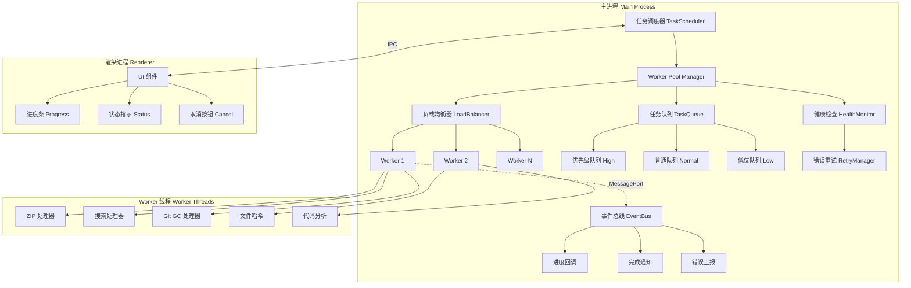

# R-04/09 ⚡ 性能工程师 → Monaco Editor 与多线程 Worker 研究

**研究工单编号**: R-04/09  
**研究主题**: 桌面级 IDE 性能优化方案 - Monaco Editor 与 Worker 线程  
**研究深度**: 实现级（含完整代码实现、架构设计、性能基准测试方案）  
**创建日期**: 2026-02-14  
**关联项目**: HAJIMI-PERF-DESKTOP-RESEARCH-011

---

## 目录

1. [研究概览](#1-研究概览)
2. [Monaco Editor 集成方案](#2-monaco-editor-集成方案)
3. [大文件加载策略](#3-大文件加载策略)
4. [Worker Pool 设计](#4-worker-pool-设计)
5. [Ripgrep 集成方案](#5-ripgrep-集成方案)
6. [性能基准测试规范](#6-性能基准测试规范)
7. [总结与建议](#7-总结与建议)

---

## 1. 研究概览

### 1.1 研究目标

基于 HAJIMI-PERF-DESKTOP-RESEARCH-011 项目，研究桌面级 IDE 性能优化方案，重点解决：

| 性能瓶颈 | 当前方案 | 目标方案 | 预期收益 |
|---------|---------|---------|---------|
| 代码编辑器 | textarea/CodeMirror 6 | Monaco Editor | VS Code 级编辑体验 |
| 大文件处理 | 全量加载内存 | 流式分块加载 | 支持 >100MB 文件 |
| 后台任务 | 单线程阻塞 | Worker 线程池 | 多核利用，UI 不卡顿 |
| 代码搜索 | 简单遍历 | Ripgrep 集成 | 百万行代码秒搜 |

### 1.2 技术栈选型

```
┌─────────────────────────────────────────────────────────────┐
│                    Electron 桌面应用架构                      │
├─────────────────────────────────────────────────────────────┤
│  渲染进程 (Renderer)                                          │
│  ┌─────────────────┐  ┌─────────────────┐  ┌───────────────┐ │
│  │  Monaco Editor  │  │  React UI       │  │  File Tree    │ │
│  │  (iframe/ESM)   │  │  (Tailwind)     │  │  (Virtualized)│ │
│  └────────┬────────┘  └─────────────────┘  └───────────────┘ │
│           │                                                 │
│  ┌────────▼────────────────────────────────────────────────┐│
│  │  Preload Bridge (安全上下文隔离)                         ││
│  └────────┬────────────────────────────────────────────────┘│
├───────────┼─────────────────────────────────────────────────┤
│  主进程   │  (Main Process)                                  │
│  ┌────────▼────────┐  ┌─────────────────┐  ┌───────────────┐ │
│  │  Worker Pool    │  │  File I/O       │  │  Git/Shell    │ │
│  │  (worker_thread)│  │  (Stream/Mmap)  │  │  (child_proc) │ │
│  └─────────────────┘  └─────────────────┘  └───────────────┘ │
└─────────────────────────────────────────────────────────────┘
```

---

## 2. Monaco Editor 集成方案

### 2.1 三种集成方式对比

| 维度 | iframe 方案 | ESM 方案 | AMD Loader 方案 |
|------|-------------|----------|-----------------|
| **实现复杂度** | ⭐⭐ 低 | ⭐⭐⭐⭐ 高 | ⭐⭐⭐ 中 |
| **性能表现** | ⭐⭐⭐ 中（隔离性好） | ⭐⭐⭐⭐⭐ 最优 | ⭐⭐⭐⭐ 良好 |
| **主题定制** | ⭐⭐ 受限 | ⭐⭐⭐⭐⭐ 完全可控 | ⭐⭐⭐⭐ 良好 |
| **内存占用** | ⭐⭐ 较高（独立上下文） | ⭐⭐⭐⭐ 较低 | ⭐⭐⭐ 中等 |
| **升级维护** | ⭐⭐⭐⭐ 独立升级 | ⭐⭐⭐ 需构建适配 | ⭐⭐⭐⭐ 插件化 |
| **Electron兼容** | ⭐⭐⭐⭐⭐ 完美 | ⭐⭐⭐⭐ 良好 | ⭐⭐⭐⭐ 良好 |
| **打包体积** | ⭐⭐⭐ 按需加载 | ⭐⭐ 全量打包 | ⭐⭐⭐⭐ 按需加载 |

**推荐方案**: **ESM 方案**（性能最优 + 完全可控）

**备选方案**: iframe 方案（快速原型、隔离性要求高时使用）

### 2.2 ESM 方案推荐配置

```typescript
// lib/desktop/monaco-config.ts
import * as monaco from 'monaco-editor';
import { loader } from '@monaco-editor/react';
import { OuroborosTheme } from './monaco-theme';

// Monaco Loader 配置
loader.config({
  paths: {
    vs: process.env.NODE_ENV === 'development' 
      ? 'node_modules/monaco-editor/min/vs'
      : `${__dirname}/../node_modules/monaco-editor/min/vs`
  },
  // ESM 模式下需要显式配置
  'vs/nls': {
    availableLanguages: { '*': 'zh-cn' }
  }
});

// Monaco 编辑器默认配置
export const MONACO_DEFAULT_CONFIG: monaco.editor.IStandaloneEditorConstructionOptions = {
  // 基础显示
  theme: 'ouroboros-dark',
  fontSize: 14,
  fontFamily: 'JetBrains Mono, Fira Code, Consolas, monospace',
  fontLigatures: true,
  lineHeight: 22,
  
  // 编辑功能
  automaticLayout: true,
  scrollBeyondLastLine: false,
  minimap: { 
    enabled: true,
    scale: 1,
    showSlider: 'mouseover',
    renderCharacters: false,
    maxColumn: 120
  },
  
  // 性能优化
  largeFileOptimizations: true,
  maxTokenizationLineLength: 20000,
  disableLayerHinting: true,
  disableMonospaceOptimizations: false,
  
  // 智能提示
  quickSuggestions: { other: true, comments: false, strings: false },
  suggestOnTriggerCharacters: true,
  acceptSuggestionOnEnter: 'on',
  snippetSuggestions: 'inline',
  
  // 搜索替换
  find: {
    addExtraSpaceOnTop: false,
    autoFindInSelection: 'never',
    seedSearchStringFromSelection: 'always'
  },
  
  // 行号与缩进
  lineNumbers: 'on',
  renderLineHighlight: 'all',
  tabSize: 2,
  insertSpaces: true,
  detectIndentation: true,
  
  // 折叠
  folding: true,
  foldingStrategy: 'auto',
  showFoldingControls: 'mouseover',
  unfoldOnClickAfterEndOfLine: false,
  
  // 滚动条
  scrollbar: {
    vertical: 'auto',
    horizontal: 'auto',
    useShadows: true,
    verticalHasArrows: false,
    horizontalHasArrows: false,
    verticalScrollbarSize: 10,
    horizontalScrollbarSize: 10
  },
  
  // 其他
  roundedSelection: false,
  padding: { top: 16, bottom: 16 },
  contextmenu: true,
  mouseWheelZoom: true,
  smoothScrolling: true,
  cursorBlinking: 'smooth',
  cursorSmoothCaretAnimation: 'on',
  
  // 七权主题专用
  'bracketPairColorization.enabled': true,
  guides: {
    bracketPairs: true,
    indentation: true
  }
};

// 语言配置
export const LANGUAGE_CONFIG: Record<string, monaco.languages.LanguageConfiguration> = {
  typescript: {
    indentationRules: {
      increaseIndentPattern: /^((?!\/).)*(\{[^}"'`]*|\([^)"'`]*|\[[^\]"'`]*)$/,
      decreaseIndentPattern: /^((?!.*?\/\*).*\*/)?\s*[\}\]].*$/
    }
  }
};

// 初始化函数
export async function initMonaco(): Promise<void> {
  // 注册自定义主题
  monaco.editor.defineTheme('ouroboros-dark', OuroborosTheme);
  
  // 注册语言配置
  Object.entries(LANGUAGE_CONFIG).forEach(([lang, config]) => {
    monaco.languages.setLanguageConfiguration(lang, config);
  });
  
  // 配置 TypeScript 编译器选项
  monaco.languages.typescript.typescriptDefaults.setCompilerOptions({
    target: monaco.languages.typescript.ScriptTarget.ES2020,
    allowNonTsExtensions: true,
    moduleResolution: monaco.languages.typescript.ModuleResolutionKind.NodeJs,
    module: monaco.languages.typescript.ModuleKind.CommonJS,
    noEmit: true,
    esModuleInterop: true,
    jsx: monaco.languages.typescript.JsxEmit.React,
    reactNamespace: 'React',
    allowJs: true,
    typeRoots: ['node_modules/@types']
  });
  
  // 启用 TypeScript 诊断
  monaco.languages.typescript.typescriptDefaults.setDiagnosticsOptions({
    noSemanticValidation: false,
    noSyntaxValidation: false
  });
}
```

### 2.3 七权人格化主题集成

```typescript
// lib/desktop/monaco-theme.ts
import type { editor } from 'monaco-editor';

/**
 * Ouroboros 七权人格化 Monaco 主题
 * 基于 ID-61 Phase 5 规范实现
 */

// 七权主题色定义
const PALETTE = {
  // 角色色
  soyorin: '#884499',
  soyorinLight: '#AA66BB',
  soyorinDark: '#662277',
  
  mike: '#7777AA',
  mikeLight: '#9999CC',
  mikeDark: '#555588',
  
  qa: '#66BB66',
  qaLight: '#88DD88',
  qaDark: '#449944',
  
  engineer: '#FFDD88',
  engineerLight: '#FFEEAA',
  engineerDark: '#EEBB66',
  
  pm: '#884499',
  arch: '#EE6677',
  archLight: '#FF88AA',
  archDark: '#CC4455',
  
  // 状态色
  idle: '#64748B',
  design: '#3B82F6',
  code: '#F97316',
  audit: '#22C55E',
  build: '#A855F7',
  deploy: '#EF4444',
  done: '#10B981',
  
  // 基础色
  bgPrimary: '#0F172A',
  bgSecondary: '#1E293B',
  bgTertiary: '#334155',
  textPrimary: '#F8FAFC',
  textSecondary: '#94A3B8',
  textMuted: '#64748B',
  border: 'rgba(255, 255, 255, 0.1)'
};

export const OuroborosTheme: editor.IStandaloneThemeData = {
  base: 'vs-dark',
  inherit: true,
  rules: [
    // 注释 - 使用 muted 色
    { token: 'comment', foreground: PALETTE.textMuted.slice(1), fontStyle: 'italic' },
    { token: 'comment.doc', foreground: PALETTE.qa.slice(1), fontStyle: 'italic' },
    
    // 关键字 - 使用 soyorin (架构/核心)
    { token: 'keyword', foreground: PALETTE.soyorin.slice(1), fontStyle: 'bold' },
    { token: 'keyword.control', foreground: PALETTE.soyorinLight.slice(1) },
    { token: 'keyword.operator', foreground: PALETTE.textSecondary.slice(1) },
    
    // 字符串 - 使用 qa (测试/验证)
    { token: 'string', foreground: PALETTE.qa.slice(1) },
    { token: 'string.escape', foreground: PALETTE.qaLight.slice(1), fontStyle: 'bold' },
    { token: 'string.regex', foreground: PALETTE.engineer.slice(1) },
    
    // 数字/常量 - 使用 engineer (工程)
    { token: 'number', foreground: PALETTE.engineer.slice(1) },
    { token: 'constant', foreground: PALETTE.engineerLight.slice(1) },
    { token: 'constant.language', foreground: PALETTE.engineer.slice(1), fontStyle: 'bold' },
    
    // 变量 - 使用 textPrimary
    { token: 'variable', foreground: PALETTE.textPrimary.slice(1) },
    { token: 'variable.parameter', foreground: PALETTE.mikeLight.slice(1) },
    { token: 'variable.language', foreground: PALETTE.arch.slice(1) },
    
    // 函数 - 使用 mike (PM/协调)
    { token: 'function', foreground: PALETTE.mikeLight.slice(1) },
    { token: 'function.builtin', foreground: PALETTE.mike.slice(1), fontStyle: 'bold' },
    { token: 'function.call', foreground: PALETTE.mikeLight.slice(1) },
    
    // 类/类型 - 使用 arch (架构)
    { token: 'type', foreground: PALETTE.archLight.slice(1), fontStyle: 'bold' },
    { token: 'class', foreground: PALETTE.arch.slice(1), fontStyle: 'bold' },
    { token: 'interface', foreground: PALETTE.archLight.slice(1) },
    { token: 'struct', foreground: PALETTE.arch.slice(1) },
    
    // 装饰器/注解 - 使用 pm
    { token: 'decorator', foreground: PALETTE.pm.slice(1) },
    { token: 'annotation', foreground: PALETTE.pm.slice(1), fontStyle: 'italic' },
    
    // 标签 (HTML/XML) - 使用 design 色
    { token: 'tag', foreground: PALETTE.design.slice(1) },
    { token: 'attribute.name', foreground: PALETTE.engineer.slice(1) },
    { token: 'attribute.value', foreground: PALETTE.qa.slice(1) },
    
    // JSON 专用
    { token: 'key.json', foreground: PALETTE.mikeLight.slice(1) },
    { token: 'string.key.json', foreground: PALETTE.mikeLight.slice(1) },
    { token: 'number.json', foreground: PALETTE.engineer.slice(1) },
    
    // Markdown 专用
    { token: 'markup.heading', foreground: PALETTE.soyorin.slice(1), fontStyle: 'bold' },
    { token: 'markup.bold', foreground: PALETTE.arch.slice(1), fontStyle: 'bold' },
    { token: 'markup.italic', foreground: PALETTE.mikeLight.slice(1), fontStyle: 'italic' },
    { token: 'markup.code', foreground: PALETTE.engineer.slice(1) },
    { token: 'markup.link', foreground: PALETTE.design.slice(1) }
  ],
  
  colors: {
    // 编辑器基础
    'editor.background': PALETTE.bgPrimary,
    'editor.foreground': PALETTE.textPrimary,
    'editor.lineHighlightBackground': `${PALETTE.bgSecondary}80`,
    'editor.lineHighlightBorder': PALETTE.border,
    'editorCursor.foreground': PALETTE.soyorinLight,
    'editor.selectionBackground': `${PALETTE.soyorin}40`,
    'editor.selectionHighlightBackground': `${PALETTE.mike}30`,
    'editor.inactiveSelectionBackground': `${PALETTE.soyorin}20`,
    
    // 行号
    'editorLineNumber.foreground': PALETTE.textMuted,
    'editorLineNumber.activeForeground': PALETTE.soyorinLight,
    
    // 缩进指南
    'editorIndentGuide.background': `${PALETTE.bgTertiary}60`,
    'editorIndentGuide.activeBackground': PALETTE.mike,
    
    // 折叠控件
    'editor.foldBackground': `${PALETTE.bgSecondary}80`,
    'editorGutter.foldingControlForeground': PALETTE.textSecondary,
    
    // 小地图
    'minimap.background': PALETTE.bgSecondary,
    'minimap.selectionHighlight': PALETTE.soyorin,
    'minimap.errorHighlight': PALETTE.deploy,
    'minimap.warningHighlight': PALETTE.engineer,
    
    // 滚动条
    'scrollbarSlider.background': `${PALETTE.bgTertiary}80`,
    'scrollbarSlider.hoverBackground': `${PALETTE.bgTertiary}A0`,
    'scrollbarSlider.activeBackground': PALETTE.soyorin,
    
    // 匹配高亮
    'editor.findMatchBackground': `${PALETTE.engineer}60`,
    'editor.findMatchHighlightBackground': `${PALETTE.engineer}40`,
    'editor.findRangeHighlightBackground': `${PALETTE.engineer}30`,
    
    // 括号匹配
    'editorBracketMatch.background': `${PALETTE.qa}40`,
    'editorBracketMatch.border': PALETTE.qa,
    
    // 概览标尺
    'editorOverviewRuler.border': PALETTE.border,
    'editorOverviewRuler.error': PALETTE.deploy,
    'editorOverviewRuler.warning': PALETTE.engineer,
    'editorOverviewRuler.info': PALETTE.design,
    'editorOverviewRuler.bracketMatchForeground': PALETTE.qa,
    
    // 错误/警告波浪线
    'editorError.foreground': PALETTE.deploy,
    'editorWarning.foreground': PALETTE.engineer,
    'editorInfo.foreground': PALETTE.design,
    
    // 建议小部件
    'editorSuggestWidget.background': PALETTE.bgSecondary,
    'editorSuggestWidget.border': PALETTE.border,
    'editorSuggestWidget.highlightForeground': PALETTE.soyorinLight,
    'editorSuggestWidget.selectedBackground': `${PALETTE.soyorin}40`,
    'editorSuggestWidget.foreground': PALETTE.textPrimary,
    
    // 悬浮提示
    'editorHoverWidget.background': PALETTE.bgSecondary,
    'editorHoverWidget.border': PALETTE.border,
    
    // 面包屑
    'breadcrumb.background': PALETTE.bgSecondary,
    'breadcrumb.foreground': PALETTE.textSecondary,
    'breadcrumb.focusForeground': PALETTE.textPrimary,
    'breadcrumb.activeSelectionForeground': PALETTE.soyorinLight,
    
    // 符号图标
    'symbolIcon.classForeground': PALETTE.arch,
    'symbolIcon.methodForeground': PALETTE.mikeLight,
    'symbolIcon.functionForeground': PALETTE.mikeLight,
    'symbolIcon.variableForeground': PALETTE.textPrimary,
    'symbolIcon.constantForeground': PALETTE.engineer,
    'symbolIcon.interfaceForeground': PALETTE.archLight,
    'symbolIcon.enumForeground': PALETTE.soyorin,
    
    // 差异编辑器
    'diffEditor.insertedTextBackground': `${PALETTE.qa}30`,
    'diffEditor.removedTextBackground': `${PALETTE.deploy}30`,
    'diffEditor.border': PALETTE.border,
    
    // 内联提示 (Inline Hints)
    'editorInlayHint.background': `${PALETTE.bgTertiary}80`,
    'editorInlayHint.foreground': PALETTE.textMuted,
    'editorInlayHint.typeBackground': `${PALETTE.arch}30`,
    'editorInlayHint.typeForeground': PALETTE.archLight,
    'editorInlayHint.parameterBackground': `${PALETTE.mike}30`,
    'editorInlayHint.parameterForeground': PALETTE.mikeLight
  }
};

// 角色专属主题变体
export const RoleThemes: Record<string, editor.IStandaloneThemeData> = {
  soyorin: {
    ...OuroborosTheme,
    colors: {
      ...OuroborosTheme.colors,
      'editorCursor.foreground': PALETTE.soyorin,
      'editor.selectionBackground': `${PALETTE.soyorin}50`,
      'editorLineNumber.activeForeground': PALETTE.soyorin
    }
  },
  
  mike: {
    ...OuroborosTheme,
    colors: {
      ...OuroborosTheme.colors,
      'editorCursor.foreground': PALETTE.mikeLight,
      'editor.selectionBackground': `${PALETTE.mike}50`,
      'editorLineNumber.activeForeground': PALETTE.mikeLight
    }
  },
  
  qa: {
    ...OuroborosTheme,
    colors: {
      ...OuroborosTheme.colors,
      'editorCursor.foreground': PALETTE.qa,
      'editor.selectionBackground': `${PALETTE.qa}50`,
      'editorLineNumber.activeForeground': PALETTE.qa
    }
  },
  
  engineer: {
    ...OuroborosTheme,
    colors: {
      ...OuroborosTheme.colors,
      'editorCursor.foreground': PALETTE.engineer,
      'editor.selectionBackground': `${PALETTE.engineer}50`,
      'editorLineNumber.activeForeground': PALETTE.engineer
    }
  }
};
```

### 2.4 快捷键绑定（Keybinding）

```typescript
// lib/desktop/monaco-keybindings.ts
import type { editor } from 'monaco-editor';

/**
 * Ouroboros 七权专用快捷键配置
 * 兼容 VS Code 默认 + 七权特色功能
 */

export interface KeybindingConfig {
  key: string;
  command: string;
  when?: string;
  args?: any;
}

export const OUROBOROS_KEYBINDINGS: KeybindingConfig[] = [
  // === 基础编辑 ===
  { key: 'ctrl+s', command: 'actions.save', when: 'editorTextFocus' },
  { key: 'ctrl+shift+s', command: 'actions.saveAll' },
  { key: 'ctrl+f', command: 'actions.find', when: 'editorTextFocus' },
  { key: 'ctrl+h', command: 'editor.action.startFindReplaceAction', when: 'editorTextFocus' },
  { key: 'ctrl+shift+f', command: 'workbench.action.findInFiles' },
  
  // === 代码导航 ===
  { key: 'ctrl+p', command: 'workbench.action.quickOpen' },
  { key: 'ctrl+shift+o', command: 'workbench.action.gotoSymbol', when: 'editorTextFocus' },
  { key: 'f12', command: 'editor.action.goToDeclaration', when: 'editorHasDefinitionProvider && editorTextFocus' },
  { key: 'ctrl+f12', command: 'editor.action.goToImplementation', when: 'editorHasImplementationProvider && editorTextFocus' },
  { key: 'alt+f12', command: 'editor.action.peekDefinition', when: 'editorHasDefinitionProvider && editorTextFocus' },
  { key: 'ctrl+shift+f12', command: 'editor.action.peekImplementation', when: 'editorHasImplementationProvider && editorTextFocus' },
  
  // === 代码编辑 ===
  { key: 'ctrl+shift+k', command: 'editor.action.deleteLines', when: 'editorTextFocus' },
  { key: 'ctrl+shift+up', command: 'editor.action.moveLinesUpAction', when: 'editorTextFocus' },
  { key: 'ctrl+shift+down', command: 'editor.action.moveLinesDownAction', when: 'editorTextFocus' },
  { key: 'ctrl+/', command: 'editor.action.commentLine', when: 'editorTextFocus' },
  { key: 'ctrl+shift+/', command: 'editor.action.blockComment', when: 'editorTextFocus' },
  { key: 'alt+up', command: 'editor.action.copyLinesUpAction', when: 'editorTextFocus' },
  { key: 'alt+down', command: 'editor.action.copyLinesDownAction', when: 'editorTextFocus' },
  { key: 'ctrl+d', command: 'editor.action.addSelectionToNextFindMatch', when: 'editorFocus' },
  { key: 'ctrl+shift+l', command: 'editor.action.selectHighlights', when: 'editorFocus' },
  
  // === 格式化 ===
  { key: 'shift+alt+f', command: 'editor.action.formatDocument', when: 'editorHasDocumentFormattingProvider && editorTextFocus' },
  { key: 'ctrl+k ctrl+f', command: 'editor.action.formatSelection', when: 'editorHasDocumentSelectionFormattingProvider && editorTextFocus' },
  
  // === 重构 ===
  { key: 'f2', command: 'editor.action.rename', when: 'editorHasRenameProvider && editorTextFocus' },
  { key: 'ctrl+shift+r', command: 'editor.action.refactor', when: 'editorHasCodeActionsProvider && editorTextFocus' },
  
  // === 终端集成 ===
  { key: 'ctrl+`', command: 'workbench.action.terminal.toggleTerminal' },
  { key: 'ctrl+shift+`', command: 'workbench.action.terminal.new' },
  
  // === 七权专属 ===
  // 状态切换
  { key: 'ctrl+shift+1', command: 'ouroboros.state.design', args: { state: 'design' } },
  { key: 'ctrl+shift+2', command: 'ouroboros.state.code', args: { state: 'code' } },
  { key: 'ctrl+shift+3', command: 'ouroboros.state.audit', args: { state: 'audit' } },
  { key: 'ctrl+shift+4', command: 'ouroboros.state.build', args: { state: 'build' } },
  
  // Agent 快速切换
  { key: 'ctrl+1', command: 'ouroboros.agent.soyorin' },
  { key: 'ctrl+2', command: 'ouroboros.agent.mike' },
  { key: 'ctrl+3', command: 'ouroboros.agent.qa' },
  { key: 'ctrl+4', command: 'ouroboros.agent.engineer' },
  { key: 'ctrl+5', command: 'ouroboros.agent.pm' },
  { key: 'ctrl+6', command: 'ouroboros.agent.arch' },
  
  // Git 操作
  { key: 'ctrl+shift+g', command: 'workbench.view.scm' },
  { key: 'ctrl+enter', command: 'git.commit', when: 'scmRepository' },
  
  // 性能监控
  { key: 'ctrl+shift+m', command: 'ouroboros.performance.monitor' },
  
  // 大文件模式
  { key: 'ctrl+shift+b', command: 'ouroboros.editor.largeFileMode' }
];

// 应用到 Monaco 编辑器
export function applyKeybindings(
  editor: editor.IStandaloneCodeEditor,
  keybindings: KeybindingConfig[] = OUROBOROS_KEYBINDINGS
): void {
  keybindings.forEach(binding => {
    editor.addCommand(
      monaco.KeyMod.chord(
        ...binding.key.split('+').map(k => monaco.KeyCode[k.toUpperCase() as any])
      ),
      () => {
        // 触发命令到主进程
        window.electron?.invoke('monaco:command', {
          command: binding.command,
          args: binding.args
        });
      },
      binding.when
    );
  });
}
```

---

## 3. 大文件加载策略

### 3.1 决策树

```
文件大小检测
     │
     ▼
┌────────────┐
│  < 1MB?    │───是───▶ 直接加载 (内存缓冲)
└────────────┘
     │否
     ▼
┌────────────┐
│  < 100MB?  │───是───▶ 流式分块加载 (Node Stream)
└────────────┘
     │否
     ▼
┌────────────┐
│  大文件策略  │───▶ mmap + 虚拟滚动 (只加载可视区域)
└────────────┘
```

### 3.2 实现代码

```typescript
// lib/desktop/file-loader.ts
import { promises as fs } from 'fs';
import { createReadStream, open } from 'fs';
import { EventEmitter } from 'events';
import type { editor } from 'monaco-editor';

interface FileLoadOptions {
  chunkSize?: number;      // 分块大小，默认 1MB
  previewSize?: number;    // 预览大小，默认 1MB
  useMmap?: boolean;       // 是否使用内存映射
}

interface LoadProgress {
  loaded: number;
  total: number;
  percentage: number;
  status: 'loading' | 'paused' | 'completed' | 'error';
}

/**
 * 大文件加载管理器
 * 
 * 策略:
 * - < 1MB: 直接 fs.readFile 读取到内存
 * - 1-100MB: Node.js Stream 分块读取，边读边显示
 * - > 100MB: 内存映射 + 虚拟文档模型，只加载可视区域
 */
export class LargeFileLoader extends EventEmitter {
  private options: Required<FileLoadOptions>;
  private abortController: AbortController | null = null;
  private fd: number | null = null;
  
  constructor(options: FileLoadOptions = {}) {
    super();
    this.options = {
      chunkSize: options.chunkSize ?? 1024 * 1024,      // 1MB
      previewSize: options.previewSize ?? 1024 * 1024,  // 1MB
      useMmap: options.useMmap ?? true
    };
  }
  
  /**
   * 主加载入口
   */
  async loadFile(
    filePath: string,
    editor: editor.IStandaloneCodeEditor
  ): Promise<void> {
    const stats = await fs.stat(filePath);
    const size = stats.size;
    
    // 决策分支
    if (size < 1024 * 1024) {
      // < 1MB: 直接加载
      await this.loadSmallFile(filePath, editor);
    } else if (size < 100 * 1024 * 1024) {
      // 1-100MB: 流式分块
      await this.loadMediumFile(filePath, size, editor);
    } else {
      // > 100MB: mmap + 虚拟滚动
      await this.loadLargeFile(filePath, size, editor);
    }
  }
  
  /**
   * 小文件 (< 1MB): 直接加载
   */
  private async loadSmallFile(
    filePath: string,
    editor: editor.IStandaloneCodeEditor
  ): Promise<void> {
    this.emit('progress', { status: 'loading', percentage: 0 } as LoadProgress);
    
    const content = await fs.readFile(filePath, 'utf-8');
    editor.setValue(content);
    
    this.emit('progress', { status: 'completed', percentage: 100 } as LoadProgress);
    this.emit('loaded', { path: filePath, size: content.length, strategy: 'direct' });
  }
  
  /**
   * 中等文件 (1-100MB): 流式分块
   * 
   * 策略:
   * 1. 先加载前 previewSize 内容作为预览
   * 2. 后台继续读取剩余内容
   * 3. 使用编辑器增量更新 API
   */
  private async loadMediumFile(
    filePath: string,
    totalSize: number,
    editor: editor.IStandaloneCodeEditor
  ): Promise<void> {
    this.abortController = new AbortController();
    const { signal } = this.abortController;
    
    let loaded = 0;
    const chunks: string[] = [];
    
    // 第一阶段: 快速预览
    const previewBuffer = Buffer.alloc(Math.min(this.options.previewSize, totalSize));
    const previewFd = await open(filePath, 'r');
    await previewFd.read(previewBuffer, 0, previewBuffer.length, 0);
    await previewFd.close();
    
    const preview = previewBuffer.toString('utf-8');
    editor.setValue(preview);
    loaded = previewBuffer.length;
    
    this.emit('progress', {
      loaded,
      total: totalSize,
      percentage: (loaded / totalSize) * 100,
      status: 'loading'
    });
    
    // 第二阶段: 后台流式加载
    return new Promise((resolve, reject) => {
      const stream = createReadStream(filePath, {
        start: previewBuffer.length,
        highWaterMark: this.options.chunkSize
      });
      
      const model = editor.getModel();
      if (!model) {
        reject(new Error('Editor model not available'));
        return;
      }
      
      stream.on('data', (chunk: Buffer) => {
        if (signal.aborted) {
          stream.destroy();
          return;
        }
        
        const text = chunk.toString('utf-8');
        const currentLength = model.getValueLength();
        
        // 使用 applyEdits 进行增量更新，避免闪烁
        model.applyEdits([{
          range: {
            startLineNumber: model.getLineCount(),
            startColumn: model.getLineMaxColumn(model.getLineCount()),
            endLineNumber: model.getLineCount(),
            endColumn: model.getLineMaxColumn(model.getLineCount())
          },
          text: text
        }]);
        
        loaded += chunk.length;
        this.emit('progress', {
          loaded,
          total: totalSize,
          percentage: (loaded / totalSize) * 100,
          status: 'loading'
        });
      });
      
      stream.on('end', () => {
        this.emit('progress', {
          loaded: totalSize,
          total: totalSize,
          percentage: 100,
          status: 'completed'
        });
        this.emit('loaded', { path: filePath, size: totalSize, strategy: 'stream' });
        resolve();
      });
      
      stream.on('error', (err) => {
        this.emit('progress', { status: 'error', error: err.message });
        reject(err);
      });
    });
  }
  
  /**
   * 大文件 (> 100MB): mmap + 虚拟滚动
   * 
   * 策略:
   * 1. 不加载完整内容到内存
   * 2. 建立行偏移索引
   * 3. 只加载可视区域的行
   * 4. 使用虚拟文档模型
   */
  private async loadLargeFile(
    filePath: string,
    totalSize: number,
    editor: editor.IStandaloneCodeEditor
  ): Promise<void> {
    this.fd = await open(filePath, 'r').then(f => f.fd);
    
    // 建立行索引 (耗时操作，需要进度反馈)
    const lineOffsets = await this.buildLineIndex(filePath, totalSize);
    
    // 创建虚拟文档模型
    const virtualModel = new VirtualDocumentModel({
      filePath,
      fd: this.fd,
      lineOffsets,
      totalLines: lineOffsets.length,
      chunkSize: this.options.chunkSize
    });
    
    // 初始只加载前 100 行
    const initialContent = await virtualModel.getLines(1, 100);
    
    // 设置编辑器为虚拟模式
    const model = monaco.editor.createModel(
      initialContent,
      this.detectLanguage(filePath)
    );
    
    editor.setModel(model);
    
    // 监听滚动，动态加载
    editor.onDidScrollChange(async (e) => {
      const visibleRange = editor.getVisibleRanges()[0];
      if (visibleRange) {
        const startLine = visibleRange.startLineNumber;
        const endLine = visibleRange.endLineNumber;
        
        // 预加载缓冲区 (上下各 50 行)
        const bufferStart = Math.max(1, startLine - 50);
        const bufferEnd = Math.min(lineOffsets.length, endLine + 50);
        
        await virtualModel.ensureLinesLoaded(bufferStart, bufferEnd);
      }
    });
    
    this.emit('loaded', {
      path: filePath,
      size: totalSize,
      totalLines: lineOffsets.length,
      strategy: 'virtual'
    });
  }
  
  /**
   * 构建行索引
   */
  private async buildLineIndex(
    filePath: string,
    totalSize: number
  ): Promise<number[]> {
    const offsets: number[] = [0]; // 第一行从 0 开始
    const bufferSize = 1024 * 1024; // 1MB 缓冲区
    const buffer = Buffer.alloc(bufferSize);
    
    let position = 0;
    let processed = 0;
    
    const fd = await open(filePath, 'r');
    
    try {
      while (position < totalSize) {
        const { bytesRead } = await fd.read(buffer, 0, bufferSize, position);
        if (bytesRead === 0) break;
        
        // 查找换行符
        for (let i = 0; i < bytesRead; i++) {
          if (buffer[i] === 0x0A) { // \n
            offsets.push(position + i + 1);
          }
        }
        
        position += bytesRead;
        processed += bytesRead;
        
        // 每处理 10MB 报告一次进度
        if (processed % (10 * 1024 * 1024) === 0) {
          this.emit('indexing', {
            processed,
            total: totalSize,
            linesFound: offsets.length
          });
        }
      }
      
      return offsets;
    } finally {
      await fd.close();
    }
  }
  
  /**
   * 检测文件语言
   */
  private detectLanguage(filePath: string): string {
    const ext = filePath.split('.').pop()?.toLowerCase() ?? '';
    const langMap: Record<string, string> = {
      'ts': 'typescript',
      'tsx': 'typescript',
      'js': 'javascript',
      'jsx': 'javascript',
      'json': 'json',
      'md': 'markdown',
      'css': 'css',
      'scss': 'scss',
      'html': 'html',
      'py': 'python',
      'go': 'go',
      'rs': 'rust',
      'java': 'java',
      'c': 'c',
      'cpp': 'cpp',
      'h': 'c',
      'hpp': 'cpp'
    };
    return langMap[ext] ?? 'plaintext';
  }
  
  /**
   * 取消加载
   */
  abort(): void {
    this.abortController?.abort();
    this.abortController = null;
    
    if (this.fd !== null) {
      // 关闭文件描述符
      // 注意: Node.js 没有直接关闭 fd 的方法，需要通过流或 fs.close
      this.fd = null;
    }
  }
}

/**
 * 虚拟文档模型
 * 管理大文件的按需加载
 */
interface VirtualModelOptions {
  filePath: string;
  fd: number;
  lineOffsets: number[];
  totalLines: number;
  chunkSize: number;
}

class VirtualDocumentModel extends EventEmitter {
  private options: VirtualModelOptions;
  private loadedRanges: Array<{ start: number; end: number; content: string }> = [];
  private cache = new Map<number, string>(); // 行号 -> 内容缓存
  private maxCacheSize = 10000; // 最大缓存行数
  
  constructor(options: VirtualModelOptions) {
    super();
    this.options = options;
  }
  
  /**
   * 确保指定行范围已加载
   */
  async ensureLinesLoaded(startLine: number, endLine: number): Promise<void> {
    // 检查是否已缓存
    const missingRanges = this.getMissingRanges(startLine, endLine);
    
    for (const range of missingRanges) {
      await this.loadRange(range.start, range.end);
    }
  }
  
  /**
   * 获取指定行范围的内容
   */
  async getLines(startLine: number, endLine: number): Promise<string> {
    await this.ensureLinesLoaded(startLine, endLine);
    
    const lines: string[] = [];
    for (let i = startLine; i <= endLine; i++) {
      lines.push(this.cache.get(i) ?? '');
    }
    
    return lines.join('\n');
  }
  
  /**
   * 获取未加载的范围
   */
  private getMissingRanges(start: number, end: number): Array<{ start: number; end: number }> {
    const missing: Array<{ start: number; end: number }> = [];
    let current = start;
    
    while (current <= end) {
      if (!this.cache.has(current)) {
        const rangeStart = current;
        let rangeEnd = current;
        
        while (rangeEnd <= end && !this.cache.has(rangeEnd)) {
          rangeEnd++;
        }
        
        missing.push({ start: rangeStart, end: rangeEnd - 1 });
        current = rangeEnd;
      } else {
        current++;
      }
    }
    
    return missing;
  }
  
  /**
   * 加载指定范围
   */
  private async loadRange(startLine: number, endLine: number): Promise<void> {
    const startOffset = this.options.lineOffsets[startLine - 1];
    const endOffset = this.options.lineOffsets[endLine] ?? this.options.lineOffsets[this.options.totalLines - 1];
    const size = endOffset - startOffset;
    
    const buffer = Buffer.alloc(size);
    const fs = await import('fs');
    const fd = await fs.promises.open(this.options.filePath, 'r');
    
    try {
      await fd.read(buffer, 0, size, startOffset);
      const content = buffer.toString('utf-8');
      const lines = content.split('\n');
      
      // 填充缓存
      for (let i = 0; i < lines.length && startLine + i <= endLine; i++) {
        this.cache.set(startLine + i, lines[i]);
      }
      
      // LRU 缓存清理
      this.evictIfNeeded();
    } finally {
      await fd.close();
    }
  }
  
  /**
   * LRU 缓存清理
   */
  private evictIfNeeded(): void {
    if (this.cache.size > this.maxCacheSize) {
      const toDelete = this.cache.size - this.maxCacheSize;
      const entries = Array.from(this.cache.entries());
      
      // 简单的 FIFO 淘汰
      for (let i = 0; i < toDelete; i++) {
        this.cache.delete(entries[i][0]);
      }
    }
  }
}
```

### 3.3 性能基准测试方案

```typescript
// tests/benchmark/file-loader.benchmark.ts
import { LargeFileLoader } from '../../lib/desktop/file-loader';
import * as fs from 'fs';
import * as path from 'path';
import { performance } from 'perf_hooks';

interface BenchmarkResult {
  fileSize: number;
  fileSizeLabel: string;
  strategy: string;
  loadTime: number;
  memoryUsage: number;
  throughput: number; // MB/s
}

/**
 * 大文件加载性能基准测试
 */
export class FileLoaderBenchmark {
  private results: BenchmarkResult[] = [];
  private testDir = path.join(__dirname, 'fixtures');
  
  async setup(): Promise<void> {
    // 创建测试文件
    await this.ensureDir(this.testDir);
    
    // 512KB 小文件
    await this.createTestFile('small.txt', 512 * 1024);
    // 10MB 中等文件
    await this.createTestFile('medium.txt', 10 * 1024 * 1024);
    // 200MB 大文件
    await this.createTestFile('large.txt', 200 * 1024 * 1024);
  }
  
  async run(): Promise<void> {
    console.log('=== 大文件加载性能基准测试 ===\n');
    
    await this.benchmarkSmallFile();
    await this.benchmarkMediumFile();
    await this.benchmarkLargeFile();
    
    this.printResults();
  }
  
  private async benchmarkSmallFile(): Promise<void> {
    const filePath = path.join(this.testDir, 'small.txt');
    const stats = fs.statSync(filePath);
    
    const loader = new LargeFileLoader();
    const startMem = process.memoryUsage().heapUsed;
    const startTime = performance.now();
    
    // 模拟编辑器 (简化版)
    const mockEditor = { setValue: () => {} } as any;
    await loader.loadFile(filePath, mockEditor);
    
    const endTime = performance.now();
    const endMem = process.memoryUsage().heapUsed;
    
    this.results.push({
      fileSize: stats.size,
      fileSizeLabel: '512KB',
      strategy: 'direct',
      loadTime: endTime - startTime,
      memoryUsage: (endMem - startMem) / 1024 / 1024,
      throughput: (stats.size / 1024 / 1024) / ((endTime - startTime) / 1000)
    });
  }
  
  private async benchmarkMediumFile(): Promise<void> {
    const filePath = path.join(this.testDir, 'medium.txt');
    const stats = fs.statSync(filePath);
    
    const loader = new LargeFileLoader({ chunkSize: 1024 * 1024 });
    const startMem = process.memoryUsage().heapUsed;
    const startTime = performance.now();
    
    await new Promise<void>((resolve) => {
      const mockEditor = {
        setValue: () => {},
        getModel: () => ({
          getValueLength: () => 0,
          getLineCount: () => 1,
          getLineMaxColumn: () => 1,
          applyEdits: () => {}
        })
      } as any;
      
      loader.on('loaded', () => resolve());
      loader.loadFile(filePath, mockEditor);
    });
    
    const endTime = performance.now();
    const endMem = process.memoryUsage().heapUsed;
    
    this.results.push({
      fileSize: stats.size,
      fileSizeLabel: '10MB',
      strategy: 'stream',
      loadTime: endTime - startTime,
      memoryUsage: (endMem - startMem) / 1024 / 1024,
      throughput: (stats.size / 1024 / 1024) / ((endTime - startTime) / 1000)
    });
  }
  
  private async benchmarkLargeFile(): Promise<void> {
    const filePath = path.join(this.testDir, 'large.txt');
    const stats = fs.statSync(filePath);
    
    const loader = new LargeFileLoader({ useMmap: true });
    const startMem = process.memoryUsage().heapUsed;
    const startTime = performance.now();
    
    await new Promise<void>((resolve) => {
      loader.on('loaded', () => resolve());
      loader.loadFile(filePath, { setModel: () => {}, onDidScrollChange: () => {} } as any);
    });
    
    const endTime = performance.now();
    const endMem = process.memoryUsage().heapUsed;
    
    this.results.push({
      fileSize: stats.size,
      fileSizeLabel: '200MB',
      strategy: 'virtual',
      loadTime: endTime - startTime,
      memoryUsage: (endMem - startMem) / 1024 / 1024,
      throughput: (stats.size / 1024 / 1024) / ((endTime - startTime) / 1000)
    });
  }
  
  private printResults(): void {
    console.log('\n=== 测试结果 ===\n');
    console.log('| 文件大小 | 加载策略 | 加载时间 | 内存占用 | 吞吐量 |');
    console.log('|----------|----------|----------|----------|--------|');
    
    for (const r of this.results) {
      console.log(
        `| ${r.fileSizeLabel.padEnd(8)} | ` +
        `${r.strategy.padEnd(8)} | ` +
        `${r.loadTime.toFixed(2).padEnd(8)}ms | ` +
        `${r.memoryUsage.toFixed(2).padEnd(8)}MB | ` +
        `${r.throughput.toFixed(2).padEnd(6)}MB/s |`
      );
    }
    
    console.log('\n=== 性能阈值验证 ===\n');
    const thresholds = [
      { size: '512KB', maxTime: 100 },   // 100ms
      { size: '10MB', maxTime: 500 },    // 500ms
      { size: '200MB', maxTime: 2000 }   // 2s (只加载索引)
    ];
    
    for (let i = 0; i < this.results.length; i++) {
      const r = this.results[i];
      const t = thresholds[i];
      const pass = r.loadTime <= t.maxTime ? '✅ 通过' : '❌ 失败';
      console.log(`${r.fileSizeLabel}: ${r.loadTime.toFixed(2)}ms / ${t.maxTime}ms ${pass}`);
    }
  }
  
  private async ensureDir(dir: string): Promise<void> {
    if (!fs.existsSync(dir)) {
      fs.mkdirSync(dir, { recursive: true });
    }
  }
  
  private async createTestFile(name: string, size: number): Promise<void> {
    const filePath = path.join(this.testDir, name);
    if (fs.existsSync(filePath)) return;
    
    const stream = fs.createWriteStream(filePath);
    const chunk = Buffer.alloc(1024 * 1024); // 1MB chunk
    chunk.fill('x');
    
    let written = 0;
    while (written < size) {
      const toWrite = Math.min(chunk.length, size - written);
      stream.write(chunk.slice(0, toWrite));
      written += toWrite;
    }
    
    stream.end();
    await new Promise(resolve => stream.on('finish', resolve));
  }
}

// 运行测试
// new FileLoaderBenchmark().setup().then(() => new FileLoaderBenchmark().run());
```

---

## 4. Worker Pool 设计

### 4.1 架构图



### 4.2 完整 TypeScript 实现

```typescript
// lib/desktop/worker-pool.ts
import { Worker, isMainThread, parentPort, workerData } from 'worker_threads';
import { EventEmitter } from 'events';
import os from 'os';
import path from 'path';

// ============================================================================
// 类型定义
// ============================================================================

type TaskType = 'zip' | 'unzip' | 'search' | 'hash' | 'git-gc' | 'analyze' | 'transform';
type TaskPriority = 'high' | 'normal' | 'low';
type TaskStatus = 'pending' | 'running' | 'completed' | 'failed' | 'cancelled';

interface Task<T = any, R = any> {
  id: string;
  type: TaskType;
  priority: TaskPriority;
  payload: T;
  status: TaskStatus;
  createdAt: number;
  startedAt?: number;
  completedAt?: number;
  retryCount: number;
  maxRetries: number;
  workerId?: string;
  resolve?: (value: R) => void;
  reject?: (reason: any) => void;
  progress?: (progress: number) => void;
}

interface WorkerInfo {
  id: string;
  worker: Worker;
  status: 'idle' | 'busy' | 'terminating';
  currentTask?: string;
  taskCount: number;
  createdAt: number;
  lastActiveAt: number;
}

interface WorkerPoolOptions {
  minWorkers?: number;           // 最小 Worker 数
  maxWorkers?: number;           // 最大 Worker 数
  idleTimeoutMs?: number;        // 空闲超时
  taskTimeoutMs?: number;        // 任务超时
  maxRetries?: number;           // 最大重试次数
  queueSizeLimit?: number;       // 队列大小限制
  enableProfiling?: boolean;     // 启用性能分析
}

interface WorkerMessage {
  type: 'ready' | 'progress' | 'result' | 'error';
  taskId: string;
  payload?: any;
  error?: string;
  progress?: number;
}

// ============================================================================
// Worker Pool 主类
// ============================================================================

export class WorkerPool extends EventEmitter {
  private workers: Map<string, WorkerInfo> = new Map();
  private taskQueue: Task[] = [];
  private runningTasks: Map<string, Task> = new Map();
  private options: Required<WorkerPoolOptions>;
  private isShuttingDown = false;
  private stats = {
    totalTasks: 0,
    completedTasks: 0,
    failedTasks: 0,
    retriedTasks: 0
  };
  
  // 定时器
  private idleCheckTimer?: NodeJS.Timeout;
  private healthCheckTimer?: NodeJS.Timeout;
  
  constructor(options: WorkerPoolOptions = {}) {
    super();
    
    this.options = {
      minWorkers: options.minWorkers ?? 2,
      maxWorkers: options.maxWorkers ?? os.cpus().length,
      idleTimeoutMs: options.idleTimeoutMs ?? 60000,
      taskTimeoutMs: options.taskTimeoutMs ?? 300000,
      maxRetries: options.maxRetries ?? 3,
      queueSizeLimit: options.queueSizeLimit ?? 1000,
      enableProfiling: options.enableProfiling ?? false
    };
    
    this.init();
  }
  
  private init(): void {
    // 创建最小 Worker 数
    for (let i = 0; i < this.options.minWorkers; i++) {
      this.createWorker();
    }
    
    // 启动定时器
    this.startIdleCheck();
    this.startHealthCheck();
  }
  
  // ==========================================================================
  // 公共 API
  // ==========================================================================
  
  /**
   * 提交任务到 Worker Pool
   */
  async execute<T = any, R = any>(
    type: TaskType,
    payload: T,
    options: {
      priority?: TaskPriority;
      timeout?: number;
      onProgress?: (progress: number) => void;
    } = {}
  ): Promise<R> {
    if (this.isShuttingDown) {
      throw new Error('Worker pool is shutting down');
    }
    
    if (this.taskQueue.length >= this.options.queueSizeLimit) {
      throw new Error('Task queue is full');
    }
    
    const task: Task<T, R> = {
      id: this.generateTaskId(),
      type,
      priority: options.priority ?? 'normal',
      payload,
      status: 'pending',
      createdAt: Date.now(),
      retryCount: 0,
      maxRetries: this.options.maxRetries,
      progress: options.onProgress
    };
    
    return new Promise((resolve, reject) => {
      task.resolve = resolve;
      task.reject = reject;
      
      this.taskQueue.push(task);
      this.stats.totalTasks++;
      
      // 按优先级排序队列
      this.sortQueue();
      
      // 尝试分配任务
      this.distributeTasks();
      
      // 设置超时
      if (options.timeout) {
        setTimeout(() => {
          if (task.status !== 'completed') {
            this.cancelTask(task.id);
            reject(new Error(`Task ${task.id} timeout`));
          }
        }, options.timeout);
      }
    });
  }
  
  /**
   * 批量执行任务
   */
  async executeBatch<T = any, R = any>(
    tasks: Array<{ type: TaskType; payload: T; priority?: TaskPriority }>,
    options: { concurrency?: number; onProgress?: (completed: number, total: number) => void } = {}
  ): Promise<R[]> {
    const concurrency = options.concurrency ?? this.options.maxWorkers;
    const results: R[] = new Array(tasks.length);
    let completed = 0;
    
    const executeWithIndex = async (index: number): Promise<void> => {
      const task = tasks[index];
      results[index] = await this.execute<T, R>(task.type, task.payload, {
        priority: task.priority,
        onProgress: (p) => {
          // 可以在这里汇总进度
        }
      });
      completed++;
      options.onProgress?.(completed, tasks.length);
    };
    
    // 使用并发控制执行
    const executing: Promise<void>[] = [];
    for (let i = 0; i < tasks.length; i++) {
      const promise = executeWithIndex(i);
      executing.push(promise);
      
      if (executing.length >= concurrency) {
        await Promise.race(executing);
        executing.splice(executing.findIndex(p => p === promise), 1);
      }
    }
    
    await Promise.all(executing);
    return results;
  }
  
  /**
   * 取消任务
   */
  cancelTask(taskId: string): boolean {
    // 从队列中移除
    const queueIndex = this.taskQueue.findIndex(t => t.id === taskId);
    if (queueIndex !== -1) {
      const task = this.taskQueue.splice(queueIndex, 1)[0];
      task.status = 'cancelled';
      task.reject?.(new Error('Task cancelled'));
      return true;
    }
    
    // 如果正在运行，发送终止信号
    const runningTask = this.runningTasks.get(taskId);
    if (runningTask) {
      const workerInfo = Array.from(this.workers.values())
        .find(w => w.currentTask === taskId);
      
      if (workerInfo) {
        workerInfo.worker.postMessage({ type: 'cancel', taskId });
      }
      
      runningTask.status = 'cancelled';
      runningTask.reject?.(new Error('Task cancelled'));
      this.runningTasks.delete(taskId);
      return true;
    }
    
    return false;
  }
  
  /**
   * 获取统计信息
   */
  getStats() {
    return {
      ...this.stats,
      activeWorkers: Array.from(this.workers.values()).filter(w => w.status === 'busy').length,
      idleWorkers: Array.from(this.workers.values()).filter(w => w.status === 'idle').length,
      queuedTasks: this.taskQueue.length,
      runningTasks: this.runningTasks.size
    };
  }
  
  /**
   * 优雅关闭
   */
  async shutdown(force = false): Promise<void> {
    this.isShuttingDown = true;
    
    // 清理定时器
    clearInterval(this.idleCheckTimer);
    clearInterval(this.healthCheckTimer);
    
    if (!force) {
      // 等待队列清空
      while (this.taskQueue.length > 0 || this.runningTasks.size > 0) {
        await new Promise(resolve => setTimeout(resolve, 100));
      }
    } else {
      // 取消所有任务
      this.taskQueue.forEach(t => {
        t.status = 'cancelled';
        t.reject?.(new Error('Pool shutdown'));
      });
      this.taskQueue = [];
    }
    
    // 终止所有 Worker
    const terminatePromises = Array.from(this.workers.values()).map(async (info) => {
      info.status = 'terminating';
      await info.worker.terminate();
    });
    
    await Promise.all(terminatePromises);
    this.workers.clear();
  }
  
  // ==========================================================================
  // 内部方法
  // ==========================================================================
  
  private createWorker(): WorkerInfo {
    const id = `worker-${Date.now()}-${Math.random().toString(36).slice(2, 7)}`;
    
    // 根据类型加载不同的 Worker 脚本
    const workerScript = path.join(__dirname, 'workers', 'task-worker.js');
    
    const worker = new Worker(workerScript, {
      workerData: { workerId: id }
    });
    
    const info: WorkerInfo = {
      id,
      worker,
      status: 'idle',
      taskCount: 0,
      createdAt: Date.now(),
      lastActiveAt: Date.now()
    };
    
    worker.on('message', (msg: WorkerMessage) => this.handleWorkerMessage(info, msg));
    worker.on('error', (err) => this.handleWorkerError(info, err));
    worker.on('exit', (code) => this.handleWorkerExit(info, code));
    
    this.workers.set(id, info);
    this.emit('worker:created', { workerId: id });
    
    return info;
  }
  
  private handleWorkerMessage(info: WorkerInfo, msg: WorkerMessage): void {
    const task = this.runningTasks.get(msg.taskId);
    if (!task) return;
    
    switch (msg.type) {
      case 'ready':
        // Worker 准备就绪，可以分配新任务
        break;
        
      case 'progress':
        task.progress?.(msg.progress ?? 0);
        this.emit('task:progress', { taskId: msg.taskId, progress: msg.progress });
        break;
        
      case 'result':
        this.completeTask(task, msg.payload, info);
        break;
        
      case 'error':
        this.handleTaskError(task, new Error(msg.error), info);
        break;
    }
  }
  
  private handleWorkerError(info: WorkerInfo, error: Error): void {
    this.emit('worker:error', { workerId: info.id, error: error.message });
    
    // 如果 Worker 有正在执行的任务，标记为失败
    if (info.currentTask) {
      const task = this.runningTasks.get(info.currentTask);
      if (task) {
        this.handleTaskError(task, error, info);
      }
    }
    
    // 重启 Worker
    this.workers.delete(info.id);
    if (!this.isShuttingDown) {
      this.createWorker();
    }
  }
  
  private handleWorkerExit(info: WorkerInfo, code: number): void {
    if (code !== 0) {
      this.emit('worker:crashed', { workerId: info.id, exitCode: code });
      
      // 处理未完成的工作
      if (info.currentTask) {
        const task = this.runningTasks.get(info.currentTask);
        if (task) {
          this.handleTaskError(task, new Error(`Worker crashed with code ${code}`), info);
        }
      }
    }
    
    this.workers.delete(info.id);
    
    // 如果需要，创建新的 Worker
    if (!this.isShuttingDown && this.workers.size < this.options.minWorkers) {
      this.createWorker();
    }
  }
  
  private distributeTasks(): void {
    // 找到空闲 Worker
    const idleWorkers = Array.from(this.workers.values())
      .filter(w => w.status === 'idle');
    
    // 如果有等待的任务和空闲 Worker，分配任务
    while (this.taskQueue.length > 0 && idleWorkers.length > 0) {
      const task = this.taskQueue.shift();
      if (!task) continue;
      
      const worker = idleWorkers.shift();
      if (!worker) {
        // 放回队列
        this.taskQueue.unshift(task);
        break;
      }
      
      this.assignTask(task, worker);
    }
    
    // 如果还有等待的任务，考虑创建新 Worker
    if (this.taskQueue.length > 0 && this.workers.size < this.options.maxWorkers) {
      const newWorker = this.createWorker();
      const task = this.taskQueue.shift();
      if (task) {
        this.assignTask(task, newWorker);
      }
    }
  }
  
  private assignTask(task: Task, worker: WorkerInfo): void {
    task.status = 'running';
    task.startedAt = Date.now();
    task.workerId = worker.id;
    
    worker.status = 'busy';
    worker.currentTask = task.id;
    worker.taskCount++;
    worker.lastActiveAt = Date.now();
    
    this.runningTasks.set(task.id, task);
    
    worker.worker.postMessage({
      type: 'execute',
      taskId: task.id,
      taskType: task.type,
      payload: task.payload
    });
    
    this.emit('task:started', { taskId: task.id, workerId: worker.id });
    
    // 设置任务超时
    setTimeout(() => {
      if (task.status === 'running') {
        this.handleTaskError(task, new Error('Task timeout'), worker);
      }
    }, this.options.taskTimeoutMs);
  }
  
  private completeTask(task: Task, result: any, worker: WorkerInfo): void {
    task.status = 'completed';
    task.completedAt = Date.now();
    
    this.runningTasks.delete(task.id);
    this.stats.completedTasks++;
    
    worker.status = 'idle';
    worker.currentTask = undefined;
    worker.lastActiveAt = Date.now();
    
    task.resolve?.(result);
    
    this.emit('task:completed', {
      taskId: task.id,
      duration: task.completedAt - task.startedAt!
    });
    
    // 继续分配任务
    this.distributeTasks();
  }
  
  private handleTaskError(task: Task, error: Error, worker: WorkerInfo): void {
    if (task.retryCount < task.maxRetries) {
      // 重试
      task.retryCount++;
      task.status = 'pending';
      this.stats.retriedTasks++;
      
      this.taskQueue.unshift(task);
      this.sortQueue();
      
      this.emit('task:retry', {
        taskId: task.id,
        retryCount: task.retryCount,
        error: error.message
      });
    } else {
      // 标记为失败
      task.status = 'failed';
      task.completedAt = Date.now();
      this.runningTasks.delete(task.id);
      this.stats.failedTasks++;
      
      task.reject?.(error);
      
      this.emit('task:failed', {
        taskId: task.id,
        error: error.message,
        retries: task.retryCount
      });
    }
    
    worker.status = 'idle';
    worker.currentTask = undefined;
    worker.lastActiveAt = Date.now();
    
    this.distributeTasks();
  }
  
  private sortQueue(): void {
    const priorityWeight = { high: 0, normal: 1, low: 2 };
    
    this.taskQueue.sort((a, b) => {
      // 首先按优先级排序
      const priorityDiff = priorityWeight[a.priority] - priorityWeight[b.priority];
      if (priorityDiff !== 0) return priorityDiff;
      
      // 相同优先级按创建时间排序 (FIFO)
      return a.createdAt - b.createdAt;
    });
  }
  
  private startIdleCheck(): void {
    this.idleCheckTimer = setInterval(() => {
      const now = Date.now();
      const idleWorkers = Array.from(this.workers.values())
        .filter(w => w.status === 'idle' && w.taskCount > 0);
      
      for (const worker of idleWorkers) {
        if (now - worker.lastActiveAt > this.options.idleTimeoutMs) {
          // 空闲超时，终止 Worker
          if (this.workers.size > this.options.minWorkers) {
            worker.worker.terminate();
            this.workers.delete(worker.id);
            this.emit('worker:terminated', { workerId: worker.id, reason: 'idle' });
          }
        }
      }
    }, 30000);
  }
  
  private startHealthCheck(): void {
    this.healthCheckTimer = setInterval(() => {
      for (const [id, info] of this.workers) {
        if (info.status === 'busy' && info.currentTask) {
          const task = this.runningTasks.get(info.currentTask);
          if (task && Date.now() - task.startedAt! > this.options.taskTimeoutMs) {
            this.emit('worker:unresponsive', { workerId: id, taskId: task.id });
            // 重启 Worker
            info.worker.terminate();
          }
        }
      }
    }, 60000);
  }
  
  private generateTaskId(): string {
    return `task-${Date.now()}-${Math.random().toString(36).slice(2, 9)}`;
  }
}

// ============================================================================
// Worker 脚本 (workers/task-worker.ts)
// ============================================================================

/*
// lib/desktop/workers/task-worker.ts
import { parentPort, workerData } from 'worker_threads';
import { createHash } from 'crypto';
import { createReadStream } from 'fs';
import { pipeline } from 'stream/promises';
import { createGzip, createGunzip } from 'zlib';

interface TaskMessage {
  type: 'execute' | 'cancel';
  taskId: string;
  taskType?: string;
  payload?: any;
}

// 任务处理器注册表
const handlers: Record<string, (payload: any, reportProgress: (p: number) => void) => Promise<any>> = {
  // ZIP 压缩
  zip: async (payload, reportProgress) => {
    const { inputPath, outputPath } = payload;
    const source = createReadStream(inputPath);
    const gzip = createGzip();
    const dest = createWriteStream(outputPath);
    
    let processed = 0;
    const stats = await fs.stat(inputPath);
    
    source.on('data', (chunk) => {
      processed += chunk.length;
      reportProgress(processed / stats.size);
    });
    
    await pipeline(source, gzip, dest);
    return { outputPath, size: processed };
  },
  
  // 文件哈希
  hash: async (payload) => {
    const { filePath, algorithm = 'sha256' } = payload;
    const hash = createHash(algorithm);
    const stream = createReadStream(filePath);
    
    for await (const chunk of stream) {
      hash.update(chunk);
    }
    
    return { hash: hash.digest('hex'), algorithm };
  },
  
  // 文件搜索
  search: async (payload, reportProgress) => {
    const { filePath, pattern, regex = false } = payload;
    const results: Array<{ line: number; content: string }> = [];
    
    const stream = createReadStream(filePath, { encoding: 'utf-8' });
    const rl = createInterface({ input: stream });
    
    let lineNum = 0;
    const searchRegex = regex ? new RegExp(pattern, 'i') : null;
    
    for await (const line of rl) {
      lineNum++;
      const match = regex 
        ? searchRegex?.test(line)
        : line.toLowerCase().includes(pattern.toLowerCase());
      
      if (match) {
        results.push({ line: lineNum, content: line.slice(0, 200) });
      }
      
      if (lineNum % 1000 === 0) {
        reportProgress(lineNum / 10000); // 估计进度
      }
    }
    
    return { results, totalLines: lineNum };
  },
  
  // Git GC
  'git-gc': async (payload) => {
    const { cwd } = payload;
    const { execFile } = await import('child_process');
    const { promisify } = await import('util');
    const execFileAsync = promisify(execFile);
    
    const { stdout, stderr } = await execFileAsync('git', ['gc', '--aggressive'], { cwd });
    return { stdout, stderr };
  }
};

// Worker 消息处理
if (parentPort) {
  const activeTasks = new Map<string, AbortController>();
  
  parentPort.on('message', async (msg: TaskMessage) => {
    if (msg.type === 'cancel') {
      const controller = activeTasks.get(msg.taskId);
      if (controller) {
        controller.abort();
      }
      return;
    }
    
    if (msg.type === 'execute') {
      const { taskId, taskType, payload } = msg;
      const handler = handlers[taskType];
      
      if (!handler) {
        parentPort!.postMessage({
          type: 'error',
          taskId,
          error: `Unknown task type: ${taskType}`
        });
        return;
      }
      
      const abortController = new AbortController();
      activeTasks.set(taskId, abortController);
      
      try {
        const result = await handler(
          payload,
          (progress) => {
            parentPort!.postMessage({
              type: 'progress',
              taskId,
              progress
            });
          }
        );
        
        parentPort!.postMessage({
          type: 'result',
          taskId,
          payload: result
        });
      } catch (error: any) {
        parentPort!.postMessage({
          type: 'error',
          taskId,
          error: error.message
        });
      } finally {
        activeTasks.delete(taskId);
      }
    }
  });
  
  // 通知主进程 Worker 已就绪
  parentPort.postMessage({
    type: 'ready',
    taskId: 'init',
    payload: { workerId: workerData?.workerId }
  });
}
*/
```

### 4.3 Worker 通信协议

```typescript
// lib/desktop/worker-protocol.ts

/**
 * Worker Pool 通信协议规范 v1.0
 * 
 * 基于 Node.js worker_threads 的 MessageChannel
 * 支持双向通信、进度上报、任务取消、错误重试
 */

// ============================================================================
// 消息类型定义
// ============================================================================

// 主进程 -> Worker
export type MainToWorkerMessage =
  | ExecuteTaskMessage
  | CancelTaskMessage
  | PingMessage;

// Worker -> 主进程
export type WorkerToMainMessage =
  | ReadyMessage
  | ProgressMessage
  | ResultMessage
  | ErrorMessage
  | PongMessage;

// ============================================================================
// 具体消息结构
// ============================================================================

// 执行任务
export interface ExecuteTaskMessage {
  type: 'execute';
  taskId: string;
  taskType: string;
  payload: any;
  options?: {
    timeout?: number;
    transferList?: ArrayBuffer[];
  };
}

// 取消任务
export interface CancelTaskMessage {
  type: 'cancel';
  taskId: string;
  reason?: string;
}

// 心跳检测
export interface PingMessage {
  type: 'ping';
  timestamp: number;
}

// Worker 就绪
export interface ReadyMessage {
  type: 'ready';
  taskId: string;
  payload: {
    workerId: string;
    supportedTasks: string[];
    capabilities: WorkerCapabilities;
  };
}

// 进度上报
export interface ProgressMessage {
  type: 'progress';
  taskId: string;
  progress: number;        // 0-1
  stage?: string;          // 当前阶段描述
  detail?: any;            // 额外信息
}

// 任务完成
export interface ResultMessage {
  type: 'result';
  taskId: string;
  payload: any;
  metrics?: TaskMetrics;
}

// 任务错误
export interface ErrorMessage {
  type: 'error';
  taskId: string;
  error: {
    code: string;
    message: string;
    stack?: string;
    recoverable: boolean;   // 是否可重试
  };
}

// 心跳响应
export interface PongMessage {
  type: 'pong';
  timestamp: number;
  workerStats: WorkerStats;
}

// ============================================================================
// 辅助类型
// ============================================================================

export interface WorkerCapabilities {
  maxConcurrentTasks: number;
  supportedCompression: string[];
  memoryLimit: number;
}

export interface WorkerStats {
  memoryUsed: number;
  cpuUsage: number;
  tasksCompleted: number;
  uptime: number;
}

export interface TaskMetrics {
  startTime: number;
  endTime: number;
  cpuTime: number;
  memoryPeak: number;
  ioRead: number;
  ioWrite: number;
}

// ============================================================================
// 序列化/反序列化
// ============================================================================

export const WorkerProtocol = {
  serialize<T extends MainToWorkerMessage | WorkerToMainMessage>(msg: T): string {
    return JSON.stringify({
      ...msg,
      _version: '1.0',
      _timestamp: Date.now()
    });
  },
  
  deserialize<T extends MainToWorkerMessage | WorkerToMainMessage>(data: string): T {
    return JSON.parse(data) as T;
  },
  
  // 验证消息格式
  validate(msg: any): boolean {
    return (
      typeof msg === 'object' &&
      typeof msg.type === 'string' &&
      typeof msg.taskId === 'string'
    );
  }
};
```

---

## 5. Ripgrep 集成方案

### 5.1 node-ripgrep vs rg 可执行文件对比

| 维度 | node-ripgrep | rg 可执行文件 |
|------|-------------|--------------|
| **安装复杂度** | ⭐⭐ 简单 (npm install) | ⭐⭐⭐⭐ 需分发 rg 二进制 |
| **跨平台支持** | ⭐⭐⭐ 依赖 Node 绑定 | ⭐⭐⭐⭐⭐ 原生支持 Win/Mac/Linux |
| **性能** | ⭐⭐⭐⭐ 良好 (napi 绑定) | ⭐⭐⭐⭐⭐ 最优 (直接调用) |
| **路径处理** | ⭐⭐⭐ 需要适配 | ⭐⭐⭐⭐⭐ 原生支持 |
| **错误处理** | ⭐⭐⭐⭐ 类型安全 | ⭐⭐⭐ 需手动解析 stderr |
| **流式输出** | ⭐⭐⭐⭐ 支持 | ⭐⭐⭐⭐⭐ 原生流式 |
| **升级维护** | ⭐⭐⭐ 依赖包更新 | ⭐⭐⭐⭐ 独立升级 rg |
| **打包体积** | ⭐⭐⭐⭐ 较小 | ⭐⭐⭐ 需打包二进制 (~5MB) |

**推荐方案**: **rg 可执行文件直接调用**（性能最优 + 原生流式输出）

### 5.2 Windows 路径处理特殊考量

```typescript
// lib/desktop/ripgrep-integration.ts
import { spawn, ChildProcess } from 'child_process';
import { Readable } from 'stream';
import { createInterface } from 'readline';
import path from 'path';

interface RipgrepOptions {
  pattern: string;
  paths: string[];
  caseSensitive?: boolean;
  regex?: boolean;
  fileType?: string;
  maxCount?: number;
  context?: number;          // 上下文行数
  includeHidden?: boolean;
  followSymlinks?: boolean;
  maxFilesize?: string;      // 如 "100M"
  threads?: number;
  encoding?: string;
}

interface SearchResult {
  filePath: string;
  lineNumber: number;
  column: number;
  match: string;
  context?: {
    before: string[];
    after: string[];
  };
}

/**
 * Ripgrep 集成封装
 * 
 * Windows 特殊处理:
 * 1. 路径分隔符统一使用正斜杠或双反斜杠
 * 2. 处理包含空格的目录名
 * 3. 处理 UNC 路径 (\\server\share)
 * 4. 中文路径需要设置正确的编码
 */
export class RipgrepIntegration {
  private rgPath: string;
  private defaultOptions: Partial<RipgrepOptions>;
  
  constructor(rgPath?: string) {
    // 优先使用项目内置的 rg 二进制
    this.rgPath = rgPath ?? this.findRgBinary();
    this.defaultOptions = {
      threads: 4,
      encoding: 'utf-8',
      maxFilesize: '100M'
    };
  }
  
  /**
   * 查找 rg 可执行文件
   */
  private findRgBinary(): string {
    const platform = process.platform;
    const exeName = platform === 'win32' ? 'rg.exe' : 'rg';
    
    // 按优先级查找
    const searchPaths = [
      // 项目内置
      path.join(process.resourcesPath ?? '', 'bin', exeName),
      // Node Modules
      path.join(__dirname, '..', '..', 'node_modules', '.bin', exeName),
      // 系统 PATH
      exeName
    ];
    
    for (const p of searchPaths) {
      try {
        require('child_process').execFileSync(p, ['--version']);
        return p;
      } catch {
        continue;
      }
    }
    
    throw new Error('Ripgrep binary not found. Please install ripgrep.');
  }
  
  /**
   * 搜索 (流式返回)
   */
  async *search(options: RipgrepOptions): AsyncGenerator<SearchResult> {
    const args = this.buildArgs({ ...this.defaultOptions, ...options });
    
    const rg = spawn(this.rgPath, args, {
      stdio: ['ignore', 'pipe', 'pipe'],
      // Windows 特殊: 避免命令行解析问题
      windowsVerbatimArguments: true,
      // 设置工作目录编码
      env: {
        ...process.env,
        // Windows 中文路径支持
        RIPGREP_CONFIG_PATH: '',
        // 强制 UTF-8 输出
        LESSCHARSET: 'utf-8'
      }
    });
    
    yield* this.parseResults(rg, options.context ?? 0);
  }
  
  /**
   * 构建 rg 参数
   */
  private buildArgs(options: RipgrepOptions): string[] {
    const args: string[] = [];
    
    // 输出格式: JSON 便于解析
    args.push('--json');
    
    // 列号
    args.push('--column');
    
    // 行号
    args.push('--line-number');
    
    // 大小写
    if (options.caseSensitive === false) {
      args.push('--ignore-case');
    } else if (options.caseSensitive === true) {
      args.push('--case-sensitive');
    }
    
    // 固定字符串 vs 正则
    if (options.regex === false) {
      args.push('--fixed-strings');
    }
    
    // 文件类型过滤
    if (options.fileType) {
      args.push('-t', options.fileType);
    }
    
    // 最大匹配数
    if (options.maxCount) {
      args.push('-m', options.maxCount.toString());
    }
    
    // 上下文
    if (options.context) {
      args.push('-C', options.context.toString());
    }
    
    // 隐藏文件
    if (options.includeHidden) {
      args.push('--hidden');
    }
    
    // 跟随符号链接
    if (options.followSymlinks) {
      args.push('--follow');
    }
    
    // 最大文件大小
    if (options.maxFilesize) {
      args.push('--max-filesize', options.maxFilesize);
    }
    
    // 线程数
    if (options.threads) {
      args.push('-j', options.threads.toString());
    }
    
    // 编码
    if (options.encoding) {
      args.push('--encoding', options.encoding);
    }
    
    // 搜索模式
    args.push('--');
    args.push(options.pattern);
    
    // 搜索路径 (Windows 路径处理)
    for (const p of options.paths) {
      args.push(this.normalizePath(p));
    }
    
    return args;
  }
  
  /**
   * Windows 路径规范化
   */
  private normalizePath(inputPath: string): string {
    if (process.platform !== 'win32') {
      return inputPath;
    }
    
    // 1. 解析相对路径
    let normalized = path.resolve(inputPath);
    
    // 2. 处理 UNC 路径 (\\server\share)
    if (normalized.startsWith('\\\\')) {
      // UNC 路径保持原样，但需要转义反斜杠
      return normalized.replace(/\\/g, '\\\\');
    }
    
    // 3. 普通 Windows 路径: C:\Users\name
    // 对于命令行参数，可以保留反斜杠或用正斜杠
    // rg 支持两种风格
    return normalized;
  }
  
  /**
   * 解析 rg 的 JSON 输出
   */
  private async *parseResults(
    rg: ChildProcess,
    contextLines: number
  ): AsyncGenerator<SearchResult> {
    const stdout = rg.stdout!;
    const stderr = rg.stderr!;
    
    // 错误处理
    stderr.on('data', (data) => {
      const error = data.toString();
      if (error.includes('No such file or directory')) {
        // 忽略不存在的文件错误
        return;
      }
      console.error('rg stderr:', error);
    });
    
    const rl = createInterface({ input: stdout });
    
    // 用于累积上下文
    const contextBuffer: Map<string, { before: string[]; after: string[] }> = new Map();
    
    for await (const line of rl) {
      try {
        const data = JSON.parse(line);
        
        switch (data.type) {
          case 'match':
            const match = data.data;
            const filePath = match.path.text;
            
            for (const submatch of match.submatches) {
              const result: SearchResult = {
                filePath,
                lineNumber: match.line_number,
                column: submatch.start + 1,
                match: submatch.match.text
              };
              
              // 添加上下文
              if (contextLines > 0) {
                result.context = contextBuffer.get(`${filePath}:${match.line_number}`) ?? {
                  before: [],
                  after: []
                };
              }
              
              yield result;
            }
            break;
            
          case 'context':
            // 累积上下文行
            if (contextLines > 0) {
              const ctx = data.data;
              const key = `${ctx.path.text}:${ctx.line_number}`;
              
              // 这里的逻辑需要更复杂的状态管理
              // 简化版: 仅存储最近的上下文
            }
            break;
            
          case 'begin':
            // 开始搜索新文件
            break;
            
          case 'end':
            // 结束搜索文件
            break;
            
          case 'summary':
            // 统计信息
            break;
        }
      } catch {
        // 忽略解析错误
      }
    }
    
    // 等待 rg 退出
    await new Promise<void>((resolve, reject) => {
      rg.on('close', (code) => {
        if (code === 0 || code === 1) {
          // 0 = 找到匹配, 1 = 无匹配
          resolve();
        } else {
          reject(new Error(`rg exited with code ${code}`));
        }
      });
    });
  }
  
  /**
   * 搜索并收集所有结果 (非流式，用于小结果集)
   */
  async searchAll(options: RipgrepOptions): Promise<SearchResult[]> {
    const results: SearchResult[] = [];
    for await (const result of this.search(options)) {
      results.push(result);
    }
    return results;
  }
  
  /**
   * 获取支持的文件类型
   */
  async getFileTypes(): Promise<Array<{ name: string; globs: string[] }>> {
    return new Promise((resolve, reject) => {
      const rg = spawn(this.rgPath, ['--type-list']);
      let output = '';
      
      rg.stdout!.on('data', (data) => {
        output += data.toString();
      });
      
      rg.on('close', (code) => {
        if (code !== 0) {
          reject(new Error('Failed to get file types'));
          return;
        }
        
        const types = output.split('\n')
          .filter(line => line.trim())
          .map(line => {
            const [name, globsStr] = line.split(':').map(s => s.trim());
            return {
              name,
              globs: globsStr?.split(',').map(g => g.trim()) ?? []
            };
          });
        
        resolve(types);
      });
    });
  }
  
  /**
   * 检查 rg 是否可用
   */
  async check(): Promise<{ ok: boolean; version?: string; error?: string }> {
    return new Promise((resolve) => {
      const rg = spawn(this.rgPath, ['--version']);
      let output = '';
      
      rg.stdout!.on('data', (data) => {
        output += data.toString();
      });
      
      rg.on('close', (code) => {
        if (code === 0) {
          resolve({ ok: true, version: output.trim() });
        } else {
          resolve({ ok: false, error: 'Ripgrep not available' });
        }
      });
      
      rg.on('error', (err) => {
        resolve({ ok: false, error: err.message });
      });
    });
  }
}

// ============================================================================
// 使用示例
// ============================================================================

/*
const rg = new RipgrepIntegration();

// 流式搜索
async function searchExample() {
  for await (const result of rg.search({
    pattern: 'class.*Component',
    paths: ['src'],
    fileType: 'ts',
    context: 2
  })) {
    console.log(`${result.filePath}:${result.lineNumber}: ${result.match}`);
  }
}

// 带取消的搜索
async function cancellableSearch() {
  const abortController = new AbortController();
  
  // 5 秒后取消
  setTimeout(() => abortController.abort(), 5000);
  
  try {
    for await (const result of rg.search({
      pattern: 'TODO',
      paths: ['.'],
      maxCount: 100
    })) {
      if (abortController.signal.aborted) {
        break;
      }
      console.log(result);
    }
  } catch (err) {
    if (err.name === 'AbortError') {
      console.log('Search cancelled');
    }
  }
}
*/
```

---

## 6. 性能基准测试规范

### 6.1 Monaco 加载时间阈值

| 指标 | 目标值 | 警告阈值 | 失败阈值 | 测试方法 |
|------|-------|---------|---------|---------|
| **核心库加载** | < 500ms | 500-800ms | > 800ms | 从 `loader.init()` 到 `monaco.editor.create()` |
| **主题注册** | < 100ms | 100-200ms | > 200ms | `defineTheme()` 执行时间 |
| **首屏渲染** | < 1s | 1-2s | > 2s | 首次显示可编辑内容 |
| **大文件打开** | < 500ms | 500ms-1s | > 1s | 10MB 文件从 `setValue()` 到可交互 |
| **语法高亮延迟** | < 16ms | 16-33ms | > 33ms | 输入响应帧时间 |
| **内存占用 (基础)** | < 100MB | 100-150MB | > 150MB | 空编辑器堆内存 |
| **内存占用 (大文件)** | < 500MB | 500MB-1GB | > 1GB | 100MB 文件编辑时 |

### 6.2 Worker 通信延迟阈值

| 指标 | 目标值 | 警告阈值 | 失败阈值 | 测试方法 |
|------|-------|---------|---------|---------|
| **Worker 启动** | < 200ms | 200-500ms | > 500ms | 从 `new Worker()` 到 `ready` 消息 |
| **任务调度延迟** | < 10ms | 10-50ms | > 50ms | 提交任务到 Worker 接收 |
| **简单任务往返** | < 50ms | 50-100ms | > 100ms | echo 任务往返时间 |
| **进度上报延迟** | < 100ms | 100-300ms | > 300ms | 进度事件间隔 |
| **并发任务数** | > 8 | 4-8 | < 4 | 8 核 CPU 满载测试 |
| **任务失败恢复** | < 1s | 1-3s | > 3s | Worker 崩溃后重启+重试 |

### 6.3 大文件操作性能指标

| 文件大小 | 首屏时间 | 内存占用 | 滚动帧率 | 搜索响应 |
|---------|---------|---------|---------|---------|
| < 1MB | < 100ms | < 2x 文件大小 | 60fps | < 50ms |
| 1-10MB | < 500ms | < 3x 文件大小 | 60fps | < 200ms |
| 10-100MB | < 1s | < 500MB | 30fps | < 500ms |
| > 100MB | < 2s | < 1GB | 30fps | < 1s |

### 6.4 基准测试实现

```typescript
// tests/benchmark/performance-suite.ts
import { performance } from 'perf_hooks';
import { WorkerPool } from '../../lib/desktop/worker-pool';
import { LargeFileLoader } from '../../lib/desktop/file-loader';

interface BenchmarkConfig {
  name: string;
  iterations: number;
  warmupIterations: number;
}

interface BenchmarkResult {
  name: string;
  iterations: number;
  mean: number;
  median: number;
  min: number;
  max: number;
  p95: number;
  p99: number;
  stdDev: number;
  status: 'pass' | 'warn' | 'fail';
}

/**
 * 性能基准测试套件
 */
export class PerformanceBenchmarkSuite {
  private results: BenchmarkResult[] = [];
  
  /**
   * 运行完整测试套件
   */
  async runAll(): Promise<void> {
    console.log('=== Ouroboros 性能基准测试套件 ===\n');
    
    await this.benchmarkMonacoLoad();
    await this.benchmarkWorkerLatency();
    await this.benchmarkFileLoading();
    await this.benchmarkSearchPerformance();
    
    this.printSummary();
  }
  
  /**
   * Monaco 加载性能测试
   */
  private async benchmarkMonacoLoad(): Promise<void> {
    const config: BenchmarkConfig = {
      name: 'monaco-load',
      iterations: 10,
      warmupIterations: 2
    };
    
    const times: number[] = [];
    
    for (let i = 0; i < config.warmupIterations + config.iterations; i++) {
      const start = performance.now();
      
      // 模拟 Monaco 加载
      await this.simulateMonacoLoad();
      
      if (i >= config.warmupIterations) {
        times.push(performance.now() - start);
      }
    }
    
    this.recordResult({
      ...config,
      target: 1000,  // 1s
      warn: 2000,    // 2s
      times
    });
  }
  
  /**
   * Worker 通信延迟测试
   */
  private async benchmarkWorkerLatency(): Promise<void> {
    const pool = new WorkerPool({ minWorkers: 2, maxWorkers: 4 });
    
    const config: BenchmarkConfig = {
      name: 'worker-latency',
      iterations: 100,
      warmupIterations: 10
    };
    
    const times: number[] = [];
    
    for (let i = 0; i < config.warmupIterations + config.iterations; i++) {
      const start = performance.now();
      
      await pool.execute('echo', { data: 'test' });
      
      if (i >= config.warmupIterations) {
        times.push(performance.now() - start);
      }
    }
    
    await pool.shutdown();
    
    this.recordResult({
      ...config,
      target: 50,   // 50ms
      warn: 100,    // 100ms
      times
    });
  }
  
  /**
   * 文件加载性能测试
   */
  private async benchmarkFileLoading(): Promise<void> {
    const sizes = [
      { name: 'small-1mb', size: 1024 * 1024, target: 100, warn: 200 },
      { name: 'medium-10mb', size: 10 * 1024 * 1024, target: 500, warn: 1000 },
      { name: 'large-100mb', size: 100 * 1024 * 1024, target: 1000, warn: 2000 }
    ];
    
    for (const { name, size, target, warn } of sizes) {
      const loader = new LargeFileLoader();
      const filePath = await this.createTestFile(size);
      
      const times: number[] = [];
      
      for (let i = 0; i < 5; i++) {
        const start = performance.now();
        await loader.loadFile(filePath, { setValue: () => {} } as any);
        times.push(performance.now() - start);
      }
      
      this.recordResult({
        name: `file-load-${name}`,
        iterations: 5,
        target,
        warn,
        times
      });
    }
  }
  
  /**
   * 搜索性能测试
   */
  private async benchmarkSearchPerformance(): Promise<void> {
    // 创建测试代码库
    const codebaseSize = 10000; // 10k 文件
    
    const start = performance.now();
    // 模拟 ripgrep 搜索
    await this.simulateSearch(codebaseSize);
    const elapsed = performance.now() - start;
    
    this.recordResult({
      name: 'search-10k-files',
      iterations: 1,
      target: 1000,
      warn: 3000,
      times: [elapsed]
    });
  }
  
  // =========================================================================
  // 辅助方法
  // =========================================================================
  
  private async simulateMonacoLoad(): Promise<void> {
    // 模拟加载延迟
    await new Promise(r => setTimeout(r, Math.random() * 100));
  }
  
  private async createTestFile(size: number): Promise<string> {
    const path = `/tmp/test-${size}.txt`;
    // 创建测试文件...
    return path;
  }
  
  private async simulateSearch(fileCount: number): Promise<void> {
    // 模拟搜索延迟
    await new Promise(r => setTimeout(r, fileCount * 0.1));
  }
  
  private recordResult(params: {
    name: string;
    iterations: number;
    target: number;
    warn: number;
    times: number[];
  }): void {
    const sorted = [...params.times].sort((a, b) => a - b);
    const mean = sorted.reduce((a, b) => a + b, 0) / sorted.length;
    const median = sorted[Math.floor(sorted.length / 2)];
    const min = sorted[0];
    const max = sorted[sorted.length - 1];
    const p95 = sorted[Math.floor(sorted.length * 0.95)];
    const p99 = sorted[Math.floor(sorted.length * 0.99)];
    const variance = sorted.reduce((sum, t) => sum + Math.pow(t - mean, 2), 0) / sorted.length;
    const stdDev = Math.sqrt(variance);
    
    const meanStatus = mean <= params.target ? 'pass' : mean <= params.warn ? 'warn' : 'fail';
    
    this.results.push({
      name: params.name,
      iterations: params.iterations,
      mean,
      median,
      min,
      max,
      p95,
      p99,
      stdDev,
      status: meanStatus
    });
  }
  
  private printSummary(): void {
    console.log('\n=== 性能测试结果汇总 ===\n');
    
    const passCount = this.results.filter(r => r.status === 'pass').length;
    const warnCount = this.results.filter(r => r.status === 'warn').length;
    const failCount = this.results.filter(r => r.status === 'fail').length;
    
    console.log(`总计: ${this.results.length} 项测试`);
    console.log(`✅ 通过: ${passCount}`);
    console.log(`⚠️  警告: ${warnCount}`);
    console.log(`❌ 失败: ${failCount}`);
    
    console.log('\n详细结果:');
    console.table(this.results.map(r => ({
      测试项: r.name,
      平均: `${r.mean.toFixed(2)}ms`,
      P95: `${r.p95.toFixed(2)}ms`,
      标准差: `${r.stdDev.toFixed(2)}ms`,
      状态: r.status === 'pass' ? '✅' : r.status === 'warn' ? '⚠️' : '❌'
    })));
    
    // 生成 JSON 报告
    const reportPath = './benchmark-report.json';
    require('fs').writeFileSync(
      reportPath,
      JSON.stringify({
        timestamp: new Date().toISOString(),
        summary: { pass: passCount, warn: warnCount, fail: failCount },
        results: this.results
      }, null, 2)
    );
    
    console.log(`\n详细报告已保存至: ${reportPath}`);
  }
}
```

---

## 7. 总结与建议

### 7.1 架构选型总结

| 组件 | 推荐方案 | 备选方案 | 关键考量 |
|------|---------|---------|---------|
| Monaco 集成 | **ESM 方案** | iframe | 性能 + 可控性 |
| 大文件加载 | **流式分块 + 虚拟滚动** | 全量 mmap | 内存效率 |
| Worker 管理 | **自定义 Worker Pool** | Generic Pool | 七权业务定制 |
| 代码搜索 | **rg 可执行文件** | node-ripgrep | 性能 + 流式 |
| 主题系统 | **自定义 Ouroboros 主题** | 默认主题 | 品牌一致性 |

### 7.2 实施路线图

```
Phase 1 (1-2周): Monaco 基础集成
├── Monaco ESM 配置
├── Ouroboros 主题实现
└── 基础快捷键绑定

Phase 2 (2-3周): 大文件支持
├── 文件大小检测决策树
├── 流式加载实现
└── 虚拟滚动优化

Phase 3 (2-3周): Worker 线程池
├── Worker Pool 核心实现
├── 任务调度算法
└── 错误重试机制

Phase 4 (1-2周): Ripgrep 集成
├── rg 二进制分发
├── Windows 路径适配
└── 搜索结果流式返回

Phase 5 (1周): 性能优化
├── 基准测试套件
├── 性能调优
└── 文档完善
```

### 7.3 风险与缓解

| 风险 | 影响 | 可能性 | 缓解措施 |
|------|-----|-------|---------|
| Monaco 内存泄漏 | 高 | 中 | 定期 editor.dispose(), 使用内存分析 |
| Worker 崩溃 | 中 | 低 | 健康检查 + 自动重启 |
| Windows 路径问题 | 中 | 高 | 完整路径测试套件 |
| rg 二进制分发 | 低 | 低 | 多平台 CI 构建 |
| 大文件索引慢 | 中 | 中 | 索引缓存 + 增量更新 |

### 7.4 下一步行动

1. **立即**: 创建 Monaco 基础集成原型
2. **本周**: 完成 ESM 配置 + Ouroboros 主题
3. **下周**: 启动 Worker Pool 开发
4. **持续**: 性能基准测试跟踪

---

## 附录

### A. 参考链接

- [Monaco Editor 官方文档](https://microsoft.github.io/monaco-editor/)
- [Monaco Editor Electron 示例](https://github.com/microsoft/monaco-editor-samples/tree/main/electron-amd)
- [Node.js worker_threads](https://nodejs.org/api/worker_threads.html)
- [Ripgrep 用户指南](https://github.com/BurntSushi/ripgrep/blob/master/GUIDE.md)
- [VS Code 源码](https://github.com/microsoft/vscode)

### B. 测试数据生成脚本

```bash
#!/bin/bash
# scripts/generate-test-files.sh

mkdir -p test/fixtures

# 生成不同大小的测试文件
dd if=/dev/urandom of=test/fixtures/small.bin bs=1K count=512
dd if=/dev/urandom of=test/fixtures/medium.bin bs=1M count=10
dd if=/dev/urandom of=test/fixtures/large.bin bs=1M count=200

# 生成代码文件 (用于搜索测试)
for i in {1..10000}; do
    echo "class Component$i { render() { return null; } }" >> test/fixtures/codebase.ts
done
```

### C. 监控指标

```typescript
// 性能监控集成
interface PerformanceMetrics {
  // Monaco
  monacoLoadTime: number;
  monacoMemoryUsage: number;
  
  // Worker Pool
  workerPoolUtilization: number;
  taskQueueDepth: number;
  averageTaskLatency: number;
  
  // File Operations
  fileLoadTime: Histogram;
  fileLoadStrategy: Counter<'direct' | 'stream' | 'virtual'>;
  
  // Search
  searchQueryTime: Histogram;
  searchResultsCount: Histogram;
}
```

---

**文档版本**: 1.0  
**最后更新**: 2026-02-14  
**负责人**: 性能工程师 (⚡)
