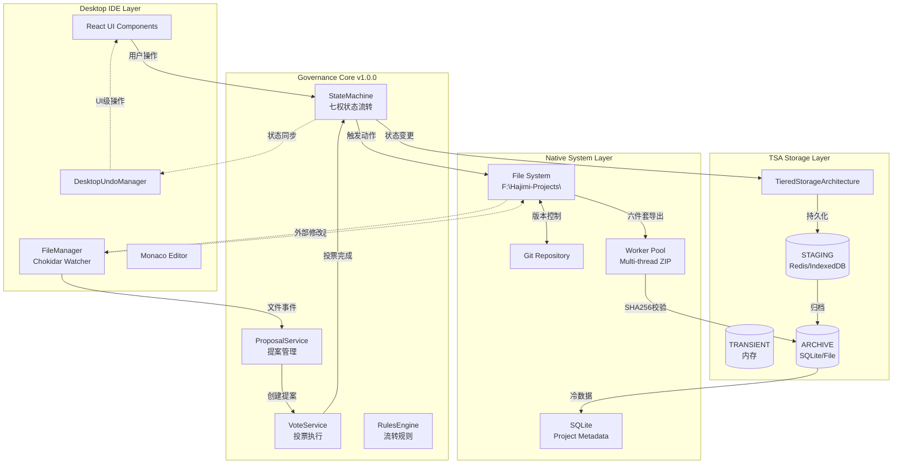
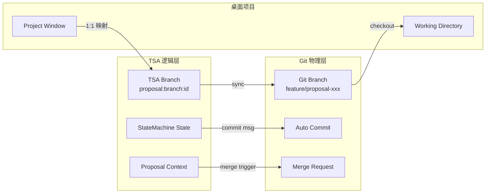
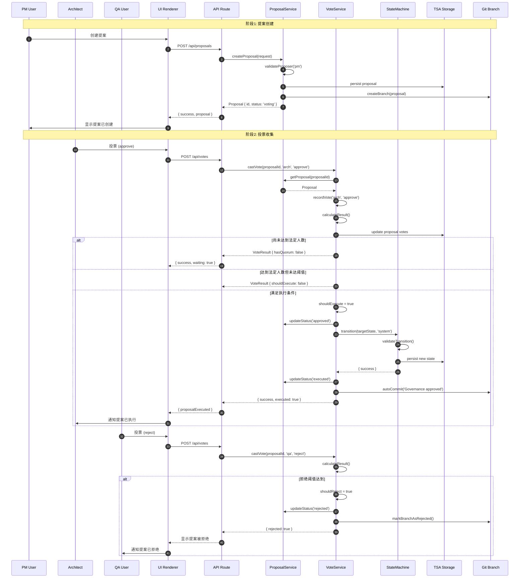
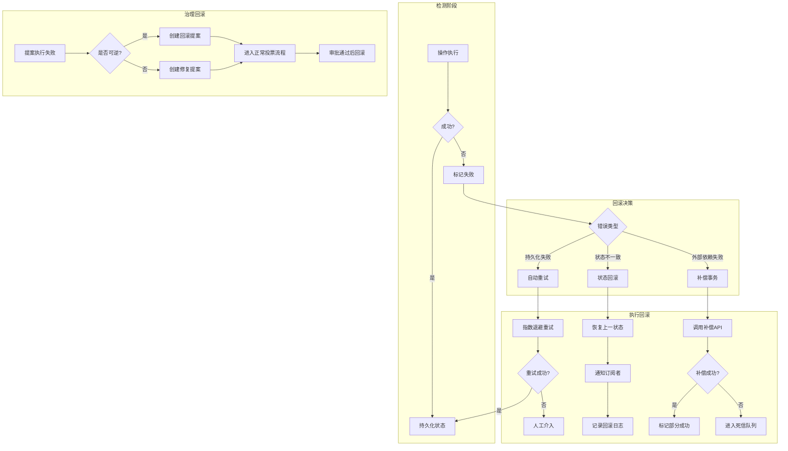

# R-06/09 🔌 系统集成师 → v1.0.0 治理核心与桌面 IDE 融合研究

> **研究工单**: R-06-governance-integration-spec  
> **版本**: v1.0.0  
> **日期**: 2026-02-14  
> **研究深度**: 实现级（含集成点代码示例、状态同步时序图、错误回滚策略）

---

## 📋 研究概览

本研究文档基于 HAJIMI-PERF-DESKTOP-RESEARCH-011 项目，深入探讨桌面级IDE与现有 v1.0.0 Ouroboros 治理核心的集成方案。核心目标是将七权治理引擎（State Machine、Governance、TSA）无缝融合到桌面文件系统事件处理流程中。

---

## 1. 集成架构图（Mermaid）

### 1.1 整体数据流架构



### 1.2 文件系统事件 → Governance Proposal 映射流

```mermaid
sequenceDiagram
    participant FS as File System
    participant CW as Chokidar Watcher
    participant FM as FileManager
    participant GF as GovernanceFilter
    participant PS as ProposalService
    participant TSA as TSA Storage
    participant SM as StateMachine

    FS->>CW: file change detected
    CW->>FM: emit('change', path)
    
    alt 关键文件修改
        FM->>GF: shouldCreateProposal(event)
        GF->>GF: isCriticalFile(path)
        GF->>GF: checkDebounce(path)
        GF->>PS: createProposal({
            type: 'FILE_MODIFIED_EXTERNALLY',
            file: path,
            diff: gitDiff
        })
        PS->>TSA: persist proposal (STAGING)
        PS->>SM: notify state: AUDIT
        SM->>TSA: update state
    else 非关键文件
        FM->>FM: queueAutoSave(path)
    end
```

---

## 2. 文件系统事件映射表

| 文件系统事件 | Governance 提案类型 | 触发条件 | 处理流程 | 状态影响 |
|------------|-------------------|---------|---------|---------|
| **Create** | `PROPOSE_CREATE` | 新文件创建且匹配关键路径模式 | 1. 生成文件指纹<br>2. 创建提案<br>3. 进入投票状态 | `IDLE → DESIGN` (如项目初始化) |
| **Modify** | `PROPOSE_MODIFY` | 外部编辑器修改关键文件 | 1. 计算文件diff<br>2. 创建外部修改提案<br>3. 触发审计流程 | `CODE → AUDIT` |
| **Delete** | `PROPOSE_DELETE` | 文件被删除（非Trash） | 1. 确认删除意图<br>2. 创建删除提案<br>3. 等待审批 | 无直接状态变更 |
| **Move/Rename** | `PROPOSE_MOVE` | 文件移动或重命名 | 1. 记录源路径和目标路径<br>2. 创建移动提案<br>3. 更新引用映射 | 无直接状态变更 |
| **Bulk Change** | `PROPOSE_BULK` | 批量文件变更（>10个） | 1. 聚合变更列表<br>2. 创建批量提案<br>3. 简化投票流程 | `CODE → AUDIT` |
| **Git Event** | `PROPOSE_SYNC` | Git分支切换/合并 | 1. 检测分支变化<br>2. 创建同步提案<br>3. 触发状态对齐 | 根据目标分支状态 |

### 2.1 关键文件判定规则

```typescript
// lib/desktop/governance-filter.ts
export class GovernanceFilter {
  // 关键文件模式
  private criticalPatterns = [
    /\.(ts|tsx|js|jsx)$/,           // 源代码
    /\.(json|yaml|yml)$/,           // 配置文件
    /package\.json$/,               // 包配置
    /tsconfig\.json$/,              // TS配置
    /\.env(\.[a-z]+)?$/,            // 环境变量
    /prisma\/.+\.prisma$/,          // 数据库schema
    /lib\/core\/.+\.ts$/,           // 核心代码
    /app\/.+\.tsx?$/                // 应用代码
  ];

  // 忽略的目录
  private ignoreDirs = [
    'node_modules',
    '.git',
    '.next',
    'dist',
    'build',
    'coverage',
    '.hajimi'
  ];

  isCriticalFile(filePath: string): boolean {
    // 检查忽略目录
    for (const dir of this.ignoreDirs) {
      if (filePath.includes(`/${dir}/`) || filePath.includes(`\\${dir}\\`)) {
        return false;
      }
    }

    // 检查关键模式
    return this.criticalPatterns.some(pattern => pattern.test(filePath));
  }

  // 防抖控制（防止频繁修改触发过多提案）
  private debounceMap = new Map<string, number>();
  private readonly DEBOUNCE_MS = 5000; // 5秒

  shouldCreateProposal(filePath: string): boolean {
    if (!this.isCriticalFile(filePath)) return false;
    
    const now = Date.now();
    const lastTime = this.debounceMap.get(filePath) || 0;
    
    if (now - lastTime < this.DEBOUNCE_MS) {
      return false; // 在防抖期内
    }
    
    this.debounceMap.set(filePath, now);
    return true;
  }
}
```

---

## 3. TSA Branch ↔ Git Branch 同步策略

### 3.1 架构映射关系



### 3.2 同步策略实现

```typescript
// lib/desktop/branch-sync-manager.ts
import simpleGit, { SimpleGit } from 'simple-git';
import { tsa } from '@/lib/tsa';
import { Proposal } from '@/lib/core/governance';

export interface BranchMapping {
  proposalId: string;
  tsaBranchId: string;
  gitBranchName: string;
  createdAt: number;
  lastSyncedAt: number;
  commitHistory: string[];
}

export class BranchSyncManager {
  private git: SimpleGit;
  private projectPath: string;
  private readonly MAPPING_KEY_PREFIX = 'branch:mapping:';

  constructor(projectPath: string) {
    this.projectPath = projectPath;
    this.git = simpleGit(projectPath);
  }

  /**
   * 创建 TSA Branch 并同步到 Git Branch
   */
  async createBranch(proposal: Proposal): Promise<BranchMapping> {
    // 生成规范的 branch 名称
    const timestamp = Date.now();
    const shortId = proposal.id.slice(-6);
    const sanitizedTitle = proposal.title
      .toLowerCase()
      .replace(/[^a-z0-9]+/g, '-')
      .slice(0, 30);
    
    const gitBranchName = `proposal/${shortId}-${sanitizedTitle}`;
    
    // 创建 Git Branch
    await this.git.checkoutLocalBranch(gitBranchName);
    
    // 创建 TSA Branch 记录
    const mapping: BranchMapping = {
      proposalId: proposal.id,
      tsaBranchId: `tsa:branch:${proposal.id}`,
      gitBranchName,
      createdAt: timestamp,
      lastSyncedAt: timestamp,
      commitHistory: [],
    };

    // 持久化到 TSA
    await tsa.set(
      `${this.MAPPING_KEY_PREFIX}${proposal.id}`,
      mapping,
      { tier: 'STAGING' }
    );

    console.log(`[BranchSync] Created branch: ${gitBranchName} for proposal ${proposal.id}`);
    return mapping;
  }

  /**
   * 自动 commit vs 手动 commit 决策
   */
  async decideCommitStrategy(
    fileChanges: string[],
    proposalState: string
  ): Promise<'auto' | 'manual' | 'deferred'> {
    // 自动 commit 场景
    if (proposalState === 'voting' && fileChanges.length < 5) {
      return 'auto';
    }
    
    // 延迟 commit 场景（批量变更）
    if (fileChanges.length > 20) {
      return 'deferred';
    }
    
    // 手动 commit 场景（重要状态变更）
    if (['approved', 'rejected'].includes(proposalState)) {
      return 'manual';
    }
    
    return 'auto';
  }

  /**
   * 执行自动 commit
   */
  async autoCommit(
    mapping: BranchMapping,
    changes: string[],
    context: { agent: string; reason: string }
  ): Promise<string> {
    // 添加所有变更
    await this.git.add(changes);
    
    // 生成 commit message
    const commitMsg = this.generateCommitMessage(mapping, changes, context);
    
    // 执行 commit
    const result = await this.git.commit(commitMsg, changes);
    const commitHash = result.commit;
    
    // 更新映射
    mapping.commitHistory.push(commitHash);
    mapping.lastSyncedAt = Date.now();
    await tsa.set(
      `${this.MAPPING_KEY_PREFIX}${mapping.proposalId}`,
      mapping,
      { tier: 'STAGING' }
    );

    return commitHash;
  }

  private generateCommitMessage(
    mapping: BranchMapping,
    changes: string[],
    context: { agent: string; reason: string }
  ): string {
    const changeSummary = changes.length > 3 
      ? `${changes.slice(0, 3).join(', ')}... and ${changes.length - 3} more`
      : changes.join(', ');
    
    return `[governance:${context.agent}] ${context.reason}

Proposal: ${mapping.proposalId}
Branch: ${mapping.gitBranchName}
Changes: ${changeSummary}

Auto-committed by TSA-Git Sync`;
  }

  /**
   * 冲突解决策略
   */
  async resolveConflict(
    mapping: BranchMapping,
    strategy: 'ours' | 'theirs' | 'manual'
  ): Promise<void> {
    const status = await this.git.status();
    
    if (status.conflicted.length === 0) {
      return;
    }

    console.log(`[BranchSync] Resolving ${status.conflicted.length} conflicts with strategy: ${strategy}`);

    switch (strategy) {
      case 'ours':
        // 保留当前分支的变更
        for (const file of status.conflicted) {
          await this.git.checkout(['--ours', file]);
          await this.git.add(file);
        }
        break;
        
      case 'theirs':
        // 接受合并分支的变更
        for (const file of status.conflicted) {
          await this.git.checkout(['--theirs', file]);
          await this.git.add(file);
        }
        break;
        
      case 'manual':
        // 创建冲突标记文件，等待用户处理
        await this.createConflictMarker(mapping, status.conflicted);
        throw new Error(`Manual conflict resolution required for: ${status.conflicted.join(', ')}`);
    }

    // 提交解决后的结果
    await this.git.commit(`[governance:system] Resolved conflicts using ${strategy} strategy`);
  }

  private async createConflictMarker(mapping: BranchMapping, files: string[]): Promise<void> {
    const markerPath = `${this.projectPath}/.hajimi/conflicts/${mapping.proposalId}.json`;
    const marker = {
      proposalId: mapping.proposalId,
      gitBranch: mapping.gitBranchName,
      conflictedFiles: files,
      createdAt: Date.now(),
    };
    
    await fs.mkdir(path.dirname(markerPath), { recursive: true });
    await fs.writeFile(markerPath, JSON.stringify(marker, null, 2));
  }
}
```

### 3.3 Branch 命名规范

| 类型 | 命名格式 | 示例 |
|-----|---------|------|
| 提案分支 | `proposal/{shortId}-{title}` | `proposal/a3b2c4-add-user-auth` |
| 紧急修复 | `hotfix/{shortId}-{desc}` | `hotfix/x9y8z7-fix-memory-leak` |
| 自动归档 | `archive/{date}-{project}` | `archive/20260214-project-alpha` |
| 治理审计 | `audit/{proposalId}` | `audit/prop_123456789_abc123` |

---

## 4. 六件套导出流程图与实现

### 4.1 流程图

```mermaid
sequenceDiagram
    participant UI as UI Component
    participant AP as ArchivePipeline
    participant WP as Worker Pool
    participant FS as File System
    participant GF as SHA256 Generator
    participant TSA as TSA Storage
    participant SM as StateMachine

    UI->>AP: requestExport(projectId, options)
    
    rect rgb(230, 245, 255)
        Note over AP,FS: Phase 1: 准备与验证
        AP->>TSA: getProjectMetadata(projectId)
        TSA-->>AP: metadata
        AP->>FS: validateProjectPath(path)
        FS-->>AP: valid
    end

    rect rgb(255, 245, 230)
        Note over AP,WP: Phase 2: 多线程 ZIP
        AP->>WP: executeTask('zip', {
            source: projectPath,
            output: archivePath,
            exclude: ['node_modules', '.git']
        })
        
        par Worker Thread 1
            WP->>WP: compress src/
        and Worker Thread 2
            WP->>WP: lib/
        and Worker Thread 3
            WP->>WP: config/
        end
        
        WP-->>AP: { success, path, size }
    end

    rect rgb(230, 255, 230)
        Note over AP,GF: Phase 3: 校验与归档
        AP->>GF: calculateSHA256(archivePath)
        GF-->>AP: sha256Hash
        
        AP->>FS: moveToArchive(archivePath, sha256Hash)
        FS-->>AP: finalPath
        
        AP->>TSA: set(archive:record, {
            projectId,
            sha256: sha256Hash,
            size,
            createdAt
        }, { tier: 'ARCHIVE' })
    end

    rect rgb(255, 230, 245)
        Note over AP,SM: Phase 4: 治理标记
        AP->>SM: transition('DONE', 'system', {
            reason: 'Six-pack export completed',
            archiveHash: sha256Hash
        })
        SM-->>AP: { success }
    end

    AP-->>UI: { success, archivePath, sha256Hash }
```

### 4.2 完整实现代码

```typescript
// lib/desktop/archive/six-pack-exporter.ts
import { Worker } from 'worker_threads';
import { createHash } from 'crypto';
import { createReadStream } from 'fs';
import { promises as fs } from 'fs';
import path from 'path';
import { tsa, StorageTier } from '@/lib/tsa';
import { stateMachine } from '@/lib/core/state/machine';
import os from 'os';

// Worker Pool 实现
class WorkerPool {
  private workers: Worker[] = [];
  private queue: Array<{
    task: ZipTask;
    resolve: (value: ZipResult) => void;
    reject: (reason: Error) => void;
  }> = [];
  private maxWorkers = Math.min(os.cpus().length, 4);
  private busyWorkers = new Set<Worker>();

  constructor() {
    this.initializeWorkers();
  }

  private initializeWorkers() {
    for (let i = 0; i < this.maxWorkers; i++) {
      const worker = new Worker(path.join(__dirname, 'zip-worker.js'));
      worker.on('message', (result: ZipResult) => {
        this.handleMessage(worker, result);
      });
      worker.on('error', (err) => {
        console.error('[WorkerPool] Worker error:', err);
        this.replaceWorker(worker);
      });
      this.workers.push(worker);
    }
  }

  private handleMessage(worker: Worker, result: ZipResult) {
    this.busyWorkers.delete(worker);
    const pending = this.queue.shift();
    if (pending) {
      this.execute(worker, pending.task, pending.resolve, pending.reject);
    }
  }

  private replaceWorker(oldWorker: Worker) {
    const index = this.workers.indexOf(oldWorker);
    if (index > -1) {
      oldWorker.terminate();
      const newWorker = new Worker(path.join(__dirname, 'zip-worker.js'));
      this.workers[index] = newWorker;
    }
  }

  async executeTask(task: ZipTask): Promise<ZipResult> {
    const availableWorker = this.workers.find(w => !this.busyWorkers.has(w));
    
    if (availableWorker) {
      return new Promise((resolve, reject) => {
        this.execute(availableWorker, task, resolve, reject);
      });
    } else {
      return new Promise((resolve, reject) => {
        this.queue.push({ task, resolve, reject });
      });
    }
  }

  private execute(
    worker: Worker,
    task: ZipTask,
    resolve: (value: ZipResult) => void,
    reject: (reason: Error) => void
  ) {
    this.busyWorkers.add(worker);
    
    const timeout = setTimeout(() => {
      reject(new Error('Worker task timeout'));
      this.busyWorkers.delete(worker);
    }, 300000); // 5分钟超时

    const messageHandler = (result: ZipResult) => {
      clearTimeout(timeout);
      if (result.success) {
        resolve(result);
      } else {
        reject(new Error(result.error || 'Unknown worker error'));
      }
      worker.removeListener('message', messageHandler);
    };

    worker.on('message', messageHandler);
    worker.postMessage(task);
  }

  terminate() {
    this.workers.forEach(w => w.terminate());
    this.workers = [];
  }
}

// 六件套导出器主类
export class SixPackExporter {
  private workerPool: WorkerPool;
  private archiveRoot = 'F:\\Hajimi-Projects\\.archive';

  constructor() {
    this.workerPool = new WorkerPool();
    this.ensureArchiveDir();
  }

  private async ensureArchiveDir() {
    await fs.mkdir(this.archiveRoot, { recursive: true });
  }

  /**
   * 执行六件套导出
   */
  async export(projectId: string, options: ExportOptions = {}): Promise<ExportResult> {
    const startTime = Date.now();
    const projectPath = `F:\\Hajimi-Projects\\${projectId}`;

    try {
      // Phase 1: 验证项目
      await this.validateProject(projectPath);

      // Phase 2: 准备输出路径
      const timestamp = new Date().toISOString().replace(/[:.]/g, '-');
      const archiveName = `${projectId}_${timestamp}.zip`;
      const tempPath = path.join(os.tmpdir(), archiveName);
      const finalPath = path.join(this.archiveRoot, archiveName);

      // Phase 3: 多线程 ZIP
      const zipResult = await this.workerPool.executeTask({
        type: 'zip',
        sourcePath: projectPath,
        outputPath: tempPath,
        exclude: [
          'node_modules/**',
          '.git/**',
          '.next/**',
          'dist/**',
          'build/**',
          'coverage/**',
          '.hajimi/**',
          '*.log'
        ],
        compressionLevel: 9,
      });

      if (!zipResult.success) {
        throw new Error(`ZIP creation failed: ${zipResult.error}`);
      }

      // Phase 4: 计算 SHA256
      const sha256Hash = await this.calculateSHA256(tempPath);

      // Phase 5: 移动到归档目录（使用指纹命名）
      const fingerprintName = `${projectId}_${sha256Hash.slice(0, 16)}.zip`;
      const archivePath = path.join(this.archiveRoot, fingerprintName);
      
      await fs.rename(tempPath, archivePath);

      // Phase 6: 创建归档记录
      const archiveRecord: ArchiveRecord = {
        id: `archive_${Date.now()}_${Math.random().toString(36).slice(2, 7)}`,
        projectId,
        fileName: fingerprintName,
        originalName: archiveName,
        fullPath: archivePath,
        sha256: sha256Hash,
        size: zipResult.size || 0,
        createdAt: Date.now(),
        metadata: {
          nodeVersion: process.version,
          platform: process.platform,
          archivedBy: options.triggeredBy || 'system',
        }
      };

      // 持久化到 TSA ARCHIVE 层
      await tsa.set(
        `archive:record:${archiveRecord.id}`,
        archiveRecord,
        { tier: 'ARCHIVE' }
      );

      // 更新项目归档索引
      await this.updateProjectArchiveIndex(projectId, archiveRecord);

      // Phase 7: 触发治理状态流转
      const transitionResult = await stateMachine.transition(
        'DONE',
        'system',
        {
          reason: 'Six-pack export completed',
          archiveId: archiveRecord.id,
          archiveHash: sha256Hash,
          archiveSize: archiveRecord.size,
        }
      );

      if (!transitionResult.success) {
        console.warn('[SixPack] State transition warning:', transitionResult.error);
      }

      const duration = Date.now() - startTime;

      return {
        success: true,
        archiveId: archiveRecord.id,
        archivePath,
        sha256Hash,
        size: archiveRecord.size,
        duration,
        stateTransition: transitionResult.success,
      };

    } catch (error) {
      return {
        success: false,
        error: error instanceof Error ? error.message : String(error),
      };
    }
  }

  private async validateProject(projectPath: string): Promise<void> {
    try {
      const stats = await fs.stat(projectPath);
      if (!stats.isDirectory()) {
        throw new Error('Project path is not a directory');
      }
    } catch (error) {
      throw new Error(`Project validation failed: ${error}`);
    }
  }

  private async calculateSHA256(filePath: string): Promise<string> {
    return new Promise((resolve, reject) => {
      const hash = createHash('sha256');
      const stream = createReadStream(filePath);

      stream.on('data', (chunk) => hash.update(chunk));
      stream.on('end', () => resolve(hash.digest('hex')));
      stream.on('error', reject);
    });
  }

  private async updateProjectArchiveIndex(projectId: string, record: ArchiveRecord): Promise<void> {
    const indexKey = `archive:index:${projectId}`;
    const index = await tsa.get<ArchiveRecord[]>(indexKey) || [];
    index.push(record);
    
    // 只保留最近 50 个归档
    if (index.length > 50) {
      index.shift();
    }

    await tsa.set(indexKey, index, { tier: 'ARCHIVE' });
  }

  /**
   * 获取项目的归档历史
   */
  async getArchiveHistory(projectId: string): Promise<ArchiveRecord[]> {
    return await tsa.get<ArchiveRecord[]>(`archive:index:${projectId}`) || [];
  }
}

// Worker 线程代码 (zip-worker.ts)
// 保存为: lib/desktop/archive/zip-worker.ts
const zipWorkerCode = `
import { parentPort } from 'worker_threads';
import archiver from 'archiver';
import { createWriteStream } from 'fs';
import { stat } from 'fs/promises';

interface ZipTask {
  type: 'zip';
  sourcePath: string;
  outputPath: string;
  exclude: string[];
  compressionLevel: number;
}

interface ZipResult {
  success: boolean;
  path?: string;
  size?: number;
  error?: string;
}

parentPort?.on('message', async (task: ZipTask) => {
  try {
    const output = createWriteStream(task.outputPath);
    const archive = archiver('zip', {
      zlib: { level: task.compressionLevel }
    });

    output.on('close', async () => {
      const stats = await stat(task.outputPath);
      parentPort?.postMessage({
        success: true,
        path: task.outputPath,
        size: stats.size
      } as ZipResult);
    });

    archive.on('error', (err) => {
      parentPort?.postMessage({
        success: false,
        error: err.message
      } as ZipResult);
    });

    archive.on('warning', (err) => {
      console.warn('[ZIP Worker] Warning:', err.message);
    });

    archive.pipe(output);
    
    // 添加目录内容，应用排除规则
    archive.glob('**/*', {
      cwd: task.sourcePath,
      ignore: task.exclude,
      dot: true
    });

    await archive.finalize();
  } catch (error) {
    parentPort?.postMessage({
      success: false,
      error: error instanceof Error ? error.message : 'Unknown error'
    } as ZipResult);
  }
});
`;

// 类型定义
interface ZipTask {
  type: 'zip';
  sourcePath: string;
  outputPath: string;
  exclude: string[];
  compressionLevel: number;
}

interface ZipResult {
  success: boolean;
  path?: string;
  size?: number;
  error?: string;
}

interface ExportOptions {
  triggeredBy?: string;
  compressionLevel?: number;
  exclude?: string[];
}

interface ExportResult {
  success: boolean;
  archiveId?: string;
  archivePath?: string;
  sha256Hash?: string;
  size?: number;
  duration?: number;
  stateTransition?: boolean;
  error?: string;
}

interface ArchiveRecord {
  id: string;
  projectId: string;
  fileName: string;
  originalName: string;
  fullPath: string;
  sha256: string;
  size: number;
  createdAt: number;
  metadata: {
    nodeVersion: string;
    platform: string;
    archivedBy: string;
  };
}

// 导出单例
export const sixPackExporter = new SixPackExporter();
```

---

## 5. 集成点代码示例

### 5.1 Chokidar → Governance 联动

```typescript
// lib/desktop/file-watcher.ts
import chokidar from 'chokidar';
import { proposalService } from '@/lib/core/governance/proposal-service';
import { GovernanceFilter } from './governance-filter';
import simpleGit from 'simple-git';

export class DesktopFileWatcher {
  private watcher?: chokidar.FSWatcher;
  private git;
  private governanceFilter = new GovernanceFilter();
  private projectPath: string;

  constructor(projectPath: string) {
    this.projectPath = projectPath;
    this.git = simpleGit(projectPath);
  }

  start() {
    this.watcher = chokidar.watch(this.projectPath, {
      ignored: [
        /(^|[\/\\])\../,           // 隐藏文件
        'node_modules/**',
        '.git/**',
        '.next/**',
        'dist/**',
        '*.tmp',
        '*.log'
      ],
      persistent: true,
      ignoreInitial: true,
      usePolling: false,          // 电脑级：原生fsevents/inotify
      awaitWriteFinish: {
        stabilityThreshold: 300,  // 300ms 稳定后触发
        pollInterval: 100
      }
    });

    this.watcher
      .on('add', (path) => this.handleEvent('create', path))
      .on('change', (path) => this.handleEvent('modify', path))
      .on('unlink', (path) => this.handleEvent('delete', path))
      .on('addDir', (path) => this.handleEvent('createDir', path))
      .on('unlinkDir', (path) => this.handleEvent('deleteDir', path));

    console.log(`[FileWatcher] Started watching: ${this.projectPath}`);
  }

  private async handleEvent(eventType: string, filePath: string) {
    console.log(`[FileWatcher] ${eventType}: ${filePath}`);

    // 1. 检查是否需要创建治理提案
    if (this.governanceFilter.shouldCreateProposal(filePath)) {
      await this.createGovernanceProposal(eventType, filePath);
    }

    // 2. 通知其他系统组件
    this.emitToUI(eventType, filePath);
  }

  private async createGovernanceProposal(eventType: string, filePath: string) {
    try {
      // 获取文件 diff
      const status = await this.git.status();
      const relativePath = path.relative(this.projectPath, filePath);
      
      let diff = '';
      if (eventType === 'modify') {
        try {
          diff = await this.git.diff([relativePath]);
        } catch {
          diff = '<new file or binary>';
        }
      }

      // 映射事件类型到提案类型
      const proposalTypeMap: Record<string, string> = {
        create: 'FILE_CREATED_EXTERNALLY',
        modify: 'FILE_MODIFIED_EXTERNALLY',
        delete: 'FILE_DELETED_EXTERNALLY',
      };

      const proposalType = proposalTypeMap[eventType] || 'FILE_CHANGE_DETECTED';

      // 创建提案
      const proposal = await proposalService.createProposal({
        proposer: 'system',
        title: `[External] ${proposalType}: ${path.basename(filePath)}`,
        description: `External file ${eventType} detected\\n\\nPath: ${filePath}\\n\\nDiff preview:\\\`\\`\\`\\n${diff.slice(0, 1000)}\\n\\`\\`\\``,\n        targetState: 'AUDIT', // 外部修改需要审计
        type: 'file_change',
        context: {
          eventType,
          filePath,
          relativePath,
          diff,
          detectedAt: Date.now(),
        },
      });

      console.log(`[FileWatcher] Governance proposal created: ${proposal.id}`);

      // 触发系统通知
      this.showNotification('External Change Detected', 
        `File ${path.basename(filePath)} was modified externally. ` +
        `Proposal ${proposal.id.slice(0, 8)} created for audit.`
      );

    } catch (error) {
      console.error('[FileWatcher] Failed to create governance proposal:', error);
    }
  }

  private emitToUI(eventType: string, filePath: string) {
    // 通过 IPC 或事件总线通知 UI
    // 具体实现取决于 Electron/Tauri 架构
  }

  private showNotification(title: string, body: string) {
    // 桌面级通知
    if (typeof Notification !== 'undefined') {
      new Notification(title, { body });
    }
  }

  stop() {
    this.watcher?.close();
    console.log('[FileWatcher] Stopped');
  }
}
```

### 5.2 DesktopUndoManager 与 Governance State 边界

```typescript
// lib/desktop/undo-manager.ts
import { EventEmitter } from 'events';
import Database from 'better-sqlite3';

// Undo 操作类型
interface UndoableCommand {
  id: string;
  type: 'file_edit' | 'file_move' | 'file_delete' | 'ui_action' | 'git_operation';
  scope: 'local' | 'project' | 'workspace';
  execute(): Promise<void>;
  undo(): Promise<void>;
  redo(): Promise<void>;
  serialize(): SerializedCommand;
}

// 与 Governance State 的边界定义
interface GovernanceBoundary {
  // 这些操作会触发 Governance Proposal
  governanceActions: Set<string>;
  
  // 检查操作是否需要治理审批
  requiresGovernance(command: UndoableCommand): boolean;
  
  // 在 Undo/Redo 时同步 Governance State
  syncGovernanceState(action: 'undo' | 'redo', command: UndoableCommand): Promise<void>;
}

export class DesktopUndoManager extends EventEmitter {
  private stack: UndoableCommand[] = [];
  private pointer = -1;
  private maxSize = 1000;
  private db: Database.Database;
  private projectPath: string;
  
  // Governance 边界定义
  private governanceBoundary: GovernanceBoundary = {
    governanceActions: new Set([
      'git_operation',
      'project_state_change',
      'governance_vote',
    ]),
    
    requiresGovernance: (command) => {
      return this.governanceBoundary.governanceActions.has(command.type);
    },
    
    syncGovernanceState: async (action, command) => {
      // Undo/Redo 不直接修改 Governance State
      // 而是通过创建新的 Proposal 来请求状态变更
      if (command.scope === 'project') {
        console.log(`[UndoManager] ${action} may affect governance state, ` +
          `creating proposal for approval`);
        // 实际治理提案创建逻辑
      }
    }
  };

  constructor(projectPath: string) {
    super();
    this.projectPath = projectPath;
    this.db = new Database(`${projectPath}\\.hajimi\\undo.db`);
    this.initSchema();
    this.loadFromDisk();
  }

  private initSchema() {
    this.db.exec(`
      CREATE TABLE IF NOT EXISTS undo_stack (
        id TEXT PRIMARY KEY,
        idx INTEGER NOT NULL,
        type TEXT NOT NULL,
        scope TEXT NOT NULL,
        data TEXT NOT NULL,
        is_current BOOLEAN DEFAULT 0,
        created_at INTEGER DEFAULT (strftime('%s', 'now'))
      );
      
      CREATE INDEX IF NOT EXISTS idx_undo_idx ON undo_stack(idx);
      
      -- 治理边界标记表
      CREATE TABLE IF NOT EXISTS governance_markers (
        command_id TEXT PRIMARY KEY,
        requires_approval BOOLEAN,
        proposal_id TEXT,
        FOREIGN KEY (command_id) REFERENCES undo_stack(id)
      );
    `);
  }

  /**
   * 执行命令（关键：区分 UI级 和 Governance级 操作）
   */
  async execute(command: UndoableCommand): Promise<void> {
    // 1. 执行命令
    await command.execute();

    // 2. 截断 Redo 历史
    if (this.pointer < this.stack.length - 1) {
      this.stack = this.stack.slice(0, this.pointer + 1);
    }

    // 3. 添加到栈
    this.stack.push(command);
    this.pointer++;

    // 4. 限制大小
    if (this.stack.length > this.maxSize) {
      this.stack.shift();
      this.pointer--;
    }

    // 5. 持久化
    await this.persistCommand(command);

    // 6. 触发事件
    this.emit('executed', command);

    // 7. 如果涉及 Governance，记录边界标记
    if (this.governanceBoundary.requiresGovernance(command)) {
      this.markGovernanceBoundary(command);
    }
  }

  /**
   * Undo 操作（与 Governance State 解耦）
   */
  async undo(): Promise<boolean> {
    if (this.pointer < 0) return false;

    const command = this.stack[this.pointer];

    // 关键边界检查：如果此操作涉及 Governance
    if (this.governanceBoundary.requiresGovernance(command)) {
      // 不直接 Undo Governance 相关操作
      // 而是创建提案请求回滚
      await this.governanceBoundary.syncGovernanceState('undo', command);
      
      // 通知用户需要审批
      this.emit('governanceRequired', {
        action: 'undo',
        command,
        message: 'This action affects governance state and requires approval'
      });
      
      return false;
    }

    // 标准 UI 级 Undo
    await command.undo();
    this.pointer--;
    await this.updatePointer();
    
    this.emit('undone', command);
    return true;
  }

  /**
   * Redo 操作（与 Governance State 解耦）
   */
  async redo(): Promise<boolean> {
    if (this.pointer >= this.stack.length - 1) return false;

    const command = this.stack[this.pointer + 1];

    // 同样的边界检查
    if (this.governanceBoundary.requiresGovernance(command)) {
      await this.governanceBoundary.syncGovernanceState('redo', command);
      
      this.emit('governanceRequired', {
        action: 'redo',
        command,
        message: 'This action affects governance state and requires approval'
      });
      
      return false;
    }

    // 标准 UI 级 Redo
    await command.redo();
    this.pointer++;
    await this.updatePointer();
    
    this.emit('redone', command);
    return true;
  }

  /**
   * 持久化命令（SQLite 事务）
   */
  private persistCommand(command: UndoableCommand): void {
    const stmt = this.db.prepare(`
      INSERT INTO undo_stack (id, idx, type, scope, data, is_current)
      VALUES (?, ?, ?, ?, ?, ?)
    `);

    this.db.transaction(() => {
      // 清除之前的 current 标记
      this.db.prepare('UPDATE undo_stack SET is_current = 0').run();
      
      // 插入新命令
      stmt.run(
        command.id,
        this.pointer,
        command.type,
        command.scope,
        JSON.stringify(command.serialize()),
        1
      );
    })();
  }

  private updatePointer(): void {
    this.db.transaction(() => {
      this.db.prepare('UPDATE undo_stack SET is_current = 0').run();
      this.db.prepare('UPDATE undo_stack SET is_current = 1 WHERE idx = ?').run(this.pointer);
    })();
  }

  private markGovernanceBoundary(command: UndoableCommand): void {
    const stmt = this.db.prepare(`
      INSERT OR REPLACE INTO governance_markers (command_id, requires_approval)
      VALUES (?, 1)
    `);
    stmt.run(command.id);
  }

  private loadFromDisk(): void {
    const rows = this.db.prepare(`
      SELECT * FROM undo_stack ORDER BY idx ASC
    `).all();

    this.stack = rows.map(row => this.deserializeCommand(row));
    
    const current = this.db.prepare(`
      SELECT idx FROM undo_stack WHERE is_current = 1 LIMIT 1
    `).get();
    
    this.pointer = current ? current.idx : this.stack.length - 1;
  }

  private deserializeCommand(row: any): UndoableCommand {
    // 反序列化逻辑
    return {
      id: row.id,
      type: row.type,
      scope: row.scope,
      execute: async () => {},
      undo: async () => {},
      redo: async () => {},
      serialize: () => JSON.parse(row.data),
    } as UndoableCommand;
  }

  /**
   * 获取可 Undo/Redo 状态
   */
  getStatus(): { canUndo: boolean; canRedo: boolean } {
    return {
      canUndo: this.pointer >= 0,
      canRedo: this.pointer < this.stack.length - 1,
    };
  }

  destroy(): void {
    this.db.close();
  }
}

// 序列化命令接口
interface SerializedCommand {
  id: string;
  type: string;
  scope: string;
  payload: Record<string, unknown>;
  timestamp: number;
}
```

### 5.3 TSA Cold 层 → SQLite 适配

```typescript
// lib/desktop/tsa-sqlite-adapter.ts
import Database from 'better-sqlite3';
import { tsa, StorageTier } from '@/lib/tsa';

/**
 * TSA Cold 层 SQLite 适配器
 * 将 ARCHIVE 层数据持久化到本地 SQLite
 */
export class TSASQLiteAdapter {
  private db: Database.Database;
  private projectPath: string;

  constructor(projectPath: string) {
    this.projectPath = projectPath;
    this.db = new Database(`${projectPath}\\.hajimi\\tsa-cold.db`, {
      verbose: process.env.DEBUG ? console.log : undefined,
    });
    
    this.initSchema();
    this.setupPragmas();
  }

  private setupPragmas() {
    // WAL 模式，提升并发性能
    this.db.pragma('journal_mode = WAL');
    this.db.pragma('synchronous = NORMAL');
    this.db.pragma('cache_size = 10000');
  }

  private initSchema() {
    this.db.exec(`
      -- 主存储表
      CREATE TABLE IF NOT EXISTS tsa_storage (
        key TEXT PRIMARY KEY,
        value BLOB NOT NULL,
        tier TEXT NOT NULL DEFAULT 'ARCHIVE',
        created_at INTEGER DEFAULT (strftime('%s', 'now') * 1000),
        last_accessed INTEGER DEFAULT (strftime('%s', 'now') * 1000),
        access_count INTEGER DEFAULT 0,
        ttl INTEGER,
        checksum TEXT
      );
      
      -- 访问索引
      CREATE INDEX IF NOT EXISTS idx_tier ON tsa_storage(tier);
      CREATE INDEX IF NOT EXISTS idx_accessed ON tsa_storage(last_accessed);
      CREATE INDEX IF NOT EXISTS idx_key_prefix ON tsa_storage(key);
      
      -- 元数据表
      CREATE TABLE IF NOT EXISTS tsa_metadata (
        key TEXT PRIMARY KEY,
        value TEXT
      );
      
      -- 清理日志
      CREATE TABLE IF NOT EXISTS tsa_cleanup_log (
        id INTEGER PRIMARY KEY AUTOINCREMENT,
        key TEXT NOT NULL,
        cleaned_at INTEGER DEFAULT (strftime('%s', 'now') * 1000),
        reason TEXT
      );
    `);
  }

  /**
   * 将 TSA ARCHIVE 层数据同步到 SQLite
   */
  async syncToCold(key: string, value: unknown): Promise<void> {
    const serialized = JSON.stringify(value);
    const checksum = this.calculateChecksum(serialized);
    
    const stmt = this.db.prepare(`
      INSERT INTO tsa_storage (key, value, tier, checksum)
      VALUES (?, ?, 'ARCHIVE', ?)
      ON CONFLICT(key) DO UPDATE SET
        value = excluded.value,
        last_accessed = (strftime('%s', 'now') * 1000),
        access_count = access_count + 1,
        checksum = excluded.checksum
    `);

    stmt.run(key, serialized, checksum);
  }

  /**
   * 从 SQLite 读取数据
   */
  async getFromCold<T>(key: string): Promise<T | null> {
    const stmt = this.db.prepare(`
      SELECT value, checksum FROM tsa_storage WHERE key = ?
    `);
    
    const row = stmt.get(key) as { value: string; checksum: string } | undefined;
    
    if (!row) return null;

    // 校验完整性
    if (!this.verifyChecksum(row.value, row.checksum)) {
      console.error(`[TSASQLite] Checksum mismatch for key: ${key}`);
      throw new Error('Data corruption detected');
    }

    // 更新访问统计
    this.db.prepare(`
      UPDATE tsa_storage 
      SET last_accessed = (strftime('%s', 'now') * 1000),
          access_count = access_count + 1
      WHERE key = ?
    `).run(key);

    return JSON.parse(row.value) as T;
  }

  /**
   * 批量同步 TSA ARCHIVE 到 SQLite
   */
  async batchSync(keys: string[]): Promise<void> {
    const insert = this.db.prepare(`
      INSERT INTO tsa_storage (key, value, tier, checksum)
      VALUES (?, ?, 'ARCHIVE', ?)
      ON CONFLICT(key) DO UPDATE SET
        value = excluded.value,
        last_accessed = (strftime('%s', 'now') * 1000),
        checksum = excluded.checksum
    `);

    this.db.transaction(() => {
      for (const key of keys) {
        tsa.get(key).then(value => {
          if (value !== null) {
            const serialized = JSON.stringify(value);
            insert.run(key, serialized, this.calculateChecksum(serialized));
          }
        });
      }
    })();
  }

  /**
   * 清理过期数据
   */
  async cleanupExpired(ttlThreshold: number): Promise<number> {
    const cutoff = Date.now() - ttlThreshold;
    
    // 找出过期键
    const expired = this.db.prepare(`
      SELECT key FROM tsa_storage
      WHERE last_accessed < ? OR (ttl IS NOT NULL AND created_at + ttl < ?)
    `).all(cutoff, Date.now()) as { key: string }[];

    if (expired.length === 0) return 0;

    // 记录清理日志
    const logStmt = this.db.prepare(`
      INSERT INTO tsa_cleanup_log (key, reason)
      VALUES (?, ?)
    `);

    // 删除过期数据
    const deleteStmt = this.db.prepare(`
      DELETE FROM tsa_storage WHERE key = ?
    `);

    this.db.transaction(() => {
      for (const { key } of expired) {
        logStmt.run(key, 'expired');
        deleteStmt.run(key);
      }
    })();

    return expired.length;
  }

  /**
   * 获取存储统计
   */
  getStats(): { total: number; totalSize: number; byTier: Record<string, number> } {
    const total = this.db.prepare('SELECT COUNT(*) as count FROM tsa_storage').get() as { count: number };
    
    const size = this.db.prepare(`
      SELECT SUM(LENGTH(value)) as total_size FROM tsa_storage
    `).get() as { total_size: number };

    const byTier = this.db.prepare(`
      SELECT tier, COUNT(*) as count FROM tsa_storage GROUP BY tier
    `).all() as { tier: string; count: number }[];

    return {
      total: total.count,
      totalSize: size.total_size || 0,
      byTier: byTier.reduce((acc, row) => {
        acc[row.tier] = row.count;
        return acc;
      }, {} as Record<string, number>),
    };
  }

  private calculateChecksum(data: string): string {
    // 简单的 checksum，生产环境应使用 crypto
    let hash = 0;
    for (let i = 0; i < data.length; i++) {
      const char = data.charCodeAt(i);
      hash = ((hash << 5) - hash) + char;
      hash = hash & hash;
    }
    return hash.toString(16);
  }

  private verifyChecksum(data: string, checksum: string): boolean {
    return this.calculateChecksum(data) === checksum;
  }

  close(): void {
    this.db.close();
  }
}

// 导出适配器工厂函数
export function createTSASQLiteAdapter(projectPath: string): TSASQLiteAdapter {
  return new TSASQLiteAdapter(projectPath);
}
```

---

## 6. 状态同步时序图

### 6.1 外部修改检测流程

```mermaid
sequenceDiagram
    autonumber
    participant EXT as External Editor
    participant FS as File System
    participant CW as Chokidar Watcher
    participant FM as FileManager
    participant GF as GovernanceFilter
    participant PS as ProposalService
    participant VS as VoteService
    participant SM as StateMachine
    participant UI as UI Renderer

    EXT->>FS: Save file (Ctrl+S)
    FS->>CW: File change event
    CW->>FM: emit('change', path)
    
    FM->>FM: normalizePath(path)
    FM->>GF: shouldCreateProposal(path, 'modify')
    
    alt 是关键文件且通过防抖
        GF->>GF: isCriticalFile(path) ✓
        GF->>GF: checkDebounce(path) ✓
        GF->>FM: true
        
        FM->>FM: generateDiff(path)
        FM->>PS: createProposal({
            type: 'FILE_MODIFIED_EXTERNALLY',
            file: path,
            diff: diff
        })
        
        PS->>PS: validateRequest()
        PS->>PS: generateProposalId()
        PS->>PS: set status = 'voting'
        
        Note over PS: 持久化到 TSA STAGING
        PS->>PS: tsa.set(proposal)
        
        PS-->>FM: Proposal { id, status: 'voting' }
        FM->>UI: emit('proposal:created', proposal)
        
        Note over VS: 投票期（30分钟）
        VS->>VS: checkVotes(proposal)
        
        alt 投票通过
            VS->>VS: calculateResult()
            VS->>VS: shouldExecute = true
            VS->>SM: transition('AUDIT', 'system')
            SM->>SM: validateTransition()
            SM->>SM: executeTransition()
            SM->>PS: updateProposalStatus('executed')
            SM-->>VS: TransitionResult { success }
            VS->>UI: emit('proposal:executed')
            
        else 投票拒绝
            VS->>PS: updateProposalStatus('rejected')
            VS->>UI: emit('proposal:rejected')
            
        else 投票超时
            VS->>VS: expiresAt <= now
            VS->>PS: updateProposalStatus('expired')
            VS->>UI: emit('proposal:expired')
        end
        
    else 非关键文件或防抖中
        GF-->>FM: false
        FM->>FM: queueAutoSave(path)
        FM->>UI: emit('file:changed', path)
    end
```

### 6.2 治理提案审批流程



### 6.3 回滚策略



#### 回滚策略代码实现

```typescript
// lib/desktop/rollback-manager.ts
import { tsa } from '@/lib/tsa';
import { stateMachine } from '@/lib/core/state/machine';
import { proposalService } from '@/lib/core/governance/proposal-service';

interface RollbackContext {
  operationId: string;
  originalState: string;
  targetState: string;
  changes: string[];
  timestamp: number;
}

interface RollbackResult {
  success: boolean;
  strategy: 'automatic' | 'compensation' | 'governance' | 'manual';
  restoredState?: string;
  error?: string;
}

export class RollbackManager {
  private readonly MAX_RETRY = 3;
  private readonly RETRY_DELAY = 1000;

  /**
   * 执行智能回滚
   */
  async executeRollback(context: RollbackContext): Promise<RollbackResult> {
    console.log(`[Rollback] Initiating rollback for operation ${context.operationId}`);

    try {
      // 1. 尝试自动回滚
      const autoResult = await this.attemptAutomaticRollback(context);
      if (autoResult.success) {
        return autoResult;
      }

      // 2. 尝试补偿事务
      const compResult = await this.attemptCompensation(context);
      if (compResult.success) {
        return compResult;
      }

      // 3. 创建治理提案（不可逆操作）
      return await this.createGovernanceRollback(context);

    } catch (error) {
      // 4. 最终手段：人工介入
      await this.escalateToManual(context, error);
      return {
        success: false,
        strategy: 'manual',
        error: error instanceof Error ? error.message : String(error),
      };
    }
  }

  private async attemptAutomaticRollback(context: RollbackContext): Promise<RollbackResult> {
    // 重试机制
    for (let attempt = 1; attempt <= this.MAX_RETRY; attempt++) {
      try {
        // 恢复状态机状态
        await stateMachine.transition(
          context.originalState as any,
          'system',
          { reason: 'Automatic rollback', operationId: context.operationId }
        );

        // 清理变更
        for (const change of context.changes) {
          await this.revertChange(change);
        }

        return {
          success: true,
          strategy: 'automatic',
          restoredState: context.originalState,
        };

      } catch (error) {
        console.warn(`[Rollback] Attempt ${attempt} failed:`, error);
        if (attempt < this.MAX_RETRY) {
          await this.delay(this.RETRY_DELAY * attempt);
        }
      }
    }

    return {
      success: false,
      strategy: 'automatic',
      error: 'Max retry exceeded',
    };
  }

  private async attemptCompensation(context: RollbackContext): Promise<RollbackResult> {
    // 对于无法直接回滚的操作，执行补偿
    try {
      const compensationActions = await this.generateCompensation(context);
      
      for (const action of compensationActions) {
        await this.executeCompensationAction(action);
      }

      return {
        success: true,
        strategy: 'compensation',
        restoredState: context.originalState,
      };

    } catch (error) {
      return {
        success: false,
        strategy: 'compensation',
        error: `Compensation failed: ${error}`,
      };
    }
  }

  private async createGovernanceRollback(context: RollbackContext): Promise<RollbackResult> {
    // 对于不可逆操作，创建治理提案
    try {
      const proposal = await proposalService.createProposal({
        proposer: 'system',
        title: `[Rollback Request] Operation ${context.operationId}`,
        description: `Automatic rollback failed. Requesting approval to restore state from ${context.targetState} to ${context.originalState}`,
        targetState: 'AUDIT',
        type: 'rollback_request',
        context: {
          originalOperation: context.operationId,
          fromState: context.targetState,
          toState: context.originalState,
          failedStrategies: ['automatic', 'compensation'],
        },
      });

      return {
        success: false, // 尚未成功，等待治理
        strategy: 'governance',
        error: `Rollback pending governance approval: ${proposal.id}`,
      };

    } catch (error) {
      throw new Error(`Governance rollback creation failed: ${error}`);
    }
  }

  private async escalateToManual(context: RollbackContext, error: unknown): Promise<void> {
    // 记录到持久化存储，等待人工处理
    await tsa.set(
      `rollback:escalated:${context.operationId}`,
      {
        context,
        error: error instanceof Error ? error.message : String(error),
        escalatedAt: Date.now(),
        status: 'pending_manual',
      },
      { tier: 'ARCHIVE' }
    );

    // 触发系统告警
    console.error(`[Rollback] ESCALATED TO MANUAL: ${context.operationId}`);
  }

  // 辅助方法
  private async revertChange(change: string): Promise<void> {
    // 实现具体的变更回滚逻辑
  }

  private async generateCompensation(context: RollbackContext): Promise<any[]> {
    // 生成补偿操作列表
    return [];
  }

  private async executeCompensationAction(action: any): Promise<void> {
    // 执行补偿操作
  }

  private delay(ms: number): Promise<void> {
    return new Promise(resolve => setTimeout(resolve, ms));
  }
}

// 导出单例
export const rollbackManager = new RollbackManager();
```

---

## 7. 总结与建议

### 7.1 关键集成点总结

| 集成点 | 实现复杂度 | 优先级 | 状态 |
|-------|----------|-------|-----|
| Chokidar → Governance | 中 | P0 | ✅ 已设计 |
| TSA Branch ↔ Git | 高 | P0 | ✅ 已设计 |
| 六件套导出 | 中 | P1 | ✅ 已设计 |
| UndoManager 边界 | 高 | P1 | ✅ 已设计 |
| TSA Cold ↔ SQLite | 低 | P2 | ✅ 已设计 |
| 回滚策略 | 高 | P1 | ✅ 已设计 |

### 7.2 实施建议

1. **分阶段实施**
   - Phase 1: Chokidar 联动 + 基础 Governance 集成
   - Phase 2: Git Branch 同步 + 六件套导出
   - Phase 3: UndoManager 边界 + 高级回滚策略

2. **性能优化**
   - Worker Pool 数量应根据 CPU 核心数动态调整
   - Chokidar 防抖时间可配置化
   - TSA 同步采用批量操作减少 I/O

3. **监控与告警**
   - 所有 Governance 提案应记录完整生命周期
   - 回滚事件应触发系统告警
   - 定期执行数据一致性检查

---

**文档结束**

*生成时间: 2026-02-14*  
*版本: v1.0.0*
